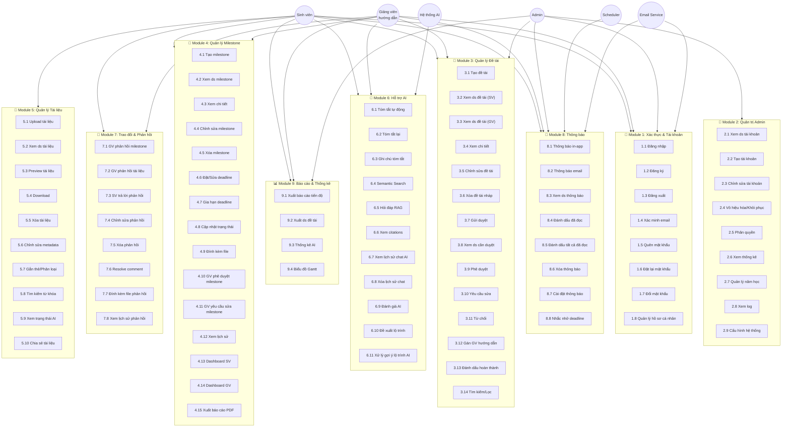
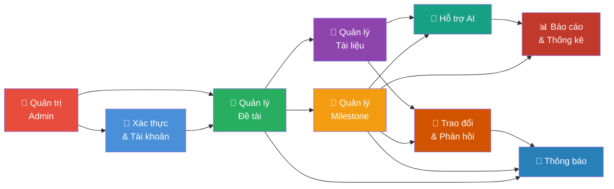

# 📋 NOVATHESIS – ĐẶC TẢ USE CASE TOÀN HỆ THỐNG

> **Hệ thống**: NovaThesis – Hệ thống quản lý luận văn và đề tài nghiên cứu tích hợp AI hỗ trợ học thuật
> **Đơn vị**: Trường Đại học Kinh tế – Đại học Đà Nẵng
> **Phiên bản**: 1.0 | **Ngày lập**: 07/2026

---

## I. DANH SÁCH ACTORS

| Actor | Loại | Mô tả |
|-------|------|-------|
| **Sinh viên** | Primary | Người thực hiện đề tài. Tạo đề tài, cập nhật milestone, upload tài liệu, sử dụng các tính năng AI hỗ trợ. |
| **Giảng viên hướng dẫn** | Primary | Người hướng dẫn nghiên cứu. Duyệt đề tài, phê duyệt milestone, phản hồi tài liệu, xem Dashboard. |
| **Quản trị viên (Admin)** | Primary | Người quản lý hệ thống. Quản lý tài khoản, cấu hình hệ thống, xem thống kê. |
| **Hệ thống AI** | Secondary | Xử lý embedding, tóm tắt, RAG, đề xuất lộ trình. Được gọi tự động hoặc theo yêu cầu người dùng. |
| **Scheduler (Cron Job)** | Secondary | Hệ thống lập lịch nội bộ. Kích hoạt nhắc nhở deadline, kiểm tra milestone quá hạn. |
| **Email Service** | Secondary | Dịch vụ gửi email (Nodemailer). Gửi thông báo, xác minh tài khoản, reset mật khẩu. |

---

## II. SƠ ĐỒ USE CASE TỔNG QUÁT – TOÀN HỆ THỐNG

---

## III. BẢNG TỔNG HỢP USE CASE THEO MODULE

| Module | Số UC | Files |
|--------|-------|-------|
| 🔐 Module 1 – Xác thực & Tài khoản | 8 | [01_UC_Authentication.md](./01_UC_Authentication.md) |
| 👑 Module 2 – Quản trị Admin | 9 | [02_UC_Admin.md](./02_UC_Admin.md) |
| 📁 Module 3 – Quản lý Đề tài | 14 | [03_UC_Thesis.md](./03_UC_Thesis.md) |
| 📅 Module 4 – Quản lý Milestone | 15 | [04_UC_Milestone.md](./04_UC_Milestone.md) |
| 📄 Module 5 – Quản lý Tài liệu | 10 | [05_UC_Document.md](./05_UC_Document.md) |
| 🤖 Module 6 – Hỗ trợ AI | 11 | [06_UC_AI.md](./06_UC_AI.md) |
| 💬 Module 7 – Trao đổi & Phản hồi | 8 | [07_UC_Feedback.md](./07_UC_Feedback.md) |
| 🔔 Module 8 – Thông báo | 8 | [08_UC_Notification.md](./08_UC_Notification.md) |
| 📊 Module 9 – Báo cáo & Thống kê | 4 | [09_UC_Report.md](./09_UC_Report.md) |
| **Tổng** | **87** | |

---

## IV. BẢNG TỔNG HỢP UC THEO ACTOR

| Actor | Các UC liên quan |
|-------|-----------------|
| **Sinh viên** | 1.1–1.8, 3.1–3.7, 3.4, 3.14, 4.1–4.9, 4.12–4.13, 4.15, 5.1–5.10, 6.1–6.11, 7.3–7.5, 7.7–7.8, 8.1–8.7, 9.1, 9.4 |
| **Giảng viên hướng dẫn** | 1.1–1.8, 3.3–3.4, 3.8–3.14, 4.2–4.3, 4.6–4.7, 4.10–4.15, 5.2–5.4, 6.4–6.9, 7.1–7.2, 7.4–7.8, 8.1–8.7, 9.1–9.2, 9.4 |
| **Admin** | 1.1–1.3, 1.7–1.8, 2.1–2.9, 3.12–3.14, 8.1–8.7, 9.1–9.3 |
| **Hệ thống AI** | 6.1, 6.4, 6.5, 6.10–6.11 |
| **Scheduler** | 8.8 |
| **Email Service** | 1.2, 1.4, 1.5, 8.2 |

---

## V. SƠ ĐỒ QUAN HỆ GIỮA CÁC MODULE

---

*Tài liệu này được tạo tự động. Xem chi tiết từng module trong các file con.*
