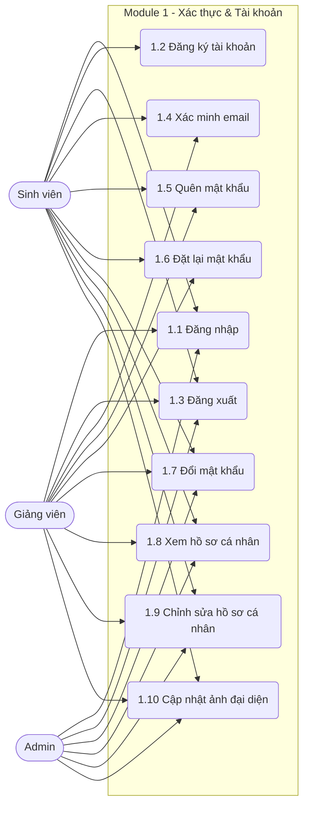

# MODULE 1 – XÁC THỰC & TÀI KHOẢN

> Module này quản lý toàn bộ các quy trình định danh, xác thực, cấp quyền (qua JWT), bảo mật thông tin và quản lý hồ sơ cơ bản cho các đối tượng người dùng (Sinh viên, Giảng viên, Admin) trong hệ thống NovaThesis.

## Sơ đồ Use Case

---

### UC 1.1 – Đăng nhập

| Field | Content |
|-------|---------|
| **Use case ID** | 1.1 |
| **Use case name** | Đăng nhập |
| **Description** | Cho phép người dùng xác thực thông tin bằng email và mật khẩu để truy cập vào hệ thống NovaThesis. |
| **Actors** | Sinh viên, Giảng viên hướng dẫn, Admin (Chính), Hệ thống (Phụ) |
| **Priority** | Cao |
| **Triggers** | Người dùng truy cập trang đăng nhập và có nhu cầu sử dụng hệ thống. |
| **Pre-conditions** | Người dùng đã có tài khoản trên hệ thống và tài khoản không bị khóa. Người dùng chưa đăng nhập. |
| **Post-conditions** | Người dùng được chuyển hướng đến trang chủ/dashboard tương ứng và hệ thống cấp JWT token hợp lệ. |
| **Business rules** | 1. Đăng nhập sai quá 5 lần liên tiếp sẽ bị khóa tài khoản tạm thời trong 15 phút. 2. Tài khoản chưa xác minh email (với SV/GV đăng ký mới) sẽ không thể đăng nhập. |
| **Non-functional requirement** | Mật khẩu phải được truyền qua kết nối mã hóa (HTTPS). Thời gian phản hồi của API đăng nhập < 1s. |

**Main flow:**

| Bước | Thao tác |
|------|---------|
| 1 | Người dùng truy cập trang Đăng nhập của NovaThesis. |
| 2 | Hệ thống hiển thị form đăng nhập (Email, Mật khẩu). |
| 3 | Người dùng nhập thông tin Email và Mật khẩu, nhấn "Đăng nhập". |
| 4 | Hệ thống kiểm tra tính hợp lệ của định dạng dữ liệu (email đúng chuẩn, mật khẩu không rỗng). |
| 5 | Hệ thống đối chiếu thông tin đăng nhập với cơ sở dữ liệu. |
| 6 | Hệ thống tạo và trả về JWT token cho phiên làm việc. |
| 7 | Hệ thống chuyển hướng người dùng tới Dashboard tương ứng với vai trò (Sinh viên/Giảng viên/Admin). |

**Alternative flows:**

| Luồng | Điều kiện | Xử lý |
|-------|-----------|-------|
| 4a | Định dạng email không hợp lệ hoặc thiếu thông tin | Hệ thống báo lỗi "Vui lòng nhập đầy đủ và đúng định dạng". Quay lại bước 2. |

**Exception flows:**

| Luồng | Điều kiện | Xử lý |
|-------|-----------|-------|
| 5a | Sai email hoặc mật khẩu (< 5 lần) | Hệ thống báo lỗi "Email hoặc mật khẩu không chính xác". Tăng biến đếm số lần sai. Quay lại bước 2. |
| 5b | Đăng nhập sai quá 5 lần | Hệ thống khóa tài khoản 15 phút, thông báo "Tài khoản bị khóa tạm thời 15 phút do nhập sai quá nhiều lần". |
| 5c | Tài khoản chưa xác minh email | Hệ thống thông báo "Vui lòng kiểm tra email để xác minh tài khoản trước khi đăng nhập" và chặn truy cập. |

---

### UC 1.2 – Đăng ký tài khoản

| Field | Content |
|-------|---------|
| **Use case ID** | 1.2 |
| **Use case name** | Đăng ký tài khoản |
| **Description** | Cho phép Sinh viên tự tạo tài khoản mới trên hệ thống để bắt đầu quá trình làm luận văn. |
| **Actors** | Sinh viên (Chính), Hệ thống (Phụ) |
| **Priority** | Cao |
| **Triggers** | Sinh viên chưa có tài khoản và chọn tính năng Đăng ký tại màn hình chào. |
| **Pre-conditions** | Email đăng ký chưa tồn tại trong hệ thống. |
| **Post-conditions** | Tài khoản được tạo ở trạng thái "Chờ xác minh". Hệ thống gửi email chứa mã/link xác minh. |
| **Business rules** | 1. Chỉ Sinh viên mới có thể tự đăng ký (Admin tạo thủ công cho Giảng viên). 2. Mật khẩu phải có độ dài tối thiểu 8 ký tự, gồm chữ và số. |
| **Non-functional requirement** | Gửi email xác minh ngay lập tức (dưới 3s) thông qua Nodemailer. |

**Main flow:**

| Bước | Thao tác |
|------|---------|
| 1 | Người dùng truy cập trang Đăng ký. |
| 2 | Hệ thống hiển thị form đăng ký gồm: Họ tên, Mã SV, Email, Mật khẩu, Xác nhận mật khẩu. Vai trò mặc định là "Sinh viên". |
| 3 | Người dùng điền đầy đủ thông tin và nhấn "Đăng ký". |
| 4 | Hệ thống kiểm tra các ràng buộc: email chưa tồn tại, mật khẩu hợp lệ, mật khẩu khớp nhau. |
| 5 | Hệ thống mã hóa mật khẩu và lưu dữ liệu người dùng với trạng thái "Chưa xác minh". |
| 6 | Hệ thống tạo link xác minh và gửi qua email đã đăng ký. |
| 7 | Hệ thống hiển thị thông báo: "Đăng ký thành công. Vui lòng kiểm tra email để xác minh tài khoản." |

**Alternative flows:**

| Luồng | Điều kiện | Xử lý |
|-------|-----------|-------|
| 4a | Thông tin nhập vào thiếu hoặc sai định dạng | Hệ thống tô đỏ các trường lỗi và yêu cầu nhập lại. Quay lại bước 2. |

**Exception flows:**

| Luồng | Điều kiện | Xử lý |
|-------|-----------|-------|
| 4b | Email hoặc Mã SV đã tồn tại trong DB | Hệ thống thông báo "Email hoặc Mã sinh viên đã được sử dụng". Quay lại bước 2. |
| 6a | Lỗi gửi email (Nodemailer lỗi/Time out) | Hệ thống lưu thông tin thành công, thông báo "Đăng ký thành công nhưng gửi email lỗi. Vui lòng sử dụng tính năng gửi lại email xác minh". |

---

### UC 1.3 – Đăng xuất

| Field | Content |
|-------|---------|
| **Use case ID** | 1.3 |
| **Use case name** | Đăng xuất |
| **Description** | Cho phép người dùng kết thúc phiên làm việc hiện tại và hủy bỏ JWT token để đảm bảo an toàn. |
| **Actors** | Sinh viên, Giảng viên hướng dẫn, Admin |
| **Priority** | Cao |
| **Triggers** | Người dùng nhấn nút "Đăng xuất" trên giao diện. |
| **Pre-conditions** | Người dùng đang trong trạng thái đăng nhập hợp lệ. |
| **Post-conditions** | Phiên đăng nhập bị hủy, token bị xóa. Người dùng trở về trang Đăng nhập. |
| **Business rules** | Token sau khi đăng xuất phải bị đưa vào blacklist (nếu có cấu hình) hoặc client tự động xóa cookie/local storage. |
| **Non-functional requirement** | Chuyển hướng người dùng về trang Đăng nhập trong vòng 1s. |

**Main flow:**

| Bước | Thao tác |
|------|---------|
| 1 | Người dùng nhấn nút "Đăng xuất" ở menu tài khoản. |
| 2 | Hệ thống yêu cầu xác nhận "Bạn có chắc chắn muốn đăng xuất?". |
| 3 | Người dùng nhấn "Đồng ý". |
| 4 | Hệ thống gọi API hủy phiên làm việc, xóa JWT token ở phía client. |
| 5 | Hệ thống chuyển hướng người dùng về trang Đăng nhập. |

**Alternative flows:**

| Luồng | Điều kiện | Xử lý |
|-------|-----------|-------|
| 3a | Người dùng chọn "Hủy" | Đóng hộp thoại xác nhận, người dùng tiếp tục phiên làm việc hiện tại. |

**Exception flows:**

| Luồng | Điều kiện | Xử lý |
|-------|-----------|-------|
| 4a | Lỗi kết nối mạng trong quá trình gọi API đăng xuất | Ứng dụng client tự động xóa token local và chuyển về trang đăng nhập để đảm bảo an toàn bề mặt. |

---

### UC 1.4 – Xác minh email (sau đăng ký)

| Field | Content |
|-------|---------|
| **Use case ID** | 1.4 |
| **Use case name** | Xác minh email |
| **Description** | Xác thực địa chỉ email của người dùng sau khi đăng ký bằng cách sử dụng link xác minh được hệ thống gửi tới email đó. |
| **Actors** | Sinh viên, Giảng viên (nếu cần), Hệ thống |
| **Priority** | Cao |
| **Triggers** | Người dùng click vào đường link xác minh trong email hệ thống gửi. |
| **Pre-conditions** | Tài khoản đang ở trạng thái "Chưa xác minh". Link xác minh vẫn còn thời hạn (ví dụ: 24h). |
| **Post-conditions** | Tài khoản chuyển sang trạng thái "Đã xác minh" (Active). |
| **Business rules** | Nếu link quá hạn, người dùng phải yêu cầu gửi lại link xác minh mới. |
| **Non-functional requirement** | Quá trình xử lý link xác minh và cập nhật trạng thái DB < 1s. |

**Main flow:**

| Bước | Thao tác |
|------|---------|
| 1 | Người dùng click vào link "Xác minh tài khoản" trong email. |
| 2 | Trình duyệt mở trang xác minh của NovaThesis kèm token mã hóa trong URL. |
| 3 | Hệ thống kiểm tra tính hợp lệ và thời hạn của token. |
| 4 | Hệ thống cập nhật trạng thái tài khoản tương ứng trong DB thành "Đã xác minh". |
| 5 | Hệ thống hiển thị thông báo "Xác minh email thành công. Bạn có thể đăng nhập ngay." cùng nút chuyển tới trang Đăng nhập. |

**Alternative flows:**

| Luồng | Điều kiện | Xử lý |
|-------|-----------|-------|
| N/A | Không có | |

**Exception flows:**

| Luồng | Điều kiện | Xử lý |
|-------|-----------|-------|
| 3a | Token không hợp lệ hoặc bị sai lệch | Hệ thống hiển thị lỗi "Liên kết xác minh không hợp lệ". |
| 3b | Token đã hết hạn | Hệ thống thông báo "Liên kết đã hết hạn", cung cấp nút "Gửi lại email xác minh". |
| 3c | Tài khoản đã được xác minh trước đó | Hệ thống thông báo "Tài khoản của bạn đã được xác minh trước đó. Vui lòng đăng nhập." |

---

### UC 1.5 – Quên mật khẩu

| Field | Content |
|-------|---------|
| **Use case ID** | 1.5 |
| **Use case name** | Quên mật khẩu |
| **Description** | Cho phép người dùng yêu cầu hệ thống gửi link đặt lại mật khẩu về email nếu họ quên mật khẩu đăng nhập. |
| **Actors** | Sinh viên, Giảng viên hướng dẫn, Hệ thống |
| **Priority** | Trung bình |
| **Triggers** | Người dùng nhấn "Quên mật khẩu" tại màn hình đăng nhập. |
| **Pre-conditions** | Không cần đăng nhập. |
| **Post-conditions** | Hệ thống tạo token đặt lại mật khẩu, thời hạn 24h và gửi qua email của người dùng. |
| **Business rules** | 1. Chỉ áp dụng với email đã tồn tại trong hệ thống. 2. Mỗi link gửi qua email chỉ có hiệu lực trong 24 giờ. |
| **Non-functional requirement** | Tránh spam: Giới hạn tần suất yêu cầu quên mật khẩu (ví dụ 1 lần/5 phút). |

**Main flow:**

| Bước | Thao tác |
|------|---------|
| 1 | Người dùng nhấn chọn "Quên mật khẩu" ở màn hình Đăng nhập. |
| 2 | Hệ thống hiển thị form yêu cầu nhập Email cần khôi phục. |
| 3 | Người dùng nhập Email và nhấn "Gửi yêu cầu". |
| 4 | Hệ thống kiểm tra Email có tồn tại trong CSDL hay không. |
| 5 | Hệ thống tạo một token reset mật khẩu có thời hạn 24h và lưu vào DB. |
| 6 | Hệ thống (Nodemailer) gửi email chứa link đặt lại mật khẩu. |
| 7 | Hệ thống thông báo: "Nếu email hợp lệ, chúng tôi đã gửi hướng dẫn đặt lại mật khẩu. Vui lòng kiểm tra hộp thư." |

**Alternative flows:**

| Luồng | Điều kiện | Xử lý |
|-------|-----------|-------|
| 4a | Email không tồn tại trong hệ thống | Hệ thống vẫn chạy đến bước 7 (nhằm bảo mật, không tiết lộ email nào đã đăng ký), nhưng không gửi email nào ra ngoài. |

**Exception flows:**

| Luồng | Điều kiện | Xử lý |
|-------|-----------|-------|
| 3a | Người dùng nhập liên tiếp yêu cầu trong thời gian ngắn | Hệ thống chặn lại và báo lỗi "Vui lòng đợi 5 phút trước khi yêu cầu lại". |
| 6a | Lỗi kết nối hệ thống email | Báo lỗi hệ thống, yêu cầu người dùng thử lại sau. |

---

### UC 1.6 – Đặt lại mật khẩu (qua link email)

| Field | Content |
|-------|---------|
| **Use case ID** | 1.6 |
| **Use case name** | Đặt lại mật khẩu |
| **Description** | Cho phép người dùng tạo mật khẩu mới thông qua đường link bảo mật gửi từ chức năng Quên mật khẩu. |
| **Actors** | Sinh viên, Giảng viên hướng dẫn |
| **Priority** | Trung bình |
| **Triggers** | Người dùng click vào link "Đặt lại mật khẩu" trong email. |
| **Pre-conditions** | Token trên URL phải hợp lệ, chưa sử dụng và chưa quá hạn (24h). |
| **Post-conditions** | Mật khẩu cũ bị vô hiệu, mật khẩu mới được cập nhật vào CSDL. Token bị đánh dấu đã sử dụng. |
| **Business rules** | 1. Mật khẩu mới phải đáp ứng quy tắc (>= 8 ký tự). 2. Link chỉ dùng được 1 lần duy nhất. |
| **Non-functional requirement** | Form đặt lại phải che giấu ký tự mật khẩu, có mắt hiển thị (toggle visibility). |

**Main flow:**

| Bước | Thao tác |
|------|---------|
| 1 | Người dùng click vào link trong email nhận được. |
| 2 | Hệ thống kiểm tra tính hợp lệ của token trong URL. |
| 3 | Hệ thống hiển thị màn hình Đặt lại mật khẩu với 2 ô: Mật khẩu mới, Xác nhận mật khẩu mới. |
| 4 | Người dùng nhập mật khẩu mới và xác nhận, nhấn "Lưu thay đổi". |
| 5 | Hệ thống kiểm tra quy tắc mật khẩu và độ khớp của 2 trường. |
| 6 | Hệ thống cập nhật mật khẩu đã mã hóa (bcrypt/argon2) vào DB. |
| 7 | Hệ thống hủy hiệu lực của token. |
| 8 | Hệ thống thông báo thành công và chuyển hướng người dùng về trang Đăng nhập. |

**Alternative flows:**

| Luồng | Điều kiện | Xử lý |
|-------|-----------|-------|
| 5a | Mật khẩu không khớp hoặc không đủ mạnh | Hệ thống báo lỗi tương ứng tại form. Quay lại bước 3. |

**Exception flows:**

| Luồng | Điều kiện | Xử lý |
|-------|-----------|-------|
| 2a | Token không hợp lệ hoặc đã hết hạn 24h | Hệ thống hiển thị trang lỗi "Liên kết không hợp lệ hoặc đã hết hạn", có nút quay lại trang Quên mật khẩu. |
| 2b | Token đã được sử dụng trước đó | Hệ thống báo lỗi "Liên kết này đã được sử dụng". |

---

### UC 1.7 – Đổi mật khẩu (khi đã đăng nhập)

| Field | Content |
|-------|---------|
| **Use case ID** | 1.7 |
| **Use case name** | Đổi mật khẩu |
| **Description** | Cho phép người dùng đang đăng nhập đổi mật khẩu hiện tại sang mật khẩu mới. |
| **Actors** | Sinh viên, Giảng viên hướng dẫn, Admin |
| **Priority** | Trung bình |
| **Triggers** | Người dùng vào Cài đặt tài khoản và chọn "Đổi mật khẩu". |
| **Pre-conditions** | Người dùng đang trong trạng thái đăng nhập. |
| **Post-conditions** | Mật khẩu mới được lưu, các phiên đăng nhập khác có thể bị đăng xuất (nếu cấu hình bảo mật yêu cầu). |
| **Business rules** | Phải nhập đúng mật khẩu hiện tại mới được phép đổi mật khẩu mới. |
| **Non-functional requirement** | Cần mã hóa mật khẩu trước khi lưu. |

**Main flow:**

| Bước | Thao tác |
|------|---------|
| 1 | Người dùng điều hướng tới mục "Đổi mật khẩu" trong trang Hồ sơ/Cài đặt. |
| 2 | Hệ thống hiển thị form gồm: Mật khẩu hiện tại, Mật khẩu mới, Xác nhận mật khẩu mới. |
| 3 | Người dùng nhập dữ liệu và nhấn "Cập nhật". |
| 4 | Hệ thống kiểm tra mật khẩu hiện tại có khớp với CSDL không. |
| 5 | Hệ thống kiểm tra mật khẩu mới hợp lệ và khớp với ô xác nhận. |
| 6 | Hệ thống mã hóa mật khẩu mới và lưu vào CSDL. |
| 7 | Hệ thống hiển thị thông báo "Đổi mật khẩu thành công". |

**Alternative flows:**

| Luồng | Điều kiện | Xử lý |
|-------|-----------|-------|
| 5a | Mật khẩu mới không hợp lệ | Báo lỗi định dạng mật khẩu. Quay lại bước 2. |

**Exception flows:**

| Luồng | Điều kiện | Xử lý |
|-------|-----------|-------|
| 4a | Mật khẩu hiện tại nhập sai | Hệ thống báo lỗi "Mật khẩu hiện tại không chính xác". Quay lại bước 2. |

---

### UC 1.8 – Xem hồ sơ cá nhân

| Field | Content |
|-------|---------|
| **Use case ID** | 1.8 |
| **Use case name** | Xem hồ sơ cá nhân |
| **Description** | Cho phép người dùng xem thông tin cá nhân của mình (họ tên, mã số, khoa, chuyên ngành, email). |
| **Actors** | Sinh viên, Giảng viên hướng dẫn, Admin |
| **Priority** | Cao |
| **Triggers** | Người dùng click vào ảnh đại diện hoặc menu "Hồ sơ của tôi". |
| **Pre-conditions** | Người dùng đã đăng nhập thành công. |
| **Post-conditions** | Hệ thống hiển thị giao diện chứa thông tin cá nhân chính xác. |
| **Business rules** | Người dùng chỉ xem được hồ sơ của chính mình (hoặc Admin/Giảng viên xem hồ sơ của sinh viên liên quan theo quyền khác). |
| **Non-functional requirement** | Tốc độ load thông tin < 1s. |

**Main flow:**

| Bước | Thao tác |
|------|---------|
| 1 | Người dùng chọn "Hồ sơ của tôi" từ thanh điều hướng. |
| 2 | Hệ thống trích xuất ID người dùng từ JWT token hiện tại. |
| 3 | Hệ thống truy vấn CSDL để lấy thông tin chi tiết của người dùng. |
| 4 | Hệ thống hiển thị giao diện Hồ sơ cá nhân với các thông tin: Ảnh đại diện, Họ tên, Email, Mã SV/MGV, Khoa/Chuyên ngành, Số điện thoại. |

**Alternative flows:**

| Luồng | Điều kiện | Xử lý |
|-------|-----------|-------|
| N/A | Không có | |

**Exception flows:**

| Luồng | Điều kiện | Xử lý |
|-------|-----------|-------|
| 3a | Không tìm thấy thông tin tài khoản (bị xóa/lỗi DB) | Hệ thống báo lỗi "Không thể tải thông tin hồ sơ", cho phép reload trang. |

---

### UC 1.9 – Chỉnh sửa hồ sơ cá nhân

| Field | Content |
|-------|---------|
| **Use case ID** | 1.9 |
| **Use case name** | Chỉnh sửa hồ sơ cá nhân |
| **Description** | Cho phép người dùng cập nhật một số thông tin cá nhân như Số điện thoại, Giới thiệu bản thân. Các trường như Email, Mã SV/MGV bị vô hiệu hóa. |
| **Actors** | Sinh viên, Giảng viên hướng dẫn, Admin |
| **Priority** | Trung bình |
| **Triggers** | Người dùng nhấn nút "Chỉnh sửa" tại trang Hồ sơ cá nhân. |
| **Pre-conditions** | Người dùng đang đăng nhập và ở trang Hồ sơ cá nhân. |
| **Post-conditions** | Thông tin mới được lưu và hiển thị trên hồ sơ. |
| **Business rules** | Không cho phép tự ý đổi Mã SV, Mã GV, Email đăng nhập. |
| **Non-functional requirement** | Cập nhật real-time trên giao diện sau khi ấn lưu. |

**Main flow:**

| Bước | Thao tác |
|------|---------|
| 1 | Người dùng nhấn "Chỉnh sửa" tại trang Hồ sơ. |
| 2 | Hệ thống chuyển các trường thông tin cho phép sửa (Số điện thoại, Giới thiệu, Địa chỉ) thành dạng input. |
| 3 | Người dùng thay đổi thông tin cần thiết và nhấn "Lưu thay đổi". |
| 4 | Hệ thống validate dữ liệu (Ví dụ: SĐT phải là số, độ dài phù hợp). |
| 5 | Hệ thống cập nhật CSDL. |
| 6 | Hệ thống hiển thị thông báo "Cập nhật thành công" và hiển thị lại trang hồ sơ với thông tin mới. |

**Alternative flows:**

| Luồng | Điều kiện | Xử lý |
|-------|-----------|-------|
| 3a | Người dùng nhấn "Hủy" | Hệ thống đóng form chỉnh sửa, không lưu thay đổi. |

**Exception flows:**

| Luồng | Điều kiện | Xử lý |
|-------|-----------|-------|
| 4a | Dữ liệu nhập không hợp lệ (Sai format SĐT) | Hệ thống báo lỗi trực tiếp trên form "Số điện thoại không hợp lệ", block việc submit. |

---

### UC 1.10 – Cập nhật ảnh đại diện

| Field | Content |
|-------|---------|
| **Use case ID** | 1.10 |
| **Use case name** | Cập nhật ảnh đại diện |
| **Description** | Cho phép người dùng upload hình ảnh cá nhân để làm ảnh đại diện (avatar) hiển thị trên hệ thống. |
| **Actors** | Sinh viên, Giảng viên hướng dẫn, Admin |
| **Priority** | Thấp |
| **Triggers** | Người dùng nhấn vào icon camera/chỉnh sửa tại khu vực ảnh đại diện trong Hồ sơ. |
| **Pre-conditions** | Người dùng đã đăng nhập. |
| **Post-conditions** | Ảnh đại diện mới được cập nhật trên toàn hệ thống (Avatar ở header, trong danh sách...). |
| **Business rules** | 1. File phải định dạng JPG hoặc PNG. 2. Kích thước file tối đa 2MB. |
| **Non-functional requirement** | Ảnh cần được nén và resize trước khi lưu (nếu cần), hỗ trợ preview ảnh trước khi lưu. |

**Main flow:**

| Bước | Thao tác |
|------|---------|
| 1 | Người dùng nhấn vào vị trí Ảnh đại diện. |
| 2 | Hệ thống mở cửa sổ chọn file từ thiết bị cục bộ. |
| 3 | Người dùng chọn một file ảnh (.jpg, .png) và nhấn Open. |
| 4 | Hệ thống kiểm tra định dạng và kích thước của file ảnh (<= 2MB). |
| 5 | Hệ thống hiển thị preview ảnh vừa chọn, cung cấp nút "Lưu ảnh". |
| 6 | Người dùng nhấn "Lưu ảnh". |
| 7 | Hệ thống upload ảnh lên server/storage, lấy URL mới và cập nhật CSDL. |
| 8 | Hệ thống thông báo "Cập nhật ảnh đại diện thành công" và reload ảnh trên toàn bộ UI hiện hành. |

**Alternative flows:**

| Luồng | Điều kiện | Xử lý |
|-------|-----------|-------|
| 6a | Người dùng nhấn "Hủy" hoặc chọn ảnh khác | Form preview đóng hoặc thay thế bằng ảnh mới. Không thực hiện lưu. |

**Exception flows:**

| Luồng | Điều kiện | Xử lý |
|-------|-----------|-------|
| 4a | Kích thước file > 2MB | Hệ thống chặn thao tác và báo lỗi "Dung lượng ảnh vượt quá 2MB. Vui lòng chọn ảnh khác nhỏ hơn." |
| 4b | Định dạng không được hỗ trợ (vd: .gif, .pdf) | Hệ thống báo lỗi "Chỉ hỗ trợ định dạng JPG hoặc PNG". |
| 7a | Lỗi kết nối khi upload ảnh lên storage | Hệ thống báo lỗi "Upload thất bại. Vui lòng thử lại sau". |

---
