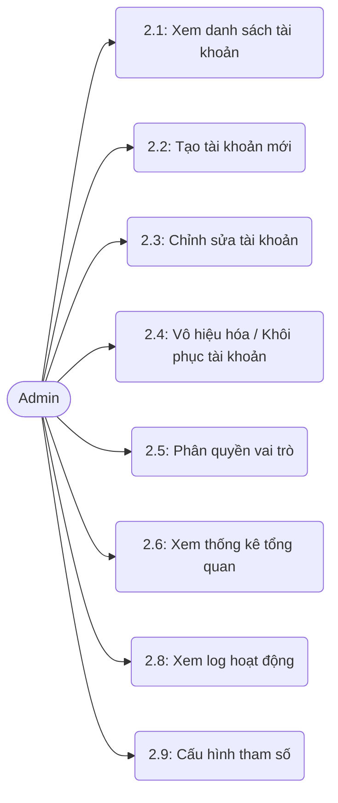

# MODULE 2 – QUẢN TRỊ HỆ THỐNG (ADMIN)

> Module Quản trị hệ thống dành riêng cho tài khoản Admin, cung cấp các công cụ để quản lý người dùng, phân quyền, cấu hình thông số hệ thống, quản lý năm học và theo dõi hoạt động toàn hệ thống NovaThesis.

## Sơ đồ Use Case

---

### UC 2.1 – Xem danh sách tài khoản người dùng

| Field                          | Content                                                                                                                                                      |
| ------------------------------ | ------------------------------------------------------------------------------------------------------------------------------------------------------------ |
| **Use case ID**                | 2.1                                                                                                                                                          |
| **Use case name**              | Xem danh sách tài khoản người dùng                                                                                                                           |
| **Description**                | Cho phép Admin xem, tìm kiếm và lọc danh sách toàn bộ tài khoản người dùng trong hệ thống (Sinh viên, Giảng viên, Admin).                                    |
| **Actors**                     | Admin                                                                                                                                                        |
| **Priority**                   | Cao                                                                                                                                                          |
| **Triggers**                   | Admin truy cập vào menu "Quản lý người dùng".                                                                                                                |
| **Pre-conditions**             | Admin đã đăng nhập thành công vào hệ thống.                                                                                                                  |
| **Post-conditions**            | Hệ thống hiển thị danh sách tài khoản dựa trên các tiêu chí lọc/tìm kiếm.                                                                                    |
| **Business rules**             | - Dữ liệu danh sách phải được phân trang để đảm bảo hiệu năng.- Thông tin hiển thị bao gồm: Mã số (MSSV/MSGV), Họ tên, Email, Vai trò, Trạng thái hoạt động. |
| **Non-functional requirement** | Thời gian tải danh sách không vượt quá 2 giây.                                                                                                               |

**Main flow:**

| Bước | Thao tác                                                                  |
| ---- | ------------------------------------------------------------------------- |
| 1    | Admin chọn chức năng "Quản lý người dùng" trên thanh điều hướng.          |
| 2    | Hệ thống truy xuất danh sách người dùng từ cơ sở dữ liệu.                 |
| 3    | Hệ thống hiển thị danh sách người dùng dưới dạng bảng có phân trang.      |
| 4    | Admin nhập từ khóa vào ô tìm kiếm hoặc chọn bộ lọc (vai trò, trạng thái). |
| 5    | Hệ thống cập nhật lại danh sách hiển thị khớp với điều kiện tìm kiếm/lọc. |

**Alternative flows:**

| Luồng | Điều kiện                                              | Xử lý                                                                                      |
| ----- | ------------------------------------------------------ | ------------------------------------------------------------------------------------------ |
| 5a    | Không có tài khoản nào khớp với điều kiện tìm kiếm/lọc | Hệ thống hiển thị thông báo "Không tìm thấy dữ liệu phù hợp" và cho phép Admin xóa bộ lọc. |

**Exception flows:**

| Luồng | Điều kiện                 | Xử lý                                                                                                              |
| ----- | ------------------------- | ------------------------------------------------------------------------------------------------------------------ |
| 2a    | Lỗi kết nối cơ sở dữ liệu | Hệ thống hiển thị thông báo lỗi "Không thể tải danh sách người dùng lúc này. Vui lòng thử lại sau" và ghi log lỗi. |

---

### UC 2.2 – Tạo tài khoản người dùng mới

| Field                          | Content                                                                                                                                  |
| ------------------------------ | ---------------------------------------------------------------------------------------------------------------------------------------- |
| **Use case ID**                | 2.2                                                                                                                                      |
| **Use case name**              | Tạo tài khoản người dùng mới                                                                                                             |
| **Description**                | Admin tạo một hoặc nhiều tài khoản mới cho Sinh viên, Giảng viên hoặc Admin khác vào hệ thống.                                           |
| **Actors**                     | Admin                                                                                                                                    |
| **Priority**                   | Cao                                                                                                                                      |
| **Triggers**                   | Admin nhấn nút "Tạo tài khoản mới" từ màn hình danh sách người dùng.                                                                     |
| **Pre-conditions**             | Admin đang ở trang "Quản lý người dùng".                                                                                                 |
| **Post-conditions**            | Tài khoản mới được tạo trong cơ sở dữ liệu và có thể đăng nhập. Hệ thống gửi email thông báo cấp tài khoản.                              |
| **Business rules**             | - Email và Mã số (MSSV/MSGV) phải là duy nhất trên toàn hệ thống.- Mật khẩu mặc định sẽ được hệ thống tạo ngẫu nhiên hoặc theo cấu hình. |
| **Non-functional requirement** | Mật khẩu phải được mã hóa trước khi lưu. Hệ thống hỗ trợ import hàng loạt qua file Excel (tối đa 500 dòng/lần).                          |

**Main flow:**

| Bước | Thao tác                                                                                        |
| ---- | ----------------------------------------------------------------------------------------------- |
| 1    | Admin nhấn nút "Tạo tài khoản".                                                                 |
| 2    | Hệ thống hiển thị form nhập thông tin tài khoản (Họ tên, Email, Mã số, Vai trò, Số điện thoại). |
| 3    | Admin điền đầy đủ thông tin bắt buộc và nhấn "Lưu".                                             |
| 4    | Hệ thống kiểm tra tính hợp lệ của dữ liệu (định dạng email, tính duy nhất).                     |
| 5    | Hệ thống tạo tài khoản, sinh mật khẩu mặc định và mã hóa mật khẩu.                              |
| 6    | Hệ thống tự động gửi email thông báo thông tin đăng nhập cho người dùng.                        |
| 7    | Hệ thống thông báo tạo thành công và tải lại danh sách.                                         |

**Alternative flows:**

| Luồng | Điều kiện                    | Xử lý                                                                                                                                                     |
| ----- | ---------------------------- | --------------------------------------------------------------------------------------------------------------------------------------------------------- |
| 1a    | Admin chọn "Import từ Excel" | 1. Hệ thống hiển thị popup upload file.2. Admin tải lên file đúng định dạng.3. Hệ thống xử lý, tạo hàng loạt và báo cáo kết quả (số thành công/thất bại). |

**Exception flows:**

| Luồng | Điều kiện                                         | Xử lý                                                                                   |
| ----- | ------------------------------------------------- | --------------------------------------------------------------------------------------- |
| 4a    | Thông tin bắt buộc bị bỏ trống hoặc sai định dạng | Hệ thống báo lỗi đỏ tại các trường tương ứng, không cho phép lưu.                       |
| 4b    | Email hoặc Mã số đã tồn tại                       | Hệ thống hiển thị thông báo lỗi "Email hoặc Mã số đã được sử dụng" và yêu cầu nhập lại. |

---

### UC 2.3 – Chỉnh sửa thông tin tài khoản

| Field                          | Content                                                                                                            |
| ------------------------------ | ------------------------------------------------------------------------------------------------------------------ |
| **Use case ID**                | 2.3                                                                                                                |
| **Use case name**              | Chỉnh sửa thông tin tài khoản                                                                                      |
| **Description**                | Admin thay đổi các thông tin cá nhân cơ bản của một tài khoản hiện có trong hệ thống.                              |
| **Actors**                     | Admin                                                                                                              |
| **Priority**                   | Trung bình                                                                                                         |
| **Triggers**                   | Admin nhấn biểu tượng "Chỉnh sửa" trên một dòng tài khoản trong danh sách.                                         |
| **Pre-conditions**             | Admin đang ở trang "Quản lý người dùng".                                                                           |
| **Post-conditions**            | Thông tin mới của tài khoản được lưu vào cơ sở dữ liệu.                                                            |
| **Business rules**             | Không cho phép thay đổi Mã số (MSSV/MSGV) sau khi tài khoản đã được tạo để đảm bảo tính toàn vẹn dữ liệu liên kết. |
| **Non-functional requirement** | Giao diện phải hiển thị rõ các trường dữ liệu bị khóa không cho sửa.                                               |

**Main flow:**

| Bước | Thao tác                                                                                       |
| ---- | ---------------------------------------------------------------------------------------------- |
| 1    | Admin chọn "Chỉnh sửa" cho một tài khoản cụ thể.                                               |
| 2    | Hệ thống hiển thị form chứa thông tin hiện tại của tài khoản (Mã số bị vô hiệu hóa chỉnh sửa). |
| 3    | Admin tiến hành thay đổi thông tin (Họ tên, Email, Số điện thoại...).                          |
| 4    | Admin nhấn "Lưu thay đổi".                                                                     |
| 5    | Hệ thống kiểm tra tính hợp lệ của dữ liệu mới (đặc biệt là email duy nhất).                    |
| 6    | Hệ thống cập nhật cơ sở dữ liệu và thông báo chỉnh sửa thành công.                             |

**Alternative flows:**

| Luồng | Điều kiện        | Xử lý                                                 |
| ----- | ---------------- | ----------------------------------------------------- |
| 4a    | Admin nhấn "Hủy" | Hệ thống đóng form chỉnh sửa, không lưu thay đổi nào. |

**Exception flows:**

| Luồng | Điều kiện                     | Xử lý                                                                         |
| ----- | ----------------------------- | ----------------------------------------------------------------------------- |
| 5a    | Email mới cập nhật đã tồn tại | Hệ thống báo lỗi "Email đã được sử dụng cho tài khoản khác". Quay lại bước 3. |

---

### UC 2.4 – Vô hiệu hóa / Khôi phục tài khoản

| Field                          | Content                                                                                                                                                           |
| ------------------------------ | ----------------------------------------------------------------------------------------------------------------------------------------------------------------- |
| **Use case ID**                | 2.4                                                                                                                                                               |
| **Use case name**              | Vô hiệu hóa / Khôi phục tài khoản                                                                                                                                 |
| **Description**                | Admin có thể khóa (vô hiệu hóa) một tài khoản để ngăn đăng nhập, hoặc mở khóa (khôi phục) tài khoản đã bị khóa. Admin không thể xóa vĩnh viễn tài khoản.          |
| **Actors**                     | Admin                                                                                                                                                             |
| **Priority**                   | Cao                                                                                                                                                               |
| **Triggers**                   | Admin chọn tính năng "Khóa/Mở khóa" trên một tài khoản.                                                                                                           |
| **Pre-conditions**             | Admin đang ở trang "Quản lý người dùng".                                                                                                                          |
| **Post-conditions**            | Trạng thái của tài khoản được chuyển sang "Bị khóa" hoặc "Hoạt động". Người dùng bị khóa sẽ không thể đăng nhập.                                                  |
| **Business rules**             | - Tài khoản bị vô hiệu hóa sẽ lập tức bị buộc đăng xuất khỏi tất cả các phiên hiện tại.- Dữ liệu liên quan đến tài khoản (đề tài, milestone) vẫn được giữ nguyên. |
| **Non-functional requirement** | Cần hiển thị cảnh báo xác nhận trước khi vô hiệu hóa để tránh thao tác nhầm.                                                                                      |

**Main flow:**

| Bước | Thao tác                                                                               |
| ---- | -------------------------------------------------------------------------------------- |
| 1    | Admin chọn thao tác "Vô hiệu hóa" (hoặc "Khôi phục") cho một tài khoản.                |
| 2    | Hệ thống hiển thị popup yêu cầu xác nhận hành động.                                    |
| 3    | Admin nhấn "Đồng ý".                                                                   |
| 4    | Hệ thống cập nhật trạng thái hoạt động của tài khoản trong CSDL.                       |
| 5    | Nếu vô hiệu hóa, hệ thống gọi API xóa token/phiên đăng nhập hiện tại của người đó.     |
| 6    | Hệ thống hiển thị thông báo thành công và cập nhật trạng thái hiển thị trên danh sách. |

**Alternative flows:**

| Luồng | Điều kiện                   | Xử lý                                 |
| ----- | --------------------------- | ------------------------------------- |
| 3a    | Admin nhấn "Hủy" trên popup | Hệ thống đóng popup, hủy bỏ thao tác. |

**Exception flows:**

| Luồng | Điều kiện                                                     | Xử lý                                                            |
| ----- | ------------------------------------------------------------- | ---------------------------------------------------------------- |
| 4a    | Admin cố gắng vô hiệu hóa chính tài khoản mình đang đăng nhập | Hệ thống báo lỗi "Không thể vô hiệu hóa tài khoản đang sử dụng". |

---

### UC 2.5 – Phân quyền vai trò người dùng

| Field                          | Content                                                                                                                                           |
| ------------------------------ | ------------------------------------------------------------------------------------------------------------------------------------------------- |
| **Use case ID**                | 2.5                                                                                                                                               |
| **Use case name**              | Phân quyền vai trò người dùng                                                                                                                     |
| **Description**                | Admin thay đổi vai trò (Sinh viên, Giảng viên, Admin) cho một tài khoản trong hệ thống.                                                           |
| **Actors**                     | Admin                                                                                                                                             |
| **Priority**                   | Cao                                                                                                                                               |
| **Triggers**                   | Admin chọn thao tác "Đổi vai trò" cho một tài khoản cụ thể.                                                                                       |
| **Pre-conditions**             | Admin đang ở trang "Quản lý người dùng".                                                                                                          |
| **Post-conditions**            | Tài khoản được cấp quyền truy cập mới tương ứng với vai trò mới.                                                                                  |
| **Business rules**             | - Một người dùng chỉ có một vai trò chính trong một thời điểm.- Việc thay đổi vai trò có thể ảnh hưởng đến quyền truy cập các module khác của họ. |
| **Non-functional requirement** | Ghi log hệ thống rõ ràng về việc ai đã thay đổi quyền của ai.                                                                                     |

**Main flow:**

| Bước | Thao tác                                                                        |
| ---- | ------------------------------------------------------------------------------- |
| 1    | Admin chọn "Đổi vai trò" cho một tài khoản.                                     |
| 2    | Hệ thống hiển thị danh sách các vai trò hiện có (Sinh viên, Giảng viên, Admin). |
| 3    | Admin chọn vai trò mới và nhấn "Cập nhật".                                      |
| 4    | Hệ thống hiển thị popup xác nhận rủi ro khi đổi quyền.                          |
| 5    | Admin xác nhận.                                                                 |
| 6    | Hệ thống cập nhật vai trò mới vào CSDL và ghi nhận log thay đổi quyền.          |
| 7    | Hệ thống thông báo thành công.                                                  |

**Exception flows:**

| Luồng | Điều kiện                                                             | Xử lý                                                                        |
| ----- | --------------------------------------------------------------------- | ---------------------------------------------------------------------------- |
| 6a    | Đổi quyền tài khoản Admin duy nhất còn lại thành Giảng viên/Sinh viên | Hệ thống chặn và báo lỗi "Phải có ít nhất 1 tài khoản Admin trong hệ thống". |

---

### UC 2.6 – Xem thống kê tổng quan hệ thống

| Field                          | Content                                                                                                                                                     |
| ------------------------------ | ----------------------------------------------------------------------------------------------------------------------------------------------------------- |
| **Use case ID**                | 2.6                                                                                                                                                         |
| **Use case name**              | Xem thống kê tổng quan hệ thống                                                                                                                             |
| **Description**                | Admin xem dashboard chứa các biểu đồ, con số thống kê về tình hình thực hiện đề tài, người dùng và hoạt động AI.                                            |
| **Actors**                     | Admin                                                                                                                                                       |
| **Priority**                   | Trung bình                                                                                                                                                  |
| **Triggers**                   | Admin truy cập vào menu "Dashboard / Thống kê".                                                                                                             |
| **Pre-conditions**             | Admin đã đăng nhập.                                                                                                                                         |
| **Post-conditions**            | Màn hình Dashboard hiển thị đầy đủ số liệu mới nhất.                                                                                                        |
| **Business rules**             | Dữ liệu thống kê bao gồm: Tổng số đề tài, Số đề tài đang thực hiện, Số milestone đã hoàn thành, Tổng lượt sử dụng API AI, Số lượng người dùng theo vai trò. |
| **Non-functional requirement** | Tốc độ load dashboard dưới 3 giây. Cho phép lọc thống kê theo Năm học/Học kỳ.                                                                               |

**Main flow:**

| Bước | Thao tác                                                              |
| ---- | --------------------------------------------------------------------- |
| 1    | Admin chọn "Dashboard".                                               |
| 2    | Hệ thống truy xuất dữ liệu thống kê tổng hợp từ các bảng liên quan.   |
| 3    | Hệ thống render các biểu đồ (tròn, cột) và các thẻ số liệu tổng quan. |
| 4    | Admin có thể chọn Năm học/Học kỳ ở bộ lọc góc trên.                   |
| 5    | Hệ thống tải lại dữ liệu thống kê tương ứng với bộ lọc.               |

**Exception flows:**

| Luồng | Điều kiện                                       | Xử lý                                                                                                         |
| ----- | ----------------------------------------------- | ------------------------------------------------------------------------------------------------------------- |
| 2a    | Khối lượng dữ liệu quá lớn gây timeout truy vấn | Hệ thống hiển thị dữ liệu cache gần nhất và báo "Dữ liệu đang được đồng bộ, hiển thị kết quả từ [thời gian]". |

---

### UC 2.7 – Xem log hoạt động hệ thống

| Field                          | Content                                                                                                                                         |
| ------------------------------ | ----------------------------------------------------------------------------------------------------------------------------------------------- |
| **Use case ID**                | 2.7                                                                                                                                             |
| **Use case name**              | Xem log hoạt động hệ thống                                                                                                                      |
| **Description**                | Admin xem lịch sử các hành động quan trọng đã diễn ra trên hệ thống để phục vụ việc audit và hỗ trợ kỹ thuật.                                   |
| **Actors**                     | Admin                                                                                                                                           |
| **Priority**                   | Trung bình                                                                                                                                      |
| **Triggers**                   | Admin truy cập menu "Nhật ký hệ thống (System Logs)".                                                                                           |
| **Pre-conditions**             | Admin đã đăng nhập.                                                                                                                             |
| **Post-conditions**            | Danh sách log được hiển thị đầy đủ chi tiết.                                                                                                    |
| **Business rules**             | Hệ thống ghi nhận các hành động: Đăng nhập (thành công/thất bại), Đổi quyền, Tạo/Xóa/Vô hiệu hóa dữ liệu quan trọng, Lỗi hệ thống nghiêm trọng. |
| **Non-functional requirement** | Dữ liệu log không được phép xóa sửa từ giao diện (Read-only). Có công cụ lọc theo ngày, người dùng, loại hành động.                             |

**Main flow:**

| Bước | Thao tác                                                                     |
| ---- | ---------------------------------------------------------------------------- |
| 1    | Admin chọn "Nhật ký hệ thống".                                               |
| 2    | Hệ thống truy xuất và hiển thị danh sách log gần đây nhất (phân trang).      |
| 3    | Admin sử dụng bộ lọc (Từ ngày - Đến ngày, Loại log, Người dùng).             |
| 4    | Hệ thống cập nhật hiển thị danh sách log phù hợp.                            |
| 5    | Admin nhấn vào một dòng log để xem chi tiết (IP, thiết bị, payload dữ liệu). |

**Alternative flows:**

| Luồng | Điều kiện           | Xử lý                                                                                       |
| ----- | ------------------- | ------------------------------------------------------------------------------------------- |
| 5a    | Admin muốn xuất log | Admin nhấn "Export CSV", hệ thống tạo file CSV từ danh sách đang hiển thị và tải xuống máy. |

---

### UC 2.8 – Cấu hình tham số hệ thống

| Field                          | Content                                                                                                                                                                                                    |
| ------------------------------ | ---------------------------------------------------------------------------------------------------------------------------------------------------------------------------------------------------------- |
| **Use case ID**                | 2.8                                                                                                                                                                                                        |
| **Use case name**              | Cấu hình tham số hệ thống                                                                                                                                                                                  |
| **Description**                | Admin cài đặt các thông số kỹ thuật, hạn mức vận hành cho toàn hệ thống (AI, giới hạn file, thời gian thông báo).                                                                                          |
| **Actors**                     | Admin                                                                                                                                                                                                      |
| **Priority**                   | Trung bình                                                                                                                                                                                                 |
| **Triggers**                   | Admin truy cập menu "Cấu hình hệ thống".                                                                                                                                                                   |
| **Pre-conditions**             | Admin đã đăng nhập.                                                                                                                                                                                        |
| **Post-conditions**            | Tham số mới được lưu và áp dụng ngay lập tức cho các tiến trình liên quan.                                                                                                                                 |
| **Business rules**             | - Cấu hình AI: Chọn mô hình (GPT-3.5/GPT-4), độ dài tối đa (max tokens).- Cấu hình Upload: Dung lượng tối đa (MB), các định dạng cho phép.- Cấu hình Thông báo: Số ngày nhắc nhở trước deadline milestone. |
| **Non-functional requirement** | Tham số phải được validate chặt chẽ kiểu dữ liệu (số nguyên, chuỗi định dạng) trước khi lưu.                                                                                                               |

**Main flow:**

| Bước | Thao tác                                                                                                                  |
| ---- | ------------------------------------------------------------------------------------------------------------------------- |
| 1    | Admin chọn "Cấu hình hệ thống".                                                                                           |
| 2    | Hệ thống hiển thị các nhóm cấu hình (AI Settings, Upload Settings, Notification Settings) với giá trị hiện tại.           |
| 3    | Admin thay đổi các giá trị mong muốn (VD: Tăng giới hạn upload từ 10MB lên 20MB, đổi số ngày nhắc deadline thành 3 ngày). |
| 4    | Admin nhấn "Lưu cấu hình".                                                                                                |
| 5    | Hệ thống kiểm tra tính hợp lệ của các giá trị nhập vào.                                                                   |
| 6    | Hệ thống lưu thay đổi và khởi tạo lại các biến môi trường/cache nếu cần.                                                  |
| 7    | Hệ thống thông báo "Cập nhật cấu hình thành công".                                                                        |

**Exception flows:**

| Luồng | Điều kiện                                                                           | Xử lý                                                        |
| ----- | ----------------------------------------------------------------------------------- | ------------------------------------------------------------ |
| 5a    | Giá trị nhập vào không hợp lệ (VD: Dung lượng file là chữ cái, số ngày nhắc nhở âm) | Hệ thống báo lỗi tại trường tương ứng và không lưu cấu hình. |
