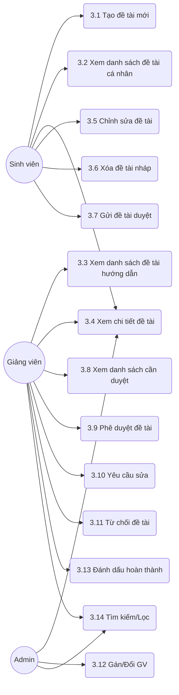

# MODULE 3 – QUẢN LÝ ĐỀ TÀI

> Module quản lý toàn bộ vòng đời của một đề tài nghiên cứu hoặc luận văn, từ lúc sinh viên tạo nháp, gửi duyệt, đến khi thực hiện và hoàn thành. Module này cho phép sinh viên, giảng viên và quản trị viên tương tác để đảm bảo tiến độ và chất lượng đề tài.

## Sơ đồ Use Case

---

### UC 3.1 – Tạo đề tài mới

| Field | Content |
|-------|---------|
| **Use case ID** | 3.1 |
| **Use case name** | Tạo đề tài mới |
| **Description** | Sinh viên nhập thông tin để tạo một đề tài luận văn mới ở trạng thái Nháp. |
| **Actors** | Sinh viên |
| **Priority** | Cao |
| **Triggers** | Sinh viên click vào nút "Tạo đề tài mới" trên dashboard cá nhân. |
| **Pre-conditions** | Sinh viên đã đăng nhập và không có đề tài nào đang ở trạng thái "Chờ duyệt", "Đang thực hiện". |
| **Post-conditions** | Một đề tài mới được tạo thành công với trạng thái "Nháp". |
| **Business rules** | 1. Mỗi sinh viên chỉ có tối đa 1 đề tài đang thực hiện/chờ duyệt tại một thời điểm. 2. Bắt buộc nhập: tên đề tài, mô tả, lĩnh vực, chọn giảng viên hướng dẫn. |
| **Non-functional requirement** | Giao diện form hiển thị danh sách giảng viên phải load mượt mà, hỗ trợ tìm kiếm nhanh giảng viên. |

**Main flow:**

| Bước | Thao tác |
|------|---------|
| 1 | Sinh viên chọn chức năng "Tạo đề tài mới". |
| 2 | Hệ thống kiểm tra điều kiện (không có đề tài đang chạy/chờ duyệt) và hiển thị form tạo đề tài. |
| 3 | Sinh viên điền các thông tin: tên đề tài, mô tả, lĩnh vực nghiên cứu, giảng viên hướng dẫn, ngày bắt đầu dự kiến. |
| 4 | Sinh viên nhấn "Lưu nháp". |
| 5 | Hệ thống kiểm tra tính hợp lệ của dữ liệu đầu vào. |
| 6 | Hệ thống lưu thông tin đề tài với trạng thái "Nháp" vào cơ sở dữ liệu. |
| 7 | Hệ thống thông báo tạo thành công và chuyển về màn hình chi tiết đề tài vừa tạo. |

**Alternative flows:**

| Luồng | Điều kiện | Xử lý |
|-------|-----------|-------|
| 3a | Sinh viên muốn làm mới dữ liệu form | Sinh viên nhấn "Làm lại", hệ thống xóa trắng các trường thông tin đã điền (quay lại bước 3). |

**Exception flows:**

| Luồng | Điều kiện | Xử lý |
|-------|-----------|-------|
| 2a | Sinh viên đã có đề tài chờ duyệt/đang thực hiện | Hệ thống hiển thị thông báo lỗi "Bạn đã có đề tài đang xử lý" và chặn tạo mới. |
| 5a | Thiếu thông tin bắt buộc | Hệ thống bôi đỏ các trường thiếu, hiển thị thông báo lỗi và yêu cầu bổ sung (quay lại bước 3). |
| 5b | Giảng viên hướng dẫn đã quá số lượng sinh viên | Hệ thống thông báo giảng viên đã đầy, yêu cầu chọn giảng viên khác (quay lại bước 3). |

---

### UC 3.2 – Xem danh sách đề tài (sinh viên xem của mình)

| Field | Content |
|-------|---------|
| **Use case ID** | 3.2 |
| **Use case name** | Xem danh sách đề tài cá nhân |
| **Description** | Sinh viên xem danh sách tất cả các đề tài mà mình đã từng tạo hoặc tham gia, bao gồm cả lịch sử. |
| **Actors** | Sinh viên |
| **Priority** | Trung bình |
| **Triggers** | Sinh viên truy cập vào mục "Đề tài của tôi". |
| **Pre-conditions** | Sinh viên đã đăng nhập vào hệ thống. |
| **Post-conditions** | Sinh viên xem được danh sách đề tài của chính mình. |
| **Business rules** | Chỉ hiển thị các đề tài do sinh viên đó làm chủ nhiệm. Hiển thị rõ trạng thái từng đề tài. |
| **Non-functional requirement** | Thời gian tải danh sách < 1s, danh sách được phân trang nếu nhiều hơn 10 đề tài. |

**Main flow:**

| Bước | Thao tác |
|------|---------|
| 1 | Sinh viên nhấn vào menu "Đề tài của tôi". |
| 2 | Hệ thống truy xuất danh sách các đề tài thuộc về tài khoản sinh viên từ cơ sở dữ liệu. |
| 3 | Hệ thống hiển thị danh sách đề tài với các thông tin tóm tắt: Tên, Trạng thái, Ngày tạo, GVHD. |
| 4 | Sinh viên cuộn xem hoặc chọn trang để xem tiếp. |

**Alternative flows:**

| Luồng | Điều kiện | Xử lý |
|-------|-----------|-------|
| 2a | Sinh viên chưa có đề tài nào | Hệ thống hiển thị thông báo "Bạn chưa tạo đề tài nào" kèm nút "Tạo đề tài mới". |

**Exception flows:**

| Luồng | Điều kiện | Xử lý |
|-------|-----------|-------|
| 2b | Lỗi kết nối CSDL | Hệ thống thông báo "Không thể tải dữ liệu, vui lòng thử lại sau". |

---

### UC 3.3 – Xem danh sách đề tài (giảng viên xem đề tài đang hướng dẫn)

| Field | Content |
|-------|---------|
| **Use case ID** | 3.3 |
| **Use case name** | Xem danh sách đề tài hướng dẫn |
| **Description** | Giảng viên xem danh sách các đề tài mà mình đang hướng dẫn (trạng thái Đang thực hiện) hoặc đã hoàn thành. |
| **Actors** | Giảng viên hướng dẫn |
| **Priority** | Cao |
| **Triggers** | Giảng viên truy cập vào mục "Quản lý sinh viên/Đề tài". |
| **Pre-conditions** | Giảng viên đã đăng nhập. |
| **Post-conditions** | Giảng viên thấy được toàn bộ đề tài được phân công. |
| **Business rules** | Danh sách này không bao gồm các đề tài đang ở trạng thái Nháp của sinh viên (giảng viên chưa thấy được nháp). |
| **Non-functional requirement** | Cung cấp giao diện phân trang, tìm kiếm và lọc cơ bản. |

**Main flow:**

| Bước | Thao tác |
|------|---------|
| 1 | Giảng viên nhấn chọn menu "Quản lý Đề tài". |
| 2 | Hệ thống truy xuất danh sách đề tài có gắn mã GVHD là giảng viên hiện tại (trạng thái Chờ duyệt, Đang thực hiện, Hoàn thành, v.v.). |
| 3 | Hệ thống hiển thị danh sách với tên SV, Tên đề tài, Trạng thái, Tiến độ (nếu có). |
| 4 | Giảng viên có thể sử dụng các bộ lọc để tùy chỉnh hiển thị. |

**Alternative flows:**

| Luồng | Điều kiện | Xử lý |
|-------|-----------|-------|
| 2a | Không có đề tài nào | Hệ thống hiển thị thông báo "Hiện tại bạn chưa hướng dẫn đề tài nào". |

**Exception flows:**

| Luồng | Điều kiện | Xử lý |
|-------|-----------|-------|
| 2b | Lỗi truy xuất dữ liệu | Hệ thống báo lỗi và cho phép "Tải lại trang". |

---

### UC 3.4 – Xem chi tiết đề tài

| Field | Content |
|-------|---------|
| **Use case ID** | 3.4 |
| **Use case name** | Xem chi tiết đề tài |
| **Description** | Người dùng xem toàn bộ thông tin chi tiết của một đề tài, bao gồm mô tả, tiến độ, và nhận xét. |
| **Actors** | Sinh viên, Giảng viên, Admin |
| **Priority** | Cao |
| **Triggers** | Người dùng click vào một đề tài cụ thể trong danh sách. |
| **Pre-conditions** | Người dùng đã đăng nhập và có quyền xem đề tài đó (SV xem của mình, GV xem đề tài được phân công, Admin xem tất cả). |
| **Post-conditions** | Thông tin chi tiết của đề tài được hiển thị. |
| **Business rules** | Chỉ những người có quyền truy cập mới xem được thông tin. Trạng thái đề tài quyết định các nút hành động (sửa, duyệt) xuất hiện hay không. |
| **Non-functional requirement** | Giao diện rõ ràng, hiển thị đầy đủ thông tin metadata và các mốc thời gian. |

**Main flow:**

| Bước | Thao tác |
|------|---------|
| 1 | Người dùng chọn một đề tài từ danh sách để xem chi tiết. |
| 2 | Hệ thống xác thực quyền truy cập đối với ID đề tài. |
| 3 | Hệ thống truy xuất thông tin chi tiết (nội dung, lịch sử trạng thái, GVHD, SV thực hiện). |
| 4 | Hệ thống hiển thị màn hình chi tiết đề tài với các thông tin tương ứng cùng các nút hành động (nếu có quyền). |

**Alternative flows:**

| Luồng | Điều kiện | Xử lý |
|-------|-----------|-------|
| 4a | Đề tài có thay đổi mới | Hệ thống hiển thị icon "New" ở các thông báo/nhận xét mới chưa đọc. |

**Exception flows:**

| Luồng | Điều kiện | Xử lý |
|-------|-----------|-------|
| 2a | Người dùng không có quyền truy cập | Hệ thống chặn và báo lỗi 403 Access Denied. |
| 3a | Đề tài không tồn tại (đã bị xóa) | Hệ thống báo lỗi 404 Not Found và chuyển về trang danh sách. |

---

### UC 3.5 – Chỉnh sửa thông tin đề tài

| Field | Content |
|-------|---------|
| **Use case ID** | 3.5 |
| **Use case name** | Chỉnh sửa thông tin đề tài |
| **Description** | Sinh viên cập nhật, chỉnh sửa thông tin đề tài khi đang ở trạng thái Nháp hoặc bị giảng viên Yêu cầu chỉnh sửa. |
| **Actors** | Sinh viên |
| **Priority** | Cao |
| **Triggers** | Sinh viên nhấn nút "Chỉnh sửa" trong màn hình chi tiết đề tài. |
| **Pre-conditions** | Đề tài đang ở trạng thái "Nháp" hoặc "Yêu cầu chỉnh sửa". Sinh viên là chủ đề tài. |
| **Post-conditions** | Dữ liệu đề tài được cập nhật vào CSDL. |
| **Business rules** | Không cho phép sửa nếu đề tài đang "Chờ duyệt", "Đang thực hiện" hoặc "Hoàn thành". |
| **Non-functional requirement** | Form tự động điền sẵn các thông tin cũ. |

**Main flow:**

| Bước | Thao tác |
|------|---------|
| 1 | Sinh viên nhấn "Chỉnh sửa" tại trang chi tiết đề tài. |
| 2 | Hệ thống kiểm tra trạng thái đề tài và quyền chỉnh sửa. |
| 3 | Hệ thống hiển thị form chứa sẵn dữ liệu hiện tại của đề tài. |
| 4 | Sinh viên thay đổi thông tin và nhấn "Lưu thay đổi". |
| 5 | Hệ thống validate dữ liệu mới. |
| 6 | Hệ thống cập nhật CSDL và hiển thị thông báo "Cập nhật thành công". |

**Alternative flows:**

| Luồng | Điều kiện | Xử lý |
|-------|-----------|-------|
| 4a | Sinh viên chọn "Hủy bỏ" | Hệ thống đóng form và quay lại trang chi tiết mà không lưu thay đổi. |

**Exception flows:**

| Luồng | Điều kiện | Xử lý |
|-------|-----------|-------|
| 2a | Sai trạng thái (VD: Đang thực hiện) | Hệ thống ẩn nút "Chỉnh sửa" hoặc báo lỗi "Không thể sửa đề tài ở trạng thái hiện tại". |
| 5a | Thông tin không hợp lệ | Hệ thống báo lỗi ngay trên form và yêu cầu sinh viên sửa lại. |

---

### UC 3.6 – Xóa đề tài nháp

| Field | Content |
|-------|---------|
| **Use case ID** | 3.6 |
| **Use case name** | Xóa đề tài nháp |
| **Description** | Sinh viên xóa bỏ hoàn toàn một đề tài khi nó vẫn còn ở trạng thái Nháp. |
| **Actors** | Sinh viên |
| **Priority** | Thấp |
| **Triggers** | Sinh viên chọn "Xóa" trên danh sách đề tài hoặc trong chi tiết đề tài. |
| **Pre-conditions** | Đề tài phải ở trạng thái "Nháp". Sinh viên là chủ đề tài. |
| **Post-conditions** | Đề tài bị xóa vĩnh viễn hoặc xóa mềm khỏi CSDL. |
| **Business rules** | Chỉ được xóa các đề tài chưa từng được gửi duyệt (trạng thái Nháp). Đề tài đã gửi đi không được tự ý xóa. |
| **Non-functional requirement** | Cần có hộp thoại xác nhận tránh xóa nhầm. |

**Main flow:**

| Bước | Thao tác |
|------|---------|
| 1 | Sinh viên nhấn nút "Xóa" đối với một đề tài Nháp. |
| 2 | Hệ thống hiển thị popup xác nhận: "Bạn có chắc chắn muốn xóa đề tài này?". |
| 3 | Sinh viên xác nhận "Đồng ý". |
| 4 | Hệ thống kiểm tra trạng thái đề tài (phải là Nháp). |
| 5 | Hệ thống thực hiện xóa đề tài khỏi CSDL. |
| 6 | Hệ thống tải lại danh sách đề tài và hiển thị thông báo "Đã xóa thành công". |

**Alternative flows:**

| Luồng | Điều kiện | Xử lý |
|-------|-----------|-------|
| 3a | Sinh viên chọn "Hủy" | Đóng popup, không thực hiện hành động xóa. |

**Exception flows:**

| Luồng | Điều kiện | Xử lý |
|-------|-----------|-------|
| 4a | Đề tài không phải là Nháp | Hệ thống báo lỗi "Chỉ có thể xóa đề tài đang ở trạng thái Nháp". |

---

### UC 3.7 – Gửi đề tài để duyệt

| Field | Content |
|-------|---------|
| **Use case ID** | 3.7 |
| **Use case name** | Gửi đề tài để duyệt |
| **Description** | Sinh viên gửi đề tài đang ở trạng thái Nháp hoặc Yêu cầu chỉnh sửa lên giảng viên hướng dẫn để được phê duyệt thực hiện. |
| **Actors** | Sinh viên |
| **Priority** | Cao |
| **Triggers** | Sinh viên nhấn "Gửi duyệt" tại trang chi tiết đề tài. |
| **Pre-conditions** | Đề tài có đủ các trường thông tin bắt buộc, trạng thái là Nháp hoặc Yêu cầu chỉnh sửa. |
| **Post-conditions** | Trạng thái đề tài đổi thành "Chờ duyệt", hệ thống gửi thông báo cho GVHD. |
| **Business rules** | Sinh viên không thể sửa đề tài trong khi đang chờ duyệt. |
| **Non-functional requirement** | Hệ thống gửi notification (real-time/email) cho giảng viên ngay lập tức. |

**Main flow:**

| Bước | Thao tác |
|------|---------|
| 1 | Sinh viên nhấn nút "Gửi duyệt". |
| 2 | Hệ thống kiểm tra tính đầy đủ của thông tin đề tài. |
| 3 | Hệ thống cập nhật trạng thái đề tài thành "Chờ duyệt". |
| 4 | Hệ thống (nội bộ) tạo thông báo gửi đến tài khoản của GVHD. |
| 5 | Hệ thống hiển thị thông báo "Đã gửi duyệt thành công" và cập nhật giao diện của sinh viên (ẩn nút sửa). |

**Alternative flows:**

| Luồng | Điều kiện | Xử lý |
|-------|-----------|-------|
| 2a | Thiếu thông tin quan trọng | Hệ thống yêu cầu sinh viên cập nhật đẩy đủ thông tin trước khi gửi duyệt. |

**Exception flows:**

| Luồng | Điều kiện | Xử lý |
|-------|-----------|-------|
| 3a | Lỗi hệ thống khi cập nhật | Hệ thống báo lỗi, giữ nguyên trạng thái cũ. |

---

### UC 3.8 – Xem danh sách đề tài cần duyệt (giảng viên)

| Field | Content |
|-------|---------|
| **Use case ID** | 3.8 |
| **Use case name** | Xem danh sách đề tài cần duyệt |
| **Description** | Giảng viên xem các đề tài sinh viên vừa gửi đến đang ở trạng thái Chờ duyệt. |
| **Actors** | Giảng viên hướng dẫn |
| **Priority** | Cao |
| **Triggers** | Giảng viên truy cập tab "Chờ duyệt" hoặc bấm vào thông báo có đề tài mới gửi. |
| **Pre-conditions** | Giảng viên đã đăng nhập. |
| **Post-conditions** | Giảng viên thấy danh sách các đề tài cần xử lý. |
| **Business rules** | Danh sách ưu tiên hiển thị đề tài gửi sớm nhất hoặc cập nhật gần nhất. |
| **Non-functional requirement** | Dữ liệu cập nhật real-time nếu có SV vừa gửi duyệt trong lúc GV đang mở tab. |

**Main flow:**

| Bước | Thao tác |
|------|---------|
| 1 | Giảng viên chọn tab "Chờ duyệt" trong khu vực quản lý đề tài. |
| 2 | Hệ thống lọc và truy xuất các đề tài có GVHD là giảng viên hiện tại và trạng thái là "Chờ duyệt". |
| 3 | Hệ thống hiển thị danh sách với các nút thao tác nhanh (Xem, Duyệt). |

**Alternative flows:**

| Luồng | Điều kiện | Xử lý |
|-------|-----------|-------|
| 2a | Không có đề tài nào cần duyệt | Hệ thống hiển thị thông báo rỗng "Không có đề tài nào cần duyệt". |

**Exception flows:**

| Luồng | Điều kiện | Xử lý |
|-------|-----------|-------|
| 2b | Lỗi mạng | Hệ thống hiển thị thông báo lỗi và nút tải lại. |

---

### UC 3.9 – Phê duyệt đề tài

| Field | Content |
|-------|---------|
| **Use case ID** | 3.9 |
| **Use case name** | Phê duyệt đề tài |
| **Description** | Giảng viên đồng ý với đề xuất của sinh viên, chuyển đề tài sang trạng thái Đang thực hiện. |
| **Actors** | Giảng viên hướng dẫn |
| **Priority** | Cao |
| **Triggers** | Giảng viên nhấn nút "Phê duyệt" trong chi tiết đề tài chờ duyệt. |
| **Pre-conditions** | Đề tài đang ở trạng thái "Chờ duyệt". Giảng viên là người được gán trong đề tài. |
| **Post-conditions** | Đề tài chuyển trạng thái "Đang thực hiện". Thông báo được gửi đến sinh viên. |
| **Business rules** | Số lượng sinh viên đang hướng dẫn của giảng viên không vượt quá giới hạn (cấu hình bởi Admin). |
| **Non-functional requirement** | Lưu lịch sử hành động duyệt vào log hệ thống. |

**Main flow:**

| Bước | Thao tác |
|------|---------|
| 1 | Giảng viên xem chi tiết đề tài và nhấn nút "Phê duyệt". |
| 2 | Hệ thống kiểm tra số lượng sinh viên GV đang hướng dẫn có vượt mức cho phép không. |
| 3 | Hệ thống hiển thị popup xác nhận phê duyệt (có thể kèm ghi chú). |
| 4 | Giảng viên nhấn "Xác nhận". |
| 5 | Hệ thống đổi trạng thái đề tài thành "Đang thực hiện", lưu ghi chú nếu có. |
| 6 | Hệ thống (nội bộ) gửi thông báo cho sinh viên. |
| 7 | Hệ thống báo thành công và đưa GV về màn hình quản lý. |

**Alternative flows:**

| Luồng | Điều kiện | Xử lý |
|-------|-----------|-------|
| 3a | Hủy phê duyệt | Giảng viên bấm "Hủy" trên popup, hệ thống đóng popup và không làm gì. |

**Exception flows:**

| Luồng | Điều kiện | Xử lý |
|-------|-----------|-------|
| 2a | Vượt quá giới hạn hướng dẫn | Hệ thống chặn thao tác, thông báo "Bạn đã hướng dẫn tối đa số sinh viên cho phép". |

---

### UC 3.10 – Yêu cầu chỉnh sửa đề tài

| Field | Content |
|-------|---------|
| **Use case ID** | 3.10 |
| **Use case name** | Yêu cầu chỉnh sửa đề tài |
| **Description** | Giảng viên yêu cầu sinh viên bổ sung, chỉnh sửa lại đề tài trước khi duyệt. |
| **Actors** | Giảng viên hướng dẫn |
| **Priority** | Cao |
| **Triggers** | Giảng viên nhấn nút "Yêu cầu chỉnh sửa" khi đang xem đề tài. |
| **Pre-conditions** | Đề tài ở trạng thái "Chờ duyệt". |
| **Post-conditions** | Đề tài chuyển trạng thái "Yêu cầu chỉnh sửa", gửi phản hồi cho SV. |
| **Business rules** | Bắt buộc phải có nội dung nhận xét/lý do chỉnh sửa để sinh viên biết cần sửa gì. |
| **Non-functional requirement** | Cửa sổ nhập liệu hỗ trợ text formatting cơ bản. |

**Main flow:**

| Bước | Thao tác |
|------|---------|
| 1 | Giảng viên nhấn "Yêu cầu chỉnh sửa". |
| 2 | Hệ thống hiển thị form nhập "Nội dung yêu cầu". |
| 3 | Giảng viên nhập lý do/góp ý và nhấn "Gửi yêu cầu". |
| 4 | Hệ thống kiểm tra nội dung nhập. |
| 5 | Hệ thống đổi trạng thái đề tài thành "Yêu cầu chỉnh sửa", đính kèm lý do vào lịch sử đề tài. |
| 6 | Hệ thống gửi thông báo cho sinh viên kèm lời nhắn của GV. |
| 7 | Thông báo thành công và tải lại giao diện. |

**Alternative flows:**

| Luồng | Điều kiện | Xử lý |
|-------|-----------|-------|
| 3a | GV đóng form | Hủy thao tác, quay lại trang chi tiết. |

**Exception flows:**

| Luồng | Điều kiện | Xử lý |
|-------|-----------|-------|
| 4a | Bỏ trống lý do | Hệ thống báo lỗi "Vui lòng nhập nội dung yêu cầu chỉnh sửa", không cho phép gửi. |

---

### UC 3.11 – Từ chối đề tài

| Field | Content |
|-------|---------|
| **Use case ID** | 3.11 |
| **Use case name** | Từ chối đề tài |
| **Description** | Giảng viên không nhận hướng dẫn đề tài này, từ chối và kết thúc quy trình của đề tài đó. |
| **Actors** | Giảng viên hướng dẫn |
| **Priority** | Trung bình |
| **Triggers** | Giảng viên chọn "Từ chối" ở trang chi tiết đề tài. |
| **Pre-conditions** | Đề tài ở trạng thái "Chờ duyệt". |
| **Post-conditions** | Đề tài chuyển trạng thái "Từ chối", sinh viên có quyền tạo đề tài mới khác. |
| **Business rules** | Từ chối là trạng thái cuối cùng, đề tài này không thể kích hoạt lại. Bắt buộc phải ghi lý do từ chối. |
| **Non-functional requirement** | Hệ thống cập nhật lại quota số sinh viên hiện tại của GVHD nếu liên quan. |

**Main flow:**

| Bước | Thao tác |
|------|---------|
| 1 | Giảng viên nhấn nút "Từ chối". |
| 2 | Hệ thống hiển thị form yêu cầu nhập "Lý do từ chối". |
| 3 | Giảng viên điền lý do và xác nhận. |
| 4 | Hệ thống kiểm tra lý do không được bỏ trống. |
| 5 | Hệ thống cập nhật trạng thái đề tài thành "Từ chối", khóa vĩnh viễn đề tài này. |
| 6 | Hệ thống gửi thông báo cho sinh viên biết để tạo đề tài mới. |
| 7 | Trở về danh sách chờ duyệt. |

**Alternative flows:**

| Luồng | Điều kiện | Xử lý |
|-------|-----------|-------|
| 3a | Hủy thao tác | Giảng viên bấm hủy, quay về màn hình trước đó. |

**Exception flows:**

| Luồng | Điều kiện | Xử lý |
|-------|-----------|-------|
| 4a | Để trống lý do | Hệ thống chặn và yêu cầu nhập lý do. |

---

### UC 3.12 – Gán / Đổi giảng viên hướng dẫn

| Field | Content |
|-------|---------|
| **Use case ID** | 3.12 |
| **Use case name** | Gán / Đổi giảng viên hướng dẫn |
| **Description** | Quản trị viên (Admin) thay đổi giảng viên hướng dẫn cho một đề tài do có lý do đặc biệt (GV ốm, thuyên chuyển,...). |
| **Actors** | Admin |
| **Priority** | Trung bình |
| **Triggers** | Admin chọn chức năng "Đổi GVHD" trong khu vực quản lý đề tài của Admin. |
| **Pre-conditions** | Đề tài đang tồn tại (thường là Đang thực hiện). Admin có quyền quản trị. |
| **Post-conditions** | Giảng viên mới được gán cho đề tài, giảng viên cũ mất quyền quản lý. |
| **Business rules** | Chỉ Admin mới có quyền thực hiện. Phải kiểm tra quota của giảng viên mới. |
| **Non-functional requirement** | Log lại thời gian và người thực hiện đổi để đối soát. |

**Main flow:**

| Bước | Thao tác |
|------|---------|
| 1 | Admin tìm kiếm và chọn đề tài cần đổi GVHD. |
| 2 | Admin nhấn "Thay đổi Giảng viên". |
| 3 | Hệ thống hiển thị danh sách giảng viên để chọn. |
| 4 | Admin chọn giảng viên mới và nhập lý do đổi, sau đó nhấn "Lưu". |
| 5 | Hệ thống kiểm tra giới hạn sinh viên của GV mới. |
| 6 | Hệ thống cập nhật GVHD mới cho đề tài, ghi log vào lịch sử. |
| 7 | Hệ thống thông báo tự động cho SV, GV cũ và GV mới. |

**Alternative flows:**

| Luồng | Điều kiện | Xử lý |
|-------|-----------|-------|
| 4a | Admin hủy bỏ | Không có thay đổi nào được lưu. |

**Exception flows:**

| Luồng | Điều kiện | Xử lý |
|-------|-----------|-------|
| 5a | GV mới vượt quá quota | Hệ thống cảnh báo và yêu cầu Admin xác nhận override (nếu hệ thống cho phép) hoặc bắt chọn người khác. |

---

### UC 3.13 – Đánh dấu đề tài hoàn thành

| Field | Content |
|-------|---------|
| **Use case ID** | 3.13 |
| **Use case name** | Đánh dấu đề tài hoàn thành |
| **Description** | Giảng viên xác nhận đề tài đã kết thúc tốt đẹp và đủ điều kiện ra hội đồng hoặc hoàn tất. |
| **Actors** | Giảng viên hướng dẫn |
| **Priority** | Trung bình |
| **Triggers** | Giảng viên chọn nút "Đánh dấu hoàn thành". |
| **Pre-conditions** | Đề tài ở trạng thái "Đang thực hiện". |
| **Post-conditions** | Đề tài chuyển sang trạng thái "Hoàn thành". |
| **Business rules** | Khi đã hoàn thành, sinh viên và giảng viên không thể thay đổi thông tin hay tiến độ đề tài nữa. |
| **Non-functional requirement** | Lưu trữ hồ sơ vĩnh viễn phục vụ tra cứu sau này. |

**Main flow:**

| Bước | Thao tác |
|------|---------|
| 1 | Giảng viên truy cập chi tiết đề tài đang thực hiện. |
| 2 | Giảng viên nhấn nút "Hoàn thành". |
| 3 | Hệ thống hiển thị hộp thoại xác nhận tổng kết (có thể có form đánh giá ngắn). |
| 4 | Giảng viên xác nhận "Hoàn thành đề tài". |
| 5 | Hệ thống cập nhật trạng thái thành "Hoàn thành" và đóng băng các chỉnh sửa. |
| 6 | Hệ thống thông báo đến sinh viên. |

**Alternative flows:**

| Luồng | Điều kiện | Xử lý |
|-------|-----------|-------|
| 3a | Hủy bỏ | Quay lại trang trước. |

**Exception flows:**

| Luồng | Điều kiện | Xử lý |
|-------|-----------|-------|
| 2a | Đề tài chưa đủ các milestone bắt buộc (nếu có cấu hình) | Hệ thống cảnh báo "Đề tài chưa hoàn tất các giai đoạn bắt buộc", giảng viên cần xác nhận bỏ qua cảnh báo này để tiếp tục. |

---

### UC 3.14 – Tìm kiếm / Lọc đề tài

| Field | Content |
|-------|---------|
| **Use case ID** | 3.14 |
| **Use case name** | Tìm kiếm / Lọc đề tài |
| **Description** | Giảng viên và Admin tìm kiếm đề tài theo các tiêu chí (trạng thái, tên, năm học, GVHD). |
| **Actors** | Admin, Giảng viên |
| **Priority** | Trung bình |
| **Triggers** | Người dùng nhập từ khóa vào ô tìm kiếm hoặc chọn bộ lọc. |
| **Pre-conditions** | Người dùng đã đăng nhập vào hệ thống. |
| **Post-conditions** | Danh sách đề tài được hiển thị khớp với điều kiện tìm kiếm. |
| **Business rules** | Giảng viên chỉ tìm trong phạm vi đề tài mình quản lý. Admin tìm được toàn hệ thống. |
| **Non-functional requirement** | Kết quả trả về dưới 0.5s, hỗ trợ Full-text search nếu cần thiết. |

**Main flow:**

| Bước | Thao tác |
|------|---------|
| 1 | Người dùng vào màn hình Danh sách đề tài. |
| 2 | Người dùng nhập từ khóa (tên SV, mã SV, tên đề tài) và/hoặc chọn bộ lọc (Năm học, Trạng thái, Lĩnh vực). |
| 3 | Người dùng nhấn "Tìm kiếm" (hoặc hệ thống auto search khi đổi filter). |
| 4 | Hệ thống áp dụng điều kiện, truy xuất dữ liệu từ CSDL. |
| 5 | Hệ thống trả về và hiển thị danh sách kết quả phù hợp. |

**Alternative flows:**

| Luồng | Điều kiện | Xử lý |
|-------|-----------|-------|
| 5a | Không có kết quả phù hợp | Hệ thống hiển thị "Không tìm thấy đề tài nào khớp với điều kiện lọc". |
| 2a | Xóa bộ lọc | Người dùng nhấn "Xóa bộ lọc", hệ thống trả về danh sách đầy đủ ban đầu. |

**Exception flows:**

| Luồng | Điều kiện | Xử lý |
|-------|-----------|-------|
| 4a | Lỗi kết nối CSDL | Hệ thống báo lỗi "Thao tác thất bại, vui lòng thử lại sau". |

---
