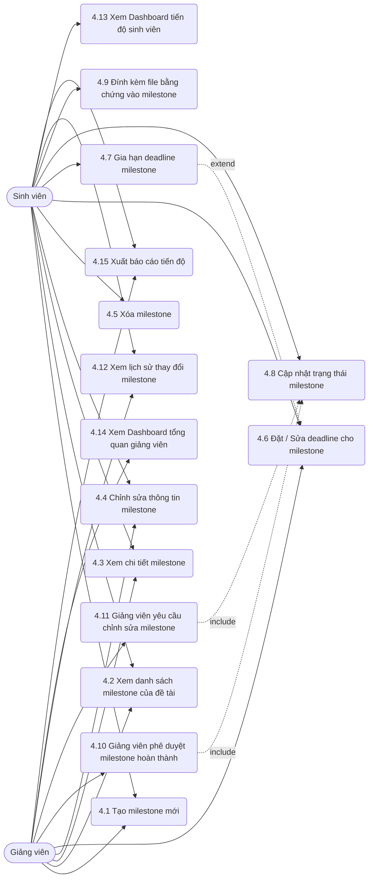

# MODULE 4 – QUẢN LÝ TIẾN ĐỘ (MILESTONE)

> Module quản lý các mốc tiến độ (milestone) của đề tài nghiên cứu, cho phép sinh viên và giảng viên tạo, theo dõi, cập nhật tiến độ, giao nộp minh chứng và phê duyệt hoàn thành.

## Sơ đồ Use Case

---

### UC 4.1 – Tạo milestone mới

| Field | Content |
|-------|---------|
| **Use case ID** | 4.1 |
| **Use case name** | Tạo milestone mới |
| **Description** | Cho phép sinh viên hoặc giảng viên hướng dẫn tạo một mốc tiến độ (milestone) mới cho đề tài. |
| **Actors** | Sinh viên, Giảng viên |
| **Priority** | Cao |
| **Triggers** | Người dùng muốn thêm một giai đoạn hoặc công việc mới vào lộ trình đề tài. |
| **Pre-conditions** | Đề tài đã được tạo và được phê duyệt. Người dùng phải có quyền thao tác trên đề tài (thành viên hoặc giảng viên hướng dẫn). |
| **Post-conditions** | Milestone mới được lưu vào hệ thống, trạng thái mặc định là "Chưa bắt đầu". |
| **Business rules** | Milestone phải có tên và hạn chót (deadline) hợp lệ. Deadline không được nằm ngoài khoảng thời gian bắt đầu và kết thúc của đề tài. |
| **Non-functional requirement** | Lưu trữ milestone vào database dưới 200ms. Hiển thị cập nhật realtime trên danh sách milestone của các thành viên. |

**Main flow:**

| Bước | Thao tác |
|------|---------|
| 1 | Người dùng chọn đề tài và nhấn nút "Thêm Milestone mới". |
| 2 | Hệ thống hiển thị form tạo milestone với các trường: Tên, Mô tả, Deadline. |
| 3 | Người dùng nhập thông tin và nhấn "Lưu". |
| 4 | Hệ thống kiểm tra tính hợp lệ của dữ liệu (tên không rỗng, deadline hợp lệ). |
| 5 | Hệ thống tạo milestone trong CSDL với trạng thái "Chưa bắt đầu". |
| 6 | Hệ thống hiển thị thông báo "Tạo thành công" và cập nhật danh sách milestone trên màn hình. |

**Alternative flows:**

| Luồng | Điều kiện | Xử lý |
|-------|-----------|-------|
| 4a | Deadline không hợp lệ (trước hiện tại hoặc ngoài thời gian đề tài) | Hệ thống hiển thị lỗi "Deadline không hợp lệ", yêu cầu nhập lại tại Bước 2. |
| 3a | Người dùng nhấn "Hủy" | Hệ thống đóng form, hủy tác vụ và quay về danh sách milestone. |

**Exception flows:**

| Luồng | Điều kiện | Xử lý |
|-------|-----------|-------|
| 5a | Lỗi kết nối database | Hệ thống báo lỗi "Lỗi máy chủ, vui lòng thử lại sau" và giữ nguyên form. |

---

### UC 4.2 – Xem danh sách milestone của đề tài

| Field | Content |
|-------|---------|
| **Use case ID** | 4.2 |
| **Use case name** | Xem danh sách milestone của đề tài |
| **Description** | Cho phép người dùng xem tất cả các milestone thuộc về một đề tài cụ thể. |
| **Actors** | Sinh viên, Giảng viên |
| **Priority** | Cao |
| **Triggers** | Người dùng truy cập vào trang chi tiết tiến độ của đề tài. |
| **Pre-conditions** | Người dùng có quyền truy cập đề tài này. |
| **Post-conditions** | Danh sách milestone được hiển thị với trạng thái, deadline và tiến độ tương ứng. |
| **Business rules** | Milestone được sắp xếp mặc định theo thời gian deadline tăng dần. |
| **Non-functional requirement** | Giao diện danh sách hiển thị mượt mà trên mobile, hỗ trợ phân trang nếu cần thiết. |

**Main flow:**

| Bước | Thao tác |
|------|---------|
| 1 | Người dùng vào tab "Tiến độ" hoặc "Milestones" trong chi tiết đề tài. |
| 2 | Hệ thống truy vấn CSDL để lấy tất cả milestone của đề tài. |
| 3 | Hệ thống hiển thị danh sách dạng timeline hoặc dạng bảng (Tên, Deadline, Trạng thái, Tiến độ). |
| 4 | Người dùng có thể xem tổng quan trạng thái (Chưa bắt đầu, Đang thực hiện, Chờ phê duyệt, Hoàn thành, Cần sửa, Trễ hạn). |

**Alternative flows:**

| Luồng | Điều kiện | Xử lý |
|-------|-----------|-------|
| 2a | Đề tài chưa có milestone nào | Hệ thống hiển thị thông báo "Chưa có milestone nào" và gợi ý nút tạo mới. |

**Exception flows:**

| Luồng | Điều kiện | Xử lý |
|-------|-----------|-------|
| 2b | Mất quyền truy cập đề tài | Hệ thống báo lỗi "Bạn không có quyền truy cập" và điều hướng về trang chủ. |

---

### UC 4.3 – Xem chi tiết milestone

| Field | Content |
|-------|---------|
| **Use case ID** | 4.3 |
| **Use case name** | Xem chi tiết milestone |
| **Description** | Cho phép người dùng xem các thông tin chi tiết của một milestone cụ thể bao gồm mô tả, file đính kèm và nhận xét. |
| **Actors** | Sinh viên, Giảng viên |
| **Priority** | Cao |
| **Triggers** | Người dùng click vào một milestone trong danh sách. |
| **Pre-conditions** | Milestone phải tồn tại trong hệ thống. |
| **Post-conditions** | Hiển thị modal hoặc trang chi tiết milestone. |
| **Business rules** | Ai có quyền xem đề tài thì có quyền xem chi tiết các milestone của đề tài đó. |
| **Non-functional requirement** | Tốc độ tải thông tin dưới 300ms. |

**Main flow:**

| Bước | Thao tác |
|------|---------|
| 1 | Người dùng click vào tên một milestone. |
| 2 | Hệ thống truy vấn thông tin chi tiết, file đính kèm, lịch sử trạng thái của milestone. |
| 3 | Hệ thống hiển thị modal chi tiết gồm: Tên, Mô tả, Trạng thái, Hạn chót, Minh chứng, và Comment nhận xét. |
| 4 | Người dùng có thể click tải về các file minh chứng (nếu có). |

**Alternative flows:**

| Luồng | Điều kiện | Xử lý |
|-------|-----------|-------|
| 4a | Người dùng tải file minh chứng | Hệ thống lấy link file từ storage và kích hoạt quá trình tải xuống. |

**Exception flows:**

| Luồng | Điều kiện | Xử lý |
|-------|-----------|-------|
| 2a | Milestone đã bị xóa hoặc không tồn tại | Hệ thống báo lỗi "Milestone không tồn tại" và quay lại danh sách. |

---

### UC 4.4 – Chỉnh sửa thông tin milestone

| Field | Content |
|-------|---------|
| **Use case ID** | 4.4 |
| **Use case name** | Chỉnh sửa thông tin milestone |
| **Description** | Cho phép người dùng cập nhật lại tên, mô tả của một milestone. |
| **Actors** | Sinh viên, Giảng viên |
| **Priority** | Trung bình |
| **Triggers** | Người dùng muốn thay đổi nội dung của một milestone đã tạo. |
| **Pre-conditions** | Milestone chưa chuyển sang trạng thái "Hoàn thành". Người chỉnh sửa phải có quyền thao tác (tác giả hoặc giảng viên). |
| **Post-conditions** | Thông tin milestone được cập nhật và lưu vết trong lịch sử. |
| **Business rules** | Chỉ được sửa thông tin cơ bản. Deadline không sửa ở UC này (có UC riêng). Không được sửa khi milestone đã "Hoàn thành" trừ khi được giảng viên yêu cầu mở lại. |
| **Non-functional requirement** | Dữ liệu cập nhật cần phản hồi ngay lập tức cho các user khác qua Socket.io. |

**Main flow:**

| Bước | Thao tác |
|------|---------|
| 1 | Người dùng chọn milestone cần sửa và nhấn nút "Chỉnh sửa". |
| 2 | Hệ thống hiển thị form chứa thông tin hiện tại (Tên, Mô tả). |
| 3 | Người dùng cập nhật thông tin và nhấn "Cập nhật". |
| 4 | Hệ thống kiểm tra dữ liệu và quyền người dùng. |
| 5 | Hệ thống lưu thay đổi và thêm một record vào lịch sử thay đổi của milestone. |
| 6 | Hệ thống hiển thị thông báo thành công và reload lại dữ liệu milestone. |

**Alternative flows:**

| Luồng | Điều kiện | Xử lý |
|-------|-----------|-------|
| 4a | Trạng thái đang là "Hoàn thành" | Hệ thống báo "Không thể sửa milestone đã hoàn thành" và khóa nút lưu. |

**Exception flows:**

| Luồng | Điều kiện | Xử lý |
|-------|-----------|-------|
| 5a | Lỗi kết nối khi lưu | Hệ thống hiển thị lỗi "Không thể cập nhật" và giữ nguyên giao diện để thử lại. |

---

### UC 4.5 – Xóa milestone

| Field | Content |
|-------|---------|
| **Use case ID** | 4.5 |
| **Use case name** | Xóa milestone |
| **Description** | Xóa bỏ một mốc tiến độ khỏi đề tài. |
| **Actors** | Sinh viên |
| **Priority** | Thấp |
| **Triggers** | Người dùng muốn loại bỏ một công việc hoặc mốc bị tạo sai. |
| **Pre-conditions** | Chỉ Sinh viên mới có quyền xóa milestone của mình. Giảng viên không được phép xóa. Milestone chưa có dữ liệu minh chứng nộp vào. |
| **Post-conditions** | Milestone bị xóa khỏi hệ thống. |
| **Business rules** | Giảng viên không thể xóa milestone của sinh viên. Sinh viên không thể xóa milestone đã được giảng viên phê duyệt hoàn thành. |
| **Non-functional requirement** | Xóa theo cơ chế soft-delete (ẩn khỏi UI nhưng giữ trong DB) để truy vết. |

**Main flow:**

| Bước | Thao tác |
|------|---------|
| 1 | Sinh viên chọn milestone và nhấn nút "Xóa". |
| 2 | Hệ thống kiểm tra quyền, trạng thái và file đính kèm của milestone. |
| 3 | Hệ thống hiển thị hộp thoại xác nhận "Bạn có chắc chắn muốn xóa milestone này không?". |
| 4 | Sinh viên nhấn "Xác nhận". |
| 5 | Hệ thống cập nhật trường `deletedAt` trong CSDL. |
| 6 | Hệ thống ẩn milestone khỏi danh sách và báo "Đã xóa thành công". |

**Alternative flows:**

| Luồng | Điều kiện | Xử lý |
|-------|-----------|-------|
| 2a | Người dùng là Giảng viên | Hệ thống ẩn nút "Xóa" hoặc báo lỗi "Giảng viên không thể xóa milestone". |
| 2b | Milestone đã có điểm hoặc đã "Hoàn thành" | Hệ thống chặn thao tác: "Không thể xóa milestone đã được đánh giá/hoàn thành". |

**Exception flows:**

| Luồng | Điều kiện | Xử lý |
|-------|-----------|-------|
| 4a | Sinh viên chọn "Hủy" | Đóng hộp thoại và không làm gì cả. |

---

### UC 4.6 – Đặt / Sửa deadline cho milestone

| Field | Content |
|-------|---------|
| **Use case ID** | 4.6 |
| **Use case name** | Đặt / Sửa deadline cho milestone |
| **Description** | Thiết lập hoặc thay đổi hạn chót (deadline) cho một milestone. |
| **Actors** | Sinh viên, Giảng viên |
| **Priority** | Trung bình |
| **Triggers** | Người dùng cần thay đổi hoặc mới gán hạn chót cho một mốc tiến độ. |
| **Pre-conditions** | Milestone chưa hoàn thành. |
| **Post-conditions** | Deadline được cập nhật. |
| **Business rules** | Nếu sinh viên tự sửa deadline và deadline mới muộn hơn hạn hiện tại, hệ thống có thể yêu cầu chuyển sang luồng "Gia hạn" (UC 4.7) tùy quy định cứng. Giảng viên thì được tự do đổi. |
| **Non-functional requirement** | Lịch sử sửa deadline phải được ghi nhận rõ ràng. |

**Main flow:**

| Bước | Thao tác |
|------|---------|
| 1 | Người dùng nhấn nút "Đổi deadline" tại chi tiết milestone. |
| 2 | Hệ thống hiển thị lịch chọn ngày giờ mới. |
| 3 | Người dùng chọn ngày giờ mới và nhấn "Lưu". |
| 4 | Hệ thống kiểm tra quyền và tính hợp lệ của deadline mới. |
| 5 | Hệ thống lưu CSDL và tự động cập nhật trạng thái "Trễ hạn" nếu deadline mới nằm trong quá khứ mà tiến độ chưa hoàn thành. |
| 6 | Thông báo thành công và tự động thay đổi lịch nhắc nhở (cập nhật cron job). |

**Alternative flows:**

| Luồng | Điều kiện | Xử lý |
|-------|-----------|-------|
| 4a | Sinh viên sửa deadline kéo dài thời gian (trễ hơn hạn cũ) | Hệ thống chặn lại và gợi ý: "Vui lòng sử dụng tính năng Yêu cầu gia hạn (UC 4.7)". |

**Exception flows:**

| Luồng | Điều kiện | Xử lý |
|-------|-----------|-------|
| 4b | Ngày giờ ngoài phạm vi đề tài | Hệ thống báo lỗi và yêu cầu chọn lại. |

---

### UC 4.7 – Gia hạn deadline milestone

| Field | Content |
|-------|---------|
| **Use case ID** | 4.7 |
| **Use case name** | Gia hạn deadline milestone |
| **Description** | Sinh viên gửi yêu cầu xin thêm thời gian cho một milestone và giảng viên phê duyệt. |
| **Actors** | Sinh viên, Giảng viên |
| **Priority** | Trung bình |
| **Triggers** | Sinh viên không kịp hoàn thành công việc và muốn xin thêm thời gian. |
| **Pre-conditions** | Milestone đang chưa hoàn thành hoặc vừa bị trễ hạn. |
| **Post-conditions** | Yêu cầu được gửi, và deadline được kéo dài nếu giảng viên đồng ý. |
| **Business rules** | Sinh viên bắt buộc phải ghi rõ lý do xin gia hạn. |
| **Non-functional requirement** | Gửi thông báo email và notification realtime cho Giảng viên khi sinh viên xin gia hạn. |

**Main flow:**

| Bước | Thao tác |
|------|---------|
| 1 | Sinh viên nhấn nút "Yêu cầu gia hạn" tại milestone. |
| 2 | Hệ thống hiển thị form yêu cầu (Ngày đề xuất, Lý do). |
| 3 | Sinh viên điền thông tin và nhấn "Gửi yêu cầu". |
| 4 | Hệ thống lưu yêu cầu vào CSDL và gửi notification đến Giảng viên. |
| 5 | Giảng viên nhận thông báo, mở xem chi tiết yêu cầu gia hạn. |
| 6 | Giảng viên nhấn "Đồng ý". |
| 7 | Hệ thống cập nhật deadline mới cho milestone, lưu lịch sử và báo notification lại cho Sinh viên. |

**Alternative flows:**

| Luồng | Điều kiện | Xử lý |
|-------|-----------|-------|
| 6a | Giảng viên nhấn "Từ chối" | Hệ thống yêu cầu nhập lý do từ chối. Deadline không đổi, gửi thông báo từ chối về cho Sinh viên. |

**Exception flows:**

| Luồng | Điều kiện | Xử lý |
|-------|-----------|-------|
| 3a | Không nhập lý do | Hệ thống chặn submit và báo "Vui lòng nhập lý do gia hạn". |

---

### UC 4.8 – Cập nhật trạng thái milestone

| Field | Content |
|-------|---------|
| **Use case ID** | 4.8 |
| **Use case name** | Cập nhật trạng thái milestone |
| **Description** | Sinh viên cập nhật trạng thái tiến độ từ "Chưa bắt đầu" sang "Đang thực hiện" hoặc "Chờ phê duyệt". |
| **Actors** | Sinh viên |
| **Priority** | Cao |
| **Triggers** | Sinh viên bắt đầu làm việc hoặc hoàn thành xong và gửi yêu cầu duyệt. |
| **Pre-conditions** | Người cập nhật là thành viên của đề tài. |
| **Post-conditions** | Trạng thái milestone thay đổi và hiển thị đúng trên dashboard. |
| **Business rules** | Sinh viên không thể tự chuyển trạng thái sang "Hoàn thành", chỉ được chuyển sang "Chờ phê duyệt". |
| **Non-functional requirement** | Thao tác cập nhật tức thì, UI có thể hỗ trợ dạng kéo thả Kanban. |

**Main flow:**

| Bước | Thao tác |
|------|---------|
| 1 | Sinh viên chọn milestone trong danh sách. |
| 2 | Sinh viên chọn trạng thái mới là "Đang thực hiện" hoặc "Chờ phê duyệt" qua dropdown hoặc kéo thả. |
| 3 | Hệ thống kiểm tra điều kiện (ví dụ: cần có file minh chứng nếu đổi sang Chờ phê duyệt). |
| 4 | Hệ thống cập nhật trạng thái mới vào CSDL. |
| 5 | Hệ thống gửi thông báo tới Giảng viên (nếu chuyển sang Chờ phê duyệt). |

**Alternative flows:**

| Luồng | Điều kiện | Xử lý |
|-------|-----------|-------|
| 3a | Đổi sang "Chờ phê duyệt" nhưng thiếu minh chứng | Hệ thống cảnh báo "Vui lòng đính kèm minh chứng trước khi yêu cầu phê duyệt" và rollback UI. |

**Exception flows:**

| Luồng | Điều kiện | Xử lý |
|-------|-----------|-------|
| 4a | Lỗi hệ thống | Báo "Lỗi không thể cập nhật trạng thái", rollback UI về cột cũ. |

---

### UC 4.9 – Đính kèm file bằng chứng vào milestone

| Field | Content |
|-------|---------|
| **Use case ID** | 4.9 |
| **Use case name** | Đính kèm file bằng chứng vào milestone |
| **Description** | Sinh viên tải lên các file làm minh chứng cho việc thực hiện tiến độ. |
| **Actors** | Sinh viên |
| **Priority** | Cao |
| **Triggers** | Sinh viên muốn nộp bài, báo cáo bằng file. |
| **Pre-conditions** | Milestone chưa hoàn thành hoặc đang bị yêu cầu sửa đổi. |
| **Post-conditions** | File được upload và hiển thị trong chi tiết milestone. |
| **Business rules** | Hỗ trợ: PDF, Word, hình ảnh. Tối đa 10MB/file. |
| **Non-functional requirement** | Quá trình upload phải có progress bar. File lưu ở Cloud (S3/Cloudinary). |

**Main flow:**

| Bước | Thao tác |
|------|---------|
| 1 | Tại trang chi tiết milestone, sinh viên nhấn "Đính kèm file". |
| 2 | Hệ thống mở cửa sổ duyệt file cục bộ. Sinh viên chọn file. |
| 3 | Hệ thống kiểm tra chuẩn định dạng và dung lượng tại Frontend. |
| 4 | Hệ thống tiến hành upload file lên server/cloud storage. |
| 5 | Server xử lý thành công, trả về URL đính kèm. |
| 6 | Hệ thống tạo record minh chứng gắn với milestone và cập nhật danh sách hiển thị. |

**Alternative flows:**

| Luồng | Điều kiện | Xử lý |
|-------|-----------|-------|
| 3a | File vượt quá 10MB | Hệ thống báo lỗi "Dung lượng file vượt quá 10MB" và ngừng upload. |
| 3b | File sai định dạng | Hệ thống báo lỗi "Định dạng file không được hỗ trợ". |

**Exception flows:**

| Luồng | Điều kiện | Xử lý |
|-------|-----------|-------|
| 4a | Mất kết nối internet lúc upload | Hệ thống báo "Upload thất bại do lỗi mạng, vui lòng thử lại". |

---

### UC 4.10 – Giảng viên phê duyệt milestone hoàn thành

| Field | Content |
|-------|---------|
| **Use case ID** | 4.10 |
| **Use case name** | Giảng viên phê duyệt milestone hoàn thành |
| **Description** | Giảng viên xác nhận minh chứng và đánh giá tiến độ của sinh viên đạt yêu cầu. |
| **Actors** | Giảng viên |
| **Priority** | Cao |
| **Triggers** | Milestone đang ở trạng thái "Chờ phê duyệt". |
| **Pre-conditions** | Giảng viên là người hướng dẫn đề tài. |
| **Post-conditions** | Trạng thái chuyển sang "Hoàn thành", cập nhật % tổng tiến độ đề tài. |
| **Business rules** | Chỉ Giảng viên hướng dẫn mới có quyền phê duyệt thành công. |
| **Non-functional requirement** | Bất đồng bộ hóa tính toán % tổng thể. |

**Main flow:**

| Bước | Thao tác |
|------|---------|
| 1 | Giảng viên xem chi tiết milestone đang "Chờ phê duyệt". |
| 2 | Giảng viên tải hoặc xem trước các file đính kèm và đọc mô tả. |
| 3 | Giảng viên nhấn nút "Phê duyệt hoàn thành". |
| 4 | Hệ thống hiển thị popup cho phép nhập nhận xét (tùy chọn) và nhấn "Xác nhận". |
| 5 | Hệ thống đổi trạng thái milestone thành "Hoàn thành". |
| 6 | Hệ thống cập nhật tính toán % hoàn thành của toàn bộ đề tài. |
| 7 | Hệ thống thông báo (Notification/Email) đến Sinh viên. |

**Alternative flows:**

| Luồng | Điều kiện | Xử lý |
|-------|-----------|-------|
| 3a | Giảng viên chưa xem file | Hiển thị nhắc nhở nhẹ "Bạn chưa xem tài liệu minh chứng, tiếp tục duyệt?". |

**Exception flows:**

| Luồng | Điều kiện | Xử lý |
|-------|-----------|-------|
| 5a | Xung đột dữ liệu đồng thời | Hệ thống báo "Milestone vừa bị sinh viên thay đổi, vui lòng load lại trang". |

---

### UC 4.11 – Giảng viên yêu cầu chỉnh sửa milestone

| Field | Content |
|-------|---------|
| **Use case ID** | 4.11 |
| **Use case name** | Giảng viên yêu cầu chỉnh sửa milestone |
| **Description** | Giảng viên đánh giá công việc chưa đạt và trả về yêu cầu sinh viên làm lại. |
| **Actors** | Giảng viên |
| **Priority** | Cao |
| **Triggers** | Milestone "Chờ phê duyệt" nhưng kết quả chưa đạt. |
| **Pre-conditions** | Giảng viên có quyền đánh giá. |
| **Post-conditions** | Trạng thái chuyển sang "Cần sửa", có comment hướng dẫn từ GV. |
| **Business rules** | Giảng viên BẮT BUỘC phải nhập lý do/nhận xét để sinh viên biết đường sửa. |
| **Non-functional requirement** | Gửi thông báo khẩn tới sinh viên. |

**Main flow:**

| Bước | Thao tác |
|------|---------|
| 1 | Giảng viên vào chi tiết milestone. |
| 2 | Giảng viên nhấn nút "Yêu cầu chỉnh sửa". |
| 3 | Hệ thống hiển thị form bắt buộc nhập "Lý do / Yêu cầu sửa". |
| 4 | Giảng viên nhập nội dung và nhấn "Gửi yêu cầu". |
| 5 | Hệ thống đổi trạng thái milestone thành "Cần sửa". |
| 6 | Hệ thống lưu comment hướng dẫn vào log/tin nhắn của milestone. |
| 7 | Hệ thống push notification đến Sinh viên. |

**Alternative flows:**

| Luồng | Điều kiện | Xử lý |
|-------|-----------|-------|
| 4a | Form nhận xét trống | Hệ thống chặn submit "Vui lòng nhập yêu cầu chỉnh sửa cụ thể". |

**Exception flows:**

| Luồng | Điều kiện | Xử lý |
|-------|-----------|-------|
| - | - | - |

---

### UC 4.12 – Xem lịch sử thay đổi milestone

| Field | Content |
|-------|---------|
| **Use case ID** | 4.12 |
| **Use case name** | Xem lịch sử thay đổi milestone |
| **Description** | Xem lại toàn bộ lịch sử trạng thái, sửa đổi hạn chót và giao nộp của milestone. |
| **Actors** | Sinh viên, Giảng viên |
| **Priority** | Thấp |
| **Triggers** | Người dùng muốn truy vết hoặc xem dòng thời gian hoạt động. |
| **Pre-conditions** | Milestone đã được tạo. |
| **Post-conditions** | Hiển thị log timeline hoạt động. |
| **Business rules** | Dữ liệu lịch sử không được phép xóa/sửa bởi bất kỳ ai (Audit log). |
| **Non-functional requirement** | Hiển thị theo thời gian thực nếu có thao tác mới xảy ra. |

**Main flow:**

| Bước | Thao tác |
|------|---------|
| 1 | Người dùng nhấn vào tab "Lịch sử hoạt động" trong chi tiết milestone. |
| 2 | Hệ thống truy vấn bảng log lấy các sự kiện liên quan tới milestone đó. |
| 3 | Hệ thống render danh sách các sự kiện (Ai làm gì, vào lúc nào). |

**Alternative flows:**

| Luồng | Điều kiện | Xử lý |
|-------|-----------|-------|
| 2a | Chưa có sự kiện nào | Hiển thị "Chưa có hoạt động nào được ghi nhận". |

**Exception flows:**

| Luồng | Điều kiện | Xử lý |
|-------|-----------|-------|
| - | - | - |

---

### UC 4.13 – Xem Dashboard tiến độ (sinh viên xem đề tài của mình)

| Field | Content |
|-------|---------|
| **Use case ID** | 4.13 |
| **Use case name** | Xem Dashboard tiến độ |
| **Description** | Sinh viên xem tổng quan bức tranh tiến độ của đề tài thông qua các biểu đồ và chỉ số. |
| **Actors** | Sinh viên |
| **Priority** | Cao |
| **Triggers** | Sinh viên mở trang Dashboard của Workspace. |
| **Pre-conditions** | Đề tài đang hoạt động. |
| **Post-conditions** | Hiển thị đầy đủ % hoàn thành, số lượng mốc trễ hạn. |
| **Business rules** | % hoàn thành tính tự động dựa trên số milestone hoàn thành. |
| **Non-functional requirement** | Chart tải nhanh, interactive (hover xem tooltip). |

**Main flow:**

| Bước | Thao tác |
|------|---------|
| 1 | Sinh viên chọn menu "Dashboard". |
| 2 | Hệ thống query số lượng milestone theo từng trạng thái. |
| 3 | Hệ thống tính toán % hoàn thành tổng thể. |
| 4 | Trả về và hiển thị các Widget: Tổng quan % hoàn thành (Pie chart), Biểu đồ tiến độ thời gian (Gantt hoặc Line chart), Danh sách milestone sắp đến hạn. |
| 5 | Sinh viên tương tác với các chart để xem chi tiết. |

**Alternative flows:**

| Luồng | Điều kiện | Xử lý |
|-------|-----------|-------|
| 2a | Đề tài chưa có milestone | Hiển thị giao diện rỗng và nút "Khởi tạo lộ trình". |

**Exception flows:**

| Luồng | Điều kiện | Xử lý |
|-------|-----------|-------|
| - | - | - |

---

### UC 4.14 – Xem Dashboard tổng quan (giảng viên xem tất cả sinh viên phụ trách)

| Field | Content |
|-------|---------|
| **Use case ID** | 4.14 |
| **Use case name** | Xem Dashboard tổng quan |
| **Description** | Giảng viên có cái nhìn toàn cảnh về tiến độ của tất cả các nhóm sinh viên do mình hướng dẫn. |
| **Actors** | Giảng viên |
| **Priority** | Cao |
| **Triggers** | Giảng viên truy cập hệ thống. |
| **Pre-conditions** | Giảng viên có ít nhất 1 nhóm hướng dẫn. |
| **Post-conditions** | Hiển thị danh sách so sánh và cảnh báo các nhóm trễ hạn. |
| **Business rules** | Dashboard cần có khả năng sắp xếp (sort) theo nhóm trễ hạn nhiều nhất, hoặc % hoàn thành thấp nhất lên đầu. |
| **Non-functional requirement** | Load dữ liệu tổng hợp lớn (aggregation) một cách tối ưu. |

**Main flow:**

| Bước | Thao tác |
|------|---------|
| 1 | Giảng viên vào "Dashboard Quản lý". |
| 2 | Hệ thống lấy danh sách các đề tài của giảng viên đó. |
| 3 | Hệ thống fetch tổng hợp % hoàn thành và số task trễ hạn cho từng đề tài. |
| 4 | Hệ thống render Bảng xếp hạng nhóm, Biểu đồ thanh so sánh các nhóm, và Widget "Cảnh báo nhóm có rủi ro trễ hạn". |
| 5 | Giảng viên click vào một nhóm để drill-down xem chi tiết. |

**Alternative flows:**

| Luồng | Điều kiện | Xử lý |
|-------|-----------|-------|
| 2a | Không có đề tài nào | Hiển thị "Bạn chưa được phân công hướng dẫn đề tài nào". |

**Exception flows:**

| Luồng | Điều kiện | Xử lý |
|-------|-----------|-------|
| - | - | - |

---

### UC 4.15 – Xuất báo cáo tiến độ (PDF)

| Field | Content |
|-------|---------|
| **Use case ID** | 4.15 |
| **Use case name** | Xuất báo cáo tiến độ (PDF) |
| **Description** | Tạo và tải xuống file PDF báo cáo tình hình thực hiện đề tài. |
| **Actors** | Sinh viên, Giảng viên |
| **Priority** | Trung bình |
| **Triggers** | Người dùng muốn lưu file báo cáo để nộp hoặc in ấn. |
| **Pre-conditions** | Đề tài có dữ liệu milestone hợp lệ. |
| **Post-conditions** | File PDF được tải về máy. |
| **Business rules** | Báo cáo cần bao gồm thông tin đề tài, bảng danh sách milestone, trạng thái, và đánh giá. |
| **Non-functional requirement** | Định dạng layout rõ ràng, font tiếng Việt chuẩn, thời gian generate PDF dưới 5s. |

**Main flow:**

| Bước | Thao tác |
|------|---------|
| 1 | Người dùng nhấn nút "Xuất báo cáo PDF" trên màn hình Dashboard hoặc Tiến độ. |
| 2 | Hệ thống hỏi thêm thông số (ví dụ: Xuất tháng này hay Toàn bộ). |
| 3 | Người dùng xác nhận. |
| 4 | Hệ thống (Backend) tổng hợp dữ liệu, render nội dung HTML thành định dạng tài liệu. |
| 5 | Hệ thống convert HTML sang PDF (thông qua thư viện hoặc service). |
| 6 | Trả về stream file và trình duyệt tự động bắt đầu tải xuống. |

**Alternative flows:**

| Luồng | Điều kiện | Xử lý |
|-------|-----------|-------|
| 2a | Không có dữ liệu milestone | Hệ thống cảnh báo "Chưa có tiến độ nào để xuất báo cáo" và ngừng tác vụ. |

**Exception flows:**

| Luồng | Điều kiện | Xử lý |
|-------|-----------|-------|
| 5a | Lỗi thư viện tạo PDF | Báo lỗi "Không thể tạo file báo cáo lúc này, vui lòng thử lại sau". |
