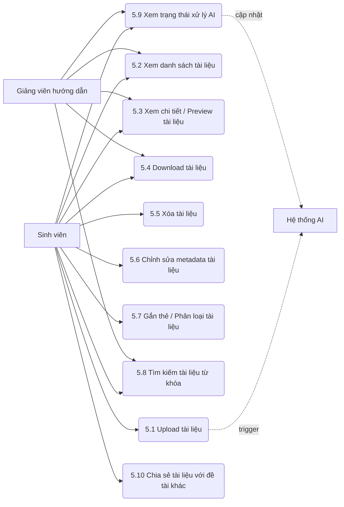

# MODULE 5 – QUẢN LÝ TÀI LIỆU NGHIÊN CỨU

> Module Quản lý tài liệu nghiên cứu cho phép sinh viên tải lên, tổ chức, phân loại, tìm kiếm và chia sẻ các tài liệu tham khảo cho đề tài của mình. Giảng viên có thể xem các tài liệu của sinh viên hướng dẫn. Hệ thống cũng tích hợp với AI để tự động trích xuất nội dung và nhúng dữ liệu (embedding) phục vụ các chức năng nâng cao ở module khác.

## Sơ đồ Use Case

---

### UC 5.1 – Upload tài liệu

| Field | Content |
|-------|---------|
| **Use case ID** | 5.1 |
| **Use case name** | Upload tài liệu |
| **Description** | Sinh viên tải tài liệu tham khảo (PDF, DOCX, TXT) lên hệ thống, tài liệu được gắn vào đề tài hiện tại. |
| **Actors** | Sinh viên, Hệ thống AI (phụ) |
| **Priority** | Cao |
| **Triggers** | Sinh viên chọn chức năng tải lên tài liệu mới. |
| **Pre-conditions** | Sinh viên đã đăng nhập và đang ở trong không gian của một đề tài. |
| **Post-conditions** | Tài liệu được lưu trữ, bản ghi được tạo trong database với trạng thái AI là "Chờ xử lý". |
| **Business rules** | Kích thước file tối đa 50MB. Chỉ hỗ trợ định dạng PDF, DOCX, TXT. Mỗi file phải có tên. |
| **Non-functional requirement** | Quá trình upload có thanh tiến trình hiển thị. Tự động đưa vào hàng đợi AI (async) để không block UX. |

**Main flow:**

| Bước | Thao tác |
|------|---------|
| 1 | Sinh viên chọn chức năng "Tải lên tài liệu". |
| 2 | Hệ thống hiển thị hộp thoại chọn file. |
| 3 | Sinh viên chọn file từ máy tính và điền thông tin (tên, mô tả ngắn nếu có). |
| 4 | Sinh viên nhấn "Xác nhận tải lên". |
| 5 | Hệ thống kiểm tra định dạng và kích thước file. |
| 6 | Hệ thống lưu file vào server (MinIO/Local) và tạo bản ghi lưu metadata vào database, trạng thái AI đặt thành "Chờ xử lý". |
| 7 | Hệ thống thông báo tải lên thành công và gửi event đến AI. |
| 8 | Hệ thống cập nhật danh sách tài liệu trên màn hình. |

**Alternative flows:**

| Luồng | Điều kiện | Xử lý |
|-------|-----------|-------|
| 5a | Người dùng hủy upload giữa chừng | Hệ thống hủy luồng tải, xóa các phần dữ liệu tạm, quay lại danh sách. |

**Exception flows:**

| Luồng | Điều kiện | Xử lý |
|-------|-----------|-------|
| 5a | Định dạng file không hợp lệ | Hệ thống báo lỗi "Chỉ hỗ trợ PDF, DOCX, TXT". Yêu cầu chọn lại. |
| 5b | Kích thước file > 50MB | Hệ thống báo lỗi vượt quá dung lượng cho phép. |
| 6a | Lỗi kết nối lưu trữ (MinIO down) | Hệ thống báo lỗi "Không thể lưu file lúc này", rollback tiến trình. |

---

### UC 5.2 – Xem danh sách tài liệu

| Field | Content |
|-------|---------|
| **Use case ID** | 5.2 |
| **Use case name** | Xem danh sách tài liệu |
| **Description** | Hiển thị tất cả tài liệu thuộc về một đề tài cho sinh viên và giảng viên hướng dẫn. |
| **Actors** | Sinh viên, Giảng viên hướng dẫn |
| **Priority** | Cao |
| **Triggers** | Người dùng truy cập vào tab/mục "Tài liệu" của đề tài. |
| **Pre-conditions** | Người dùng có quyền truy cập đề tài. |
| **Post-conditions** | Danh sách tài liệu được hiển thị đầy đủ thông tin metadata và trạng thái. |
| **Business rules** | Sinh viên và GVHD chỉ xem tài liệu của đề tài mình đang làm/hướng dẫn. |
| **Non-functional requirement** | Phân trang hoặc tải cuộn vô hạn nếu có nhiều tài liệu. Thời gian hiển thị < 1s. |

**Main flow:**

| Bước | Thao tác |
|------|---------|
| 1 | Người dùng chọn mục "Tài liệu". |
| 2 | Hệ thống truy vấn danh sách các tài liệu thuộc về đề tài. |
| 3 | Hệ thống hiển thị danh sách dạng bảng hoặc lưới, gồm: Tên tài liệu, Loại, Kích thước, Ngày tải lên, Thẻ, và Trạng thái AI. |

**Alternative flows:**

| Luồng | Điều kiện | Xử lý |
|-------|-----------|-------|
| 2a | Đề tài chưa có tài liệu nào | Hệ thống hiển thị thông báo "Chưa có tài liệu nào" và nút gọi ý tải lên (đối với sinh viên). |

**Exception flows:**

| Luồng | Điều kiện | Xử lý |
|-------|-----------|-------|
| 2a | Mất kết nối database | Hệ thống hiển thị lỗi "Không thể tải danh sách". Cung cấp nút Retry. |

---

### UC 5.3 – Xem chi tiết / Preview tài liệu

| Field | Content |
|-------|---------|
| **Use case ID** | 5.3 |
| **Use case name** | Xem chi tiết / Preview tài liệu |
| **Description** | Xem trước nội dung tài liệu ngay trên trình duyệt mà không cần tải về. |
| **Actors** | Sinh viên, Giảng viên hướng dẫn |
| **Priority** | Trung bình |
| **Triggers** | Người dùng nhấn vào nút "Xem trước" hoặc tên một tài liệu. |
| **Pre-conditions** | Tài liệu tồn tại và người dùng có quyền truy cập. |
| **Post-conditions** | Hệ thống hiển thị trình xem tài liệu nội tuyến. |
| **Business rules** | Tính năng preview hiện chỉ hỗ trợ tốt nhất cho file PDF. File DOCX/TXT có thể chuyển đổi thành PDF hoặc hiển thị dạng plain text. |
| **Non-functional requirement** | Sử dụng trình xem PDF tích hợp nhẹ, hỗ trợ zoom, cuộn trang mượt mà. |

**Main flow:**

| Bước | Thao tác |
|------|---------|
| 1 | Người dùng nhấn chọn "Xem trước" trên tài liệu. |
| 2 | Hệ thống lấy URL file (hoặc sinh URL tạm thời có xác thực). |
| 3 | Hệ thống hiển thị modal hoặc chuyển sang trang Preview. |
| 4 | Trình duyệt load nội dung tài liệu inline. |
| 5 | Người dùng xem và đóng modal/trang khi xong. |

**Alternative flows:**

| Luồng | Điều kiện | Xử lý |
|-------|-----------|-------|
| 4a | Tài liệu là file text/docx không có preview native | Hệ thống có thể gọi service render HTML hoặc gợi ý "Vui lòng tải về để xem chi tiết". |

**Exception flows:**

| Luồng | Điều kiện | Xử lý |
|-------|-----------|-------|
| 2a | File gốc không tồn tại trên server | Hệ thống hiển thị thông báo "File không tồn tại hoặc đã bị lỗi". |

---

### UC 5.4 – Download tài liệu

| Field | Content |
|-------|---------|
| **Use case ID** | 5.4 |
| **Use case name** | Download tài liệu |
| **Description** | Tải file tài liệu gốc từ hệ thống về máy cá nhân. |
| **Actors** | Sinh viên, Giảng viên hướng dẫn |
| **Priority** | Cao |
| **Triggers** | Người dùng nhấn vào icon/nút Download. |
| **Pre-conditions** | Tài liệu tồn tại. |
| **Post-conditions** | File được tải xuống máy của người dùng. |
| **Business rules** | Chỉ user có quyền trong đề tài mới tải được. |
| **Non-functional requirement** | Băng thông tải file phải được đảm bảo không bị nghẽn. |

**Main flow:**

| Bước | Thao tác |
|------|---------|
| 1 | Người dùng chọn "Download" tại dòng tài liệu. |
| 2 | Hệ thống kiểm tra quyền tải. |
| 3 | Hệ thống tạo luồng stream file hoặc pre-signed URL. |
| 4 | Trình duyệt tự động tải file về. |

**Alternative flows:**
Không có.

**Exception flows:**

| Luồng | Điều kiện | Xử lý |
|-------|-----------|-------|
| 2a | Người dùng không có quyền truy cập | Báo lỗi 403 Forbidden. |
| 3a | Lỗi server storage | Báo lỗi không tìm thấy file 404. |

---

### UC 5.5 – Xóa tài liệu

| Field | Content |
|-------|---------|
| **Use case ID** | 5.5 |
| **Use case name** | Xóa tài liệu |
| **Description** | Sinh viên xóa một tài liệu khỏi đề tài. Thao tác xóa loại bỏ file vật lý và các vector embedding liên quan. |
| **Actors** | Sinh viên |
| **Priority** | Trung bình |
| **Triggers** | Sinh viên nhấn "Xóa" tài liệu. |
| **Pre-conditions** | Sinh viên là người thực hiện đề tài. |
| **Post-conditions** | Tài liệu bị xóa khỏi danh sách, file vật lý bị xóa, record trong pgvector bị xóa. |
| **Business rules** | Chỉ sinh viên mới có quyền xóa. Giảng viên chỉ được xem. Cần xác nhận trước khi xóa. |
| **Non-functional requirement** | Việc xóa vector trong pgvector và file trên storage nên có cơ chế retry nền để đảm bảo dọn sạch rác. |

**Main flow:**

| Bước | Thao tác |
|------|---------|
| 1 | Sinh viên chọn "Xóa" một tài liệu. |
| 2 | Hệ thống hiển thị popup xác nhận: "Bạn có chắc chắn muốn xóa? Toàn bộ phân tích AI liên quan cũng sẽ bị xóa." |
| 3 | Sinh viên xác nhận "Xóa". |
| 4 | Hệ thống xóa bản ghi metadata trong DB. |
| 5 | Hệ thống gửi lệnh xóa file vật lý trên MinIO/Storage. |
| 6 | Hệ thống xóa các vector tương ứng trong pgvector. |
| 7 | Hệ thống thông báo thành công và cập nhật UI. |

**Alternative flows:**

| Luồng | Điều kiện | Xử lý |
|-------|-----------|-------|
| 3a | Sinh viên chọn "Hủy" | Đóng popup, không thực hiện hành động. |

**Exception flows:**

| Luồng | Điều kiện | Xử lý |
|-------|-----------|-------|
| 5a | Xóa file vật lý lỗi | Vẫn xóa logic trong UI nhưng log lỗi để cronjob dọn dẹp sau. |
| 6a | Lỗi xóa vector | Log lỗi cho admin xử lý bất đồng bộ. |

---

### UC 5.6 – Chỉnh sửa metadata tài liệu

| Field | Content |
|-------|---------|
| **Use case ID** | 5.6 |
| **Use case name** | Chỉnh sửa metadata tài liệu |
| **Description** | Sinh viên chỉnh sửa các thông tin thuộc tính của tài liệu (tên, mô tả). |
| **Actors** | Sinh viên |
| **Priority** | Trung bình |
| **Triggers** | Sinh viên chọn "Chỉnh sửa" tài liệu. |
| **Pre-conditions** | Tài liệu đã được tải lên. |
| **Post-conditions** | Thông tin mới được lưu lại hệ thống. |
| **Business rules** | Không thể thay đổi file vật lý thông qua chỉnh sửa, chỉ sửa thông tin văn bản. Tên không được để trống. |
| **Non-functional requirement** | Cập nhật tức thời. |

**Main flow:**

| Bước | Thao tác |
|------|---------|
| 1 | Sinh viên chọn tính năng "Chỉnh sửa" tài liệu. |
| 2 | Hệ thống mở form chứa thông tin hiện tại (Tên, Mô tả). |
| 3 | Sinh viên thay đổi thông tin và nhấn "Lưu". |
| 4 | Hệ thống validate dữ liệu. |
| 5 | Hệ thống lưu cập nhật vào database. |
| 6 | Hệ thống đóng form và cập nhật UI. |

**Alternative flows:**
Không có.

**Exception flows:**

| Luồng | Điều kiện | Xử lý |
|-------|-----------|-------|
| 4a | Tên tài liệu trống | Hệ thống báo lỗi "Tên tài liệu là bắt buộc". |

---

### UC 5.7 – Gắn thẻ / Phân loại tài liệu

| Field | Content |
|-------|---------|
| **Use case ID** | 5.7 |
| **Use case name** | Gắn thẻ / Phân loại tài liệu |
| **Description** | Sinh viên gắn các thẻ (tags) vào tài liệu để dễ dàng quản lý, nhóm và lọc sau này. |
| **Actors** | Sinh viên |
| **Priority** | Thấp |
| **Triggers** | Sinh viên chọn "Quản lý thẻ" cho một hoặc nhiều tài liệu. |
| **Pre-conditions** | Đã có tài liệu. |
| **Post-conditions** | Tài liệu được gắn các tag thành công. |
| **Business rules** | Một tài liệu có thể có nhiều thẻ. Có thể tạo thẻ mới hoặc chọn từ danh sách đã có. |
| **Non-functional requirement** | Hỗ trợ autocompletion khi nhập tag. |

**Main flow:**

| Bước | Thao tác |
|------|---------|
| 1 | Sinh viên chọn mục gắn thẻ cho tài liệu. |
| 2 | Hệ thống hiển thị input với gợi ý các thẻ đã sử dụng trong đề tài. |
| 3 | Sinh viên gõ thẻ mới hoặc chọn thẻ có sẵn. |
| 4 | Sinh viên lưu thay đổi. |
| 5 | Hệ thống cập nhật liên kết thẻ - tài liệu trong database. |
| 6 | Hệ thống hiển thị tag mới trên danh sách. |

**Alternative flows:**
Không có.

**Exception flows:**

| Luồng | Điều kiện | Xử lý |
|-------|-----------|-------|
| 3a | Tag quá dài (vd > 30 ký tự) | Báo lỗi giới hạn ký tự tag. |

---

### UC 5.8 – Tìm kiếm tài liệu theo từ khóa thông thường

| Field | Content |
|-------|---------|
| **Use case ID** | 5.8 |
| **Use case name** | Tìm kiếm tài liệu theo từ khóa thông thường |
| **Description** | Người dùng tìm kiếm tài liệu dựa trên tên file, mô tả, hoặc thẻ (tag). Đây là tìm kiếm text thuần túy. |
| **Actors** | Sinh viên, Giảng viên hướng dẫn |
| **Priority** | Cao |
| **Triggers** | Người dùng nhập ký tự vào ô tìm kiếm tài liệu. |
| **Pre-conditions** | Có tài liệu trong đề tài. |
| **Post-conditions** | Danh sách tài liệu được lọc theo từ khóa. |
| **Business rules** | Tìm kiếm không phân biệt hoa thường (case-insensitive) và là tìm kiếm tương đối (LIKE / Full text search). |
| **Non-functional requirement** | Sử dụng debounce 300ms nếu tìm kiếm trực tiếp khi gõ để giảm tải server. |

**Main flow:**

| Bước | Thao tác |
|------|---------|
| 1 | Người dùng nhập từ khóa vào ô Search. |
| 2 | Hệ thống bắt sự kiện và gửi API request với query. |
| 3 | Hệ thống tìm kiếm theo tên tài liệu, mô tả và tag. |
| 4 | Hệ thống trả về danh sách kết quả. |
| 5 | UI cập nhật chỉ hiển thị tài liệu khớp điều kiện. |

**Alternative flows:**

| Luồng | Điều kiện | Xử lý |
|-------|-----------|-------|
| 3a | Không có kết quả nào khớp | Hiển thị "Không tìm thấy tài liệu nào phù hợp với từ khóa". |

**Exception flows:**
Không có.

---

### UC 5.9 – Xem trạng thái xử lý AI của tài liệu

| Field | Content |
|-------|---------|
| **Use case ID** | 5.9 |
| **Use case name** | Xem trạng thái xử lý AI |
| **Description** | Theo dõi xem tài liệu đã được AI xử lý (đọc nội dung, tạo vector embedding) xong chưa. |
| **Actors** | Sinh viên, Giảng viên hướng dẫn |
| **Priority** | Trung bình |
| **Triggers** | Truy cập danh sách tài liệu. |
| **Pre-conditions** | Đã upload tài liệu. |
| **Post-conditions** | Trạng thái AI mới nhất (Chờ xử lý, Đang xử lý, Hoàn thành, Lỗi) được hiển thị đúng. |
| **Business rules** | Chỉ khi trạng thái "Hoàn thành", tài liệu mới có thể được dùng cho tính năng Semantic Search hay RAG Hỏi đáp. |
| **Non-functional requirement** | Có thể dùng Socket.io để push trạng thái cập nhật realtime, hoặc polling định kỳ nếu đang ở trang danh sách. |

**Main flow:**

| Bước | Thao tác |
|------|---------|
| 1 | Người dùng vào trang danh sách tài liệu. |
| 2 | Hệ thống hiển thị icon/badge trạng thái (vd: Loading, Tích xanh, Dấu X) ứng với trạng thái. |
| 3 | Worker AI ở backend xử lý tài liệu xong sẽ emit event. |
| 4 | Hệ thống (via Socket.io) gửi thông báo về client. |
| 5 | UI tự động đổi badge sang "Hoàn thành" mà không cần F5 trang. |

**Alternative flows:**

| Luồng | Điều kiện | Xử lý |
|-------|-----------|-------|
| 3a | Worker AI bị lỗi (file mã hóa mật khẩu, lỗi parse) | Trạng thái chuyển thành "Lỗi". Sinh viên có thể click vào để xem chi tiết lỗi và nút thử lại (retry). |

**Exception flows:**

| Luồng | Điều kiện | Xử lý |
|-------|-----------|-------|
| 4a | Mất kết nối Socket | Hệ thống fallback về gọi API check lại trạng thái khi người dùng làm mới trang. |

---

### UC 5.10 – Chia sẻ tài liệu với đề tài khác

| Field | Content |
|-------|---------|
| **Use case ID** | 5.10 |
| **Use case name** | Chia sẻ tài liệu với đề tài khác |
| **Description** | Sinh viên chia sẻ thông tin cơ bản (metadata, tóm tắt do AI tạo) của tài liệu cho sinh viên/đề tài khác. Không chia sẻ file vật lý. |
| **Actors** | Sinh viên |
| **Priority** | Thấp |
| **Triggers** | Sinh viên nhấn "Chia sẻ" trên một tài liệu. |
| **Pre-conditions** | Tài liệu đã được xử lý AI thành công (để có tóm tắt nếu cần). |
| **Post-conditions** | Một bản sao tham chiếu/metadata được tạo hoặc URL chia sẻ công khai được cấp. |
| **Business rules** | File gốc bị cấm tải bởi người ngoài. Người nhận chỉ đọc được mô tả, tóm tắt, tên tài liệu. |
| **Non-functional requirement** | Bảo mật quyền truy cập tĩnh đối với file vật lý, đảm bảo cơ chế chia sẻ không bị lách để lấy file. |

**Main flow:**

| Bước | Thao tác |
|------|---------|
| 1 | Sinh viên chọn "Chia sẻ" tài liệu. |
| 2 | Hệ thống tạo một link chia sẻ nội bộ hoặc chọn đề tài đích. |
| 3 | Sinh viên gửi thông tin này cho sinh viên khác. |
| 4 | Sinh viên khác bấm vào link chia sẻ. |
| 5 | Hệ thống hiển thị giao diện xem trước chia sẻ (chỉ gồm Tên, Mô tả, Tóm tắt nội dung AI), nút Tải về bị ẩn/khóa. |

**Alternative flows:**

| Luồng | Điều kiện | Xử lý |
|-------|-----------|-------|
| 1a | Sinh viên muốn tắt chia sẻ | Sinh viên chọn lại và "Ngừng chia sẻ", link chia sẻ trở nên vô hiệu. |

**Exception flows:**

| Luồng | Điều kiện | Xử lý |
|-------|-----------|-------|
| 4a | Người xem cố lấy ID để tải file | API download chặn do người xem không thuộc đề tài. |
