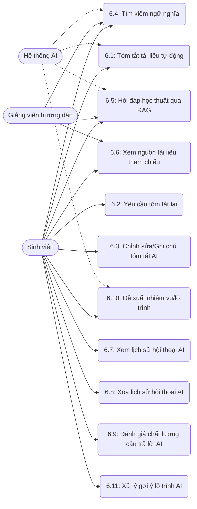

# MODULE 6 – HỖ TRỢ BỞI AI

> Module cung cấp các chức năng ứng dụng AI để hỗ trợ học thuật trong hệ thống NovaThesis, bao gồm tóm tắt tài liệu tự động, tìm kiếm ngữ nghĩa, hỏi đáp qua RAG và gợi ý lộ trình thực hiện đề tài.

## Sơ đồ Use Case

---

### UC 6.1 – Tóm tắt tài liệu tự động (kích hoạt sau upload)

| Field | Content |
|-------|---------|
| **Use case ID** | 6.1 |
| **Use case name** | Tóm tắt tài liệu tự động |
| **Description** | Hệ thống tự động trích xuất nội dung và gọi AI để tóm tắt tài liệu sau khi sinh viên tải lên thành công. |
| **Actors** | Hệ thống (nội bộ), Hệ thống AI |
| **Priority** | Cao |
| **Triggers** | Sinh viên tải lên tài liệu thành công. |
| **Pre-conditions** | Tài liệu hợp lệ, có định dạng đọc được văn bản (PDF, DOCX) và hệ thống AI đang hoạt động. |
| **Post-conditions** | Tài liệu có bản tóm tắt tự động lưu trong cơ sở dữ liệu. |
| **Business rules** | Chỉ áp dụng cho tài liệu có định dạng hỗ trợ trích xuất văn bản; Tóm tắt chạy bất đồng bộ (background). |
| **Non-functional requirement** | Quá trình trích xuất và tóm tắt không ảnh hưởng trải nghiệm người dùng hiện tại; Giới hạn độ dài văn bản gửi lên AI API. |

**Main flow:**

| Bước | Thao tác |
|------|---------|
| 1 | Hệ thống nội bộ nhận sự kiện tài liệu được tải lên thành công. |
| 2 | Hệ thống trích xuất văn bản (text) từ tài liệu (PDF, DOCX). |
| 3 | Hệ thống phân chia văn bản thành các đoạn (chunks) nếu văn bản quá dài. |
| 4 | Hệ thống gửi nội dung đến API của Hệ thống AI để yêu cầu tóm tắt. |
| 5 | Hệ thống AI xử lý và trả về kết quả tóm tắt. |
| 6 | Hệ thống lưu bản tóm tắt vào cơ sở dữ liệu, liên kết với tài liệu vừa upload. |
| 7 | Hệ thống cập nhật trạng thái xử lý AI của tài liệu thành "Hoàn thành". |

**Alternative flows:**

| Luồng | Điều kiện | Xử lý |
|-------|-----------|-------|
| 3a | Văn bản ngắn | Bỏ qua bước chia chunk, gửi toàn bộ nội dung cho AI. |

**Exception flows:**

| Luồng | Điều kiện | Xử lý |
|-------|-----------|-------|
| 2a | Không thể trích xuất văn bản (tài liệu rỗng hoặc là ảnh scan không có OCR) | Đánh dấu trạng thái xử lý AI là "Lỗi trích xuất" và dừng lại. |
| 5a | API AI phản hồi lỗi hoặc timeout | Thử lại tối đa 3 lần. Nếu vẫn lỗi, cập nhật trạng thái "Lỗi AI" và thông báo cho quản trị viên. |

---

### UC 6.2 – Yêu cầu tóm tắt lại

| Field | Content |
|-------|---------|
| **Use case ID** | 6.2 |
| **Use case name** | Yêu cầu tóm tắt lại |
| **Description** | Sinh viên yêu cầu hệ thống tạo lại bản tóm tắt khác nếu bản hiện tại không đạt yêu cầu. |
| **Actors** | Sinh viên, Hệ thống AI |
| **Priority** | Trung bình |
| **Triggers** | Sinh viên click nút "Tóm tắt lại" trên giao diện chi tiết tài liệu. |
| **Pre-conditions** | Tài liệu đã được xử lý AI trước đó (đã có tóm tắt hoặc bị lỗi AI). |
| **Post-conditions** | Hệ thống tạo và lưu bản tóm tắt mới. |
| **Business rules** | Giới hạn số lần yêu cầu tóm tắt lại trong ngày để tránh spam API. |
| **Non-functional requirement** | Phản hồi tiến trình đang xử lý ngay trên UI. |

**Main flow:**

| Bước | Thao tác |
|------|---------|
| 1 | Sinh viên truy cập chi tiết tài liệu và nhấn "Tóm tắt lại". |
| 2 | Hệ thống kiểm tra số lần giới hạn tóm tắt trong ngày của sinh viên. |
| 3 | Hệ thống cập nhật trạng thái tài liệu thành "Đang xử lý". |
| 4 | Hệ thống gửi yêu cầu sinh tóm tắt mới tới Hệ thống AI. |
| 5 | Hệ thống AI trả về kết quả tóm tắt mới. |
| 6 | Hệ thống thay thế bản tóm tắt cũ bằng bản mới trong CSDL. |
| 7 | Hệ thống cập nhật trạng thái xử lý thành "Hoàn thành" và hiển thị tóm tắt mới trên giao diện. |

**Alternative flows:**

| Luồng | Điều kiện | Xử lý |
|-------|-----------|-------|
| 2a | Vượt quá giới hạn số lần tóm tắt lại | Hệ thống hiển thị thông báo lỗi và từ chối thực hiện. |

**Exception flows:**

| Luồng | Điều kiện | Xử lý |
|-------|-----------|-------|
| 5a | API AI phản hồi lỗi | Cập nhật trạng thái "Lỗi AI", giữ nguyên tóm tắt cũ và thông báo cho sinh viên. |

---

### UC 6.3 – Chỉnh sửa / Ghi chú vào tóm tắt AI

| Field | Content |
|-------|---------|
| **Use case ID** | 6.3 |
| **Use case name** | Chỉnh sửa / Ghi chú vào tóm tắt AI |
| **Description** | Sinh viên có thể chỉnh sửa thủ công hoặc thêm ghi chú cá nhân vào bản tóm tắt do AI tạo ra. |
| **Actors** | Sinh viên |
| **Priority** | Trung bình |
| **Triggers** | Sinh viên nhấn "Chỉnh sửa" tại phần tóm tắt. |
| **Pre-conditions** | Tài liệu đã có bản tóm tắt. |
| **Post-conditions** | Bản tóm tắt mới (đã qua chỉnh sửa) và ghi chú được lưu lại. |
| **Business rules** | Chỉ chủ sở hữu đề tài (hoặc thành viên nhóm) mới có quyền chỉnh sửa. |
| **Non-functional requirement** | UX thân thiện với trình soạn thảo văn bản phong phú (Rich Text Editor). |

**Main flow:**

| Bước | Thao tác |
|------|---------|
| 1 | Sinh viên nhấn nút "Chỉnh sửa" tại khối hiển thị tóm tắt. |
| 2 | Hệ thống mở giao diện chỉnh sửa với nội dung tóm tắt hiện tại. |
| 3 | Sinh viên thay đổi nội dung tóm tắt và thêm các ghi chú cá nhân. |
| 4 | Sinh viên nhấn nút "Lưu". |
| 5 | Hệ thống kiểm tra tính hợp lệ của dữ liệu đầu vào. |
| 6 | Hệ thống cập nhật nội dung vào CSDL, đánh dấu là "Đã chỉnh sửa bởi người dùng". |
| 7 | Hệ thống thông báo lưu thành công và hiển thị nội dung cập nhật. |

**Alternative flows:**

| Luồng | Điều kiện | Xử lý |
|-------|-----------|-------|
| 4a | Sinh viên nhấn "Hủy" | Hệ thống đóng giao diện chỉnh sửa, không lưu thay đổi. |

**Exception flows:**

| Luồng | Điều kiện | Xử lý |
|-------|-----------|-------|
| 5a | Nội dung chỉnh sửa vượt quá độ dài cho phép | Hệ thống báo lỗi và yêu cầu sinh viên rút gọn. |

---

### UC 6.4 – Tìm kiếm ngữ nghĩa (Semantic Search)

| Field | Content |
|-------|---------|
| **Use case ID** | 6.4 |
| **Use case name** | Tìm kiếm ngữ nghĩa (Semantic Search) |
| **Description** | Sinh viên hoặc giảng viên nhập truy vấn bằng ngôn ngữ tự nhiên để tìm kiếm nội dung trong các tài liệu dựa trên ý nghĩa (không chỉ từ khóa). |
| **Actors** | Sinh viên, Giảng viên hướng dẫn, Hệ thống AI |
| **Priority** | Cao |
| **Triggers** | Người dùng nhập câu truy vấn vào ô tìm kiếm AI và nhấn "Tìm kiếm". |
| **Pre-conditions** | Tài liệu trong đề tài đã được xử lý embedding và lưu vào cơ sở dữ liệu vector (pgvector). |
| **Post-conditions** | Hệ thống hiển thị danh sách các đoạn tài liệu có ý nghĩa tương đồng nhất. |
| **Business rules** | Phạm vi tìm kiếm bị giới hạn trong các tài liệu thuộc đề tài của sinh viên (không cross-thesis). |
| **Non-functional requirement** | Thời gian phản hồi tìm kiếm dưới 3 giây; Trả về Top-K kết quả (K thường là 3-5). |

**Main flow:**

| Bước | Thao tác |
|------|---------|
| 1 | Người dùng nhập câu hỏi/truy vấn ngôn ngữ tự nhiên vào thanh tìm kiếm và gửi yêu cầu. |
| 2 | Hệ thống gọi API để tạo vector (embedding) cho câu truy vấn. |
| 3 | Hệ thống AI trả về vector của câu truy vấn. |
| 4 | Hệ thống thực hiện truy vấn so sánh cosine similarity bằng pgvector trên các chunk tài liệu thuộc đề tài hiện tại. |
| 5 | Hệ thống lấy ra Top-K kết quả có độ tương đồng cao nhất. |
| 6 | Hệ thống hiển thị danh sách kết quả, bao gồm trích đoạn nội dung, tên tài liệu chứa đoạn đó và độ tương đồng. |

**Alternative flows:**

| Luồng | Điều kiện | Xử lý |
|-------|-----------|-------|
| 5a | Không tìm thấy kết quả nào có độ tương đồng đạt ngưỡng | Hệ thống hiển thị thông báo "Không tìm thấy nội dung phù hợp" và gợi ý thay đổi từ khóa. |

**Exception flows:**

| Luồng | Điều kiện | Xử lý |
|-------|-----------|-------|
| 2a | API tạo embedding bị lỗi | Hệ thống thông báo lỗi tạm thời không thể tìm kiếm. |

---

### UC 6.5 – Hỏi đáp học thuật qua RAG

| Field | Content |
|-------|---------|
| **Use case ID** | 6.5 |
| **Use case name** | Hỏi đáp học thuật qua RAG |
| **Description** | Sinh viên/giảng viên đặt câu hỏi cho AI, AI truy xuất dữ liệu từ tài liệu đề tài để sinh câu trả lời kèm theo trích dẫn nguồn. |
| **Actors** | Sinh viên, Giảng viên hướng dẫn, Hệ thống AI |
| **Priority** | Cao |
| **Triggers** | Người dùng gửi câu hỏi trong giao diện hội thoại (Chat). |
| **Pre-conditions** | Tài liệu đã được xử lý embedding. |
| **Post-conditions** | AI trả lời câu hỏi kèm trích dẫn (citations) cụ thể. |
| **Business rules** | Chỉ tìm và dựa vào tài liệu của đề tài hiện tại; Trả lời theo context (RAG) không bịa đặt (hallucination). |
| **Non-functional requirement** | Sử dụng luồng (streaming) để trả lời từng phần chữ giống ChatGPT nhằm tối ưu UX. |

**Main flow:**

| Bước | Thao tác |
|------|---------|
| 1 | Người dùng nhập câu hỏi vào cửa sổ chat AI. |
| 2 | Hệ thống thực hiện UC 6.4 (Tìm kiếm ngữ nghĩa) để lấy các chunk nội dung liên quan nhất (Context). |
| 3 | Hệ thống ghép câu hỏi của người dùng và Context thành một Prompt RAG cấu trúc. |
| 4 | Hệ thống gửi Prompt cùng lịch sử hội thoại gần nhất đến LLM. |
| 5 | LLM sinh câu trả lời dựa trên Context và trả về dữ liệu (theo dạng streaming). |
| 6 | Hệ thống hiển thị câu trả lời dần dần lên màn hình người dùng. |
| 7 | Sau khi hoàn tất, hệ thống đính kèm danh sách tài liệu tham chiếu (citations) dưới câu trả lời. |
| 8 | Hệ thống lưu tin nhắn của người dùng và câu trả lời của AI vào lịch sử hội thoại. |

**Alternative flows:**

| Luồng | Điều kiện | Xử lý |
|-------|-----------|-------|
| 2a | Context tìm được không đủ để trả lời | LLM trả lời "Không tìm thấy thông tin đủ để trả lời từ tài liệu của bạn" thay vì tự bịa thông tin. |

**Exception flows:**

| Luồng | Điều kiện | Xử lý |
|-------|-----------|-------|
| 5a | Lỗi kết nối API LLM | Hệ thống thông báo lỗi sinh câu trả lời và yêu cầu thử lại sau. |

---

### UC 6.6 – Xem nguồn tài liệu tham chiếu (RAG citations)

| Field | Content |
|-------|---------|
| **Use case ID** | 6.6 |
| **Use case name** | Xem nguồn tài liệu tham chiếu (RAG citations) |
| **Description** | Người dùng xem chi tiết các đoạn văn bản nguồn (citations) mà AI đã dựa vào để trả lời. |
| **Actors** | Sinh viên, Giảng viên hướng dẫn |
| **Priority** | Trung bình |
| **Triggers** | Người dùng click vào thẻ trích dẫn (citation tag) dưới câu trả lời của AI. |
| **Pre-conditions** | Có câu trả lời RAG với trích dẫn đi kèm. |
| **Post-conditions** | Hiển thị modal hoặc panel chứa nội dung tài liệu gốc và số trang (nếu có). |
| **Business rules** | Người dùng phải có quyền truy cập vào tài liệu đó. |
| **Non-functional requirement** | Hiển thị highlight (đánh dấu) trên đoạn text gốc. |

**Main flow:**

| Bước | Thao tác |
|------|---------|
| 1 | Người dùng click vào một trích dẫn đính kèm cuối câu trả lời của AI. |
| 2 | Hệ thống truy xuất dữ liệu chi tiết của chunk tài liệu tương ứng từ CSDL. |
| 3 | Hệ thống hiển thị cửa sổ nhỏ (popover/modal) chứa tên tài liệu, nội dung đoạn văn bản gốc và vị trí (số trang). |
| 4 | Người dùng xem thông tin và đóng cửa sổ. |

**Alternative flows:**
- (Không có luồng phụ đáng kể)

**Exception flows:**

| Luồng | Điều kiện | Xử lý |
|-------|-----------|-------|
| 2a | Tài liệu nguồn đã bị xóa khỏi hệ thống | Hệ thống hiển thị thông báo "Tài liệu nguồn không còn tồn tại". |

---

### UC 6.7 – Xem lịch sử hội thoại AI

| Field | Content |
|-------|---------|
| **Use case ID** | 6.7 |
| **Use case name** | Xem lịch sử hội thoại AI |
| **Description** | Sinh viên xem lại các cuộc hội thoại đã thực hiện với AI. |
| **Actors** | Sinh viên |
| **Priority** | Thấp |
| **Triggers** | Sinh viên mở tab "Lịch sử AI". |
| **Pre-conditions** | Đã từng chat với AI. |
| **Post-conditions** | Hiển thị danh sách phiên (session) và nội dung chat chi tiết. |
| **Business rules** | Lịch sử chat được lưu trữ theo từng đề tài. |
| **Non-functional requirement** | Tải tin nhắn phân trang (pagination) để không làm nặng ứng dụng. |

**Main flow:**

| Bước | Thao tác |
|------|---------|
| 1 | Sinh viên chọn "Lịch sử AI" trên menu đề tài. |
| 2 | Hệ thống lấy danh sách các phiên hội thoại (session) từ CSDL. |
| 3 | Hệ thống hiển thị danh sách các phiên (gồm thời gian, câu hỏi đầu tiên làm tiêu đề). |
| 4 | Sinh viên click vào một phiên hội thoại. |
| 5 | Hệ thống tải chi tiết các tin nhắn trong phiên đó. |
| 6 | Hệ thống hiển thị lịch sử chat trên màn hình. |

**Alternative flows:**
- (Không có luồng phụ đáng kể)

**Exception flows:**

| Luồng | Điều kiện | Xử lý |
|-------|-----------|-------|
| 2a | Không có lịch sử nào | Hệ thống hiển thị "Chưa có cuộc hội thoại nào". |

---

### UC 6.8 – Xóa lịch sử hội thoại AI

| Field | Content |
|-------|---------|
| **Use case ID** | 6.8 |
| **Use case name** | Xóa lịch sử hội thoại AI |
| **Description** | Sinh viên xóa một phiên hoặc toàn bộ lịch sử hội thoại với AI. |
| **Actors** | Sinh viên |
| **Priority** | Thấp |
| **Triggers** | Sinh viên nhấn nút "Xóa" tại một phiên hội thoại. |
| **Pre-conditions** | Có lịch sử hội thoại tồn tại. |
| **Post-conditions** | Phiên hội thoại bị xóa hoàn toàn khỏi CSDL, không thể phục hồi. |
| **Business rules** | Xóa hội thoại sẽ xóa luôn context của phiên đó cho các câu hỏi tiếp theo trong phiên. |
| **Non-functional requirement** | Yêu cầu xác nhận (confirm) trước khi xóa. |

**Main flow:**

| Bước | Thao tác |
|------|---------|
| 1 | Sinh viên chọn nút "Xóa" trên một phiên hội thoại. |
| 2 | Hệ thống hiển thị thông báo xác nhận: "Bạn có chắc muốn xóa cuộc hội thoại này?". |
| 3 | Sinh viên xác nhận "Đồng ý". |
| 4 | Hệ thống xóa dữ liệu phiên hội thoại và các tin nhắn liên quan trong CSDL. |
| 5 | Hệ thống cập nhật lại danh sách hội thoại trên giao diện. |

**Alternative flows:**

| Luồng | Điều kiện | Xử lý |
|-------|-----------|-------|
| 3a | Sinh viên chọn "Hủy" | Đóng hộp thoại, không thực hiện xóa. |
| 1a | Sinh viên chọn "Xóa tất cả" | Hệ thống yêu cầu xác nhận và xóa toàn bộ session thuộc đề tài hiện tại của sinh viên. |

**Exception flows:**
- Lỗi kết nối CSDL (xử lý lỗi chung).

---

### UC 6.9 – Đánh giá chất lượng câu trả lời AI (thumbs up/down)

| Field | Content |
|-------|---------|
| **Use case ID** | 6.9 |
| **Use case name** | Đánh giá chất lượng câu trả lời AI |
| **Description** | Người dùng thả biểu tượng (thumbs up/down) và gửi ghi chú để đánh giá câu trả lời của AI. |
| **Actors** | Sinh viên, Giảng viên hướng dẫn |
| **Priority** | Thấp |
| **Triggers** | Người dùng click vào icon 👍 hoặc 👎 dưới câu trả lời của AI. |
| **Pre-conditions** | Có câu trả lời AI trong cửa sổ chat. |
| **Post-conditions** | Dữ liệu đánh giá được lưu lại để phân tích cải thiện AI. |
| **Business rules** | Mỗi câu trả lời chỉ được đánh giá 1 lần (có thể thay đổi đánh giá). |
| **Non-functional requirement** | Thao tác mượt mà không load lại trang. |

**Main flow:**

| Bước | Thao tác |
|------|---------|
| 1 | Người dùng nhấn vào icon 👍 (Tốt) hoặc 👎 (Không tốt). |
| 2 | Hệ thống thay đổi trạng thái icon (highlight). |
| 3 | (Tùy chọn) Hệ thống hiển thị một text box nhỏ hỏi "Bạn có muốn cung cấp thêm ý kiến không?". |
| 4 | Người dùng nhập phản hồi và nhấn "Gửi" (hoặc bỏ qua). |
| 5 | Hệ thống lưu trạng thái đánh giá (và ghi chú) vào CSDL ứng với message ID đó. |

**Alternative flows:**

| Luồng | Điều kiện | Xử lý |
|-------|-----------|-------|
| 1a | Người dùng nhấn lại vào icon đã chọn | Hủy bỏ đánh giá cũ. |

**Exception flows:**
- (Không có luồng ngoại lệ đáng kể)

---

### UC 6.10 – Đề xuất nhiệm vụ / lộ trình thực hiện

| Field | Content |
|-------|---------|
| **Use case ID** | 6.10 |
| **Use case name** | Đề xuất nhiệm vụ / lộ trình thực hiện |
| **Description** | AI phân tích tiến độ, milestone hiện tại và nội dung tài liệu để gợi ý danh sách nhiệm vụ tiếp theo cho sinh viên. |
| **Actors** | Sinh viên, Hệ thống AI |
| **Priority** | Trung bình |
| **Triggers** | Sinh viên nhấn "Nhận gợi ý lộ trình từ AI". |
| **Pre-conditions** | Đề tài đã được duyệt và có ít nhất 1 tài liệu hoặc milestone cơ bản. |
| **Post-conditions** | Hiển thị danh sách các nhiệm vụ/milestone do AI đề xuất. |
| **Business rules** | Đề xuất phải bám sát tên đề tài và trạng thái hiện tại (chưa hoàn thành). |
| **Non-functional requirement** | Cấu trúc dữ liệu AI trả về phải là định dạng JSON chuẩn để hệ thống dễ dàng parse và hiển thị. |

**Main flow:**

| Bước | Thao tác |
|------|---------|
| 1 | Sinh viên nhấn nút "Gợi ý lộ trình từ AI" tại màn hình Quản lý Milestone. |
| 2 | Hệ thống thu thập thông tin: tên đề tài, mô tả, danh sách milestone hiện tại, tiến độ và tóm tắt tài liệu mới nhất. |
| 3 | Hệ thống đóng gói thông tin vào một prompt cấu trúc và gửi tới Hệ thống AI. |
| 4 | Hệ thống AI phân tích và trả về danh sách các nhiệm vụ/milestone gợi ý (dưới định dạng JSON). |
| 5 | Hệ thống parse JSON và hiển thị danh sách gợi ý lên giao diện dưới dạng các thẻ "Nhiệm vụ đề xuất". |

**Alternative flows:**
- (Không có luồng phụ đáng kể)

**Exception flows:**

| Luồng | Điều kiện | Xử lý |
|-------|-----------|-------|
| 4a | AI không sinh được cấu trúc JSON hợp lệ | Hệ thống thử lại 1 lần, nếu thất bại hiển thị lỗi "Không thể phân tích phản hồi AI, vui lòng thử lại". |

---

### UC 6.11 – Xử lý gợi ý lộ trình AI (Chấp nhận / Từ chối / Chỉnh sửa / Tái tạo)

| Field | Content |
|-------|---------|
| **Use case ID** | 6.11 |
| **Use case name** | Xử lý gợi ý lộ trình AI |
| **Description** | Sinh viên tương tác với danh sách gợi ý nhiệm vụ/lộ trình do AI tạo ra: chấp nhận để tạo milestone, từ chối/bỏ qua, chỉnh sửa nội dung gợi ý, hoặc yêu cầu AI tái tạo tập gợi ý mới. |
| **Actors** | Sinh viên, Hệ thống AI |
| **Priority** | Trung bình |
| **Triggers** | Danh sách gợi ý từ UC 6.10 hiển thị trên giao diện. |
| **Pre-conditions** | Đã có danh sách gợi ý từ UC 6.10. |
| **Post-conditions** | Gợi ý được chấp nhận tạo milestone chính thức, bị loại bỏ, chỉnh sửa nội dung, hoặc thay thế bằng tập mới. |
| **Business rules** | 1. Milestone tạo từ AI có trạng thái "To Do" và cần xác định lại deadline hợp lý. 2. Giới hạn số lần tái tạo liên tục để tránh spam API. 3. Việc bỏ qua không xóa dữ liệu vĩnh viễn nhưng ẩn khỏi view hiện tại. |
| **Non-functional requirement** | Giao diện cho phép chọn multi-select. UX thao tác nhanh (inline edit). Hạn chế gọi lại API khi tái tạo. |

**Main flow – Chấp nhận gợi ý:**

| Bước | Thao tác |
|------|---------|
| 1 | Sinh viên xem danh sách các nhiệm vụ do AI gợi ý. |
| 2 | Sinh viên tích chọn (checkbox) một hoặc nhiều nhiệm vụ phù hợp. |
| 3 | Sinh viên điều chỉnh thông tin (tên, mô tả, deadline) nếu cần. |
| 4 | Sinh viên nhấn nút "Tạo Milestone". |
| 5 | Hệ thống gọi API tạo milestone mới cho từng nhiệm vụ được chọn (tương tác Module 4). |
| 6 | Hệ thống ẩn các gợi ý đã sử dụng và thông báo thành công. |

**Main flow – Từ chối/Bỏ qua:**

| Bước | Thao tác |
|------|---------|
| 1 | Sinh viên nhấn nút "Bỏ qua" (X) trên thẻ gợi ý. |
| 2 | Hệ thống ẩn thẻ gợi ý đó khỏi màn hình. |

**Main flow – Chỉnh sửa gợi ý:**

| Bước | Thao tác |
|------|---------|
| 1 | Sinh viên nhấn vào tiêu đề hoặc nội dung thẻ gợi ý (inline edit). |
| 2 | Sinh viên nhập nội dung mới và nhấn Enter/Lưu. |
| 3 | Hệ thống cập nhật hiển thị của thẻ gợi ý. |

**Main flow – Tái tạo gợi ý:**

| Bước | Thao tác |
|------|---------|
| 1 | Sinh viên nhấn "Tạo lại gợi ý" trên màn hình gợi ý AI. |
| 2 | Hệ thống kiểm tra giới hạn lượt gọi API. |
| 3 | Hệ thống làm sạch danh sách gợi ý cũ, hiển thị trạng thái đang tải. |
| 4 | Hệ thống gọi lại luồng UC 6.10, bổ sung prompt yêu cầu nội dung khác biệt. |
| 5 | AI trả về danh sách gợi ý mới. |
| 6 | Hệ thống hiển thị danh sách gợi ý mới cho sinh viên. |

**Alternative flows:**

| Luồng | Điều kiện | Xử lý |
|-------|-----------|-------|
| 2b (Tái tạo) | Vượt quá số lần cho phép | Hệ thống từ chối và báo "Vui lòng thử lại sau X phút". |

**Exception flows:**

| Luồng | Điều kiện | Xử lý |
|-------|-----------|-------|
| 5a (Chấp nhận) | Lỗi tạo milestone từ Module 4 | Báo lỗi. |
| 5b (Tái tạo) | AI gặp lỗi | Hiển thị thông báo lỗi và giữ nguyên hoặc cho phép thử lại. |

---
