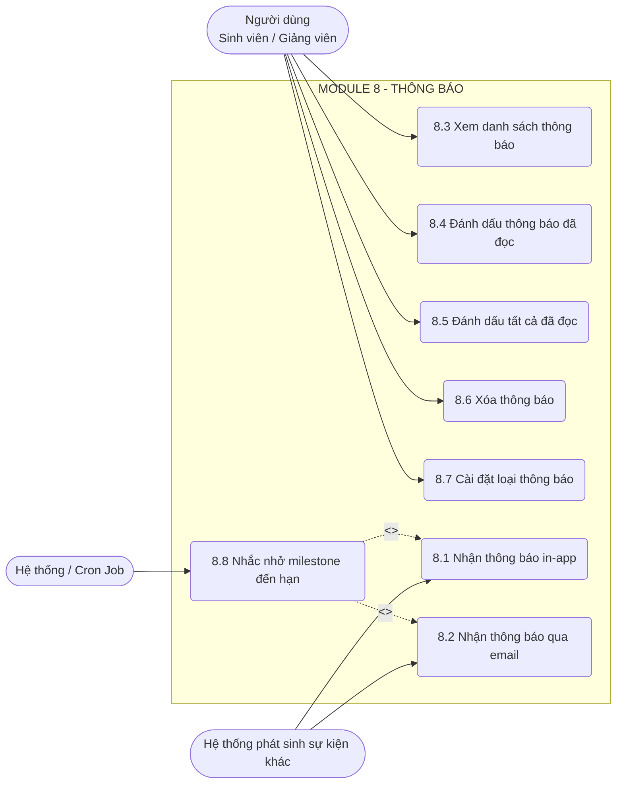

# MODULE 8 – THÔNG BÁO

> Module này quản lý toàn bộ hệ thống thông báo của NovaThesis, bao gồm thông báo thời gian thực (in-app) thông qua Socket.io, thông báo qua Email sử dụng Nodemailer, quản lý trạng thái thông báo và các tác vụ tự động nhắc nhở tiến độ.

---

### UC 8.1 – Nhận thông báo in-app (real-time)

| Field | Content |
|-------|---------|
| **Use case ID** | 8.1 |
| **Use case name** | Nhận thông báo in-app (real-time) |
| **Description** | Hệ thống tự động đẩy thông báo theo thời gian thực đến client của người dùng thông qua Socket.io khi có sự kiện mới xảy ra. |
| **Actors** | Sinh viên, Giảng viên hướng dẫn, Hệ thống (nội bộ) |
| **Priority** | Cao |
| **Triggers** | Hệ thống phát sinh các sự kiện như: duyệt đề tài, có phản hồi mới, milestone đến hạn, AI hoàn thành xử lý. |
| **Pre-conditions** | Người dùng đã đăng nhập và đang có kết nối Socket.io hợp lệ với máy chủ. Cấu hình nhận thông báo in-app cho sự kiện tương ứng đang bật. |
| **Post-conditions** | Giao diện người dùng hiển thị toast notification (nếu đang online) và cập nhật tăng số lượng badge trên icon bell. Thông báo được lưu vào cơ sở dữ liệu. |
| **Business rules** | 1. Chỉ gửi qua Socket.io tới các phiên kết nối đang active của người dùng. 2. Mỗi thông báo phải lưu trong DB với trạng thái mặc định là "Chưa đọc". |
| **Non-functional requirement** | Độ trễ khi nhận thông báo real-time không vượt quá 2 giây. Payload gửi qua socket phải được tối ưu (nhẹ). |

**Main flow:**

| Bước | Thao tác |
|------|---------|
| 1 | Hệ thống (backend) ghi nhận một sự kiện cần thông báo (ví dụ: Giảng viên phê duyệt đề tài). |
| 2 | Hệ thống kiểm tra cấu hình thông báo in-app của người dùng nhận. |
| 3 | Hệ thống lưu thông báo vào cơ sở dữ liệu với trạng thái "Chưa đọc". |
| 4 | Hệ thống xác định các socket id đang kết nối của người dùng. |
| 5 | Hệ thống emit sự kiện thông báo kèm dữ liệu (tiêu đề, nội dung ngắn, link) qua Socket.io. |
| 6 | Trình duyệt client nhận sự kiện, hiển thị pop-up/toast thông báo và cập nhật số lượng thông báo chưa đọc trên icon bell. |

**Alternative flows:**

| Luồng | Điều kiện | Xử lý |
|-------|-----------|-------|
| 4a | Người dùng không online (không có socket kết nối). | Hệ thống bỏ qua bước gửi qua Socket.io (chỉ lưu DB ở bước 3) và kết thúc UC. |
| 2a | Người dùng đã tắt cấu hình thông báo in-app cho sự kiện này. | Hệ thống hủy quá trình tạo thông báo in-app và kết thúc UC. |

**Exception flows:**

| Luồng | Điều kiện | Xử lý |
|-------|-----------|-------|
| 3a | Lỗi kết nối cơ sở dữ liệu khi lưu thông báo. | Hệ thống ghi log lỗi hệ thống, không gửi emit qua socket để tránh sai lệch dữ liệu hiển thị. |
| 5a | Mất kết nối mạng đột ngột khi đang emit sự kiện. | Socket.io tự động retry kết nối ở client, thông báo có thể bị lỡ nhưng vẫn nằm trong DB để người dùng xem ở UC 8.3. |

---

### UC 8.2 – Nhận thông báo qua email

| Field | Content |
|-------|---------|
| **Use case ID** | 8.2 |
| **Use case name** | Nhận thông báo qua email |
| **Description** | Hệ thống gửi thông báo định dạng HTML đẹp mắt qua email của người dùng thông qua Nodemailer. |
| **Actors** | Sinh viên, Giảng viên hướng dẫn, Hệ thống (nội bộ) |
| **Priority** | Trung bình |
| **Triggers** | Hệ thống phát sinh các sự kiện quan trọng và người dùng có cấu hình nhận email. |
| **Pre-conditions** | Người dùng có địa chỉ email hợp lệ trong hệ thống. Cấu hình nhận thông báo qua email cho loại sự kiện tương ứng đang bật. |
| **Post-conditions** | Một email thông báo được gửi thành công đến hòm thư của người dùng. |
| **Business rules** | 1. Email phải sử dụng các template HTML đã được thiết kế sẵn cho từng loại sự kiện. 2. Các email gửi đi cần được đẩy vào message queue để không làm block luồng xử lý chính. |
| **Non-functional requirement** | Email gửi đi không được rơi vào thư mục Spam. Quá trình gửi email phải xử lý bất đồng bộ. |

**Main flow:**

| Bước | Thao tác |
|------|---------|
| 1 | Hệ thống sinh ra sự kiện cần gửi email (VD: AI hoàn thành xử lý tài liệu, milestone quá hạn). |
| 2 | Hệ thống kiểm tra cấu hình thông báo qua email của người dùng nhận. |
| 3 | Hệ thống đẩy job gửi email vào Queue. |
| 4 | Worker xử lý Queue lấy thông tin job, chuẩn bị dữ liệu và bind vào HTML template tương ứng. |
| 5 | Hệ thống sử dụng Nodemailer kết nối với SMTP server để gửi email. |
| 6 | Đánh dấu job gửi email thành công và ghi log. |

**Alternative flows:**

| Luồng | Điều kiện | Xử lý |
|-------|-----------|-------|
| 2a | Người dùng đã tắt cấu hình nhận email cho loại sự kiện này. | Hệ thống hủy quá trình, không đẩy job vào queue và kết thúc UC. |

**Exception flows:**

| Luồng | Điều kiện | Xử lý |
|-------|-----------|-------|
| 5a | Kết nối SMTP server thất bại hoặc timeout. | Worker đánh dấu job bị lỗi, tự động retry lại theo cấu hình (ví dụ 3 lần). Sau 3 lần vẫn lỗi thì chuyển vào Dead Letter Queue và ghi log cảnh báo Admin. |
| 4a | Template HTML bị lỗi không compile được. | Hủy bỏ gửi email, ghi log hệ thống (critical error) và kết thúc UC. |

---

### UC 8.3 – Xem danh sách thông báo

| Field | Content |
|-------|---------|
| **Use case ID** | 8.3 |
| **Use case name** | Xem danh sách thông báo |
| **Description** | Người dùng mở giao diện panel thông báo để xem danh sách các thông báo đã nhận, được sắp xếp theo thời gian mới nhất. |
| **Actors** | Sinh viên, Giảng viên hướng dẫn |
| **Priority** | Cao |
| **Triggers** | Người dùng nhấn vào biểu tượng chuông (bell icon) trên thanh điều hướng. |
| **Pre-conditions** | Người dùng đã đăng nhập thành công vào hệ thống. |
| **Post-conditions** | Danh sách thông báo được hiển thị đầy đủ, phân biệt rõ thông báo đã đọc và chưa đọc. |
| **Business rules** | 1. Thông báo mới nhất phải hiển thị trên cùng (Sort by created_at DESC). 2. Thông báo chưa đọc phải được bôi đậm hoặc có chấm xanh nổi bật. 3. Load thông báo theo dạng phân trang (pagination) hoặc cuộn vô hạn (infinite scroll), mặc định 10-20 thông báo/lần. |
| **Non-functional requirement** | Thời gian lấy danh sách thông báo không vượt quá 1 giây. |

**Main flow:**

| Bước | Thao tác |
|------|---------|
| 1 | Người dùng click vào icon chuông trên header. |
| 2 | Client gửi yêu cầu lấy danh sách thông báo (kèm trang số 1) lên server. |
| 3 | Server truy vấn DB, lấy danh sách các thông báo của người dùng hiện tại, sắp xếp mới nhất. |
| 4 | Server trả về danh sách thông báo và tổng số thông báo chưa đọc. |
| 5 | Client hiển thị dropdown panel chứa danh sách thông báo. Các thông báo chưa đọc được highlight nổi bật. |

**Alternative flows:**

| Luồng | Điều kiện | Xử lý |
|-------|-----------|-------|
| 3a | Người dùng không có bất kỳ thông báo nào. | Server trả về danh sách rỗng, Client hiển thị thông báo "Bạn chưa có thông báo nào" và ảnh minh họa (empty state). |
| 5a | Người dùng cuộn xuống cuối danh sách (Infinite scroll). | Client gọi API lấy trang tiếp theo, nối tiếp dữ liệu vào danh sách hiện tại. |

**Exception flows:**

| Luồng | Điều kiện | Xử lý |
|-------|-----------|-------|
| 3a | Lỗi kết nối cơ sở dữ liệu. | Server trả về lỗi 500, Client hiển thị thông báo "Lỗi tải thông báo, vui lòng thử lại sau". |

---

### UC 8.4 – Đánh dấu thông báo đã đọc

| Field | Content |
|-------|---------|
| **Use case ID** | 8.4 |
| **Use case name** | Đánh dấu thông báo đã đọc |
| **Description** | Chuyển trạng thái của một thông báo cụ thể từ "Chưa đọc" sang "Đã đọc" khi người dùng click vào thông báo đó. |
| **Actors** | Sinh viên, Giảng viên hướng dẫn |
| **Priority** | Cao |
| **Triggers** | Người dùng click vào một thông báo chưa đọc trong danh sách. |
| **Pre-conditions** | Có ít nhất một thông báo mang trạng thái "Chưa đọc" hiển thị trên giao diện. |
| **Post-conditions** | Trạng thái thông báo trong DB chuyển thành "Đã đọc". Số lượng badge chưa đọc giảm đi 1. Người dùng có thể được điều hướng đến trang liên quan. |
| **Business rules** | 1. Trạng thái "Đã đọc" không thể hoàn tác về "Chưa đọc". 2. Nếu thông báo chứa đường dẫn (URL), hệ thống tự động điều hướng người dùng sau khi cập nhật trạng thái. |
| **Non-functional requirement** | Việc cập nhật trạng thái phải diễn ra tức thì trên UI (Optimistic UI update) trước khi đợi phản hồi từ server để tăng trải nghiệm. |

**Main flow:**

| Bước | Thao tác |
|------|---------|
| 1 | Người dùng click vào một thông báo có trạng thái "Chưa đọc". |
| 2 | Client lập tức xóa highlight chưa đọc và giảm số trên badge đi 1. |
| 3 | Client gọi API gửi yêu cầu đánh dấu đã đọc kèm ID của thông báo đó. |
| 4 | Server cập nhật thuộc tính `is_read` = true trong DB. |
| 5 | Server trả về phản hồi thành công. |
| 6 | Client điều hướng trình duyệt của người dùng đến đường link đính kèm trong thông báo (nếu có). |

**Alternative flows:**

| Luồng | Điều kiện | Xử lý |
|-------|-----------|-------|
| 1a | Người dùng click vào thông báo đã mang trạng thái "Đã đọc". | Client bỏ qua bước 2, 3, 4, 5 và trực tiếp thực hiện bước 6 (điều hướng URL nếu có). |
| 6a | Thông báo không đính kèm URL đích. | Hệ thống bỏ qua bước 6, người dùng vẫn ở nguyên màn hình hiện tại. |

**Exception flows:**

| Luồng | Điều kiện | Xử lý |
|-------|-----------|-------|
| 4a | Lỗi kết nối DB hoặc server lỗi. | Server trả về mã lỗi. Client khôi phục lại trạng thái highlight "Chưa đọc" và số lượng badge như cũ, hiển thị thông báo "Có lỗi xảy ra". |

---

### UC 8.5 – Đánh dấu tất cả thông báo đã đọc

| Field | Content |
|-------|---------|
| **Use case ID** | 8.5 |
| **Use case name** | Đánh dấu tất cả thông báo đã đọc |
| **Description** | Cho phép người dùng đánh dấu toàn bộ thông báo hiện có của mình là đã đọc chỉ với một thao tác. |
| **Actors** | Sinh viên, Giảng viên hướng dẫn |
| **Priority** | Trung bình |
| **Triggers** | Người dùng click vào nút "Đánh dấu tất cả đã đọc" trong panel thông báo. |
| **Pre-conditions** | Người dùng có ít nhất một thông báo chưa đọc. |
| **Post-conditions** | Toàn bộ thông báo của người dùng trong DB được chuyển thành "Đã đọc". Badge biến mất hoặc hiển thị số 0. |
| **Business rules** | Hệ thống chỉ cập nhật các thông báo thuộc quyền sở hữu của người dùng hiện tại và đang có trạng thái `is_read` = false. |
| **Non-functional requirement** | Truy vấn cập nhật `UPDATE ... WHERE user_id = ? AND is_read = false` phải nhanh và không lock table lâu. |

**Main flow:**

| Bước | Thao tác |
|------|---------|
| 1 | Người dùng click vào nút "Đánh dấu tất cả đã đọc". |
| 2 | Client hiển thị loading indicator nhỏ và gửi yêu cầu lên server. |
| 3 | Server thực hiện truy vấn cập nhật tất cả thông báo của người dùng này thành trạng thái "Đã đọc". |
| 4 | Server trả về kết quả thành công. |
| 5 | Client cập nhật giao diện: gỡ bỏ highlight của tất cả thông báo trong danh sách, đặt số lượng badge bằng 0 (ẩn badge). |

**Alternative flows:**

| Luồng | Điều kiện | Xử lý |
|-------|-----------|-------|
| 1a | Người dùng không có thông báo chưa đọc nào. | Nút "Đánh dấu tất cả đã đọc" bị vô hiệu hóa (disabled), người dùng không thể thực hiện UC này. |

**Exception flows:**

| Luồng | Điều kiện | Xử lý |
|-------|-----------|-------|
| 3a | Lỗi thao tác DB. | Server trả về lỗi, client hiển thị thông báo "Không thể thực hiện tác vụ, vui lòng thử lại" và giữ nguyên trạng thái chưa đọc. |

---

### UC 8.6 – Xóa thông báo

| Field | Content |
|-------|---------|
| **Use case ID** | 8.6 |
| **Use case name** | Xóa thông báo |
| **Description** | Người dùng xóa một thông báo cụ thể khỏi danh sách của mình. |
| **Actors** | Sinh viên, Giảng viên hướng dẫn |
| **Priority** | Thấp |
| **Triggers** | Người dùng click vào icon thùng rác/Xóa tại một thông báo cụ thể. |
| **Pre-conditions** | Người dùng đang mở danh sách thông báo. |
| **Post-conditions** | Thông báo bị xóa khỏi UI và không còn hiển thị ở các lần tải sau (xóa mềm hoặc cứng trong DB). |
| **Business rules** | Chỉ được xóa thông báo của chính mình. Hành động xóa là vĩnh viễn với người dùng, không có chức năng khôi phục. |
| **Non-functional requirement** | Thao tác xóa cần phản hồi nhanh trên UI. |

**Main flow:**

| Bước | Thao tác |
|------|---------|
| 1 | Người dùng hover vào thông báo và click icon "Xóa". |
| 2 | Client gửi yêu cầu xóa (kèm ID thông báo) lên server. |
| 3 | Server xác thực quyền sở hữu và thực hiện lệnh xóa (hoặc set cờ `is_deleted` = true). |
| 4 | Server trả về kết quả thành công. |
| 5 | Client áp dụng hiệu ứng mờ đi (fade-out) và gỡ thông báo đó khỏi danh sách hiển thị. Nếu thông báo chưa đọc bị xóa, cập nhật lại số lượng badge (-1). |

**Alternative flows:**

| Luồng | Điều kiện | Xử lý |
|-------|-----------|-------|
| 3a | Người dùng cố gắng xóa thông báo không phải của mình. | Server từ chối và trả về HTTP 403 Forbidden. Client báo lỗi. |

**Exception flows:**

| Luồng | Điều kiện | Xử lý |
|-------|-----------|-------|
| 3a | Không tìm thấy thông báo trong DB (đã bị xóa trước đó). | Server trả về HTTP 404. Client vẫn xóa khỏi UI và báo lỗi nhẹ. |

---

### UC 8.7 – Cài đặt loại thông báo muốn nhận

| Field | Content |
|-------|---------|
| **Use case ID** | 8.7 |
| **Use case name** | Cài đặt loại thông báo muốn nhận |
| **Description** | Cho phép người dùng tùy chỉnh việc bật/tắt nhận thông báo qua email và in-app cho từng nhóm sự kiện cụ thể. |
| **Actors** | Sinh viên, Giảng viên hướng dẫn |
| **Priority** | Trung bình |
| **Triggers** | Người dùng truy cập vào trang "Cài đặt tài khoản", chọn tab "Cài đặt thông báo". |
| **Pre-conditions** | Người dùng đã đăng nhập. |
| **Post-conditions** | Cấu hình tùy chọn thông báo của người dùng được lưu trữ và áp dụng ngay lập tức cho các sự kiện tiếp theo. |
| **Business rules** | 1. Có thể cấu hình riêng rẽ cho kênh In-app và kênh Email đối với mỗi loại sự kiện. 2. Một số thông báo hệ thống bắt buộc (như thông báo bảo mật) không cho phép tắt. |
| **Non-functional requirement** | Giao diện phải rõ ràng, thiết kế dạng toggle switch thân thiện. |

**Main flow:**

| Bước | Thao tác |
|------|---------|
| 1 | Người dùng mở trang Cài đặt và chọn phần Thông báo. |
| 2 | Client gọi API lấy cấu hình thông báo hiện tại của người dùng. |
| 3 | Server trả về cấu hình (ví dụ JSON các cờ boolean). |
| 4 | Client hiển thị danh sách các loại thông báo kèm các công tắc (toggle) bật/tắt cho In-app và Email. |
| 5 | Người dùng thay đổi trạng thái bật/tắt của một hoặc nhiều cấu hình. |
| 6 | Người dùng click nút "Lưu thay đổi". |
| 7 | Client gửi payload cấu hình mới lên Server. |
| 8 | Server cập nhật thông tin trong DB và trả về thành công. |
| 9 | Client hiển thị thông báo "Lưu cấu hình thành công". |

**Alternative flows:**

| Luồng | Điều kiện | Xử lý |
|-------|-----------|-------|
| 6a | Client thiết kế kiểu lưu tự động (auto-save). | Không cần nút "Lưu thay đổi", mỗi khi toggle thay đổi, client lập tức debounce và gửi API cập nhật ngầm. Server phản hồi và client hiện toast nhỏ báo đã lưu thành công. |

**Exception flows:**

| Luồng | Điều kiện | Xử lý |
|-------|-----------|-------|
| 8a | Lỗi kết nối DB. | Server trả về HTTP 500. Client báo lỗi "Không thể lưu cấu hình, thử lại sau" và revert lại UI toggle. |

---

### UC 8.8 – Tự động nhắc nhở milestone sắp đến hạn

| Field | Content |
|-------|---------|
| **Use case ID** | 8.8 |
| **Use case name** | Tự động nhắc nhở milestone sắp đến hạn |
| **Description** | Hệ thống tự động kiểm tra định kỳ mỗi ngày để phát hiện các milestone sắp đến hạn (7 ngày, 3 ngày, 1 ngày) hoặc quá hạn, từ đó sinh ra các thông báo nhắc nhở gửi cho Sinh viên và Giảng viên. |
| **Actors** | Scheduler (Hệ thống external/Cron job) |
| **Priority** | Cao |
| **Triggers** | Thời gian đạt mốc cố định hàng ngày (Cron job chạy vào 8:00 sáng). |
| **Pre-conditions** | Dịch vụ Cron job được cấu hình chính xác và hoạt động. Hệ thống có dữ liệu Milestone hợp lệ. |
| **Post-conditions** | Các thông báo nhắc nhở tương ứng được sinh ra và gửi cho các đối tượng liên quan (Sinh viên thực hiện, Giảng viên theo dõi) qua in-app và email. |
| **Business rules** | 1. Chỉ nhắc nhở các Milestone đang ở trạng thái chưa hoàn thành. 2. Tính toán khoảng cách (khoảng thời gian) = (Ngày deadline - Ngày hiện tại). Gửi nhắc nhở mốc 7 ngày, 3 ngày, 1 ngày. 3. Khoảng cách < 0 tức là đã quá hạn, gửi thông báo quá hạn (có thể giới hạn số lần gửi để tránh spam). |
| **Non-functional requirement** | Tác vụ chạy ngầm phải hoàn tất nhanh và không khóa DB lâu. Xử lý hàng loạt (batch processing) nếu dữ liệu quá lớn. |

**Main flow:**

| Bước | Thao tác |
|------|---------|
| 1 | Đúng 8:00 sáng, Scheduler trigger tác vụ kiểm tra milestone. |
| 2 | Hệ thống truy vấn DB lấy toàn bộ các Milestone chưa hoàn thành và đối chiếu với thời gian hiện tại. |
| 3 | Hệ thống phân loại danh sách Milestone thành các nhóm: Đến hạn trong 7 ngày, 3 ngày, 1 ngày, và Đã quá hạn. |
| 4 | Với mỗi Milestone trong từng nhóm, hệ thống tạo bản ghi sự kiện thông báo (nội dung tương ứng với mốc thời gian). |
| 5 | Hệ thống gọi hàm nội bộ (Include UC 8.1 và UC 8.2) để phát thông báo In-app và đưa job gửi Email vào Queue cho các tài khoản sinh viên/giảng viên sở hữu đề tài của milestone đó. |
| 6 | Ghi log hoàn tất tác vụ Cron. |

**Alternative flows:**

| Luồng | Điều kiện | Xử lý |
|-------|-----------|-------|
| 3a | Không có Milestone nào nằm trong các mốc thời gian cần nhắc nhở. | Hệ thống bỏ qua bước 4, 5. Chuyển thẳng tới bước 6 (ghi log không có dữ liệu) và kết thúc. |

**Exception flows:**

| Luồng | Điều kiện | Xử lý |
|-------|-----------|-------|
| 2a | DB quá tải hoặc từ chối kết nối. | Hệ thống dừng tác vụ, ghi log lỗi nghiêm trọng và gửi thông báo khẩn qua kênh monitoring (Slack/Email Admin) để xử lý. |

---

## Sơ đồ Use Case Module Thông báo

