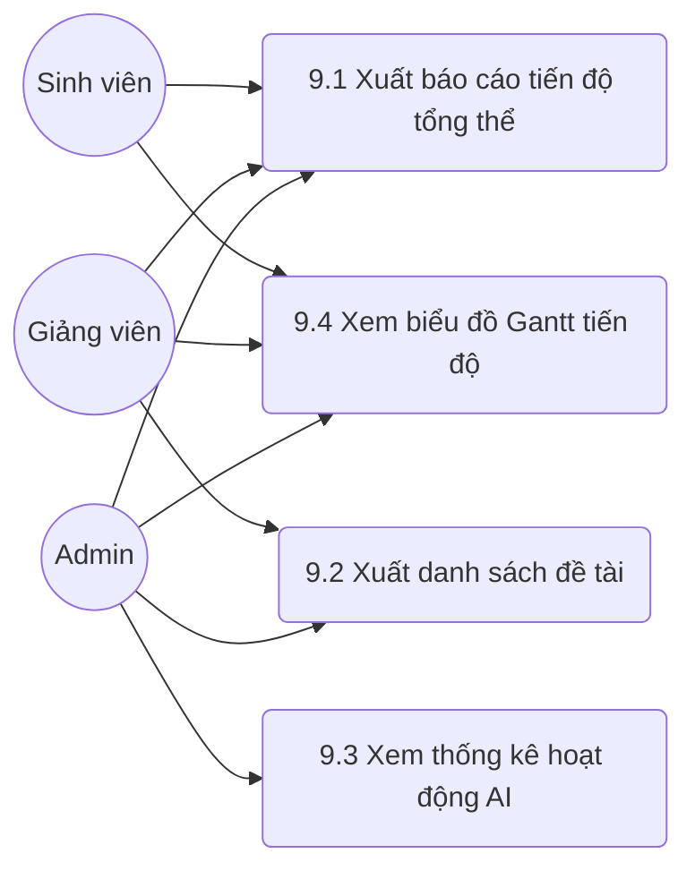

# MODULE 9 – BÁO CÁO & THỐNG KÊ

> Module hỗ trợ quản lý và xuất các báo cáo, thống kê tiến độ đề tài và tình hình sử dụng AI cho Sinh viên, Giảng viên và Quản trị viên (Admin).

## Sơ đồ Use Case

---

### UC 9.1 – Xuất báo cáo tiến độ tổng thể (PDF)

| Field | Content |
|-------|---------|
| **Use case ID** | 9.1 |
| **Use case name** | Xuất báo cáo tiến độ tổng thể |
| **Description** | Cho phép người dùng kết xuất báo cáo tiến độ của đề tài dưới dạng PDF bao gồm thông tin đề tài, danh sách milestone, phần trăm hoàn thành, timeline và phản hồi gần nhất. |
| **Actors** | Sinh viên, Giảng viên hướng dẫn, Admin |
| **Priority** | Cao |
| **Triggers** | Người dùng nhấn nút "Xuất báo cáo PDF" trong giao diện chi tiết đề tài hoặc danh sách đề tài. |
| **Pre-conditions** | Người dùng đã đăng nhập. Đề tài phải có dữ liệu về tiến độ và milestone. |
| **Post-conditions** | Hệ thống tạo và tải xuống file PDF báo cáo tiến độ thành công. |
| **Business rules** | 1. Sinh viên chỉ xuất báo cáo của đề tài mình. 2. Giảng viên chỉ xuất báo cáo cho sinh viên/đề tài mình hướng dẫn. 3. Admin có thể xuất báo cáo của bất kỳ đề tài nào trong hệ thống. |
| **Non-functional requirement** | Thời gian kết xuất file PDF không vượt quá 5 giây. File xuất ra có định dạng chuẩn, không bị lỗi font tiếng Việt. |

**Main flow:**

| Bước | Thao tác |
|------|---------|
| 1 | Người dùng truy cập trang chi tiết đề tài hoặc Dashboard tiến độ. |
| 2 | Người dùng chọn đề tài cần xuất và nhấn "Xuất báo cáo PDF". |
| 3 | Hệ thống kiểm tra quyền truy cập của người dùng đối với đề tài được yêu cầu. |
| 4 | Hệ thống tổng hợp dữ liệu đề tài (thông tin chung, milestone, % hoàn thành, timeline, phản hồi). |
| 5 | Hệ thống định dạng dữ liệu thành template PDF. |
| 6 | Hệ thống trả về file PDF và trình duyệt của người dùng tự động tải xuống. |

**Alternative flows:**

| Luồng | Điều kiện | Xử lý |
|-------|-----------|-------|
| 4a | Đề tài chưa có milestone nào được tạo | Hệ thống vẫn tạo PDF nhưng phần danh sách milestone để trống kèm ghi chú "Chưa có dữ liệu", sau đó tiếp tục bước 5. |
| 4b | Đề tài chưa có phản hồi nào từ giảng viên | Hệ thống ghi nhận "Không có phản hồi nào gần đây" vào báo cáo PDF, tiếp tục bước 5. |

**Exception flows:**

| Luồng | Điều kiện | Xử lý |
|-------|-----------|-------|
| 3a | Người dùng không có quyền xem/xuất báo cáo của đề tài này | Hệ thống hiển thị thông báo lỗi "Bạn không có quyền truy cập báo cáo đề tài này" và hủy quá trình xuất. |
| 5a | Lỗi trong quá trình tạo file PDF (lỗi server, thiếu thư viện) | Hệ thống hiển thị thông báo "Có lỗi xảy ra khi tạo PDF. Vui lòng thử lại sau" và ghi log lỗi hệ thống. |

---

### UC 9.2 – Xuất danh sách đề tài theo trạng thái

| Field | Content |
|-------|---------|
| **Use case ID** | 9.2 |
| **Use case name** | Xuất danh sách đề tài theo trạng thái |
| **Description** | Cho phép Giảng viên và Quản trị viên xuất danh sách các đề tài dưới định dạng Excel hoặc PDF sau khi đã lọc theo trạng thái, năm học hoặc giảng viên. |
| **Actors** | Giảng viên hướng dẫn, Admin |
| **Priority** | Trung bình |
| **Triggers** | Người dùng nhấn nút "Xuất danh sách" trên trang quản lý hoặc danh sách đề tài. |
| **Pre-conditions** | Người dùng có quyền Giảng viên hoặc Admin. Có ít nhất một đề tài thỏa mãn bộ lọc hiện tại. |
| **Post-conditions** | File danh sách đề tài (Excel/PDF) được tải về máy người dùng. |
| **Business rules** | 1. Giảng viên chỉ được xuất danh sách các đề tài mà mình đang hướng dẫn. 2. Admin được quyền lọc và xuất danh sách toàn bộ hệ thống. 3. Các bộ lọc áp dụng trên UI phải được phản ánh chính xác trong file xuất ra. |
| **Non-functional requirement** | Hỗ trợ xuất dữ liệu lớn (hàng trăm đề tài) trong dưới 10 giây mà không gây gián đoạn hệ thống (timeout). |

**Main flow:**

| Bước | Thao tác |
|------|---------|
| 1 | Người dùng vào trang Danh sách đề tài. |
| 2 | Người dùng thiết lập các bộ lọc (trạng thái, năm học, giảng viên) và nhấn "Lọc". |
| 3 | Người dùng nhấn "Xuất danh sách", sau đó chọn định dạng mong muốn (Excel hoặc PDF). |
| 4 | Hệ thống truy vấn danh sách đề tài theo các tiêu chí bộ lọc và quyền hạn người dùng. |
| 5 | Hệ thống sinh file báo cáo (Excel hoặc PDF) tương ứng với dữ liệu lấy được. |
| 6 | Hệ thống gửi file về client để người dùng tải xuống. |

**Alternative flows:**

| Luồng | Điều kiện | Xử lý |
|-------|-----------|-------|
| 3a | Người dùng không thiết lập bộ lọc nào | Hệ thống áp dụng thiết lập mặc định (năm học hiện tại, tất cả trạng thái) để xuất báo cáo, tiếp tục bước 4. |

**Exception flows:**

| Luồng | Điều kiện | Xử lý |
|-------|-----------|-------|
| 4a | Không có đề tài nào khớp với tiêu chí lọc | Hệ thống thông báo "Không có dữ liệu phù hợp để xuất" và hủy thao tác. |
| 5a | Quá trình sinh file bị vượt quá thời gian (Timeout) | Hệ thống thông báo "Dữ liệu quá lớn, vui lòng thu hẹp phạm vi lọc" và ngừng quá trình xuất. |

---

### UC 9.3 – Xem thống kê hoạt động AI

| Field | Content |
|-------|---------|
| **Use case ID** | 9.3 |
| **Use case name** | Xem thống kê hoạt động AI |
| **Description** | Cung cấp cho Admin dashboard thống kê số liệu về việc sử dụng AI trên hệ thống, bao gồm số lượng thao tác, đánh giá chất lượng (tốt/xấu) và số lượng tài liệu đã xử lý. |
| **Actors** | Admin |
| **Priority** | Trung bình |
| **Triggers** | Admin truy cập vào menu "Thống kê AI" trên trang quản trị. |
| **Pre-conditions** | Người dùng đăng nhập tài khoản Admin. Có dữ liệu log của AI trong hệ thống (từ module AI). |
| **Post-conditions** | Admin xem được các biểu đồ và chỉ số thống kê về hệ thống AI. |
| **Business rules** | 1. Chỉ Admin mới có quyền truy cập vào bảng thống kê AI. 2. Các số liệu thống kê phải được phân loại theo từng tính năng AI (Semantic Search, RAG, Summarization). |
| **Non-functional requirement** | Biểu đồ hiển thị phải trực quan (dùng chart.js hoặc thư viện tương đương). Dữ liệu thống kê được cập nhật theo thời gian thực hoặc độ trễ không quá 5 phút. |

**Main flow:**

| Bước | Thao tác |
|------|---------|
| 1 | Admin chọn menu "Thống kê AI" trên sidebar của trang quản trị. |
| 2 | Hệ thống kiểm tra quyền Admin của người dùng. |
| 3 | Hệ thống truy vấn log AI (số lần Semantic Search, RAG, tóm tắt), số tài liệu xử lý (embedding) và dữ liệu phản hồi (tỷ lệ tốt/xấu). |
| 4 | Hệ thống tổng hợp dữ liệu theo khoảng thời gian (mặc định là 30 ngày gần nhất). |
| 5 | Hệ thống render Dashboard hiển thị biểu đồ và các con số thống kê tương ứng. |
| 6 | Admin quan sát các chỉ số thống kê. |

**Alternative flows:**

| Luồng | Điều kiện | Xử lý |
|-------|-----------|-------|
| 6a | Admin muốn xem thời gian khác | Admin chọn khoảng thời gian tùy chỉnh -> Hệ thống quay lại bước 3 truy vấn lại với khoảng thời gian mới. |

**Exception flows:**

| Luồng | Điều kiện | Xử lý |
|-------|-----------|-------|
| 2a | Người dùng không phải là Admin | Hệ thống điều hướng về trang chủ và hiển thị lỗi "Quyền truy cập bị từ chối". |
| 3a | Không thể kết nối đến database log AI hoặc vector DB | Hệ thống hiển thị thông báo "Không thể lấy dữ liệu lúc này" trên dashboard và các biểu đồ trống. |

---

### UC 9.4 – Xem biểu đồ Gantt tiến độ

| Field | Content |
|-------|---------|
| **Use case ID** | 9.4 |
| **Use case name** | Xem biểu đồ Gantt tiến độ |
| **Description** | Cho phép hiển thị trực quan các milestone của đề tài dưới dạng biểu đồ Gantt trên trục thời gian, thể hiện rõ trạng thái hoàn thành qua màu sắc. |
| **Actors** | Sinh viên, Giảng viên hướng dẫn, Admin |
| **Priority** | Cao |
| **Triggers** | Người dùng chọn tab "Biểu đồ tiến độ" (Gantt) trong trang chi tiết đề tài. |
| **Pre-conditions** | Người dùng đã đăng nhập và đề tài phải có tối thiểu 1 milestone đã được thiết lập thời gian bắt đầu và kết thúc. |
| **Post-conditions** | Biểu đồ Gantt được render chính xác trên giao diện người dùng. |
| **Business rules** | 1. Sinh viên chỉ xem biểu đồ của đề tài mình. Giảng viên xem của sinh viên mình hướng dẫn. Admin xem được toàn bộ. 2. Các mốc công việc (milestone) quá hạn chưa hoàn thành phải được làm nổi bật (VD: màu đỏ). |
| **Non-functional requirement** | Giao diện thân thiện, có khả năng zoom in/zoom out theo tháng/tuần/ngày. Hỗ trợ hiển thị tốt trên thiết bị di động. |

**Main flow:**

| Bước | Thao tác |
|------|---------|
| 1 | Người dùng truy cập chi tiết đề tài và chuyển sang tab "Biểu đồ tiến độ" (Gantt Chart). |
| 2 | Hệ thống kiểm tra quyền truy cập của người dùng với đề tài tương ứng. |
| 3 | Hệ thống tải dữ liệu các milestone (tên, ngày bắt đầu, ngày kết thúc, trạng thái hoàn thành, tỷ lệ %). |
| 4 | Hệ thống tính toán trục thời gian dựa trên ngày sớm nhất và muộn nhất của các milestone. |
| 5 | Hệ thống phân bổ màu sắc theo trạng thái: (vd: Xanh = Đã xong, Vàng = Đang thực hiện, Đỏ = Trễ hạn). |
| 6 | Hệ thống render biểu đồ Gantt lên màn hình. |
| 7 | Người dùng tương tác (cuộn, phóng to, thu nhỏ) để xem chi tiết timeline. |

**Alternative flows:**

| Luồng | Điều kiện | Xử lý |
|-------|-----------|-------|
| 3a | Đề tài chưa thiết lập milestone nào | Hệ thống hiển thị thông báo "Đề tài chưa có lộ trình/milestone để hiển thị biểu đồ" thay vì hiển thị khung biểu đồ trống. |
| 7a | Người dùng click vào một milestone trên biểu đồ | Hệ thống hiển thị popup chứa chi tiết thông tin của milestone đó (mô tả, file đính kèm, phản hồi). |

**Exception flows:**

| Luồng | Điều kiện | Xử lý |
|-------|-----------|-------|
| 2a | Người dùng không có quyền truy cập đề tài | Hệ thống thông báo lỗi và chặn hiển thị dữ liệu. |
| 3b | Dữ liệu milestone bị thiếu ngày bắt đầu hoặc kết thúc hợp lệ | Hệ thống bỏ qua các milestone lỗi này trên biểu đồ Gantt và hiện cảnh báo "Một số milestone không thể hiển thị do thiếu thông tin ngày tháng". |
