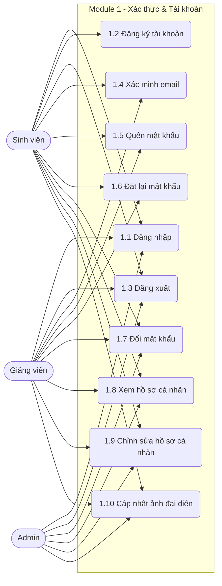
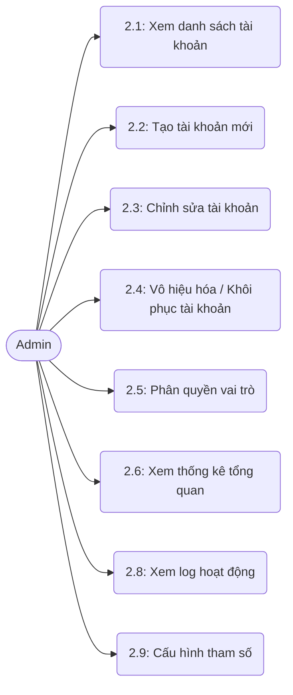
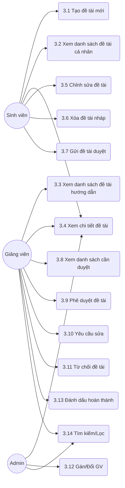
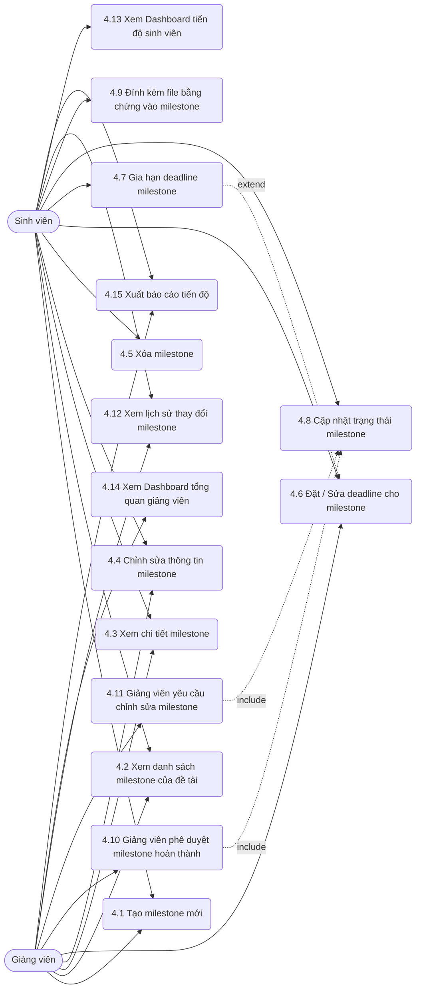
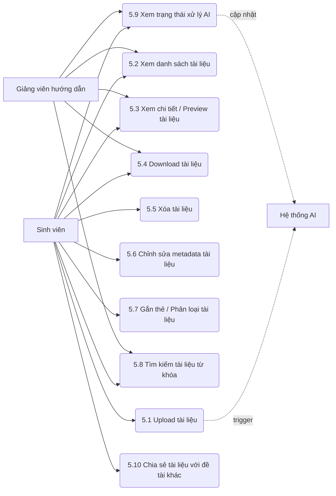
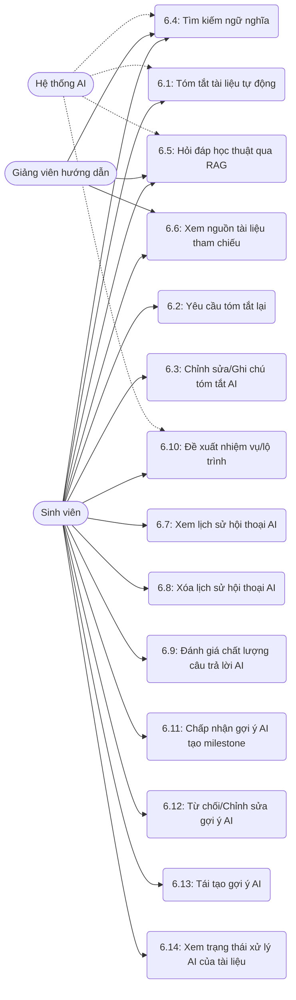
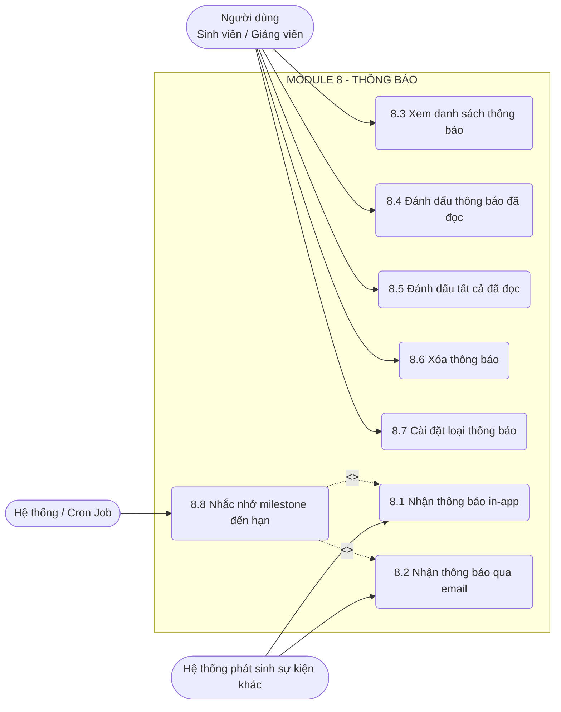
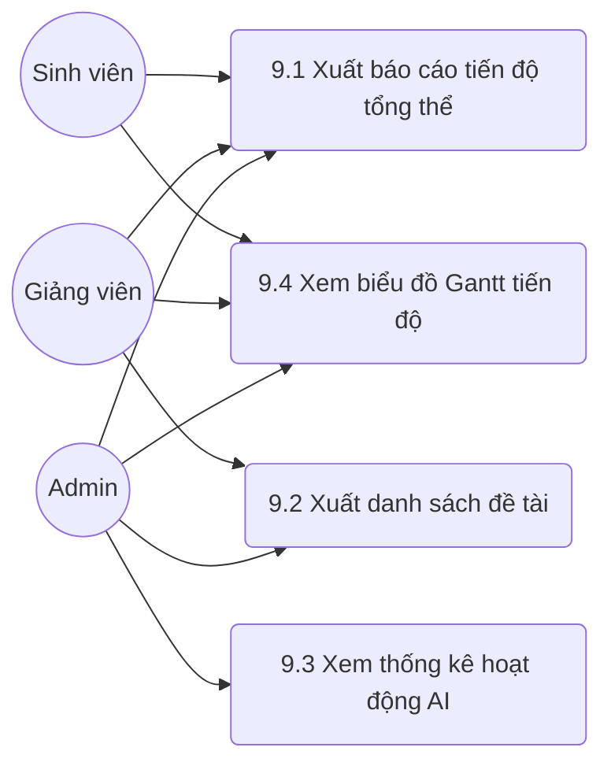

# NOVATHESIS – ĐẶC TẢ USE CASE TỔNG HỢP

> Tài liệu tổng hợp toàn bộ 92 Use Case của hệ thống NovaThesis
> Phiên bản: 1.0 | Ngày: 07/2026

## Mục lục

| Module                                                               | Số UC  |
| -------------------------------------------------------------------- | ------ |
| [Module 1 – Xác thực &amp; Tài khoản](#module-1-xac-thuc-tai-khoan)  | 10     |
| [Module 2 – Quản trị Admin](#module-2-quan-tri-admin)                | 9      |
| [Module 3 – Quản lý Đề tài](#module-3-quan-ly-de-tai)                | 14     |
| [Module 4 – Quản lý Milestone](#module-4-quan-ly-tien-do)            | 15     |
| [Module 5 – Quản lý Tài liệu](#module-5-quan-ly-tai-lieu-nghien-cuu) | 10     |
| [Module 6 – Hỗ trợ AI](#module-6-ho-tro-boi-ai)                      | 14     |
| [Module 7 – Trao đổi &amp; Phản hồi](#module-7-trao-doi-phan-hoi)    | 8      |
| [Module 8 – Thông báo](#module-8-thong-bao)                          | 8      |
| [Module 9 – Báo cáo &amp; Thống kê](#module-9-bao-cao-thong-ke)      | 4      |
| **Tổng**                                                             | **92** |

---

# MODULE 1 – XÁC THỰC & TÀI KHOẢN



### UC 1.1 – Đăng nhập

| Field                          | Content                                                                                                                                                                                                                                                                                                                                                                                                                                                                                                    |
| ------------------------------ | ---------------------------------------------------------------------------------------------------------------------------------------------------------------------------------------------------------------------------------------------------------------------------------------------------------------------------------------------------------------------------------------------------------------------------------------------------------------------------------------------------------- |
| **Use case ID**                | 1.1                                                                                                                                                                                                                                                                                                                                                                                                                                                                                                        |
| **Use case name**              | Đăng nhập                                                                                                                                                                                                                                                                                                                                                                                                                                                                                                  |
| **Description**                | Cho phép người dùng xác thực thông tin bằng email và mật khẩu để truy cập vào hệ thống NovaThesis.                                                                                                                                                                                                                                                                                                                                                                                                         |
| **Actors**                     | Sinh viên, Giảng viên hướng dẫn, Admin (Chính), Hệ thống (Phụ)                                                                                                                                                                                                                                                                                                                                                                                                                                             |
| **Priority**                   | Cao                                                                                                                                                                                                                                                                                                                                                                                                                                                                                                        |
| **Triggers**                   | Người dùng truy cập trang đăng nhập và có nhu cầu sử dụng hệ thống.                                                                                                                                                                                                                                                                                                                                                                                                                                        |
| **Pre-conditions**             | Người dùng đã có tài khoản trên hệ thống và tài khoản không bị khóa. Người dùng chưa đăng nhập.                                                                                                                                                                                                                                                                                                                                                                                                            |
| **Post-conditions**            | Người dùng được chuyển hướng đến trang chủ/dashboard tương ứng và hệ thống cấp JWT token hợp lệ.                                                                                                                                                                                                                                                                                                                                                                                                           |
| **Main flow**                  | 1. Người dùng truy cập trang Đăng nhập của NovaThesis. 2. Hệ thống hiển thị form đăng nhập (Email, Mật khẩu). 3. Người dùng nhập thông tin Email và Mật khẩu, nhấn "Đăng nhập". 4. Hệ thống kiểm tra tính hợp lệ của định dạng dữ liệu (email đúng chuẩn, mật khẩu không rỗng). 5. Hệ thống đối chiếu thông tin đăng nhập với cơ sở dữ liệu. 6. Hệ thống tạo và trả về JWT token cho phiên làm việc. 7. Hệ thống chuyển hướng người dùng tới Dashboard tương ứng với vai trò (Sinh viên/Giảng viên/Admin). |
| **Alternative flows**          | **4a** Định dạng email không hợp lệ hoặc thiếu thông tin: Hệ thống báo lỗi "Vui lòng nhập đầy đủ và đúng định dạng". Quay lại bước 2.                                                                                                                                                                                                                                                                                                                                                                      |
| **Exception flows**            | **5a** Sai email hoặc mật khẩu (< 5 lần): Hệ thống báo lỗi "Email hoặc mật khẩu không chính xác". Tăng biến đếm số lần sai. Quay lại bước 2. **5b** Đăng nhập sai quá 5 lần: Hệ thống khóa tài khoản 15 phút, thông báo "Tài khoản bị khóa tạm thời 15 phút do nhập sai quá nhiều lần". **5c** Tài khoản chưa xác minh email: Hệ thống thông báo "Vui lòng kiểm tra email để xác minh tài khoản trước khi đăng nhập" và chặn truy cập.                                                                     |
| **Business rules**             | 1. Đăng nhập sai quá 5 lần liên tiếp sẽ bị khóa tài khoản tạm thời trong 15 phút. 2. Tài khoản chưa xác minh email (với SV/GV đăng ký mới) sẽ không thể đăng nhập.                                                                                                                                                                                                                                                                                                                                         |
| **Non-functional requirement** | Mật khẩu phải được truyền qua kết nối mã hóa (HTTPS). Thời gian phản hồi của API đăng nhập < 1s.                                                                                                                                                                                                                                                                                                                                                                                                           |

### UC 1.2 – Đăng ký tài khoản

| Field                          | Content                                                                                                                                                                                                                                                                                                                                                                                                                                                                                                                                                                    |
| ------------------------------ | -------------------------------------------------------------------------------------------------------------------------------------------------------------------------------------------------------------------------------------------------------------------------------------------------------------------------------------------------------------------------------------------------------------------------------------------------------------------------------------------------------------------------------------------------------------------------- |
| **Use case ID**                | 1.2                                                                                                                                                                                                                                                                                                                                                                                                                                                                                                                                                                        |
| **Use case name**              | Đăng ký tài khoản                                                                                                                                                                                                                                                                                                                                                                                                                                                                                                                                                          |
| **Description**                | Cho phép Sinh viên tự tạo tài khoản mới trên hệ thống để bắt đầu quá trình làm luận văn.                                                                                                                                                                                                                                                                                                                                                                                                                                                                                   |
| **Actors**                     | Sinh viên (Chính), Hệ thống (Phụ)                                                                                                                                                                                                                                                                                                                                                                                                                                                                                                                                          |
| **Priority**                   | Cao                                                                                                                                                                                                                                                                                                                                                                                                                                                                                                                                                                        |
| **Triggers**                   | Sinh viên chưa có tài khoản và chọn tính năng Đăng ký tại màn hình chào.                                                                                                                                                                                                                                                                                                                                                                                                                                                                                                   |
| **Pre-conditions**             | Email đăng ký chưa tồn tại trong hệ thống.                                                                                                                                                                                                                                                                                                                                                                                                                                                                                                                                 |
| **Post-conditions**            | Tài khoản được tạo ở trạng thái "Chờ xác minh". Hệ thống gửi email chứa mã/link xác minh.                                                                                                                                                                                                                                                                                                                                                                                                                                                                                  |
| **Main flow**                  | 1. Người dùng truy cập trang Đăng ký. 2. Hệ thống hiển thị form đăng ký gồm: Họ tên, Mã SV, Email, Mật khẩu, Xác nhận mật khẩu. Vai trò mặc định là "Sinh viên". 3. Người dùng điền đầy đủ thông tin và nhấn "Đăng ký". 4. Hệ thống kiểm tra các ràng buộc: email chưa tồn tại, mật khẩu hợp lệ, mật khẩu khớp nhau. 5. Hệ thống mã hóa mật khẩu và lưu dữ liệu người dùng với trạng thái "Chưa xác minh". 6. Hệ thống tạo link xác minh và gửi qua email đã đăng ký. 7. Hệ thống hiển thị thông báo: "Đăng ký thành công. Vui lòng kiểm tra email để xác minh tài khoản." |
| **Alternative flows**          | **4a** Thông tin nhập vào thiếu hoặc sai định dạng: Hệ thống tô đỏ các trường lỗi và yêu cầu nhập lại. Quay lại bước 2.                                                                                                                                                                                                                                                                                                                                                                                                                                                    |
| **Exception flows**            | **4b** Email hoặc Mã SV đã tồn tại trong DB: Hệ thống thông báo "Email hoặc Mã sinh viên đã được sử dụng". Quay lại bước 2. **6a** Lỗi gửi email (Nodemailer lỗi/Time out): Hệ thống lưu thông tin thành công, thông báo "Đăng ký thành công nhưng gửi email lỗi. Vui lòng sử dụng tính năng gửi lại email xác minh".                                                                                                                                                                                                                                                      |
| **Business rules**             | 1. Chỉ Sinh viên mới có thể tự đăng ký (Admin tạo thủ công cho Giảng viên). 2. Mật khẩu phải có độ dài tối thiểu 8 ký tự, gồm chữ và số.                                                                                                                                                                                                                                                                                                                                                                                                                                   |
| **Non-functional requirement** | Gửi email xác minh ngay lập tức (dưới 3s) thông qua Nodemailer.                                                                                                                                                                                                                                                                                                                                                                                                                                                                                                            |

### UC 1.3 – Đăng xuất

| Field                          | Content                                                                                                                                                                                                                                                                         |
| ------------------------------ | ------------------------------------------------------------------------------------------------------------------------------------------------------------------------------------------------------------------------------------------------------------------------------- |
| **Use case ID**                | 1.3                                                                                                                                                                                                                                                                             |
| **Use case name**              | Đăng xuất                                                                                                                                                                                                                                                                       |
| **Description**                | Cho phép người dùng kết thúc phiên làm việc hiện tại và hủy bỏ JWT token để đảm bảo an toàn.                                                                                                                                                                                    |
| **Actors**                     | Sinh viên, Giảng viên hướng dẫn, Admin                                                                                                                                                                                                                                          |
| **Priority**                   | Cao                                                                                                                                                                                                                                                                             |
| **Triggers**                   | Người dùng nhấn nút "Đăng xuất" trên giao diện.                                                                                                                                                                                                                                 |
| **Pre-conditions**             | Người dùng đang trong trạng thái đăng nhập hợp lệ.                                                                                                                                                                                                                              |
| **Post-conditions**            | Phiên đăng nhập bị hủy, token bị xóa. Người dùng trở về trang Đăng nhập.                                                                                                                                                                                                        |
| **Main flow**                  | 1. Người dùng nhấn nút "Đăng xuất" ở menu tài khoản. 2. Hệ thống yêu cầu xác nhận "Bạn có chắc chắn muốn đăng xuất?". 3. Người dùng nhấn "Đồng ý". 4. Hệ thống gọi API hủy phiên làm việc, xóa JWT token ở phía client. 5. Hệ thống chuyển hướng người dùng về trang Đăng nhập. |
| **Alternative flows**          | **3a** Người dùng chọn "Hủy": Đóng hộp thoại xác nhận, người dùng tiếp tục phiên làm việc hiện tại.                                                                                                                                                                             |
| **Exception flows**            | **4a** Lỗi kết nối mạng trong quá trình gọi API đăng xuất: Ứng dụng client tự động xóa token local và chuyển về trang đăng nhập để đảm bảo an toàn bề mặt.                                                                                                                      |
| **Business rules**             | Token sau khi đăng xuất phải bị đưa vào blacklist (nếu có cấu hình) hoặc client tự động xóa cookie/local storage.                                                                                                                                                               |
| **Non-functional requirement** | Chuyển hướng người dùng về trang Đăng nhập trong vòng 1s.                                                                                                                                                                                                                       |

### UC 1.4 – Xác minh email (sau đăng ký)

| Field                          | Content                                                                                                                                                                                                                                                                                                                                                                                                          |
| ------------------------------ | ---------------------------------------------------------------------------------------------------------------------------------------------------------------------------------------------------------------------------------------------------------------------------------------------------------------------------------------------------------------------------------------------------------------- |
| **Use case ID**                | 1.4                                                                                                                                                                                                                                                                                                                                                                                                              |
| **Use case name**              | Xác minh email                                                                                                                                                                                                                                                                                                                                                                                                   |
| **Description**                | Xác thực địa chỉ email của người dùng sau khi đăng ký bằng cách sử dụng link xác minh được hệ thống gửi tới email đó.                                                                                                                                                                                                                                                                                            |
| **Actors**                     | Sinh viên, Giảng viên (nếu cần), Hệ thống                                                                                                                                                                                                                                                                                                                                                                        |
| **Priority**                   | Cao                                                                                                                                                                                                                                                                                                                                                                                                              |
| **Triggers**                   | Người dùng click vào đường link xác minh trong email hệ thống gửi.                                                                                                                                                                                                                                                                                                                                               |
| **Pre-conditions**             | Tài khoản đang ở trạng thái "Chưa xác minh". Link xác minh vẫn còn thời hạn (ví dụ: 24h).                                                                                                                                                                                                                                                                                                                        |
| **Post-conditions**            | Tài khoản chuyển sang trạng thái "Đã xác minh" (Active).                                                                                                                                                                                                                                                                                                                                                         |
| **Main flow**                  | 1. Người dùng click vào link "Xác minh tài khoản" trong email. 2. Trình duyệt mở trang xác minh của NovaThesis kèm token mã hóa trong URL. 3. Hệ thống kiểm tra tính hợp lệ và thời hạn của token. 4. Hệ thống cập nhật trạng thái tài khoản tương ứng trong DB thành "Đã xác minh". 5. Hệ thống hiển thị thông báo "Xác minh email thành công. Bạn có thể đăng nhập ngay." cùng nút chuyển tới trang Đăng nhập. |
| **Alternative flows**          | **N/A** Không có:                                                                                                                                                                                                                                                                                                                                                                                                |
| **Exception flows**            | **3a** Token không hợp lệ hoặc bị sai lệch: Hệ thống hiển thị lỗi "Liên kết xác minh không hợp lệ". **3b** Token đã hết hạn: Hệ thống thông báo "Liên kết đã hết hạn", cung cấp nút "Gửi lại email xác minh". **3c** Tài khoản đã được xác minh trước đó: Hệ thống thông báo "Tài khoản của bạn đã được xác minh trước đó. Vui lòng đăng nhập."                                                                  |
| **Business rules**             | Nếu link quá hạn, người dùng phải yêu cầu gửi lại link xác minh mới.                                                                                                                                                                                                                                                                                                                                             |
| **Non-functional requirement** | Quá trình xử lý link xác minh và cập nhật trạng thái DB < 1s.                                                                                                                                                                                                                                                                                                                                                    |

### UC 1.5 – Quên mật khẩu

| Field                          | Content                                                                                                                                                                                                                                                                                                                                                                                                                                                                                         |
| ------------------------------ | ----------------------------------------------------------------------------------------------------------------------------------------------------------------------------------------------------------------------------------------------------------------------------------------------------------------------------------------------------------------------------------------------------------------------------------------------------------------------------------------------- |
| **Use case ID**                | 1.5                                                                                                                                                                                                                                                                                                                                                                                                                                                                                             |
| **Use case name**              | Quên mật khẩu                                                                                                                                                                                                                                                                                                                                                                                                                                                                                   |
| **Description**                | Cho phép người dùng yêu cầu hệ thống gửi link đặt lại mật khẩu về email nếu họ quên mật khẩu đăng nhập.                                                                                                                                                                                                                                                                                                                                                                                         |
| **Actors**                     | Sinh viên, Giảng viên hướng dẫn, Hệ thống                                                                                                                                                                                                                                                                                                                                                                                                                                                       |
| **Priority**                   | Trung bình                                                                                                                                                                                                                                                                                                                                                                                                                                                                                      |
| **Triggers**                   | Người dùng nhấn "Quên mật khẩu" tại màn hình đăng nhập.                                                                                                                                                                                                                                                                                                                                                                                                                                         |
| **Pre-conditions**             | Không cần đăng nhập.                                                                                                                                                                                                                                                                                                                                                                                                                                                                            |
| **Post-conditions**            | Hệ thống tạo token đặt lại mật khẩu, thời hạn 24h và gửi qua email của người dùng.                                                                                                                                                                                                                                                                                                                                                                                                              |
| **Main flow**                  | 1. Người dùng nhấn chọn "Quên mật khẩu" ở màn hình Đăng nhập. 2. Hệ thống hiển thị form yêu cầu nhập Email cần khôi phục. 3. Người dùng nhập Email và nhấn "Gửi yêu cầu". 4. Hệ thống kiểm tra Email có tồn tại trong CSDL hay không. 5. Hệ thống tạo một token reset mật khẩu có thời hạn 24h và lưu vào DB. 6. Hệ thống (Nodemailer) gửi email chứa link đặt lại mật khẩu. 7. Hệ thống thông báo: "Nếu email hợp lệ, chúng tôi đã gửi hướng dẫn đặt lại mật khẩu. Vui lòng kiểm tra hộp thư." |
| **Alternative flows**          | **4a** Email không tồn tại trong hệ thống: Hệ thống vẫn chạy đến bước 7 (nhằm bảo mật, không tiết lộ email nào đã đăng ký), nhưng không gửi email nào ra ngoài.                                                                                                                                                                                                                                                                                                                                 |
| **Exception flows**            | **3a** Người dùng nhập liên tiếp yêu cầu trong thời gian ngắn: Hệ thống chặn lại và báo lỗi "Vui lòng đợi 5 phút trước khi yêu cầu lại". **6a** Lỗi kết nối hệ thống email: Báo lỗi hệ thống, yêu cầu người dùng thử lại sau.                                                                                                                                                                                                                                                                   |
| **Business rules**             | 1. Chỉ áp dụng với email đã tồn tại trong hệ thống. 2. Mỗi link gửi qua email chỉ có hiệu lực trong 24 giờ.                                                                                                                                                                                                                                                                                                                                                                                     |
| **Non-functional requirement** | Tránh spam: Giới hạn tần suất yêu cầu quên mật khẩu (ví dụ 1 lần/5 phút).                                                                                                                                                                                                                                                                                                                                                                                                                       |

### UC 1.6 – Đặt lại mật khẩu (qua link email)

| Field                          | Content                                                                                                                                                                                                                                                                                                                                                                                                                                                                                                                     |
| ------------------------------ | --------------------------------------------------------------------------------------------------------------------------------------------------------------------------------------------------------------------------------------------------------------------------------------------------------------------------------------------------------------------------------------------------------------------------------------------------------------------------------------------------------------------------- |
| **Use case ID**                | 1.6                                                                                                                                                                                                                                                                                                                                                                                                                                                                                                                         |
| **Use case name**              | Đặt lại mật khẩu                                                                                                                                                                                                                                                                                                                                                                                                                                                                                                            |
| **Description**                | Cho phép người dùng tạo mật khẩu mới thông qua đường link bảo mật gửi từ chức năng Quên mật khẩu.                                                                                                                                                                                                                                                                                                                                                                                                                           |
| **Actors**                     | Sinh viên, Giảng viên hướng dẫn                                                                                                                                                                                                                                                                                                                                                                                                                                                                                             |
| **Priority**                   | Trung bình                                                                                                                                                                                                                                                                                                                                                                                                                                                                                                                  |
| **Triggers**                   | Người dùng click vào link "Đặt lại mật khẩu" trong email.                                                                                                                                                                                                                                                                                                                                                                                                                                                                   |
| **Pre-conditions**             | Token trên URL phải hợp lệ, chưa sử dụng và chưa quá hạn (24h).                                                                                                                                                                                                                                                                                                                                                                                                                                                             |
| **Post-conditions**            | Mật khẩu cũ bị vô hiệu, mật khẩu mới được cập nhật vào CSDL. Token bị đánh dấu đã sử dụng.                                                                                                                                                                                                                                                                                                                                                                                                                                  |
| **Main flow**                  | 1. Người dùng click vào link trong email nhận được. 2. Hệ thống kiểm tra tính hợp lệ của token trong URL. 3. Hệ thống hiển thị màn hình Đặt lại mật khẩu với 2 ô: Mật khẩu mới, Xác nhận mật khẩu mới. 4. Người dùng nhập mật khẩu mới và xác nhận, nhấn "Lưu thay đổi". 5. Hệ thống kiểm tra quy tắc mật khẩu và độ khớp của 2 trường. 6. Hệ thống cập nhật mật khẩu đã mã hóa (bcrypt/argon2) vào DB. 7. Hệ thống hủy hiệu lực của token. 8. Hệ thống thông báo thành công và chuyển hướng người dùng về trang Đăng nhập. |
| **Alternative flows**          | **5a** Mật khẩu không khớp hoặc không đủ mạnh: Hệ thống báo lỗi tương ứng tại form. Quay lại bước 3.                                                                                                                                                                                                                                                                                                                                                                                                                        |
| **Exception flows**            | **2a** Token không hợp lệ hoặc đã hết hạn 24h: Hệ thống hiển thị trang lỗi "Liên kết không hợp lệ hoặc đã hết hạn", có nút quay lại trang Quên mật khẩu. **2b** Token đã được sử dụng trước đó: Hệ thống báo lỗi "Liên kết này đã được sử dụng".                                                                                                                                                                                                                                                                            |
| **Business rules**             | 1. Mật khẩu mới phải đáp ứng quy tắc (>= 8 ký tự). 2. Link chỉ dùng được 1 lần duy nhất.                                                                                                                                                                                                                                                                                                                                                                                                                                    |
| **Non-functional requirement** | Form đặt lại phải che giấu ký tự mật khẩu, có mắt hiển thị (toggle visibility).                                                                                                                                                                                                                                                                                                                                                                                                                                             |

### UC 1.7 – Đổi mật khẩu (khi đã đăng nhập)

| Field                          | Content                                                                                                                                                                                                                                                                                                                                                                                                                                                     |
| ------------------------------ | ----------------------------------------------------------------------------------------------------------------------------------------------------------------------------------------------------------------------------------------------------------------------------------------------------------------------------------------------------------------------------------------------------------------------------------------------------------- |
| **Use case ID**                | 1.7                                                                                                                                                                                                                                                                                                                                                                                                                                                         |
| **Use case name**              | Đổi mật khẩu                                                                                                                                                                                                                                                                                                                                                                                                                                                |
| **Description**                | Cho phép người dùng đang đăng nhập đổi mật khẩu hiện tại sang mật khẩu mới.                                                                                                                                                                                                                                                                                                                                                                                 |
| **Actors**                     | Sinh viên, Giảng viên hướng dẫn, Admin                                                                                                                                                                                                                                                                                                                                                                                                                      |
| **Priority**                   | Trung bình                                                                                                                                                                                                                                                                                                                                                                                                                                                  |
| **Triggers**                   | Người dùng vào Cài đặt tài khoản và chọn "Đổi mật khẩu".                                                                                                                                                                                                                                                                                                                                                                                                    |
| **Pre-conditions**             | Người dùng đang trong trạng thái đăng nhập.                                                                                                                                                                                                                                                                                                                                                                                                                 |
| **Post-conditions**            | Mật khẩu mới được lưu, các phiên đăng nhập khác có thể bị đăng xuất (nếu cấu hình bảo mật yêu cầu).                                                                                                                                                                                                                                                                                                                                                         |
| **Main flow**                  | 1. Người dùng điều hướng tới mục "Đổi mật khẩu" trong trang Hồ sơ/Cài đặt. 2. Hệ thống hiển thị form gồm: Mật khẩu hiện tại, Mật khẩu mới, Xác nhận mật khẩu mới. 3. Người dùng nhập dữ liệu và nhấn "Cập nhật". 4. Hệ thống kiểm tra mật khẩu hiện tại có khớp với CSDL không. 5. Hệ thống kiểm tra mật khẩu mới hợp lệ và khớp với ô xác nhận. 6. Hệ thống mã hóa mật khẩu mới và lưu vào CSDL. 7. Hệ thống hiển thị thông báo "Đổi mật khẩu thành công". |
| **Alternative flows**          | **5a** Mật khẩu mới không hợp lệ: Báo lỗi định dạng mật khẩu. Quay lại bước 2.                                                                                                                                                                                                                                                                                                                                                                              |
| **Exception flows**            | **4a** Mật khẩu hiện tại nhập sai: Hệ thống báo lỗi "Mật khẩu hiện tại không chính xác". Quay lại bước 2.                                                                                                                                                                                                                                                                                                                                                   |
| **Business rules**             | Phải nhập đúng mật khẩu hiện tại mới được phép đổi mật khẩu mới.                                                                                                                                                                                                                                                                                                                                                                                            |
| **Non-functional requirement** | Cần mã hóa mật khẩu trước khi lưu.                                                                                                                                                                                                                                                                                                                                                                                                                          |

### UC 1.8 – Xem hồ sơ cá nhân

| Field                          | Content                                                                                                                                                                                                                                                                                                                           |
| ------------------------------ | --------------------------------------------------------------------------------------------------------------------------------------------------------------------------------------------------------------------------------------------------------------------------------------------------------------------------------- |
| **Use case ID**                | 1.8                                                                                                                                                                                                                                                                                                                               |
| **Use case name**              | Xem hồ sơ cá nhân                                                                                                                                                                                                                                                                                                                 |
| **Description**                | Cho phép người dùng xem thông tin cá nhân của mình (họ tên, mã số, khoa, chuyên ngành, email).                                                                                                                                                                                                                                    |
| **Actors**                     | Sinh viên, Giảng viên hướng dẫn, Admin                                                                                                                                                                                                                                                                                            |
| **Priority**                   | Cao                                                                                                                                                                                                                                                                                                                               |
| **Triggers**                   | Người dùng click vào ảnh đại diện hoặc menu "Hồ sơ của tôi".                                                                                                                                                                                                                                                                      |
| **Pre-conditions**             | Người dùng đã đăng nhập thành công.                                                                                                                                                                                                                                                                                               |
| **Post-conditions**            | Hệ thống hiển thị giao diện chứa thông tin cá nhân chính xác.                                                                                                                                                                                                                                                                     |
| **Main flow**                  | 1. Người dùng chọn "Hồ sơ của tôi" từ thanh điều hướng. 2. Hệ thống trích xuất ID người dùng từ JWT token hiện tại. 3. Hệ thống truy vấn CSDL để lấy thông tin chi tiết của người dùng. 4. Hệ thống hiển thị giao diện Hồ sơ cá nhân với các thông tin: Ảnh đại diện, Họ tên, Email, Mã SV/MGV, Khoa/Chuyên ngành, Số điện thoại. |
| **Alternative flows**          | **N/A** Không có:                                                                                                                                                                                                                                                                                                                 |
| **Exception flows**            | **3a** Không tìm thấy thông tin tài khoản (bị xóa/lỗi DB): Hệ thống báo lỗi "Không thể tải thông tin hồ sơ", cho phép reload trang.                                                                                                                                                                                               |
| **Business rules**             | Người dùng chỉ xem được hồ sơ của chính mình (hoặc Admin/Giảng viên xem hồ sơ của sinh viên liên quan theo quyền khác).                                                                                                                                                                                                           |
| **Non-functional requirement** | Tốc độ load thông tin < 1s.                                                                                                                                                                                                                                                                                                       |

### UC 1.9 – Chỉnh sửa hồ sơ cá nhân

| Field                          | Content                                                                                                                                                                                                                                                                                                                                                                                                                             |
| ------------------------------ | ----------------------------------------------------------------------------------------------------------------------------------------------------------------------------------------------------------------------------------------------------------------------------------------------------------------------------------------------------------------------------------------------------------------------------------- |
| **Use case ID**                | 1.9                                                                                                                                                                                                                                                                                                                                                                                                                                 |
| **Use case name**              | Chỉnh sửa hồ sơ cá nhân                                                                                                                                                                                                                                                                                                                                                                                                             |
| **Description**                | Cho phép người dùng cập nhật một số thông tin cá nhân như Số điện thoại, Giới thiệu bản thân. Các trường như Email, Mã SV/MGV bị vô hiệu hóa.                                                                                                                                                                                                                                                                                       |
| **Actors**                     | Sinh viên, Giảng viên hướng dẫn, Admin                                                                                                                                                                                                                                                                                                                                                                                              |
| **Priority**                   | Trung bình                                                                                                                                                                                                                                                                                                                                                                                                                          |
| **Triggers**                   | Người dùng nhấn nút "Chỉnh sửa" tại trang Hồ sơ cá nhân.                                                                                                                                                                                                                                                                                                                                                                            |
| **Pre-conditions**             | Người dùng đang đăng nhập và ở trang Hồ sơ cá nhân.                                                                                                                                                                                                                                                                                                                                                                                 |
| **Post-conditions**            | Thông tin mới được lưu và hiển thị trên hồ sơ.                                                                                                                                                                                                                                                                                                                                                                                      |
| **Main flow**                  | 1. Người dùng nhấn "Chỉnh sửa" tại trang Hồ sơ. 2. Hệ thống chuyển các trường thông tin cho phép sửa (Số điện thoại, Giới thiệu, Địa chỉ) thành dạng input. 3. Người dùng thay đổi thông tin cần thiết và nhấn "Lưu thay đổi". 4. Hệ thống validate dữ liệu (Ví dụ: SĐT phải là số, độ dài phù hợp). 5. Hệ thống cập nhật CSDL. 6. Hệ thống hiển thị thông báo "Cập nhật thành công" và hiển thị lại trang hồ sơ với thông tin mới. |
| **Alternative flows**          | **3a** Người dùng nhấn "Hủy": Hệ thống đóng form chỉnh sửa, không lưu thay đổi.                                                                                                                                                                                                                                                                                                                                                     |
| **Exception flows**            | **4a** Dữ liệu nhập không hợp lệ (Sai format SĐT): Hệ thống báo lỗi trực tiếp trên form "Số điện thoại không hợp lệ", block việc submit.                                                                                                                                                                                                                                                                                            |
| **Business rules**             | Không cho phép tự ý đổi Mã SV, Mã GV, Email đăng nhập.                                                                                                                                                                                                                                                                                                                                                                              |
| **Non-functional requirement** | Cập nhật real-time trên giao diện sau khi ấn lưu.                                                                                                                                                                                                                                                                                                                                                                                   |

### UC 1.10 – Cập nhật ảnh đại diện

| Field                          | Content                                                                                                                                                                                                                                                                                                                                                                                                                                                                                                    |
| ------------------------------ | ---------------------------------------------------------------------------------------------------------------------------------------------------------------------------------------------------------------------------------------------------------------------------------------------------------------------------------------------------------------------------------------------------------------------------------------------------------------------------------------------------------- |
| **Use case ID**                | 1.10                                                                                                                                                                                                                                                                                                                                                                                                                                                                                                       |
| **Use case name**              | Cập nhật ảnh đại diện                                                                                                                                                                                                                                                                                                                                                                                                                                                                                      |
| **Description**                | Cho phép người dùng upload hình ảnh cá nhân để làm ảnh đại diện (avatar) hiển thị trên hệ thống.                                                                                                                                                                                                                                                                                                                                                                                                           |
| **Actors**                     | Sinh viên, Giảng viên hướng dẫn, Admin                                                                                                                                                                                                                                                                                                                                                                                                                                                                     |
| **Priority**                   | Thấp                                                                                                                                                                                                                                                                                                                                                                                                                                                                                                       |
| **Triggers**                   | Người dùng nhấn vào icon camera/chỉnh sửa tại khu vực ảnh đại diện trong Hồ sơ.                                                                                                                                                                                                                                                                                                                                                                                                                            |
| **Pre-conditions**             | Người dùng đã đăng nhập.                                                                                                                                                                                                                                                                                                                                                                                                                                                                                   |
| **Post-conditions**            | Ảnh đại diện mới được cập nhật trên toàn hệ thống (Avatar ở header, trong danh sách...).                                                                                                                                                                                                                                                                                                                                                                                                                   |
| **Main flow**                  | 1. Người dùng nhấn vào vị trí Ảnh đại diện. 2. Hệ thống mở cửa sổ chọn file từ thiết bị cục bộ. 3. Người dùng chọn một file ảnh (.jpg, .png) và nhấn Open. 4. Hệ thống kiểm tra định dạng và kích thước của file ảnh (<= 2MB). 5. Hệ thống hiển thị preview ảnh vừa chọn, cung cấp nút "Lưu ảnh". 6. Người dùng nhấn "Lưu ảnh". 7. Hệ thống upload ảnh lên server/storage, lấy URL mới và cập nhật CSDL. 8. Hệ thống thông báo "Cập nhật ảnh đại diện thành công" và reload ảnh trên toàn bộ UI hiện hành. |
| **Alternative flows**          | **6a** Người dùng nhấn "Hủy" hoặc chọn ảnh khác: Form preview đóng hoặc thay thế bằng ảnh mới. Không thực hiện lưu.                                                                                                                                                                                                                                                                                                                                                                                        |
| **Exception flows**            | **4a** Kích thước file > 2MB: Hệ thống chặn thao tác và báo lỗi "Dung lượng ảnh vượt quá 2MB. Vui lòng chọn ảnh khác nhỏ hơn." **4b** Định dạng không được hỗ trợ (vd: .gif, .pdf): Hệ thống báo lỗi "Chỉ hỗ trợ định dạng JPG hoặc PNG". **7a** Lỗi kết nối khi upload ảnh lên storage: Hệ thống báo lỗi "Upload thất bại. Vui lòng thử lại sau".                                                                                                                                                         |
| **Business rules**             | 1. File phải định dạng JPG hoặc PNG. 2. Kích thước file tối đa 2MB.                                                                                                                                                                                                                                                                                                                                                                                                                                        |
| **Non-functional requirement** | Ảnh cần được nén và resize trước khi lưu (nếu cần), hỗ trợ preview ảnh trước khi lưu.                                                                                                                                                                                                                                                                                                                                                                                                                      |

---

# MODULE 2 – QUẢN TRỊ HỆ THỐNG (ADMIN)



### UC 2.1 – Xem danh sách tài khoản người dùng

| Field                          | Content                                                                                                                                                                                                                                                                                                                                                            |
| ------------------------------ | ------------------------------------------------------------------------------------------------------------------------------------------------------------------------------------------------------------------------------------------------------------------------------------------------------------------------------------------------------------------ |
| **Use case ID**                | 2.1                                                                                                                                                                                                                                                                                                                                                                |
| **Use case name**              | Xem danh sách tài khoản người dùng                                                                                                                                                                                                                                                                                                                                 |
| **Description**                | Cho phép Admin xem, tìm kiếm và lọc danh sách toàn bộ tài khoản người dùng trong hệ thống (Sinh viên, Giảng viên, Admin).                                                                                                                                                                                                                                          |
| **Actors**                     | Admin                                                                                                                                                                                                                                                                                                                                                              |
| **Priority**                   | Cao                                                                                                                                                                                                                                                                                                                                                                |
| **Triggers**                   | Admin truy cập vào menu "Quản lý người dùng".                                                                                                                                                                                                                                                                                                                      |
| **Pre-conditions**             | Admin đã đăng nhập thành công vào hệ thống.                                                                                                                                                                                                                                                                                                                        |
| **Post-conditions**            | Hệ thống hiển thị danh sách tài khoản dựa trên các tiêu chí lọc/tìm kiếm.                                                                                                                                                                                                                                                                                          |
| **Main flow**                  | 1. Admin chọn chức năng "Quản lý người dùng" trên thanh điều hướng. 2. Hệ thống truy xuất danh sách người dùng từ cơ sở dữ liệu. 3. Hệ thống hiển thị danh sách người dùng dưới dạng bảng có phân trang. 4. Admin nhập từ khóa vào ô tìm kiếm hoặc chọn bộ lọc (vai trò, trạng thái). 5. Hệ thống cập nhật lại danh sách hiển thị khớp với điều kiện tìm kiếm/lọc. |
| **Alternative flows**          | **5a** Không có tài khoản nào khớp với điều kiện tìm kiếm/lọc: Hệ thống hiển thị thông báo "Không tìm thấy dữ liệu phù hợp" và cho phép Admin xóa bộ lọc.                                                                                                                                                                                                          |
| **Exception flows**            | **2a** Lỗi kết nối cơ sở dữ liệu: Hệ thống hiển thị thông báo lỗi "Không thể tải danh sách người dùng lúc này. Vui lòng thử lại sau" và ghi log lỗi.                                                                                                                                                                                                               |
| **Business rules**             | - Dữ liệu danh sách phải được phân trang để đảm bảo hiệu năng.- Thông tin hiển thị bao gồm: Mã số (MSSV/MSGV), Họ tên, Email, Vai trò, Trạng thái hoạt động.                                                                                                                                                                                                       |
| **Non-functional requirement** | Thời gian tải danh sách không vượt quá 2 giây.                                                                                                                                                                                                                                                                                                                     |

### UC 2.2 – Tạo tài khoản người dùng mới

| Field                          | Content                                                                                                                                                                                                                                                                                                                                                                                                                                                                                  |
| ------------------------------ | ---------------------------------------------------------------------------------------------------------------------------------------------------------------------------------------------------------------------------------------------------------------------------------------------------------------------------------------------------------------------------------------------------------------------------------------------------------------------------------------- |
| **Use case ID**                | 2.2                                                                                                                                                                                                                                                                                                                                                                                                                                                                                      |
| **Use case name**              | Tạo tài khoản người dùng mới                                                                                                                                                                                                                                                                                                                                                                                                                                                             |
| **Description**                | Admin tạo một hoặc nhiều tài khoản mới cho Sinh viên, Giảng viên hoặc Admin khác vào hệ thống.                                                                                                                                                                                                                                                                                                                                                                                           |
| **Actors**                     | Admin                                                                                                                                                                                                                                                                                                                                                                                                                                                                                    |
| **Priority**                   | Cao                                                                                                                                                                                                                                                                                                                                                                                                                                                                                      |
| **Triggers**                   | Admin nhấn nút "Tạo tài khoản mới" từ màn hình danh sách người dùng.                                                                                                                                                                                                                                                                                                                                                                                                                     |
| **Pre-conditions**             | Admin đang ở trang "Quản lý người dùng".                                                                                                                                                                                                                                                                                                                                                                                                                                                 |
| **Post-conditions**            | Tài khoản mới được tạo trong cơ sở dữ liệu và có thể đăng nhập. Hệ thống gửi email thông báo cấp tài khoản.                                                                                                                                                                                                                                                                                                                                                                              |
| **Main flow**                  | 1. Admin nhấn nút "Tạo tài khoản". 2. Hệ thống hiển thị form nhập thông tin tài khoản (Họ tên, Email, Mã số, Vai trò, Số điện thoại). 3. Admin điền đầy đủ thông tin bắt buộc và nhấn "Lưu". 4. Hệ thống kiểm tra tính hợp lệ của dữ liệu (định dạng email, tính duy nhất). 5. Hệ thống tạo tài khoản, sinh mật khẩu mặc định và mã hóa mật khẩu. 6. Hệ thống tự động gửi email thông báo thông tin đăng nhập cho người dùng. 7. Hệ thống thông báo tạo thành công và tải lại danh sách. |
| **Alternative flows**          | **1a** Admin chọn "Import từ Excel": 1. Hệ thống hiển thị popup upload file.2. Admin tải lên file đúng định dạng.3. Hệ thống xử lý, tạo hàng loạt và báo cáo kết quả (số thành công/thất bại).                                                                                                                                                                                                                                                                                           |
| **Exception flows**            | **4a** Thông tin bắt buộc bị bỏ trống hoặc sai định dạng: Hệ thống báo lỗi đỏ tại các trường tương ứng, không cho phép lưu. **4b** Email hoặc Mã số đã tồn tại: Hệ thống hiển thị thông báo lỗi "Email hoặc Mã số đã được sử dụng" và yêu cầu nhập lại.                                                                                                                                                                                                                                  |
| **Business rules**             | - Email và Mã số (MSSV/MSGV) phải là duy nhất trên toàn hệ thống.- Mật khẩu mặc định sẽ được hệ thống tạo ngẫu nhiên hoặc theo cấu hình.                                                                                                                                                                                                                                                                                                                                                 |
| **Non-functional requirement** | Mật khẩu phải được mã hóa trước khi lưu. Hệ thống hỗ trợ import hàng loạt qua file Excel (tối đa 500 dòng/lần).                                                                                                                                                                                                                                                                                                                                                                          |

### UC 2.3 – Chỉnh sửa thông tin tài khoản

| Field                          | Content                                                                                                                                                                                                                                                                                                                                                                                                           |
| ------------------------------ | ----------------------------------------------------------------------------------------------------------------------------------------------------------------------------------------------------------------------------------------------------------------------------------------------------------------------------------------------------------------------------------------------------------------- |
| **Use case ID**                | 2.3                                                                                                                                                                                                                                                                                                                                                                                                               |
| **Use case name**              | Chỉnh sửa thông tin tài khoản                                                                                                                                                                                                                                                                                                                                                                                     |
| **Description**                | Admin thay đổi các thông tin cá nhân cơ bản của một tài khoản hiện có trong hệ thống.                                                                                                                                                                                                                                                                                                                             |
| **Actors**                     | Admin                                                                                                                                                                                                                                                                                                                                                                                                             |
| **Priority**                   | Trung bình                                                                                                                                                                                                                                                                                                                                                                                                        |
| **Triggers**                   | Admin nhấn biểu tượng "Chỉnh sửa" trên một dòng tài khoản trong danh sách.                                                                                                                                                                                                                                                                                                                                        |
| **Pre-conditions**             | Admin đang ở trang "Quản lý người dùng".                                                                                                                                                                                                                                                                                                                                                                          |
| **Post-conditions**            | Thông tin mới của tài khoản được lưu vào cơ sở dữ liệu.                                                                                                                                                                                                                                                                                                                                                           |
| **Main flow**                  | 1. Admin chọn "Chỉnh sửa" cho một tài khoản cụ thể. 2. Hệ thống hiển thị form chứa thông tin hiện tại của tài khoản (Mã số bị vô hiệu hóa chỉnh sửa). 3. Admin tiến hành thay đổi thông tin (Họ tên, Email, Số điện thoại...). 4. Admin nhấn "Lưu thay đổi". 5. Hệ thống kiểm tra tính hợp lệ của dữ liệu mới (đặc biệt là email duy nhất). 6. Hệ thống cập nhật cơ sở dữ liệu và thông báo chỉnh sửa thành công. |
| **Alternative flows**          | **4a** Admin nhấn "Hủy": Hệ thống đóng form chỉnh sửa, không lưu thay đổi nào.                                                                                                                                                                                                                                                                                                                                    |
| **Exception flows**            | **5a** Email mới cập nhật đã tồn tại: Hệ thống báo lỗi "Email đã được sử dụng cho tài khoản khác". Quay lại bước 3.                                                                                                                                                                                                                                                                                               |
| **Business rules**             | Không cho phép thay đổi Mã số (MSSV/MSGV) sau khi tài khoản đã được tạo để đảm bảo tính toàn vẹn dữ liệu liên kết.                                                                                                                                                                                                                                                                                                |
| **Non-functional requirement** | Giao diện phải hiển thị rõ các trường dữ liệu bị khóa không cho sửa.                                                                                                                                                                                                                                                                                                                                              |

### UC 2.4 – Vô hiệu hóa / Khôi phục tài khoản

| Field                          | Content                                                                                                                                                                                                                                                                                                                                                                                                       |
| ------------------------------ | ------------------------------------------------------------------------------------------------------------------------------------------------------------------------------------------------------------------------------------------------------------------------------------------------------------------------------------------------------------------------------------------------------------- |
| **Use case ID**                | 2.4                                                                                                                                                                                                                                                                                                                                                                                                           |
| **Use case name**              | Vô hiệu hóa / Khôi phục tài khoản                                                                                                                                                                                                                                                                                                                                                                             |
| **Description**                | Admin có thể khóa (vô hiệu hóa) một tài khoản để ngăn đăng nhập, hoặc mở khóa (khôi phục) tài khoản đã bị khóa. Admin không thể xóa vĩnh viễn tài khoản.                                                                                                                                                                                                                                                      |
| **Actors**                     | Admin                                                                                                                                                                                                                                                                                                                                                                                                         |
| **Priority**                   | Cao                                                                                                                                                                                                                                                                                                                                                                                                           |
| **Triggers**                   | Admin chọn tính năng "Khóa/Mở khóa" trên một tài khoản.                                                                                                                                                                                                                                                                                                                                                       |
| **Pre-conditions**             | Admin đang ở trang "Quản lý người dùng".                                                                                                                                                                                                                                                                                                                                                                      |
| **Post-conditions**            | Trạng thái của tài khoản được chuyển sang "Bị khóa" hoặc "Hoạt động". Người dùng bị khóa sẽ không thể đăng nhập.                                                                                                                                                                                                                                                                                              |
| **Main flow**                  | 1. Admin chọn thao tác "Vô hiệu hóa" (hoặc "Khôi phục") cho một tài khoản. 2. Hệ thống hiển thị popup yêu cầu xác nhận hành động. 3. Admin nhấn "Đồng ý". 4. Hệ thống cập nhật trạng thái hoạt động của tài khoản trong CSDL. 5. Nếu vô hiệu hóa, hệ thống gọi API xóa token/phiên đăng nhập hiện tại của người đó. 6. Hệ thống hiển thị thông báo thành công và cập nhật trạng thái hiển thị trên danh sách. |
| **Alternative flows**          | **3a** Admin nhấn "Hủy" trên popup: Hệ thống đóng popup, hủy bỏ thao tác.                                                                                                                                                                                                                                                                                                                                     |
| **Exception flows**            | **4a** Admin cố gắng vô hiệu hóa chính tài khoản mình đang đăng nhập: Hệ thống báo lỗi "Không thể vô hiệu hóa tài khoản đang sử dụng".                                                                                                                                                                                                                                                                        |
| **Business rules**             | - Tài khoản bị vô hiệu hóa sẽ lập tức bị buộc đăng xuất khỏi tất cả các phiên hiện tại.- Dữ liệu liên quan đến tài khoản (đề tài, milestone) vẫn được giữ nguyên.                                                                                                                                                                                                                                             |
| **Non-functional requirement** | Cần hiển thị cảnh báo xác nhận trước khi vô hiệu hóa để tránh thao tác nhầm.                                                                                                                                                                                                                                                                                                                                  |

### UC 2.5 – Phân quyền vai trò người dùng

| Field                          | Content                                                                                                                                                                                                                                                                                                                                                                  |
| ------------------------------ | ------------------------------------------------------------------------------------------------------------------------------------------------------------------------------------------------------------------------------------------------------------------------------------------------------------------------------------------------------------------------ |
| **Use case ID**                | 2.5                                                                                                                                                                                                                                                                                                                                                                      |
| **Use case name**              | Phân quyền vai trò người dùng                                                                                                                                                                                                                                                                                                                                            |
| **Description**                | Admin thay đổi vai trò (Sinh viên, Giảng viên, Admin) cho một tài khoản trong hệ thống.                                                                                                                                                                                                                                                                                  |
| **Actors**                     | Admin                                                                                                                                                                                                                                                                                                                                                                    |
| **Priority**                   | Cao                                                                                                                                                                                                                                                                                                                                                                      |
| **Triggers**                   | Admin chọn thao tác "Đổi vai trò" cho một tài khoản cụ thể.                                                                                                                                                                                                                                                                                                              |
| **Pre-conditions**             | Admin đang ở trang "Quản lý người dùng".                                                                                                                                                                                                                                                                                                                                 |
| **Post-conditions**            | Tài khoản được cấp quyền truy cập mới tương ứng với vai trò mới.                                                                                                                                                                                                                                                                                                         |
| **Main flow**                  | 1. Admin chọn "Đổi vai trò" cho một tài khoản. 2. Hệ thống hiển thị danh sách các vai trò hiện có (Sinh viên, Giảng viên, Admin). 3. Admin chọn vai trò mới và nhấn "Cập nhật". 4. Hệ thống hiển thị popup xác nhận rủi ro khi đổi quyền. 5. Admin xác nhận. 6. Hệ thống cập nhật vai trò mới vào CSDL và ghi nhận log thay đổi quyền. 7. Hệ thống thông báo thành công. |
| **Alternative flows**          | Không có                                                                                                                                                                                                                                                                                                                                                                 |
| **Exception flows**            | **6a** Đổi quyền tài khoản Admin duy nhất còn lại thành Giảng viên/Sinh viên: Hệ thống chặn và báo lỗi "Phải có ít nhất 1 tài khoản Admin trong hệ thống".                                                                                                                                                                                                               |
| **Business rules**             | - Một người dùng chỉ có một vai trò chính trong một thời điểm.- Việc thay đổi vai trò có thể ảnh hưởng đến quyền truy cập các module khác của họ.                                                                                                                                                                                                                        |
| **Non-functional requirement** | Ghi log hệ thống rõ ràng về việc ai đã thay đổi quyền của ai.                                                                                                                                                                                                                                                                                                            |

### UC 2.6 – Xem thống kê tổng quan hệ thống

| Field                          | Content                                                                                                                                                                                                                                                                                      |
| ------------------------------ | -------------------------------------------------------------------------------------------------------------------------------------------------------------------------------------------------------------------------------------------------------------------------------------------- |
| **Use case ID**                | 2.6                                                                                                                                                                                                                                                                                          |
| **Use case name**              | Xem thống kê tổng quan hệ thống                                                                                                                                                                                                                                                              |
| **Description**                | Admin xem dashboard chứa các biểu đồ, con số thống kê về tình hình thực hiện đề tài, người dùng và hoạt động AI.                                                                                                                                                                             |
| **Actors**                     | Admin                                                                                                                                                                                                                                                                                        |
| **Priority**                   | Trung bình                                                                                                                                                                                                                                                                                   |
| **Triggers**                   | Admin truy cập vào menu "Dashboard / Thống kê".                                                                                                                                                                                                                                              |
| **Pre-conditions**             | Admin đã đăng nhập.                                                                                                                                                                                                                                                                          |
| **Post-conditions**            | Màn hình Dashboard hiển thị đầy đủ số liệu mới nhất.                                                                                                                                                                                                                                         |
| **Main flow**                  | 1. Admin chọn "Dashboard". 2. Hệ thống truy xuất dữ liệu thống kê tổng hợp từ các bảng liên quan. 3. Hệ thống render các biểu đồ (tròn, cột) và các thẻ số liệu tổng quan. 4. Admin có thể chọn Năm học/Học kỳ ở bộ lọc góc trên. 5. Hệ thống tải lại dữ liệu thống kê tương ứng với bộ lọc. |
| **Alternative flows**          | Không có                                                                                                                                                                                                                                                                                     |
| **Exception flows**            | **2a** Khối lượng dữ liệu quá lớn gây timeout truy vấn: Hệ thống hiển thị dữ liệu cache gần nhất và báo "Dữ liệu đang được đồng bộ, hiển thị kết quả từ [thời gian]".                                                                                                                        |
| **Business rules**             | Dữ liệu thống kê bao gồm: Tổng số đề tài, Số đề tài đang thực hiện, Số milestone đã hoàn thành, Tổng lượt sử dụng API AI, Số lượng người dùng theo vai trò.                                                                                                                                  |
| **Non-functional requirement** | Tốc độ load dashboard dưới 3 giây. Cho phép lọc thống kê theo Năm học/Học kỳ.                                                                                                                                                                                                                |

### UC 2.7 – Xem log hoạt động hệ thống

| Field                          | Content                                                                                                                                                                                                                                                                                                               |
| ------------------------------ | --------------------------------------------------------------------------------------------------------------------------------------------------------------------------------------------------------------------------------------------------------------------------------------------------------------------- |
| **Use case ID**                | 2.7                                                                                                                                                                                                                                                                                                                   |
| **Use case name**              | Xem log hoạt động hệ thống                                                                                                                                                                                                                                                                                            |
| **Description**                | Admin xem lịch sử các hành động quan trọng đã diễn ra trên hệ thống để phục vụ việc audit và hỗ trợ kỹ thuật.                                                                                                                                                                                                         |
| **Actors**                     | Admin                                                                                                                                                                                                                                                                                                                 |
| **Priority**                   | Trung bình                                                                                                                                                                                                                                                                                                            |
| **Triggers**                   | Admin truy cập menu "Nhật ký hệ thống (System Logs)".                                                                                                                                                                                                                                                                 |
| **Pre-conditions**             | Admin đã đăng nhập.                                                                                                                                                                                                                                                                                                   |
| **Post-conditions**            | Danh sách log được hiển thị đầy đủ chi tiết.                                                                                                                                                                                                                                                                          |
| **Main flow**                  | 1. Admin chọn "Nhật ký hệ thống". 2. Hệ thống truy xuất và hiển thị danh sách log gần đây nhất (phân trang). 3. Admin sử dụng bộ lọc (Từ ngày - Đến ngày, Loại log, Người dùng). 4. Hệ thống cập nhật hiển thị danh sách log phù hợp. 5. Admin nhấn vào một dòng log để xem chi tiết (IP, thiết bị, payload dữ liệu). |
| **Alternative flows**          | **5a** Admin muốn xuất log: Admin nhấn "Export CSV", hệ thống tạo file CSV từ danh sách đang hiển thị và tải xuống máy.                                                                                                                                                                                               |
| **Exception flows**            | Không có                                                                                                                                                                                                                                                                                                              |
| **Business rules**             | Hệ thống ghi nhận các hành động: Đăng nhập (thành công/thất bại), Đổi quyền, Tạo/Xóa/Vô hiệu hóa dữ liệu quan trọng, Lỗi hệ thống nghiêm trọng.                                                                                                                                                                       |
| **Non-functional requirement** | Dữ liệu log không được phép xóa sửa từ giao diện (Read-only). Có công cụ lọc theo ngày, người dùng, loại hành động.                                                                                                                                                                                                   |

### UC 2.8 – Cấu hình tham số hệ thống

| Field                          | Content                                                                                                                                                                                                                                                                                                                                                                                                                                                                                                       |
| ------------------------------ | ------------------------------------------------------------------------------------------------------------------------------------------------------------------------------------------------------------------------------------------------------------------------------------------------------------------------------------------------------------------------------------------------------------------------------------------------------------------------------------------------------------- |
| **Use case ID**                | 2.8                                                                                                                                                                                                                                                                                                                                                                                                                                                                                                           |
| **Use case name**              | Cấu hình tham số hệ thống                                                                                                                                                                                                                                                                                                                                                                                                                                                                                     |
| **Description**                | Admin cài đặt các thông số kỹ thuật, hạn mức vận hành cho toàn hệ thống (AI, giới hạn file, thời gian thông báo).                                                                                                                                                                                                                                                                                                                                                                                             |
| **Actors**                     | Admin                                                                                                                                                                                                                                                                                                                                                                                                                                                                                                         |
| **Priority**                   | Trung bình                                                                                                                                                                                                                                                                                                                                                                                                                                                                                                    |
| **Triggers**                   | Admin truy cập menu "Cấu hình hệ thống".                                                                                                                                                                                                                                                                                                                                                                                                                                                                      |
| **Pre-conditions**             | Admin đã đăng nhập.                                                                                                                                                                                                                                                                                                                                                                                                                                                                                           |
| **Post-conditions**            | Tham số mới được lưu và áp dụng ngay lập tức cho các tiến trình liên quan.                                                                                                                                                                                                                                                                                                                                                                                                                                    |
| **Main flow**                  | 1. Admin chọn "Cấu hình hệ thống". 2. Hệ thống hiển thị các nhóm cấu hình (AI Settings, Upload Settings, Notification Settings) với giá trị hiện tại. 3. Admin thay đổi các giá trị mong muốn (VD: Tăng giới hạn upload từ 10MB lên 20MB, đổi số ngày nhắc deadline thành 3 ngày). 4. Admin nhấn "Lưu cấu hình". 5. Hệ thống kiểm tra tính hợp lệ của các giá trị nhập vào. 6. Hệ thống lưu thay đổi và khởi tạo lại các biến môi trường/cache nếu cần. 7. Hệ thống thông báo "Cập nhật cấu hình thành công". |
| **Alternative flows**          | Không có                                                                                                                                                                                                                                                                                                                                                                                                                                                                                                      |
| **Exception flows**            | **5a** Giá trị nhập vào không hợp lệ (VD: Dung lượng file là chữ cái, số ngày nhắc nhở âm): Hệ thống báo lỗi tại trường tương ứng và không lưu cấu hình.                                                                                                                                                                                                                                                                                                                                                      |
| **Business rules**             | - Cấu hình AI: Chọn mô hình (GPT-3.5/GPT-4), độ dài tối đa (max tokens).- Cấu hình Upload: Dung lượng tối đa (MB), các định dạng cho phép.- Cấu hình Thông báo: Số ngày nhắc nhở trước deadline milestone.                                                                                                                                                                                                                                                                                                    |
| **Non-functional requirement** | Tham số phải được validate chặt chẽ kiểu dữ liệu (số nguyên, chuỗi định dạng) trước khi lưu.                                                                                                                                                                                                                                                                                                                                                                                                                  |

---

# MODULE 3 – QUẢN LÝ ĐỀ TÀI



### UC 3.1 – Tạo đề tài mới

| Field                          | Content                                                                                                                                                                                                                                                                                                                                                                                                                                                                                                                |
| ------------------------------ | ---------------------------------------------------------------------------------------------------------------------------------------------------------------------------------------------------------------------------------------------------------------------------------------------------------------------------------------------------------------------------------------------------------------------------------------------------------------------------------------------------------------------- |
| **Use case ID**                | 3.1                                                                                                                                                                                                                                                                                                                                                                                                                                                                                                                    |
| **Use case name**              | Tạo đề tài mới                                                                                                                                                                                                                                                                                                                                                                                                                                                                                                         |
| **Description**                | Sinh viên nhập thông tin để tạo một đề tài luận văn mới ở trạng thái Nháp.                                                                                                                                                                                                                                                                                                                                                                                                                                             |
| **Actors**                     | Sinh viên                                                                                                                                                                                                                                                                                                                                                                                                                                                                                                              |
| **Priority**                   | Cao                                                                                                                                                                                                                                                                                                                                                                                                                                                                                                                    |
| **Triggers**                   | Sinh viên click vào nút "Tạo đề tài mới" trên dashboard cá nhân.                                                                                                                                                                                                                                                                                                                                                                                                                                                       |
| **Pre-conditions**             | Sinh viên đã đăng nhập và không có đề tài nào đang ở trạng thái "Chờ duyệt", "Đang thực hiện".                                                                                                                                                                                                                                                                                                                                                                                                                         |
| **Post-conditions**            | Một đề tài mới được tạo thành công với trạng thái "Nháp".                                                                                                                                                                                                                                                                                                                                                                                                                                                              |
| **Main flow**                  | 1. Sinh viên chọn chức năng "Tạo đề tài mới". 2. Hệ thống kiểm tra điều kiện (không có đề tài đang chạy/chờ duyệt) và hiển thị form tạo đề tài. 3. Sinh viên điền các thông tin: tên đề tài, mô tả, lĩnh vực nghiên cứu, giảng viên hướng dẫn, ngày bắt đầu dự kiến. 4. Sinh viên nhấn "Lưu nháp". 5. Hệ thống kiểm tra tính hợp lệ của dữ liệu đầu vào. 6. Hệ thống lưu thông tin đề tài với trạng thái "Nháp" vào cơ sở dữ liệu. 7. Hệ thống thông báo tạo thành công và chuyển về màn hình chi tiết đề tài vừa tạo. |
| **Alternative flows**          | **3a** Sinh viên muốn làm mới dữ liệu form: Sinh viên nhấn "Làm lại", hệ thống xóa trắng các trường thông tin đã điền (quay lại bước 3).                                                                                                                                                                                                                                                                                                                                                                               |
| **Exception flows**            | **2a** Sinh viên đã có đề tài chờ duyệt/đang thực hiện: Hệ thống hiển thị thông báo lỗi "Bạn đã có đề tài đang xử lý" và chặn tạo mới. **5a** Thiếu thông tin bắt buộc: Hệ thống bôi đỏ các trường thiếu, hiển thị thông báo lỗi và yêu cầu bổ sung (quay lại bước 3). **5b** Giảng viên hướng dẫn đã quá số lượng sinh viên: Hệ thống thông báo giảng viên đã đầy, yêu cầu chọn giảng viên khác (quay lại bước 3).                                                                                                    |
| **Business rules**             | 1. Mỗi sinh viên chỉ có tối đa 1 đề tài đang thực hiện/chờ duyệt tại một thời điểm. 2. Bắt buộc nhập: tên đề tài, mô tả, lĩnh vực, chọn giảng viên hướng dẫn.                                                                                                                                                                                                                                                                                                                                                          |
| **Non-functional requirement** | Giao diện form hiển thị danh sách giảng viên phải load mượt mà, hỗ trợ tìm kiếm nhanh giảng viên.                                                                                                                                                                                                                                                                                                                                                                                                                      |

### UC 3.2 – Xem danh sách đề tài (sinh viên xem của mình)

| Field                          | Content                                                                                                                                                                                                                                                                                     |
| ------------------------------ | ------------------------------------------------------------------------------------------------------------------------------------------------------------------------------------------------------------------------------------------------------------------------------------------- |
| **Use case ID**                | 3.2                                                                                                                                                                                                                                                                                         |
| **Use case name**              | Xem danh sách đề tài cá nhân                                                                                                                                                                                                                                                                |
| **Description**                | Sinh viên xem danh sách tất cả các đề tài mà mình đã từng tạo hoặc tham gia, bao gồm cả lịch sử.                                                                                                                                                                                            |
| **Actors**                     | Sinh viên                                                                                                                                                                                                                                                                                   |
| **Priority**                   | Trung bình                                                                                                                                                                                                                                                                                  |
| **Triggers**                   | Sinh viên truy cập vào mục "Đề tài của tôi".                                                                                                                                                                                                                                                |
| **Pre-conditions**             | Sinh viên đã đăng nhập vào hệ thống.                                                                                                                                                                                                                                                        |
| **Post-conditions**            | Sinh viên xem được danh sách đề tài của chính mình.                                                                                                                                                                                                                                         |
| **Main flow**                  | 1. Sinh viên nhấn vào menu "Đề tài của tôi". 2. Hệ thống truy xuất danh sách các đề tài thuộc về tài khoản sinh viên từ cơ sở dữ liệu. 3. Hệ thống hiển thị danh sách đề tài với các thông tin tóm tắt: Tên, Trạng thái, Ngày tạo, GVHD. 4. Sinh viên cuộn xem hoặc chọn trang để xem tiếp. |
| **Alternative flows**          | **2a** Sinh viên chưa có đề tài nào: Hệ thống hiển thị thông báo "Bạn chưa tạo đề tài nào" kèm nút "Tạo đề tài mới".                                                                                                                                                                        |
| **Exception flows**            | **2b** Lỗi kết nối CSDL: Hệ thống thông báo "Không thể tải dữ liệu, vui lòng thử lại sau".                                                                                                                                                                                                  |
| **Business rules**             | Chỉ hiển thị các đề tài do sinh viên đó làm chủ nhiệm. Hiển thị rõ trạng thái từng đề tài.                                                                                                                                                                                                  |
| **Non-functional requirement** | Thời gian tải danh sách < 1s, danh sách được phân trang nếu nhiều hơn 10 đề tài.                                                                                                                                                                                                            |

### UC 3.3 – Xem danh sách đề tài (giảng viên xem đề tài đang hướng dẫn)

| Field                          | Content                                                                                                                                                                                                                                                                                                                                   |
| ------------------------------ | ----------------------------------------------------------------------------------------------------------------------------------------------------------------------------------------------------------------------------------------------------------------------------------------------------------------------------------------- |
| **Use case ID**                | 3.3                                                                                                                                                                                                                                                                                                                                       |
| **Use case name**              | Xem danh sách đề tài hướng dẫn                                                                                                                                                                                                                                                                                                            |
| **Description**                | Giảng viên xem danh sách các đề tài mà mình đang hướng dẫn (trạng thái Đang thực hiện) hoặc đã hoàn thành.                                                                                                                                                                                                                                |
| **Actors**                     | Giảng viên hướng dẫn                                                                                                                                                                                                                                                                                                                      |
| **Priority**                   | Cao                                                                                                                                                                                                                                                                                                                                       |
| **Triggers**                   | Giảng viên truy cập vào mục "Quản lý sinh viên/Đề tài".                                                                                                                                                                                                                                                                                   |
| **Pre-conditions**             | Giảng viên đã đăng nhập.                                                                                                                                                                                                                                                                                                                  |
| **Post-conditions**            | Giảng viên thấy được toàn bộ đề tài được phân công.                                                                                                                                                                                                                                                                                       |
| **Main flow**                  | 1. Giảng viên nhấn chọn menu "Quản lý Đề tài". 2. Hệ thống truy xuất danh sách đề tài có gắn mã GVHD là giảng viên hiện tại (trạng thái Chờ duyệt, Đang thực hiện, Hoàn thành, v.v.). 3. Hệ thống hiển thị danh sách với tên SV, Tên đề tài, Trạng thái, Tiến độ (nếu có). 4. Giảng viên có thể sử dụng các bộ lọc để tùy chỉnh hiển thị. |
| **Alternative flows**          | **2a** Không có đề tài nào: Hệ thống hiển thị thông báo "Hiện tại bạn chưa hướng dẫn đề tài nào".                                                                                                                                                                                                                                         |
| **Exception flows**            | **2b** Lỗi truy xuất dữ liệu: Hệ thống báo lỗi và cho phép "Tải lại trang".                                                                                                                                                                                                                                                               |
| **Business rules**             | Danh sách này không bao gồm các đề tài đang ở trạng thái Nháp của sinh viên (giảng viên chưa thấy được nháp).                                                                                                                                                                                                                             |
| **Non-functional requirement** | Cung cấp giao diện phân trang, tìm kiếm và lọc cơ bản.                                                                                                                                                                                                                                                                                    |

### UC 3.4 – Xem chi tiết đề tài

| Field                          | Content                                                                                                                                                                                                                                                                                                                          |
| ------------------------------ | -------------------------------------------------------------------------------------------------------------------------------------------------------------------------------------------------------------------------------------------------------------------------------------------------------------------------------- |
| **Use case ID**                | 3.4                                                                                                                                                                                                                                                                                                                              |
| **Use case name**              | Xem chi tiết đề tài                                                                                                                                                                                                                                                                                                              |
| **Description**                | Người dùng xem toàn bộ thông tin chi tiết của một đề tài, bao gồm mô tả, tiến độ, và nhận xét.                                                                                                                                                                                                                                   |
| **Actors**                     | Sinh viên, Giảng viên, Admin                                                                                                                                                                                                                                                                                                     |
| **Priority**                   | Cao                                                                                                                                                                                                                                                                                                                              |
| **Triggers**                   | Người dùng click vào một đề tài cụ thể trong danh sách.                                                                                                                                                                                                                                                                          |
| **Pre-conditions**             | Người dùng đã đăng nhập và có quyền xem đề tài đó (SV xem của mình, GV xem đề tài được phân công, Admin xem tất cả).                                                                                                                                                                                                             |
| **Post-conditions**            | Thông tin chi tiết của đề tài được hiển thị.                                                                                                                                                                                                                                                                                     |
| **Main flow**                  | 1. Người dùng chọn một đề tài từ danh sách để xem chi tiết. 2. Hệ thống xác thực quyền truy cập đối với ID đề tài. 3. Hệ thống truy xuất thông tin chi tiết (nội dung, lịch sử trạng thái, GVHD, SV thực hiện). 4. Hệ thống hiển thị màn hình chi tiết đề tài với các thông tin tương ứng cùng các nút hành động (nếu có quyền). |
| **Alternative flows**          | **4a** Đề tài có thay đổi mới: Hệ thống hiển thị icon "New" ở các thông báo/nhận xét mới chưa đọc.                                                                                                                                                                                                                               |
| **Exception flows**            | **2a** Người dùng không có quyền truy cập: Hệ thống chặn và báo lỗi 403 Access Denied. **3a** Đề tài không tồn tại (đã bị xóa): Hệ thống báo lỗi 404 Not Found và chuyển về trang danh sách.                                                                                                                                     |
| **Business rules**             | Chỉ những người có quyền truy cập mới xem được thông tin. Trạng thái đề tài quyết định các nút hành động (sửa, duyệt) xuất hiện hay không.                                                                                                                                                                                       |
| **Non-functional requirement** | Giao diện rõ ràng, hiển thị đầy đủ thông tin metadata và các mốc thời gian.                                                                                                                                                                                                                                                      |

### UC 3.5 – Chỉnh sửa thông tin đề tài

| Field                          | Content                                                                                                                                                                                                                                                                                                                                              |
| ------------------------------ | ---------------------------------------------------------------------------------------------------------------------------------------------------------------------------------------------------------------------------------------------------------------------------------------------------------------------------------------------------- |
| **Use case ID**                | 3.5                                                                                                                                                                                                                                                                                                                                                  |
| **Use case name**              | Chỉnh sửa thông tin đề tài                                                                                                                                                                                                                                                                                                                           |
| **Description**                | Sinh viên cập nhật, chỉnh sửa thông tin đề tài khi đang ở trạng thái Nháp hoặc bị giảng viên Yêu cầu chỉnh sửa.                                                                                                                                                                                                                                      |
| **Actors**                     | Sinh viên                                                                                                                                                                                                                                                                                                                                            |
| **Priority**                   | Cao                                                                                                                                                                                                                                                                                                                                                  |
| **Triggers**                   | Sinh viên nhấn nút "Chỉnh sửa" trong màn hình chi tiết đề tài.                                                                                                                                                                                                                                                                                       |
| **Pre-conditions**             | Đề tài đang ở trạng thái "Nháp" hoặc "Yêu cầu chỉnh sửa". Sinh viên là chủ đề tài.                                                                                                                                                                                                                                                                   |
| **Post-conditions**            | Dữ liệu đề tài được cập nhật vào CSDL.                                                                                                                                                                                                                                                                                                               |
| **Main flow**                  | 1. Sinh viên nhấn "Chỉnh sửa" tại trang chi tiết đề tài. 2. Hệ thống kiểm tra trạng thái đề tài và quyền chỉnh sửa. 3. Hệ thống hiển thị form chứa sẵn dữ liệu hiện tại của đề tài. 4. Sinh viên thay đổi thông tin và nhấn "Lưu thay đổi". 5. Hệ thống validate dữ liệu mới. 6. Hệ thống cập nhật CSDL và hiển thị thông báo "Cập nhật thành công". |
| **Alternative flows**          | **4a** Sinh viên chọn "Hủy bỏ": Hệ thống đóng form và quay lại trang chi tiết mà không lưu thay đổi.                                                                                                                                                                                                                                                 |
| **Exception flows**            | **2a** Sai trạng thái (VD: Đang thực hiện): Hệ thống ẩn nút "Chỉnh sửa" hoặc báo lỗi "Không thể sửa đề tài ở trạng thái hiện tại". **5a** Thông tin không hợp lệ: Hệ thống báo lỗi ngay trên form và yêu cầu sinh viên sửa lại.                                                                                                                      |
| **Business rules**             | Không cho phép sửa nếu đề tài đang "Chờ duyệt", "Đang thực hiện" hoặc "Hoàn thành".                                                                                                                                                                                                                                                                  |
| **Non-functional requirement** | Form tự động điền sẵn các thông tin cũ.                                                                                                                                                                                                                                                                                                              |

### UC 3.6 – Xóa đề tài nháp

| Field                          | Content                                                                                                                                                                                                                                                                                                                                               |
| ------------------------------ | ----------------------------------------------------------------------------------------------------------------------------------------------------------------------------------------------------------------------------------------------------------------------------------------------------------------------------------------------------- |
| **Use case ID**                | 3.6                                                                                                                                                                                                                                                                                                                                                   |
| **Use case name**              | Xóa đề tài nháp                                                                                                                                                                                                                                                                                                                                       |
| **Description**                | Sinh viên xóa bỏ hoàn toàn một đề tài khi nó vẫn còn ở trạng thái Nháp.                                                                                                                                                                                                                                                                               |
| **Actors**                     | Sinh viên                                                                                                                                                                                                                                                                                                                                             |
| **Priority**                   | Thấp                                                                                                                                                                                                                                                                                                                                                  |
| **Triggers**                   | Sinh viên chọn "Xóa" trên danh sách đề tài hoặc trong chi tiết đề tài.                                                                                                                                                                                                                                                                                |
| **Pre-conditions**             | Đề tài phải ở trạng thái "Nháp". Sinh viên là chủ đề tài.                                                                                                                                                                                                                                                                                             |
| **Post-conditions**            | Đề tài bị xóa vĩnh viễn hoặc xóa mềm khỏi CSDL.                                                                                                                                                                                                                                                                                                       |
| **Main flow**                  | 1. Sinh viên nhấn nút "Xóa" đối với một đề tài Nháp. 2. Hệ thống hiển thị popup xác nhận: "Bạn có chắc chắn muốn xóa đề tài này?". 3. Sinh viên xác nhận "Đồng ý". 4. Hệ thống kiểm tra trạng thái đề tài (phải là Nháp). 5. Hệ thống thực hiện xóa đề tài khỏi CSDL. 6. Hệ thống tải lại danh sách đề tài và hiển thị thông báo "Đã xóa thành công". |
| **Alternative flows**          | **3a** Sinh viên chọn "Hủy": Đóng popup, không thực hiện hành động xóa.                                                                                                                                                                                                                                                                               |
| **Exception flows**            | **4a** Đề tài không phải là Nháp: Hệ thống báo lỗi "Chỉ có thể xóa đề tài đang ở trạng thái Nháp".                                                                                                                                                                                                                                                    |
| **Business rules**             | Chỉ được xóa các đề tài chưa từng được gửi duyệt (trạng thái Nháp). Đề tài đã gửi đi không được tự ý xóa.                                                                                                                                                                                                                                             |
| **Non-functional requirement** | Cần có hộp thoại xác nhận tránh xóa nhầm.                                                                                                                                                                                                                                                                                                             |

### UC 3.7 – Gửi đề tài để duyệt

| Field                          | Content                                                                                                                                                                                                                                                                                                                       |
| ------------------------------ | ----------------------------------------------------------------------------------------------------------------------------------------------------------------------------------------------------------------------------------------------------------------------------------------------------------------------------- |
| **Use case ID**                | 3.7                                                                                                                                                                                                                                                                                                                           |
| **Use case name**              | Gửi đề tài để duyệt                                                                                                                                                                                                                                                                                                           |
| **Description**                | Sinh viên gửi đề tài đang ở trạng thái Nháp hoặc Yêu cầu chỉnh sửa lên giảng viên hướng dẫn để được phê duyệt thực hiện.                                                                                                                                                                                                      |
| **Actors**                     | Sinh viên                                                                                                                                                                                                                                                                                                                     |
| **Priority**                   | Cao                                                                                                                                                                                                                                                                                                                           |
| **Triggers**                   | Sinh viên nhấn "Gửi duyệt" tại trang chi tiết đề tài.                                                                                                                                                                                                                                                                         |
| **Pre-conditions**             | Đề tài có đủ các trường thông tin bắt buộc, trạng thái là Nháp hoặc Yêu cầu chỉnh sửa.                                                                                                                                                                                                                                        |
| **Post-conditions**            | Trạng thái đề tài đổi thành "Chờ duyệt", hệ thống gửi thông báo cho GVHD.                                                                                                                                                                                                                                                     |
| **Main flow**                  | 1. Sinh viên nhấn nút "Gửi duyệt". 2. Hệ thống kiểm tra tính đầy đủ của thông tin đề tài. 3. Hệ thống cập nhật trạng thái đề tài thành "Chờ duyệt". 4. Hệ thống (nội bộ) tạo thông báo gửi đến tài khoản của GVHD. 5. Hệ thống hiển thị thông báo "Đã gửi duyệt thành công" và cập nhật giao diện của sinh viên (ẩn nút sửa). |
| **Alternative flows**          | **2a** Thiếu thông tin quan trọng: Hệ thống yêu cầu sinh viên cập nhật đẩy đủ thông tin trước khi gửi duyệt.                                                                                                                                                                                                                  |
| **Exception flows**            | **3a** Lỗi hệ thống khi cập nhật: Hệ thống báo lỗi, giữ nguyên trạng thái cũ.                                                                                                                                                                                                                                                 |
| **Business rules**             | Sinh viên không thể sửa đề tài trong khi đang chờ duyệt.                                                                                                                                                                                                                                                                      |
| **Non-functional requirement** | Hệ thống gửi notification (real-time/email) cho giảng viên ngay lập tức.                                                                                                                                                                                                                                                      |

### UC 3.8 – Xem danh sách đề tài cần duyệt (giảng viên)

| Field                          | Content                                                                                                                                                                                                                                       |
| ------------------------------ | --------------------------------------------------------------------------------------------------------------------------------------------------------------------------------------------------------------------------------------------- |
| **Use case ID**                | 3.8                                                                                                                                                                                                                                           |
| **Use case name**              | Xem danh sách đề tài cần duyệt                                                                                                                                                                                                                |
| **Description**                | Giảng viên xem các đề tài sinh viên vừa gửi đến đang ở trạng thái Chờ duyệt.                                                                                                                                                                  |
| **Actors**                     | Giảng viên hướng dẫn                                                                                                                                                                                                                          |
| **Priority**                   | Cao                                                                                                                                                                                                                                           |
| **Triggers**                   | Giảng viên truy cập tab "Chờ duyệt" hoặc bấm vào thông báo có đề tài mới gửi.                                                                                                                                                                 |
| **Pre-conditions**             | Giảng viên đã đăng nhập.                                                                                                                                                                                                                      |
| **Post-conditions**            | Giảng viên thấy danh sách các đề tài cần xử lý.                                                                                                                                                                                               |
| **Main flow**                  | 1. Giảng viên chọn tab "Chờ duyệt" trong khu vực quản lý đề tài. 2. Hệ thống lọc và truy xuất các đề tài có GVHD là giảng viên hiện tại và trạng thái là "Chờ duyệt". 3. Hệ thống hiển thị danh sách với các nút thao tác nhanh (Xem, Duyệt). |
| **Alternative flows**          | **2a** Không có đề tài nào cần duyệt: Hệ thống hiển thị thông báo rỗng "Không có đề tài nào cần duyệt".                                                                                                                                       |
| **Exception flows**            | **2b** Lỗi mạng: Hệ thống hiển thị thông báo lỗi và nút tải lại.                                                                                                                                                                              |
| **Business rules**             | Danh sách ưu tiên hiển thị đề tài gửi sớm nhất hoặc cập nhật gần nhất.                                                                                                                                                                        |
| **Non-functional requirement** | Dữ liệu cập nhật real-time nếu có SV vừa gửi duyệt trong lúc GV đang mở tab.                                                                                                                                                                  |

### UC 3.9 – Phê duyệt đề tài

| Field                          | Content                                                                                                                                                                                                                                                                                                                                                                                                                                       |
| ------------------------------ | --------------------------------------------------------------------------------------------------------------------------------------------------------------------------------------------------------------------------------------------------------------------------------------------------------------------------------------------------------------------------------------------------------------------------------------------- |
| **Use case ID**                | 3.9                                                                                                                                                                                                                                                                                                                                                                                                                                           |
| **Use case name**              | Phê duyệt đề tài                                                                                                                                                                                                                                                                                                                                                                                                                              |
| **Description**                | Giảng viên đồng ý với đề xuất của sinh viên, chuyển đề tài sang trạng thái Đang thực hiện.                                                                                                                                                                                                                                                                                                                                                    |
| **Actors**                     | Giảng viên hướng dẫn                                                                                                                                                                                                                                                                                                                                                                                                                          |
| **Priority**                   | Cao                                                                                                                                                                                                                                                                                                                                                                                                                                           |
| **Triggers**                   | Giảng viên nhấn nút "Phê duyệt" trong chi tiết đề tài chờ duyệt.                                                                                                                                                                                                                                                                                                                                                                              |
| **Pre-conditions**             | Đề tài đang ở trạng thái "Chờ duyệt". Giảng viên là người được gán trong đề tài.                                                                                                                                                                                                                                                                                                                                                              |
| **Post-conditions**            | Đề tài chuyển trạng thái "Đang thực hiện". Thông báo được gửi đến sinh viên.                                                                                                                                                                                                                                                                                                                                                                  |
| **Main flow**                  | 1. Giảng viên xem chi tiết đề tài và nhấn nút "Phê duyệt". 2. Hệ thống kiểm tra số lượng sinh viên GV đang hướng dẫn có vượt mức cho phép không. 3. Hệ thống hiển thị popup xác nhận phê duyệt (có thể kèm ghi chú). 4. Giảng viên nhấn "Xác nhận". 5. Hệ thống đổi trạng thái đề tài thành "Đang thực hiện", lưu ghi chú nếu có. 6. Hệ thống (nội bộ) gửi thông báo cho sinh viên. 7. Hệ thống báo thành công và đưa GV về màn hình quản lý. |
| **Alternative flows**          | **3a** Hủy phê duyệt: Giảng viên bấm "Hủy" trên popup, hệ thống đóng popup và không làm gì.                                                                                                                                                                                                                                                                                                                                                   |
| **Exception flows**            | **2a** Vượt quá giới hạn hướng dẫn: Hệ thống chặn thao tác, thông báo "Bạn đã hướng dẫn tối đa số sinh viên cho phép".                                                                                                                                                                                                                                                                                                                        |
| **Business rules**             | Số lượng sinh viên đang hướng dẫn của giảng viên không vượt quá giới hạn (cấu hình bởi Admin).                                                                                                                                                                                                                                                                                                                                                |
| **Non-functional requirement** | Lưu lịch sử hành động duyệt vào log hệ thống.                                                                                                                                                                                                                                                                                                                                                                                                 |

### UC 3.10 – Yêu cầu chỉnh sửa đề tài

| Field                          | Content                                                                                                                                                                                                                                                                                                                                                                                         |
| ------------------------------ | ----------------------------------------------------------------------------------------------------------------------------------------------------------------------------------------------------------------------------------------------------------------------------------------------------------------------------------------------------------------------------------------------- |
| **Use case ID**                | 3.10                                                                                                                                                                                                                                                                                                                                                                                            |
| **Use case name**              | Yêu cầu chỉnh sửa đề tài                                                                                                                                                                                                                                                                                                                                                                        |
| **Description**                | Giảng viên yêu cầu sinh viên bổ sung, chỉnh sửa lại đề tài trước khi duyệt.                                                                                                                                                                                                                                                                                                                     |
| **Actors**                     | Giảng viên hướng dẫn                                                                                                                                                                                                                                                                                                                                                                            |
| **Priority**                   | Cao                                                                                                                                                                                                                                                                                                                                                                                             |
| **Triggers**                   | Giảng viên nhấn nút "Yêu cầu chỉnh sửa" khi đang xem đề tài.                                                                                                                                                                                                                                                                                                                                    |
| **Pre-conditions**             | Đề tài ở trạng thái "Chờ duyệt".                                                                                                                                                                                                                                                                                                                                                                |
| **Post-conditions**            | Đề tài chuyển trạng thái "Yêu cầu chỉnh sửa", gửi phản hồi cho SV.                                                                                                                                                                                                                                                                                                                              |
| **Main flow**                  | 1. Giảng viên nhấn "Yêu cầu chỉnh sửa". 2. Hệ thống hiển thị form nhập "Nội dung yêu cầu". 3. Giảng viên nhập lý do/góp ý và nhấn "Gửi yêu cầu". 4. Hệ thống kiểm tra nội dung nhập. 5. Hệ thống đổi trạng thái đề tài thành "Yêu cầu chỉnh sửa", đính kèm lý do vào lịch sử đề tài. 6. Hệ thống gửi thông báo cho sinh viên kèm lời nhắn của GV. 7. Thông báo thành công và tải lại giao diện. |
| **Alternative flows**          | **3a** GV đóng form: Hủy thao tác, quay lại trang chi tiết.                                                                                                                                                                                                                                                                                                                                     |
| **Exception flows**            | **4a** Bỏ trống lý do: Hệ thống báo lỗi "Vui lòng nhập nội dung yêu cầu chỉnh sửa", không cho phép gửi.                                                                                                                                                                                                                                                                                         |
| **Business rules**             | Bắt buộc phải có nội dung nhận xét/lý do chỉnh sửa để sinh viên biết cần sửa gì.                                                                                                                                                                                                                                                                                                                |
| **Non-functional requirement** | Cửa sổ nhập liệu hỗ trợ text formatting cơ bản.                                                                                                                                                                                                                                                                                                                                                 |

### UC 3.11 – Từ chối đề tài

| Field                          | Content                                                                                                                                                                                                                                                                                                                                                           |
| ------------------------------ | ----------------------------------------------------------------------------------------------------------------------------------------------------------------------------------------------------------------------------------------------------------------------------------------------------------------------------------------------------------------- |
| **Use case ID**                | 3.11                                                                                                                                                                                                                                                                                                                                                              |
| **Use case name**              | Từ chối đề tài                                                                                                                                                                                                                                                                                                                                                    |
| **Description**                | Giảng viên không nhận hướng dẫn đề tài này, từ chối và kết thúc quy trình của đề tài đó.                                                                                                                                                                                                                                                                          |
| **Actors**                     | Giảng viên hướng dẫn                                                                                                                                                                                                                                                                                                                                              |
| **Priority**                   | Trung bình                                                                                                                                                                                                                                                                                                                                                        |
| **Triggers**                   | Giảng viên chọn "Từ chối" ở trang chi tiết đề tài.                                                                                                                                                                                                                                                                                                                |
| **Pre-conditions**             | Đề tài ở trạng thái "Chờ duyệt".                                                                                                                                                                                                                                                                                                                                  |
| **Post-conditions**            | Đề tài chuyển trạng thái "Từ chối", sinh viên có quyền tạo đề tài mới khác.                                                                                                                                                                                                                                                                                       |
| **Main flow**                  | 1. Giảng viên nhấn nút "Từ chối". 2. Hệ thống hiển thị form yêu cầu nhập "Lý do từ chối". 3. Giảng viên điền lý do và xác nhận. 4. Hệ thống kiểm tra lý do không được bỏ trống. 5. Hệ thống cập nhật trạng thái đề tài thành "Từ chối", khóa vĩnh viễn đề tài này. 6. Hệ thống gửi thông báo cho sinh viên biết để tạo đề tài mới. 7. Trở về danh sách chờ duyệt. |
| **Alternative flows**          | **3a** Hủy thao tác: Giảng viên bấm hủy, quay về màn hình trước đó.                                                                                                                                                                                                                                                                                               |
| **Exception flows**            | **4a** Để trống lý do: Hệ thống chặn và yêu cầu nhập lý do.                                                                                                                                                                                                                                                                                                       |
| **Business rules**             | Từ chối là trạng thái cuối cùng, đề tài này không thể kích hoạt lại. Bắt buộc phải ghi lý do từ chối.                                                                                                                                                                                                                                                             |
| **Non-functional requirement** | Hệ thống cập nhật lại quota số sinh viên hiện tại của GVHD nếu liên quan.                                                                                                                                                                                                                                                                                         |

### UC 3.12 – Gán / Đổi giảng viên hướng dẫn

| Field                          | Content                                                                                                                                                                                                                                                                                                                                                                             |
| ------------------------------ | ----------------------------------------------------------------------------------------------------------------------------------------------------------------------------------------------------------------------------------------------------------------------------------------------------------------------------------------------------------------------------------- |
| **Use case ID**                | 3.12                                                                                                                                                                                                                                                                                                                                                                                |
| **Use case name**              | Gán / Đổi giảng viên hướng dẫn                                                                                                                                                                                                                                                                                                                                                      |
| **Description**                | Quản trị viên (Admin) thay đổi giảng viên hướng dẫn cho một đề tài do có lý do đặc biệt (GV ốm, thuyên chuyển,...).                                                                                                                                                                                                                                                                 |
| **Actors**                     | Admin                                                                                                                                                                                                                                                                                                                                                                               |
| **Priority**                   | Trung bình                                                                                                                                                                                                                                                                                                                                                                          |
| **Triggers**                   | Admin chọn chức năng "Đổi GVHD" trong khu vực quản lý đề tài của Admin.                                                                                                                                                                                                                                                                                                             |
| **Pre-conditions**             | Đề tài đang tồn tại (thường là Đang thực hiện). Admin có quyền quản trị.                                                                                                                                                                                                                                                                                                            |
| **Post-conditions**            | Giảng viên mới được gán cho đề tài, giảng viên cũ mất quyền quản lý.                                                                                                                                                                                                                                                                                                                |
| **Main flow**                  | 1. Admin tìm kiếm và chọn đề tài cần đổi GVHD. 2. Admin nhấn "Thay đổi Giảng viên". 3. Hệ thống hiển thị danh sách giảng viên để chọn. 4. Admin chọn giảng viên mới và nhập lý do đổi, sau đó nhấn "Lưu". 5. Hệ thống kiểm tra giới hạn sinh viên của GV mới. 6. Hệ thống cập nhật GVHD mới cho đề tài, ghi log vào lịch sử. 7. Hệ thống thông báo tự động cho SV, GV cũ và GV mới. |
| **Alternative flows**          | **4a** Admin hủy bỏ: Không có thay đổi nào được lưu.                                                                                                                                                                                                                                                                                                                                |
| **Exception flows**            | **5a** GV mới vượt quá quota: Hệ thống cảnh báo và yêu cầu Admin xác nhận override (nếu hệ thống cho phép) hoặc bắt chọn người khác.                                                                                                                                                                                                                                                |
| **Business rules**             | Chỉ Admin mới có quyền thực hiện. Phải kiểm tra quota của giảng viên mới.                                                                                                                                                                                                                                                                                                           |
| **Non-functional requirement** | Log lại thời gian và người thực hiện đổi để đối soát.                                                                                                                                                                                                                                                                                                                               |

### UC 3.13 – Đánh dấu đề tài hoàn thành

| Field                          | Content                                                                                                                                                                                                                                                                                                                                      |
| ------------------------------ | -------------------------------------------------------------------------------------------------------------------------------------------------------------------------------------------------------------------------------------------------------------------------------------------------------------------------------------------- |
| **Use case ID**                | 3.13                                                                                                                                                                                                                                                                                                                                         |
| **Use case name**              | Đánh dấu đề tài hoàn thành                                                                                                                                                                                                                                                                                                                   |
| **Description**                | Giảng viên xác nhận đề tài đã kết thúc tốt đẹp và đủ điều kiện ra hội đồng hoặc hoàn tất.                                                                                                                                                                                                                                                    |
| **Actors**                     | Giảng viên hướng dẫn                                                                                                                                                                                                                                                                                                                         |
| **Priority**                   | Trung bình                                                                                                                                                                                                                                                                                                                                   |
| **Triggers**                   | Giảng viên chọn nút "Đánh dấu hoàn thành".                                                                                                                                                                                                                                                                                                   |
| **Pre-conditions**             | Đề tài ở trạng thái "Đang thực hiện".                                                                                                                                                                                                                                                                                                        |
| **Post-conditions**            | Đề tài chuyển sang trạng thái "Hoàn thành".                                                                                                                                                                                                                                                                                                  |
| **Main flow**                  | 1. Giảng viên truy cập chi tiết đề tài đang thực hiện. 2. Giảng viên nhấn nút "Hoàn thành". 3. Hệ thống hiển thị hộp thoại xác nhận tổng kết (có thể có form đánh giá ngắn). 4. Giảng viên xác nhận "Hoàn thành đề tài". 5. Hệ thống cập nhật trạng thái thành "Hoàn thành" và đóng băng các chỉnh sửa. 6. Hệ thống thông báo đến sinh viên. |
| **Alternative flows**          | **3a** Hủy bỏ: Quay lại trang trước.                                                                                                                                                                                                                                                                                                         |
| **Exception flows**            | **2a** Đề tài chưa đủ các milestone bắt buộc (nếu có cấu hình): Hệ thống cảnh báo "Đề tài chưa hoàn tất các giai đoạn bắt buộc", giảng viên cần xác nhận bỏ qua cảnh báo này để tiếp tục.                                                                                                                                                    |
| **Business rules**             | Khi đã hoàn thành, sinh viên và giảng viên không thể thay đổi thông tin hay tiến độ đề tài nữa.                                                                                                                                                                                                                                              |
| **Non-functional requirement** | Lưu trữ hồ sơ vĩnh viễn phục vụ tra cứu sau này.                                                                                                                                                                                                                                                                                             |

### UC 3.14 – Tìm kiếm / Lọc đề tài

| Field                          | Content                                                                                                                                                                                                                                                                                                                                                |
| ------------------------------ | ------------------------------------------------------------------------------------------------------------------------------------------------------------------------------------------------------------------------------------------------------------------------------------------------------------------------------------------------------ |
| **Use case ID**                | 3.14                                                                                                                                                                                                                                                                                                                                                   |
| **Use case name**              | Tìm kiếm / Lọc đề tài                                                                                                                                                                                                                                                                                                                                  |
| **Description**                | Giảng viên và Admin tìm kiếm đề tài theo các tiêu chí (trạng thái, tên, năm học, GVHD).                                                                                                                                                                                                                                                                |
| **Actors**                     | Admin, Giảng viên                                                                                                                                                                                                                                                                                                                                      |
| **Priority**                   | Trung bình                                                                                                                                                                                                                                                                                                                                             |
| **Triggers**                   | Người dùng nhập từ khóa vào ô tìm kiếm hoặc chọn bộ lọc.                                                                                                                                                                                                                                                                                               |
| **Pre-conditions**             | Người dùng đã đăng nhập vào hệ thống.                                                                                                                                                                                                                                                                                                                  |
| **Post-conditions**            | Danh sách đề tài được hiển thị khớp với điều kiện tìm kiếm.                                                                                                                                                                                                                                                                                            |
| **Main flow**                  | 1. Người dùng vào màn hình Danh sách đề tài. 2. Người dùng nhập từ khóa (tên SV, mã SV, tên đề tài) và/hoặc chọn bộ lọc (Năm học, Trạng thái, Lĩnh vực). 3. Người dùng nhấn "Tìm kiếm" (hoặc hệ thống auto search khi đổi filter). 4. Hệ thống áp dụng điều kiện, truy xuất dữ liệu từ CSDL. 5. Hệ thống trả về và hiển thị danh sách kết quả phù hợp. |
| **Alternative flows**          | **5a** Không có kết quả phù hợp: Hệ thống hiển thị "Không tìm thấy đề tài nào khớp với điều kiện lọc". **2a** Xóa bộ lọc: Người dùng nhấn "Xóa bộ lọc", hệ thống trả về danh sách đầy đủ ban đầu.                                                                                                                                                      |
| **Exception flows**            | **4a** Lỗi kết nối CSDL: Hệ thống báo lỗi "Thao tác thất bại, vui lòng thử lại sau".                                                                                                                                                                                                                                                                   |
| **Business rules**             | Giảng viên chỉ tìm trong phạm vi đề tài mình quản lý. Admin tìm được toàn hệ thống.                                                                                                                                                                                                                                                                    |
| **Non-functional requirement** | Kết quả trả về dưới 0.5s, hỗ trợ Full-text search nếu cần thiết.                                                                                                                                                                                                                                                                                       |

---

# MODULE 4 – QUẢN LÝ TIẾN ĐỘ (MILESTONE)



### UC 4.1 – Tạo milestone mới

| Field                          | Content                                                                                                                                                                                                                                                                                                                                                                                                                                  |
| ------------------------------ | ---------------------------------------------------------------------------------------------------------------------------------------------------------------------------------------------------------------------------------------------------------------------------------------------------------------------------------------------------------------------------------------------------------------------------------------- |
| **Use case ID**                | 4.1                                                                                                                                                                                                                                                                                                                                                                                                                                      |
| **Use case name**              | Tạo milestone mới                                                                                                                                                                                                                                                                                                                                                                                                                        |
| **Description**                | Cho phép sinh viên hoặc giảng viên hướng dẫn tạo một mốc tiến độ (milestone) mới cho đề tài.                                                                                                                                                                                                                                                                                                                                             |
| **Actors**                     | Sinh viên, Giảng viên                                                                                                                                                                                                                                                                                                                                                                                                                    |
| **Priority**                   | Cao                                                                                                                                                                                                                                                                                                                                                                                                                                      |
| **Triggers**                   | Người dùng muốn thêm một giai đoạn hoặc công việc mới vào lộ trình đề tài.                                                                                                                                                                                                                                                                                                                                                               |
| **Pre-conditions**             | Đề tài đã được tạo và được phê duyệt. Người dùng phải có quyền thao tác trên đề tài (thành viên hoặc giảng viên hướng dẫn).                                                                                                                                                                                                                                                                                                              |
| **Post-conditions**            | Milestone mới được lưu vào hệ thống, trạng thái mặc định là "Chưa bắt đầu".                                                                                                                                                                                                                                                                                                                                                              |
| **Main flow**                  | 1. Người dùng chọn đề tài và nhấn nút "Thêm Milestone mới". 2. Hệ thống hiển thị form tạo milestone với các trường: Tên, Mô tả, Deadline. 3. Người dùng nhập thông tin và nhấn "Lưu". 4. Hệ thống kiểm tra tính hợp lệ của dữ liệu (tên không rỗng, deadline hợp lệ). 5. Hệ thống tạo milestone trong CSDL với trạng thái "Chưa bắt đầu". 6. Hệ thống hiển thị thông báo "Tạo thành công" và cập nhật danh sách milestone trên màn hình. |
| **Alternative flows**          | **4a** Deadline không hợp lệ (trước hiện tại hoặc ngoài thời gian đề tài): Hệ thống hiển thị lỗi "Deadline không hợp lệ", yêu cầu nhập lại tại Bước 2. **3a** Người dùng nhấn "Hủy": Hệ thống đóng form, hủy tác vụ và quay về danh sách milestone.                                                                                                                                                                                      |
| **Exception flows**            | **5a** Lỗi kết nối database: Hệ thống báo lỗi "Lỗi máy chủ, vui lòng thử lại sau" và giữ nguyên form.                                                                                                                                                                                                                                                                                                                                    |
| **Business rules**             | Milestone phải có tên và hạn chót (deadline) hợp lệ. Deadline không được nằm ngoài khoảng thời gian bắt đầu và kết thúc của đề tài.                                                                                                                                                                                                                                                                                                      |
| **Non-functional requirement** | Lưu trữ milestone vào database dưới 200ms. Hiển thị cập nhật realtime trên danh sách milestone của các thành viên.                                                                                                                                                                                                                                                                                                                       |

### UC 4.2 – Xem danh sách milestone của đề tài

| Field                          | Content                                                                                                                                                                                                                                                                                                                                                             |
| ------------------------------ | ------------------------------------------------------------------------------------------------------------------------------------------------------------------------------------------------------------------------------------------------------------------------------------------------------------------------------------------------------------------- |
| **Use case ID**                | 4.2                                                                                                                                                                                                                                                                                                                                                                 |
| **Use case name**              | Xem danh sách milestone của đề tài                                                                                                                                                                                                                                                                                                                                  |
| **Description**                | Cho phép người dùng xem tất cả các milestone thuộc về một đề tài cụ thể.                                                                                                                                                                                                                                                                                            |
| **Actors**                     | Sinh viên, Giảng viên                                                                                                                                                                                                                                                                                                                                               |
| **Priority**                   | Cao                                                                                                                                                                                                                                                                                                                                                                 |
| **Triggers**                   | Người dùng truy cập vào trang chi tiết tiến độ của đề tài.                                                                                                                                                                                                                                                                                                          |
| **Pre-conditions**             | Người dùng có quyền truy cập đề tài này.                                                                                                                                                                                                                                                                                                                            |
| **Post-conditions**            | Danh sách milestone được hiển thị với trạng thái, deadline và tiến độ tương ứng.                                                                                                                                                                                                                                                                                    |
| **Main flow**                  | 1. Người dùng vào tab "Tiến độ" hoặc "Milestones" trong chi tiết đề tài. 2. Hệ thống truy vấn CSDL để lấy tất cả milestone của đề tài. 3. Hệ thống hiển thị danh sách dạng timeline hoặc dạng bảng (Tên, Deadline, Trạng thái, Tiến độ). 4. Người dùng có thể xem tổng quan trạng thái (Chưa bắt đầu, Đang thực hiện, Chờ phê duyệt, Hoàn thành, Cần sửa, Trễ hạn). |
| **Alternative flows**          | **2a** Đề tài chưa có milestone nào: Hệ thống hiển thị thông báo "Chưa có milestone nào" và gợi ý nút tạo mới.                                                                                                                                                                                                                                                      |
| **Exception flows**            | **2b** Mất quyền truy cập đề tài: Hệ thống báo lỗi "Bạn không có quyền truy cập" và điều hướng về trang chủ.                                                                                                                                                                                                                                                        |
| **Business rules**             | Milestone được sắp xếp mặc định theo thời gian deadline tăng dần.                                                                                                                                                                                                                                                                                                   |
| **Non-functional requirement** | Giao diện danh sách hiển thị mượt mà trên mobile, hỗ trợ phân trang nếu cần thiết.                                                                                                                                                                                                                                                                                  |

### UC 4.3 – Xem chi tiết milestone

| Field                          | Content                                                                                                                                                                                                                                                                                                          |
| ------------------------------ | ---------------------------------------------------------------------------------------------------------------------------------------------------------------------------------------------------------------------------------------------------------------------------------------------------------------- |
| **Use case ID**                | 4.3                                                                                                                                                                                                                                                                                                              |
| **Use case name**              | Xem chi tiết milestone                                                                                                                                                                                                                                                                                           |
| **Description**                | Cho phép người dùng xem các thông tin chi tiết của một milestone cụ thể bao gồm mô tả, file đính kèm và nhận xét.                                                                                                                                                                                                |
| **Actors**                     | Sinh viên, Giảng viên                                                                                                                                                                                                                                                                                            |
| **Priority**                   | Cao                                                                                                                                                                                                                                                                                                              |
| **Triggers**                   | Người dùng click vào một milestone trong danh sách.                                                                                                                                                                                                                                                              |
| **Pre-conditions**             | Milestone phải tồn tại trong hệ thống.                                                                                                                                                                                                                                                                           |
| **Post-conditions**            | Hiển thị modal hoặc trang chi tiết milestone.                                                                                                                                                                                                                                                                    |
| **Main flow**                  | 1. Người dùng click vào tên một milestone. 2. Hệ thống truy vấn thông tin chi tiết, file đính kèm, lịch sử trạng thái của milestone. 3. Hệ thống hiển thị modal chi tiết gồm: Tên, Mô tả, Trạng thái, Hạn chót, Minh chứng, và Comment nhận xét. 4. Người dùng có thể click tải về các file minh chứng (nếu có). |
| **Alternative flows**          | **4a** Người dùng tải file minh chứng: Hệ thống lấy link file từ storage và kích hoạt quá trình tải xuống.                                                                                                                                                                                                       |
| **Exception flows**            | **2a** Milestone đã bị xóa hoặc không tồn tại: Hệ thống báo lỗi "Milestone không tồn tại" và quay lại danh sách.                                                                                                                                                                                                 |
| **Business rules**             | Ai có quyền xem đề tài thì có quyền xem chi tiết các milestone của đề tài đó.                                                                                                                                                                                                                                    |
| **Non-functional requirement** | Tốc độ tải thông tin dưới 300ms.                                                                                                                                                                                                                                                                                 |

### UC 4.4 – Chỉnh sửa thông tin milestone

| Field                          | Content                                                                                                                                                                                                                                                                                                                                                                                         |
| ------------------------------ | ----------------------------------------------------------------------------------------------------------------------------------------------------------------------------------------------------------------------------------------------------------------------------------------------------------------------------------------------------------------------------------------------- |
| **Use case ID**                | 4.4                                                                                                                                                                                                                                                                                                                                                                                             |
| **Use case name**              | Chỉnh sửa thông tin milestone                                                                                                                                                                                                                                                                                                                                                                   |
| **Description**                | Cho phép người dùng cập nhật lại tên, mô tả của một milestone.                                                                                                                                                                                                                                                                                                                                  |
| **Actors**                     | Sinh viên, Giảng viên                                                                                                                                                                                                                                                                                                                                                                           |
| **Priority**                   | Trung bình                                                                                                                                                                                                                                                                                                                                                                                      |
| **Triggers**                   | Người dùng muốn thay đổi nội dung của một milestone đã tạo.                                                                                                                                                                                                                                                                                                                                     |
| **Pre-conditions**             | Milestone chưa chuyển sang trạng thái "Hoàn thành". Người chỉnh sửa phải có quyền thao tác (tác giả hoặc giảng viên).                                                                                                                                                                                                                                                                           |
| **Post-conditions**            | Thông tin milestone được cập nhật và lưu vết trong lịch sử.                                                                                                                                                                                                                                                                                                                                     |
| **Main flow**                  | 1. Người dùng chọn milestone cần sửa và nhấn nút "Chỉnh sửa". 2. Hệ thống hiển thị form chứa thông tin hiện tại (Tên, Mô tả). 3. Người dùng cập nhật thông tin và nhấn "Cập nhật". 4. Hệ thống kiểm tra dữ liệu và quyền người dùng. 5. Hệ thống lưu thay đổi và thêm một record vào lịch sử thay đổi của milestone. 6. Hệ thống hiển thị thông báo thành công và reload lại dữ liệu milestone. |
| **Alternative flows**          | **4a** Trạng thái đang là "Hoàn thành": Hệ thống báo "Không thể sửa milestone đã hoàn thành" và khóa nút lưu.                                                                                                                                                                                                                                                                                   |
| **Exception flows**            | **5a** Lỗi kết nối khi lưu: Hệ thống hiển thị lỗi "Không thể cập nhật" và giữ nguyên giao diện để thử lại.                                                                                                                                                                                                                                                                                      |
| **Business rules**             | Chỉ được sửa thông tin cơ bản. Deadline không sửa ở UC này (có UC riêng). Không được sửa khi milestone đã "Hoàn thành" trừ khi được giảng viên yêu cầu mở lại.                                                                                                                                                                                                                                  |
| **Non-functional requirement** | Dữ liệu cập nhật cần phản hồi ngay lập tức cho các user khác qua Socket.io.                                                                                                                                                                                                                                                                                                                     |

### UC 4.5 – Xóa milestone

| Field                          | Content                                                                                                                                                                                                                                                                                                                                                               |
| ------------------------------ | --------------------------------------------------------------------------------------------------------------------------------------------------------------------------------------------------------------------------------------------------------------------------------------------------------------------------------------------------------------------- |
| **Use case ID**                | 4.5                                                                                                                                                                                                                                                                                                                                                                   |
| **Use case name**              | Xóa milestone                                                                                                                                                                                                                                                                                                                                                         |
| **Description**                | Xóa bỏ một mốc tiến độ khỏi đề tài.                                                                                                                                                                                                                                                                                                                                   |
| **Actors**                     | Sinh viên                                                                                                                                                                                                                                                                                                                                                             |
| **Priority**                   | Thấp                                                                                                                                                                                                                                                                                                                                                                  |
| **Triggers**                   | Người dùng muốn loại bỏ một công việc hoặc mốc bị tạo sai.                                                                                                                                                                                                                                                                                                            |
| **Pre-conditions**             | Chỉ Sinh viên mới có quyền xóa milestone của mình. Giảng viên không được phép xóa. Milestone chưa có dữ liệu minh chứng nộp vào.                                                                                                                                                                                                                                      |
| **Post-conditions**            | Milestone bị xóa khỏi hệ thống.                                                                                                                                                                                                                                                                                                                                       |
| **Main flow**                  | 1. Sinh viên chọn milestone và nhấn nút "Xóa". 2. Hệ thống kiểm tra quyền, trạng thái và file đính kèm của milestone. 3. Hệ thống hiển thị hộp thoại xác nhận "Bạn có chắc chắn muốn xóa milestone này không?". 4. Sinh viên nhấn "Xác nhận". 5. Hệ thống cập nhật trường `deletedAt` trong CSDL. 6. Hệ thống ẩn milestone khỏi danh sách và báo "Đã xóa thành công". |
| **Alternative flows**          | **2a** Người dùng là Giảng viên: Hệ thống ẩn nút "Xóa" hoặc báo lỗi "Giảng viên không thể xóa milestone". **2b** Milestone đã có điểm hoặc đã "Hoàn thành": Hệ thống chặn thao tác: "Không thể xóa milestone đã được đánh giá/hoàn thành".                                                                                                                            |
| **Exception flows**            | **4a** Sinh viên chọn "Hủy": Đóng hộp thoại và không làm gì cả.                                                                                                                                                                                                                                                                                                       |
| **Business rules**             | Giảng viên không thể xóa milestone của sinh viên. Sinh viên không thể xóa milestone đã được giảng viên phê duyệt hoàn thành.                                                                                                                                                                                                                                          |
| **Non-functional requirement** | Xóa theo cơ chế soft-delete (ẩn khỏi UI nhưng giữ trong DB) để truy vết.                                                                                                                                                                                                                                                                                              |

### UC 4.6 – Đặt / Sửa deadline cho milestone

| Field                          | Content                                                                                                                                                                                                                                                                                                                                                                                                                           |
| ------------------------------ | --------------------------------------------------------------------------------------------------------------------------------------------------------------------------------------------------------------------------------------------------------------------------------------------------------------------------------------------------------------------------------------------------------------------------------- |
| **Use case ID**                | 4.6                                                                                                                                                                                                                                                                                                                                                                                                                               |
| **Use case name**              | Đặt / Sửa deadline cho milestone                                                                                                                                                                                                                                                                                                                                                                                                  |
| **Description**                | Thiết lập hoặc thay đổi hạn chót (deadline) cho một milestone.                                                                                                                                                                                                                                                                                                                                                                    |
| **Actors**                     | Sinh viên, Giảng viên                                                                                                                                                                                                                                                                                                                                                                                                             |
| **Priority**                   | Trung bình                                                                                                                                                                                                                                                                                                                                                                                                                        |
| **Triggers**                   | Người dùng cần thay đổi hoặc mới gán hạn chót cho một mốc tiến độ.                                                                                                                                                                                                                                                                                                                                                                |
| **Pre-conditions**             | Milestone chưa hoàn thành.                                                                                                                                                                                                                                                                                                                                                                                                        |
| **Post-conditions**            | Deadline được cập nhật.                                                                                                                                                                                                                                                                                                                                                                                                           |
| **Main flow**                  | 1. Người dùng nhấn nút "Đổi deadline" tại chi tiết milestone. 2. Hệ thống hiển thị lịch chọn ngày giờ mới. 3. Người dùng chọn ngày giờ mới và nhấn "Lưu". 4. Hệ thống kiểm tra quyền và tính hợp lệ của deadline mới. 5. Hệ thống lưu CSDL và tự động cập nhật trạng thái "Trễ hạn" nếu deadline mới nằm trong quá khứ mà tiến độ chưa hoàn thành. 6. Thông báo thành công và tự động thay đổi lịch nhắc nhở (cập nhật cron job). |
| **Alternative flows**          | **4a** Sinh viên sửa deadline kéo dài thời gian (trễ hơn hạn cũ): Hệ thống chặn lại và gợi ý: "Vui lòng sử dụng tính năng Yêu cầu gia hạn (UC 4.7)".                                                                                                                                                                                                                                                                              |
| **Exception flows**            | **4b** Ngày giờ ngoài phạm vi đề tài: Hệ thống báo lỗi và yêu cầu chọn lại.                                                                                                                                                                                                                                                                                                                                                       |
| **Business rules**             | Nếu sinh viên tự sửa deadline và deadline mới muộn hơn hạn hiện tại, hệ thống có thể yêu cầu chuyển sang luồng "Gia hạn" (UC 4.7) tùy quy định cứng. Giảng viên thì được tự do đổi.                                                                                                                                                                                                                                               |
| **Non-functional requirement** | Lịch sử sửa deadline phải được ghi nhận rõ ràng.                                                                                                                                                                                                                                                                                                                                                                                  |

### UC 4.7 – Gia hạn deadline milestone

| Field                          | Content                                                                                                                                                                                                                                                                                                                                                                                                                                 |
| ------------------------------ | --------------------------------------------------------------------------------------------------------------------------------------------------------------------------------------------------------------------------------------------------------------------------------------------------------------------------------------------------------------------------------------------------------------------------------------- |
| **Use case ID**                | 4.7                                                                                                                                                                                                                                                                                                                                                                                                                                     |
| **Use case name**              | Gia hạn deadline milestone                                                                                                                                                                                                                                                                                                                                                                                                              |
| **Description**                | Sinh viên gửi yêu cầu xin thêm thời gian cho một milestone và giảng viên phê duyệt.                                                                                                                                                                                                                                                                                                                                                     |
| **Actors**                     | Sinh viên, Giảng viên                                                                                                                                                                                                                                                                                                                                                                                                                   |
| **Priority**                   | Trung bình                                                                                                                                                                                                                                                                                                                                                                                                                              |
| **Triggers**                   | Sinh viên không kịp hoàn thành công việc và muốn xin thêm thời gian.                                                                                                                                                                                                                                                                                                                                                                    |
| **Pre-conditions**             | Milestone đang chưa hoàn thành hoặc vừa bị trễ hạn.                                                                                                                                                                                                                                                                                                                                                                                     |
| **Post-conditions**            | Yêu cầu được gửi, và deadline được kéo dài nếu giảng viên đồng ý.                                                                                                                                                                                                                                                                                                                                                                       |
| **Main flow**                  | 1. Sinh viên nhấn nút "Yêu cầu gia hạn" tại milestone. 2. Hệ thống hiển thị form yêu cầu (Ngày đề xuất, Lý do). 3. Sinh viên điền thông tin và nhấn "Gửi yêu cầu". 4. Hệ thống lưu yêu cầu vào CSDL và gửi notification đến Giảng viên. 5. Giảng viên nhận thông báo, mở xem chi tiết yêu cầu gia hạn. 6. Giảng viên nhấn "Đồng ý". 7. Hệ thống cập nhật deadline mới cho milestone, lưu lịch sử và báo notification lại cho Sinh viên. |
| **Alternative flows**          | **6a** Giảng viên nhấn "Từ chối": Hệ thống yêu cầu nhập lý do từ chối. Deadline không đổi, gửi thông báo từ chối về cho Sinh viên.                                                                                                                                                                                                                                                                                                      |
| **Exception flows**            | **3a** Không nhập lý do: Hệ thống chặn submit và báo "Vui lòng nhập lý do gia hạn".                                                                                                                                                                                                                                                                                                                                                     |
| **Business rules**             | Sinh viên bắt buộc phải ghi rõ lý do xin gia hạn.                                                                                                                                                                                                                                                                                                                                                                                       |
| **Non-functional requirement** | Gửi thông báo email và notification realtime cho Giảng viên khi sinh viên xin gia hạn.                                                                                                                                                                                                                                                                                                                                                  |

### UC 4.8 – Cập nhật trạng thái milestone

| Field                          | Content                                                                                                                                                                                                                                                                                                                                                              |
| ------------------------------ | -------------------------------------------------------------------------------------------------------------------------------------------------------------------------------------------------------------------------------------------------------------------------------------------------------------------------------------------------------------------- |
| **Use case ID**                | 4.8                                                                                                                                                                                                                                                                                                                                                                  |
| **Use case name**              | Cập nhật trạng thái milestone                                                                                                                                                                                                                                                                                                                                        |
| **Description**                | Sinh viên cập nhật trạng thái tiến độ từ "Chưa bắt đầu" sang "Đang thực hiện" hoặc "Chờ phê duyệt".                                                                                                                                                                                                                                                                  |
| **Actors**                     | Sinh viên                                                                                                                                                                                                                                                                                                                                                            |
| **Priority**                   | Cao                                                                                                                                                                                                                                                                                                                                                                  |
| **Triggers**                   | Sinh viên bắt đầu làm việc hoặc hoàn thành xong và gửi yêu cầu duyệt.                                                                                                                                                                                                                                                                                                |
| **Pre-conditions**             | Người cập nhật là thành viên của đề tài.                                                                                                                                                                                                                                                                                                                             |
| **Post-conditions**            | Trạng thái milestone thay đổi và hiển thị đúng trên dashboard.                                                                                                                                                                                                                                                                                                       |
| **Main flow**                  | 1. Sinh viên chọn milestone trong danh sách. 2. Sinh viên chọn trạng thái mới là "Đang thực hiện" hoặc "Chờ phê duyệt" qua dropdown hoặc kéo thả. 3. Hệ thống kiểm tra điều kiện (ví dụ: cần có file minh chứng nếu đổi sang Chờ phê duyệt). 4. Hệ thống cập nhật trạng thái mới vào CSDL. 5. Hệ thống gửi thông báo tới Giảng viên (nếu chuyển sang Chờ phê duyệt). |
| **Alternative flows**          | **3a** Đổi sang "Chờ phê duyệt" nhưng thiếu minh chứng: Hệ thống cảnh báo "Vui lòng đính kèm minh chứng trước khi yêu cầu phê duyệt" và rollback UI.                                                                                                                                                                                                                 |
| **Exception flows**            | **4a** Lỗi hệ thống: Báo "Lỗi không thể cập nhật trạng thái", rollback UI về cột cũ.                                                                                                                                                                                                                                                                                 |
| **Business rules**             | Sinh viên không thể tự chuyển trạng thái sang "Hoàn thành", chỉ được chuyển sang "Chờ phê duyệt".                                                                                                                                                                                                                                                                    |
| **Non-functional requirement** | Thao tác cập nhật tức thì, UI có thể hỗ trợ dạng kéo thả Kanban.                                                                                                                                                                                                                                                                                                     |

### UC 4.9 – Đính kèm file bằng chứng vào milestone

| Field                          | Content                                                                                                                                                                                                                                                                                                                                                                                          |
| ------------------------------ | ------------------------------------------------------------------------------------------------------------------------------------------------------------------------------------------------------------------------------------------------------------------------------------------------------------------------------------------------------------------------------------------------ |
| **Use case ID**                | 4.9                                                                                                                                                                                                                                                                                                                                                                                              |
| **Use case name**              | Đính kèm file bằng chứng vào milestone                                                                                                                                                                                                                                                                                                                                                           |
| **Description**                | Sinh viên tải lên các file làm minh chứng cho việc thực hiện tiến độ.                                                                                                                                                                                                                                                                                                                            |
| **Actors**                     | Sinh viên                                                                                                                                                                                                                                                                                                                                                                                        |
| **Priority**                   | Cao                                                                                                                                                                                                                                                                                                                                                                                              |
| **Triggers**                   | Sinh viên muốn nộp bài, báo cáo bằng file.                                                                                                                                                                                                                                                                                                                                                       |
| **Pre-conditions**             | Milestone chưa hoàn thành hoặc đang bị yêu cầu sửa đổi.                                                                                                                                                                                                                                                                                                                                          |
| **Post-conditions**            | File được upload và hiển thị trong chi tiết milestone.                                                                                                                                                                                                                                                                                                                                           |
| **Main flow**                  | 1. Tại trang chi tiết milestone, sinh viên nhấn "Đính kèm file". 2. Hệ thống mở cửa sổ duyệt file cục bộ. Sinh viên chọn file. 3. Hệ thống kiểm tra chuẩn định dạng và dung lượng tại Frontend. 4. Hệ thống tiến hành upload file lên server/cloud storage. 5. Server xử lý thành công, trả về URL đính kèm. 6. Hệ thống tạo record minh chứng gắn với milestone và cập nhật danh sách hiển thị. |
| **Alternative flows**          | **3a** File vượt quá 10MB: Hệ thống báo lỗi "Dung lượng file vượt quá 10MB" và ngừng upload. **3b** File sai định dạng: Hệ thống báo lỗi "Định dạng file không được hỗ trợ".                                                                                                                                                                                                                     |
| **Exception flows**            | **4a** Mất kết nối internet lúc upload: Hệ thống báo "Upload thất bại do lỗi mạng, vui lòng thử lại".                                                                                                                                                                                                                                                                                            |
| **Business rules**             | Hỗ trợ: PDF, Word, hình ảnh. Tối đa 10MB/file.                                                                                                                                                                                                                                                                                                                                                   |
| **Non-functional requirement** | Quá trình upload phải có progress bar. File lưu ở Cloud (S3/Cloudinary).                                                                                                                                                                                                                                                                                                                         |

### UC 4.10 – Giảng viên phê duyệt milestone hoàn thành

| Field                          | Content                                                                                                                                                                                                                                                                                                                                                                                                                                        |
| ------------------------------ | ---------------------------------------------------------------------------------------------------------------------------------------------------------------------------------------------------------------------------------------------------------------------------------------------------------------------------------------------------------------------------------------------------------------------------------------------- |
| **Use case ID**                | 4.10                                                                                                                                                                                                                                                                                                                                                                                                                                           |
| **Use case name**              | Giảng viên phê duyệt milestone hoàn thành                                                                                                                                                                                                                                                                                                                                                                                                      |
| **Description**                | Giảng viên xác nhận minh chứng và đánh giá tiến độ của sinh viên đạt yêu cầu.                                                                                                                                                                                                                                                                                                                                                                  |
| **Actors**                     | Giảng viên                                                                                                                                                                                                                                                                                                                                                                                                                                     |
| **Priority**                   | Cao                                                                                                                                                                                                                                                                                                                                                                                                                                            |
| **Triggers**                   | Milestone đang ở trạng thái "Chờ phê duyệt".                                                                                                                                                                                                                                                                                                                                                                                                   |
| **Pre-conditions**             | Giảng viên là người hướng dẫn đề tài.                                                                                                                                                                                                                                                                                                                                                                                                          |
| **Post-conditions**            | Trạng thái chuyển sang "Hoàn thành", cập nhật % tổng tiến độ đề tài.                                                                                                                                                                                                                                                                                                                                                                           |
| **Main flow**                  | 1. Giảng viên xem chi tiết milestone đang "Chờ phê duyệt". 2. Giảng viên tải hoặc xem trước các file đính kèm và đọc mô tả. 3. Giảng viên nhấn nút "Phê duyệt hoàn thành". 4. Hệ thống hiển thị popup cho phép nhập nhận xét (tùy chọn) và nhấn "Xác nhận". 5. Hệ thống đổi trạng thái milestone thành "Hoàn thành". 6. Hệ thống cập nhật tính toán % hoàn thành của toàn bộ đề tài. 7. Hệ thống thông báo (Notification/Email) đến Sinh viên. |
| **Alternative flows**          | **3a** Giảng viên chưa xem file: Hiển thị nhắc nhở nhẹ "Bạn chưa xem tài liệu minh chứng, tiếp tục duyệt?".                                                                                                                                                                                                                                                                                                                                    |
| **Exception flows**            | **5a** Xung đột dữ liệu đồng thời: Hệ thống báo "Milestone vừa bị sinh viên thay đổi, vui lòng load lại trang".                                                                                                                                                                                                                                                                                                                                |
| **Business rules**             | Chỉ Giảng viên hướng dẫn mới có quyền phê duyệt thành công.                                                                                                                                                                                                                                                                                                                                                                                    |
| **Non-functional requirement** | Bất đồng bộ hóa tính toán % tổng thể.                                                                                                                                                                                                                                                                                                                                                                                                          |

### UC 4.11 – Giảng viên yêu cầu chỉnh sửa milestone

| Field                          | Content                                                                                                                                                                                                                                                                                                                                                                  |
| ------------------------------ | ------------------------------------------------------------------------------------------------------------------------------------------------------------------------------------------------------------------------------------------------------------------------------------------------------------------------------------------------------------------------ |
| **Use case ID**                | 4.11                                                                                                                                                                                                                                                                                                                                                                     |
| **Use case name**              | Giảng viên yêu cầu chỉnh sửa milestone                                                                                                                                                                                                                                                                                                                                   |
| **Description**                | Giảng viên đánh giá công việc chưa đạt và trả về yêu cầu sinh viên làm lại.                                                                                                                                                                                                                                                                                              |
| **Actors**                     | Giảng viên                                                                                                                                                                                                                                                                                                                                                               |
| **Priority**                   | Cao                                                                                                                                                                                                                                                                                                                                                                      |
| **Triggers**                   | Milestone "Chờ phê duyệt" nhưng kết quả chưa đạt.                                                                                                                                                                                                                                                                                                                        |
| **Pre-conditions**             | Giảng viên có quyền đánh giá.                                                                                                                                                                                                                                                                                                                                            |
| **Post-conditions**            | Trạng thái chuyển sang "Cần sửa", có comment hướng dẫn từ GV.                                                                                                                                                                                                                                                                                                            |
| **Main flow**                  | 1. Giảng viên vào chi tiết milestone. 2. Giảng viên nhấn nút "Yêu cầu chỉnh sửa". 3. Hệ thống hiển thị form bắt buộc nhập "Lý do / Yêu cầu sửa". 4. Giảng viên nhập nội dung và nhấn "Gửi yêu cầu". 5. Hệ thống đổi trạng thái milestone thành "Cần sửa". 6. Hệ thống lưu comment hướng dẫn vào log/tin nhắn của milestone. 7. Hệ thống push notification đến Sinh viên. |
| **Alternative flows**          | **4a** Form nhận xét trống: Hệ thống chặn submit "Vui lòng nhập yêu cầu chỉnh sửa cụ thể".                                                                                                                                                                                                                                                                               |
| **Exception flows**            | Không có                                                                                                                                                                                                                                                                                                                                                                 |
| **Business rules**             | Giảng viên BẮT BUỘC phải nhập lý do/nhận xét để sinh viên biết đường sửa.                                                                                                                                                                                                                                                                                                |
| **Non-functional requirement** | Gửi thông báo khẩn tới sinh viên.                                                                                                                                                                                                                                                                                                                                        |

### UC 4.12 – Xem lịch sử thay đổi milestone

| Field                          | Content                                                                                                                                                                                                               |
| ------------------------------ | --------------------------------------------------------------------------------------------------------------------------------------------------------------------------------------------------------------------- |
| **Use case ID**                | 4.12                                                                                                                                                                                                                  |
| **Use case name**              | Xem lịch sử thay đổi milestone                                                                                                                                                                                        |
| **Description**                | Xem lại toàn bộ lịch sử trạng thái, sửa đổi hạn chót và giao nộp của milestone.                                                                                                                                       |
| **Actors**                     | Sinh viên, Giảng viên                                                                                                                                                                                                 |
| **Priority**                   | Thấp                                                                                                                                                                                                                  |
| **Triggers**                   | Người dùng muốn truy vết hoặc xem dòng thời gian hoạt động.                                                                                                                                                           |
| **Pre-conditions**             | Milestone đã được tạo.                                                                                                                                                                                                |
| **Post-conditions**            | Hiển thị log timeline hoạt động.                                                                                                                                                                                      |
| **Main flow**                  | 1. Người dùng nhấn vào tab "Lịch sử hoạt động" trong chi tiết milestone. 2. Hệ thống truy vấn bảng log lấy các sự kiện liên quan tới milestone đó. 3. Hệ thống render danh sách các sự kiện (Ai làm gì, vào lúc nào). |
| **Alternative flows**          | **2a** Chưa có sự kiện nào: Hiển thị "Chưa có hoạt động nào được ghi nhận".                                                                                                                                           |
| **Exception flows**            | Không có                                                                                                                                                                                                              |
| **Business rules**             | Dữ liệu lịch sử không được phép xóa/sửa bởi bất kỳ ai (Audit log).                                                                                                                                                    |
| **Non-functional requirement** | Hiển thị theo thời gian thực nếu có thao tác mới xảy ra.                                                                                                                                                              |

### UC 4.13 – Xem Dashboard tiến độ (sinh viên xem đề tài của mình)

| Field                          | Content                                                                                                                                                                                                                                                                                                                                                     |
| ------------------------------ | ----------------------------------------------------------------------------------------------------------------------------------------------------------------------------------------------------------------------------------------------------------------------------------------------------------------------------------------------------------- |
| **Use case ID**                | 4.13                                                                                                                                                                                                                                                                                                                                                        |
| **Use case name**              | Xem Dashboard tiến độ                                                                                                                                                                                                                                                                                                                                       |
| **Description**                | Sinh viên xem tổng quan bức tranh tiến độ của đề tài thông qua các biểu đồ và chỉ số.                                                                                                                                                                                                                                                                       |
| **Actors**                     | Sinh viên                                                                                                                                                                                                                                                                                                                                                   |
| **Priority**                   | Cao                                                                                                                                                                                                                                                                                                                                                         |
| **Triggers**                   | Sinh viên mở trang Dashboard của Workspace.                                                                                                                                                                                                                                                                                                                 |
| **Pre-conditions**             | Đề tài đang hoạt động.                                                                                                                                                                                                                                                                                                                                      |
| **Post-conditions**            | Hiển thị đầy đủ % hoàn thành, số lượng mốc trễ hạn.                                                                                                                                                                                                                                                                                                         |
| **Main flow**                  | 1. Sinh viên chọn menu "Dashboard". 2. Hệ thống query số lượng milestone theo từng trạng thái. 3. Hệ thống tính toán % hoàn thành tổng thể. 4. Trả về và hiển thị các Widget: Tổng quan % hoàn thành (Pie chart), Biểu đồ tiến độ thời gian (Gantt hoặc Line chart), Danh sách milestone sắp đến hạn. 5. Sinh viên tương tác với các chart để xem chi tiết. |
| **Alternative flows**          | **2a** Đề tài chưa có milestone: Hiển thị giao diện rỗng và nút "Khởi tạo lộ trình".                                                                                                                                                                                                                                                                        |
| **Exception flows**            | Không có                                                                                                                                                                                                                                                                                                                                                    |
| **Business rules**             | % hoàn thành tính tự động dựa trên số milestone hoàn thành.                                                                                                                                                                                                                                                                                                 |
| **Non-functional requirement** | Chart tải nhanh, interactive (hover xem tooltip).                                                                                                                                                                                                                                                                                                           |

### UC 4.14 – Xem Dashboard tổng quan (giảng viên xem tất cả sinh viên phụ trách)

| Field                          | Content                                                                                                                                                                                                                                                                                                                                                     |
| ------------------------------ | ----------------------------------------------------------------------------------------------------------------------------------------------------------------------------------------------------------------------------------------------------------------------------------------------------------------------------------------------------------- |
| **Use case ID**                | 4.14                                                                                                                                                                                                                                                                                                                                                        |
| **Use case name**              | Xem Dashboard tổng quan                                                                                                                                                                                                                                                                                                                                     |
| **Description**                | Giảng viên có cái nhìn toàn cảnh về tiến độ của tất cả các nhóm sinh viên do mình hướng dẫn.                                                                                                                                                                                                                                                                |
| **Actors**                     | Giảng viên                                                                                                                                                                                                                                                                                                                                                  |
| **Priority**                   | Cao                                                                                                                                                                                                                                                                                                                                                         |
| **Triggers**                   | Giảng viên truy cập hệ thống.                                                                                                                                                                                                                                                                                                                               |
| **Pre-conditions**             | Giảng viên có ít nhất 1 nhóm hướng dẫn.                                                                                                                                                                                                                                                                                                                     |
| **Post-conditions**            | Hiển thị danh sách so sánh và cảnh báo các nhóm trễ hạn.                                                                                                                                                                                                                                                                                                    |
| **Main flow**                  | 1. Giảng viên vào "Dashboard Quản lý". 2. Hệ thống lấy danh sách các đề tài của giảng viên đó. 3. Hệ thống fetch tổng hợp % hoàn thành và số task trễ hạn cho từng đề tài. 4. Hệ thống render Bảng xếp hạng nhóm, Biểu đồ thanh so sánh các nhóm, và Widget "Cảnh báo nhóm có rủi ro trễ hạn". 5. Giảng viên click vào một nhóm để drill-down xem chi tiết. |
| **Alternative flows**          | **2a** Không có đề tài nào: Hiển thị "Bạn chưa được phân công hướng dẫn đề tài nào".                                                                                                                                                                                                                                                                        |
| **Exception flows**            | Không có                                                                                                                                                                                                                                                                                                                                                    |
| **Business rules**             | Dashboard cần có khả năng sắp xếp (sort) theo nhóm trễ hạn nhiều nhất, hoặc % hoàn thành thấp nhất lên đầu.                                                                                                                                                                                                                                                 |
| **Non-functional requirement** | Load dữ liệu tổng hợp lớn (aggregation) một cách tối ưu.                                                                                                                                                                                                                                                                                                    |

### UC 4.15 – Xuất báo cáo tiến độ (PDF)

| Field                          | Content                                                                                                                                                                                                                                                                                                                                                                                                |
| ------------------------------ | ------------------------------------------------------------------------------------------------------------------------------------------------------------------------------------------------------------------------------------------------------------------------------------------------------------------------------------------------------------------------------------------------------ |
| **Use case ID**                | 4.15                                                                                                                                                                                                                                                                                                                                                                                                   |
| **Use case name**              | Xuất báo cáo tiến độ (PDF)                                                                                                                                                                                                                                                                                                                                                                             |
| **Description**                | Tạo và tải xuống file PDF báo cáo tình hình thực hiện đề tài.                                                                                                                                                                                                                                                                                                                                          |
| **Actors**                     | Sinh viên, Giảng viên                                                                                                                                                                                                                                                                                                                                                                                  |
| **Priority**                   | Trung bình                                                                                                                                                                                                                                                                                                                                                                                             |
| **Triggers**                   | Người dùng muốn lưu file báo cáo để nộp hoặc in ấn.                                                                                                                                                                                                                                                                                                                                                    |
| **Pre-conditions**             | Đề tài có dữ liệu milestone hợp lệ.                                                                                                                                                                                                                                                                                                                                                                    |
| **Post-conditions**            | File PDF được tải về máy.                                                                                                                                                                                                                                                                                                                                                                              |
| **Main flow**                  | 1. Người dùng nhấn nút "Xuất báo cáo PDF" trên màn hình Dashboard hoặc Tiến độ. 2. Hệ thống hỏi thêm thông số (ví dụ: Xuất tháng này hay Toàn bộ). 3. Người dùng xác nhận. 4. Hệ thống (Backend) tổng hợp dữ liệu, render nội dung HTML thành định dạng tài liệu. 5. Hệ thống convert HTML sang PDF (thông qua thư viện hoặc service). 6. Trả về stream file và trình duyệt tự động bắt đầu tải xuống. |
| **Alternative flows**          | **2a** Không có dữ liệu milestone: Hệ thống cảnh báo "Chưa có tiến độ nào để xuất báo cáo" và ngừng tác vụ.                                                                                                                                                                                                                                                                                            |
| **Exception flows**            | **5a** Lỗi thư viện tạo PDF: Báo lỗi "Không thể tạo file báo cáo lúc này, vui lòng thử lại sau".                                                                                                                                                                                                                                                                                                       |
| **Business rules**             | Báo cáo cần bao gồm thông tin đề tài, bảng danh sách milestone, trạng thái, và đánh giá.                                                                                                                                                                                                                                                                                                               |
| **Non-functional requirement** | Định dạng layout rõ ràng, font tiếng Việt chuẩn, thời gian generate PDF dưới 5s.                                                                                                                                                                                                                                                                                                                       |

---

# MODULE 5 – QUẢN LÝ TÀI LIỆU NGHIÊN CỨU



### UC 5.1 – Upload tài liệu

| Field                          | Content                                                                                                                                                                                                                                                                                                                                                                                                                                                                                                             |
| ------------------------------ | ------------------------------------------------------------------------------------------------------------------------------------------------------------------------------------------------------------------------------------------------------------------------------------------------------------------------------------------------------------------------------------------------------------------------------------------------------------------------------------------------------------------- |
| **Use case ID**                | 5.1                                                                                                                                                                                                                                                                                                                                                                                                                                                                                                                 |
| **Use case name**              | Upload tài liệu                                                                                                                                                                                                                                                                                                                                                                                                                                                                                                     |
| **Description**                | Sinh viên tải tài liệu tham khảo (PDF, DOCX, TXT) lên hệ thống, tài liệu được gắn vào đề tài hiện tại.                                                                                                                                                                                                                                                                                                                                                                                                              |
| **Actors**                     | Sinh viên, Hệ thống AI (phụ)                                                                                                                                                                                                                                                                                                                                                                                                                                                                                        |
| **Priority**                   | Cao                                                                                                                                                                                                                                                                                                                                                                                                                                                                                                                 |
| **Triggers**                   | Sinh viên chọn chức năng tải lên tài liệu mới.                                                                                                                                                                                                                                                                                                                                                                                                                                                                      |
| **Pre-conditions**             | Sinh viên đã đăng nhập và đang ở trong không gian của một đề tài.                                                                                                                                                                                                                                                                                                                                                                                                                                                   |
| **Post-conditions**            | Tài liệu được lưu trữ, bản ghi được tạo trong database với trạng thái AI là "Chờ xử lý".                                                                                                                                                                                                                                                                                                                                                                                                                            |
| **Main flow**                  | 1. Sinh viên chọn chức năng "Tải lên tài liệu". 2. Hệ thống hiển thị hộp thoại chọn file. 3. Sinh viên chọn file từ máy tính và điền thông tin (tên, mô tả ngắn nếu có). 4. Sinh viên nhấn "Xác nhận tải lên". 5. Hệ thống kiểm tra định dạng và kích thước file. 6. Hệ thống lưu file vào server (MinIO/Local) và tạo bản ghi lưu metadata vào database, trạng thái AI đặt thành "Chờ xử lý". 7. Hệ thống thông báo tải lên thành công và gửi event đến AI. 8. Hệ thống cập nhật danh sách tài liệu trên màn hình. |
| **Alternative flows**          | **5a** Người dùng hủy upload giữa chừng: Hệ thống hủy luồng tải, xóa các phần dữ liệu tạm, quay lại danh sách.                                                                                                                                                                                                                                                                                                                                                                                                      |
| **Exception flows**            | **5a** Định dạng file không hợp lệ: Hệ thống báo lỗi "Chỉ hỗ trợ PDF, DOCX, TXT". Yêu cầu chọn lại. **5b** Kích thước file > 50MB: Hệ thống báo lỗi vượt quá dung lượng cho phép. **6a** Lỗi kết nối lưu trữ (MinIO down): Hệ thống báo lỗi "Không thể lưu file lúc này", rollback tiến trình.                                                                                                                                                                                                                      |
| **Business rules**             | Kích thước file tối đa 50MB. Chỉ hỗ trợ định dạng PDF, DOCX, TXT. Mỗi file phải có tên.                                                                                                                                                                                                                                                                                                                                                                                                                             |
| **Non-functional requirement** | Quá trình upload có thanh tiến trình hiển thị. Tự động đưa vào hàng đợi AI (async) để không block UX.                                                                                                                                                                                                                                                                                                                                                                                                               |

### UC 5.2 – Xem danh sách tài liệu

| Field                          | Content                                                                                                                                                                                                                       |
| ------------------------------ | ----------------------------------------------------------------------------------------------------------------------------------------------------------------------------------------------------------------------------- |
| **Use case ID**                | 5.2                                                                                                                                                                                                                           |
| **Use case name**              | Xem danh sách tài liệu                                                                                                                                                                                                        |
| **Description**                | Hiển thị tất cả tài liệu thuộc về một đề tài cho sinh viên và giảng viên hướng dẫn.                                                                                                                                           |
| **Actors**                     | Sinh viên, Giảng viên hướng dẫn                                                                                                                                                                                               |
| **Priority**                   | Cao                                                                                                                                                                                                                           |
| **Triggers**                   | Người dùng truy cập vào tab/mục "Tài liệu" của đề tài.                                                                                                                                                                        |
| **Pre-conditions**             | Người dùng có quyền truy cập đề tài.                                                                                                                                                                                          |
| **Post-conditions**            | Danh sách tài liệu được hiển thị đầy đủ thông tin metadata và trạng thái.                                                                                                                                                     |
| **Main flow**                  | 1. Người dùng chọn mục "Tài liệu". 2. Hệ thống truy vấn danh sách các tài liệu thuộc về đề tài. 3. Hệ thống hiển thị danh sách dạng bảng hoặc lưới, gồm: Tên tài liệu, Loại, Kích thước, Ngày tải lên, Thẻ, và Trạng thái AI. |
| **Alternative flows**          | **2a** Đề tài chưa có tài liệu nào: Hệ thống hiển thị thông báo "Chưa có tài liệu nào" và nút gọi ý tải lên (đối với sinh viên).                                                                                              |
| **Exception flows**            | **2a** Mất kết nối database: Hệ thống hiển thị lỗi "Không thể tải danh sách". Cung cấp nút Retry.                                                                                                                             |
| **Business rules**             | Sinh viên và GVHD chỉ xem tài liệu của đề tài mình đang làm/hướng dẫn.                                                                                                                                                        |
| **Non-functional requirement** | Phân trang hoặc tải cuộn vô hạn nếu có nhiều tài liệu. Thời gian hiển thị < 1s.                                                                                                                                               |

### UC 5.3 – Xem chi tiết / Preview tài liệu

| Field                          | Content                                                                                                                                                                                                                                                                    |
| ------------------------------ | -------------------------------------------------------------------------------------------------------------------------------------------------------------------------------------------------------------------------------------------------------------------------- |
| **Use case ID**                | 5.3                                                                                                                                                                                                                                                                        |
| **Use case name**              | Xem chi tiết / Preview tài liệu                                                                                                                                                                                                                                            |
| **Description**                | Xem trước nội dung tài liệu ngay trên trình duyệt mà không cần tải về.                                                                                                                                                                                                     |
| **Actors**                     | Sinh viên, Giảng viên hướng dẫn                                                                                                                                                                                                                                            |
| **Priority**                   | Trung bình                                                                                                                                                                                                                                                                 |
| **Triggers**                   | Người dùng nhấn vào nút "Xem trước" hoặc tên một tài liệu.                                                                                                                                                                                                                 |
| **Pre-conditions**             | Tài liệu tồn tại và người dùng có quyền truy cập.                                                                                                                                                                                                                          |
| **Post-conditions**            | Hệ thống hiển thị trình xem tài liệu nội tuyến.                                                                                                                                                                                                                            |
| **Main flow**                  | 1. Người dùng nhấn chọn "Xem trước" trên tài liệu. 2. Hệ thống lấy URL file (hoặc sinh URL tạm thời có xác thực). 3. Hệ thống hiển thị modal hoặc chuyển sang trang Preview. 4. Trình duyệt load nội dung tài liệu inline. 5. Người dùng xem và đóng modal/trang khi xong. |
| **Alternative flows**          | **4a** Tài liệu là file text/docx không có preview native: Hệ thống có thể gọi service render HTML hoặc gợi ý "Vui lòng tải về để xem chi tiết".                                                                                                                           |
| **Exception flows**            | **2a** File gốc không tồn tại trên server: Hệ thống hiển thị thông báo "File không tồn tại hoặc đã bị lỗi".                                                                                                                                                                |
| **Business rules**             | Tính năng preview hiện chỉ hỗ trợ tốt nhất cho file PDF. File DOCX/TXT có thể chuyển đổi thành PDF hoặc hiển thị dạng plain text.                                                                                                                                          |
| **Non-functional requirement** | Sử dụng trình xem PDF tích hợp nhẹ, hỗ trợ zoom, cuộn trang mượt mà.                                                                                                                                                                                                       |

### UC 5.4 – Download tài liệu

| Field                          | Content                                                                                                                                                                     |
| ------------------------------ | --------------------------------------------------------------------------------------------------------------------------------------------------------------------------- |
| **Use case ID**                | 5.4                                                                                                                                                                         |
| **Use case name**              | Download tài liệu                                                                                                                                                           |
| **Description**                | Tải file tài liệu gốc từ hệ thống về máy cá nhân.                                                                                                                           |
| **Actors**                     | Sinh viên, Giảng viên hướng dẫn                                                                                                                                             |
| **Priority**                   | Cao                                                                                                                                                                         |
| **Triggers**                   | Người dùng nhấn vào icon/nút Download.                                                                                                                                      |
| **Pre-conditions**             | Tài liệu tồn tại.                                                                                                                                                           |
| **Post-conditions**            | File được tải xuống máy của người dùng.                                                                                                                                     |
| **Main flow**                  | 1. Người dùng chọn "Download" tại dòng tài liệu. 2. Hệ thống kiểm tra quyền tải. 3. Hệ thống tạo luồng stream file hoặc pre-signed URL. 4. Trình duyệt tự động tải file về. |
| **Alternative flows**          | Không có                                                                                                                                                                    |
| **Exception flows**            | **2a** Người dùng không có quyền truy cập: Báo lỗi 403 Forbidden. **3a** Lỗi server storage: Báo lỗi không tìm thấy file 404.                                               |
| **Business rules**             | Chỉ user có quyền trong đề tài mới tải được.                                                                                                                                |
| **Non-functional requirement** | Băng thông tải file phải được đảm bảo không bị nghẽn.                                                                                                                       |

### UC 5.5 – Xóa tài liệu

| Field                          | Content                                                                                                                                                                                                                                                                                                                                                                                       |
| ------------------------------ | --------------------------------------------------------------------------------------------------------------------------------------------------------------------------------------------------------------------------------------------------------------------------------------------------------------------------------------------------------------------------------------------- |
| **Use case ID**                | 5.5                                                                                                                                                                                                                                                                                                                                                                                           |
| **Use case name**              | Xóa tài liệu                                                                                                                                                                                                                                                                                                                                                                                  |
| **Description**                | Sinh viên xóa một tài liệu khỏi đề tài. Thao tác xóa loại bỏ file vật lý và các vector embedding liên quan.                                                                                                                                                                                                                                                                                   |
| **Actors**                     | Sinh viên                                                                                                                                                                                                                                                                                                                                                                                     |
| **Priority**                   | Trung bình                                                                                                                                                                                                                                                                                                                                                                                    |
| **Triggers**                   | Sinh viên nhấn "Xóa" tài liệu.                                                                                                                                                                                                                                                                                                                                                                |
| **Pre-conditions**             | Sinh viên là người thực hiện đề tài.                                                                                                                                                                                                                                                                                                                                                          |
| **Post-conditions**            | Tài liệu bị xóa khỏi danh sách, file vật lý bị xóa, record trong pgvector bị xóa.                                                                                                                                                                                                                                                                                                             |
| **Main flow**                  | 1. Sinh viên chọn "Xóa" một tài liệu. 2. Hệ thống hiển thị popup xác nhận: "Bạn có chắc chắn muốn xóa? Toàn bộ phân tích AI liên quan cũng sẽ bị xóa." 3. Sinh viên xác nhận "Xóa". 4. Hệ thống xóa bản ghi metadata trong DB. 5. Hệ thống gửi lệnh xóa file vật lý trên MinIO/Storage. 6. Hệ thống xóa các vector tương ứng trong pgvector. 7. Hệ thống thông báo thành công và cập nhật UI. |
| **Alternative flows**          | **3a** Sinh viên chọn "Hủy": Đóng popup, không thực hiện hành động.                                                                                                                                                                                                                                                                                                                           |
| **Exception flows**            | **5a** Xóa file vật lý lỗi: Vẫn xóa logic trong UI nhưng log lỗi để cronjob dọn dẹp sau. **6a** Lỗi xóa vector: Log lỗi cho admin xử lý bất đồng bộ.                                                                                                                                                                                                                                          |
| **Business rules**             | Chỉ sinh viên mới có quyền xóa. Giảng viên chỉ được xem. Cần xác nhận trước khi xóa.                                                                                                                                                                                                                                                                                                          |
| **Non-functional requirement** | Việc xóa vector trong pgvector và file trên storage nên có cơ chế retry nền để đảm bảo dọn sạch rác.                                                                                                                                                                                                                                                                                          |

### UC 5.6 – Chỉnh sửa metadata tài liệu

| Field                          | Content                                                                                                                                                                                                                                                               |
| ------------------------------ | --------------------------------------------------------------------------------------------------------------------------------------------------------------------------------------------------------------------------------------------------------------------- |
| **Use case ID**                | 5.6                                                                                                                                                                                                                                                                   |
| **Use case name**              | Chỉnh sửa metadata tài liệu                                                                                                                                                                                                                                           |
| **Description**                | Sinh viên chỉnh sửa các thông tin thuộc tính của tài liệu (tên, mô tả).                                                                                                                                                                                               |
| **Actors**                     | Sinh viên                                                                                                                                                                                                                                                             |
| **Priority**                   | Trung bình                                                                                                                                                                                                                                                            |
| **Triggers**                   | Sinh viên chọn "Chỉnh sửa" tài liệu.                                                                                                                                                                                                                                  |
| **Pre-conditions**             | Tài liệu đã được tải lên.                                                                                                                                                                                                                                             |
| **Post-conditions**            | Thông tin mới được lưu lại hệ thống.                                                                                                                                                                                                                                  |
| **Main flow**                  | 1. Sinh viên chọn tính năng "Chỉnh sửa" tài liệu. 2. Hệ thống mở form chứa thông tin hiện tại (Tên, Mô tả). 3. Sinh viên thay đổi thông tin và nhấn "Lưu". 4. Hệ thống validate dữ liệu. 5. Hệ thống lưu cập nhật vào database. 6. Hệ thống đóng form và cập nhật UI. |
| **Alternative flows**          | Không có                                                                                                                                                                                                                                                              |
| **Exception flows**            | **4a** Tên tài liệu trống: Hệ thống báo lỗi "Tên tài liệu là bắt buộc".                                                                                                                                                                                               |
| **Business rules**             | Không thể thay đổi file vật lý thông qua chỉnh sửa, chỉ sửa thông tin văn bản. Tên không được để trống.                                                                                                                                                               |
| **Non-functional requirement** | Cập nhật tức thời.                                                                                                                                                                                                                                                    |

### UC 5.7 – Gắn thẻ / Phân loại tài liệu

| Field                          | Content                                                                                                                                                                                                                                                                                              |
| ------------------------------ | ---------------------------------------------------------------------------------------------------------------------------------------------------------------------------------------------------------------------------------------------------------------------------------------------------- |
| **Use case ID**                | 5.7                                                                                                                                                                                                                                                                                                  |
| **Use case name**              | Gắn thẻ / Phân loại tài liệu                                                                                                                                                                                                                                                                         |
| **Description**                | Sinh viên gắn các thẻ (tags) vào tài liệu để dễ dàng quản lý, nhóm và lọc sau này.                                                                                                                                                                                                                   |
| **Actors**                     | Sinh viên                                                                                                                                                                                                                                                                                            |
| **Priority**                   | Thấp                                                                                                                                                                                                                                                                                                 |
| **Triggers**                   | Sinh viên chọn "Quản lý thẻ" cho một hoặc nhiều tài liệu.                                                                                                                                                                                                                                            |
| **Pre-conditions**             | Đã có tài liệu.                                                                                                                                                                                                                                                                                      |
| **Post-conditions**            | Tài liệu được gắn các tag thành công.                                                                                                                                                                                                                                                                |
| **Main flow**                  | 1. Sinh viên chọn mục gắn thẻ cho tài liệu. 2. Hệ thống hiển thị input với gợi ý các thẻ đã sử dụng trong đề tài. 3. Sinh viên gõ thẻ mới hoặc chọn thẻ có sẵn. 4. Sinh viên lưu thay đổi. 5. Hệ thống cập nhật liên kết thẻ - tài liệu trong database. 6. Hệ thống hiển thị tag mới trên danh sách. |
| **Alternative flows**          | Không có                                                                                                                                                                                                                                                                                             |
| **Exception flows**            | **3a** Tag quá dài (vd > 30 ký tự): Báo lỗi giới hạn ký tự tag.                                                                                                                                                                                                                                      |
| **Business rules**             | Một tài liệu có thể có nhiều thẻ. Có thể tạo thẻ mới hoặc chọn từ danh sách đã có.                                                                                                                                                                                                                   |
| **Non-functional requirement** | Hỗ trợ autocompletion khi nhập tag.                                                                                                                                                                                                                                                                  |

### UC 5.8 – Tìm kiếm tài liệu theo từ khóa thông thường

| Field                          | Content                                                                                                                                                                                                                                         |
| ------------------------------ | ----------------------------------------------------------------------------------------------------------------------------------------------------------------------------------------------------------------------------------------------- |
| **Use case ID**                | 5.8                                                                                                                                                                                                                                             |
| **Use case name**              | Tìm kiếm tài liệu theo từ khóa thông thường                                                                                                                                                                                                     |
| **Description**                | Người dùng tìm kiếm tài liệu dựa trên tên file, mô tả, hoặc thẻ (tag). Đây là tìm kiếm text thuần túy.                                                                                                                                          |
| **Actors**                     | Sinh viên, Giảng viên hướng dẫn                                                                                                                                                                                                                 |
| **Priority**                   | Cao                                                                                                                                                                                                                                             |
| **Triggers**                   | Người dùng nhập ký tự vào ô tìm kiếm tài liệu.                                                                                                                                                                                                  |
| **Pre-conditions**             | Có tài liệu trong đề tài.                                                                                                                                                                                                                       |
| **Post-conditions**            | Danh sách tài liệu được lọc theo từ khóa.                                                                                                                                                                                                       |
| **Main flow**                  | 1. Người dùng nhập từ khóa vào ô Search. 2. Hệ thống bắt sự kiện và gửi API request với query. 3. Hệ thống tìm kiếm theo tên tài liệu, mô tả và tag. 4. Hệ thống trả về danh sách kết quả. 5. UI cập nhật chỉ hiển thị tài liệu khớp điều kiện. |
| **Alternative flows**          | **3a** Không có kết quả nào khớp: Hiển thị "Không tìm thấy tài liệu nào phù hợp với từ khóa".                                                                                                                                                   |
| **Exception flows**            | Không có                                                                                                                                                                                                                                        |
| **Business rules**             | Tìm kiếm không phân biệt hoa thường (case-insensitive) và là tìm kiếm tương đối (LIKE / Full text search).                                                                                                                                      |
| **Non-functional requirement** | Sử dụng debounce 300ms nếu tìm kiếm trực tiếp khi gõ để giảm tải server.                                                                                                                                                                        |

### UC 5.9 – Xem trạng thái xử lý AI của tài liệu

| Field                          | Content                                                                                                                                                                                                                                                                                                                    |
| ------------------------------ | -------------------------------------------------------------------------------------------------------------------------------------------------------------------------------------------------------------------------------------------------------------------------------------------------------------------------- |
| **Use case ID**                | 5.9                                                                                                                                                                                                                                                                                                                        |
| **Use case name**              | Xem trạng thái xử lý AI                                                                                                                                                                                                                                                                                                    |
| **Description**                | Theo dõi xem tài liệu đã được AI xử lý (đọc nội dung, tạo vector embedding) xong chưa.                                                                                                                                                                                                                                     |
| **Actors**                     | Sinh viên, Giảng viên hướng dẫn                                                                                                                                                                                                                                                                                            |
| **Priority**                   | Trung bình                                                                                                                                                                                                                                                                                                                 |
| **Triggers**                   | Truy cập danh sách tài liệu.                                                                                                                                                                                                                                                                                               |
| **Pre-conditions**             | Đã upload tài liệu.                                                                                                                                                                                                                                                                                                        |
| **Post-conditions**            | Trạng thái AI mới nhất (Chờ xử lý, Đang xử lý, Hoàn thành, Lỗi) được hiển thị đúng.                                                                                                                                                                                                                                        |
| **Main flow**                  | 1. Người dùng vào trang danh sách tài liệu. 2. Hệ thống hiển thị icon/badge trạng thái (vd: Loading, Tích xanh, Dấu X) ứng với trạng thái. 3. Worker AI ở backend xử lý tài liệu xong sẽ emit event. 4. Hệ thống (via Socket.io) gửi thông báo về client. 5. UI tự động đổi badge sang "Hoàn thành" mà không cần F5 trang. |
| **Alternative flows**          | **3a** Worker AI bị lỗi (file mã hóa mật khẩu, lỗi parse): Trạng thái chuyển thành "Lỗi". Sinh viên có thể click vào để xem chi tiết lỗi và nút thử lại (retry).                                                                                                                                                           |
| **Exception flows**            | **4a** Mất kết nối Socket: Hệ thống fallback về gọi API check lại trạng thái khi người dùng làm mới trang.                                                                                                                                                                                                                 |
| **Business rules**             | Chỉ khi trạng thái "Hoàn thành", tài liệu mới có thể được dùng cho tính năng Semantic Search hay RAG Hỏi đáp.                                                                                                                                                                                                              |
| **Non-functional requirement** | Có thể dùng Socket.io để push trạng thái cập nhật realtime, hoặc polling định kỳ nếu đang ở trang danh sách.                                                                                                                                                                                                               |

### UC 5.10 – Chia sẻ tài liệu với đề tài khác

| Field                          | Content                                                                                                                                                                                                                                                                                                            |
| ------------------------------ | ------------------------------------------------------------------------------------------------------------------------------------------------------------------------------------------------------------------------------------------------------------------------------------------------------------------ |
| **Use case ID**                | 5.10                                                                                                                                                                                                                                                                                                               |
| **Use case name**              | Chia sẻ tài liệu với đề tài khác                                                                                                                                                                                                                                                                                   |
| **Description**                | Sinh viên chia sẻ thông tin cơ bản (metadata, tóm tắt do AI tạo) của tài liệu cho sinh viên/đề tài khác. Không chia sẻ file vật lý.                                                                                                                                                                                |
| **Actors**                     | Sinh viên                                                                                                                                                                                                                                                                                                          |
| **Priority**                   | Thấp                                                                                                                                                                                                                                                                                                               |
| **Triggers**                   | Sinh viên nhấn "Chia sẻ" trên một tài liệu.                                                                                                                                                                                                                                                                        |
| **Pre-conditions**             | Tài liệu đã được xử lý AI thành công (để có tóm tắt nếu cần).                                                                                                                                                                                                                                                      |
| **Post-conditions**            | Một bản sao tham chiếu/metadata được tạo hoặc URL chia sẻ công khai được cấp.                                                                                                                                                                                                                                      |
| **Main flow**                  | 1. Sinh viên chọn "Chia sẻ" tài liệu. 2. Hệ thống tạo một link chia sẻ nội bộ hoặc chọn đề tài đích. 3. Sinh viên gửi thông tin này cho sinh viên khác. 4. Sinh viên khác bấm vào link chia sẻ. 5. Hệ thống hiển thị giao diện xem trước chia sẻ (chỉ gồm Tên, Mô tả, Tóm tắt nội dung AI), nút Tải về bị ẩn/khóa. |
| **Alternative flows**          | **1a** Sinh viên muốn tắt chia sẻ: Sinh viên chọn lại và "Ngừng chia sẻ", link chia sẻ trở nên vô hiệu.                                                                                                                                                                                                            |
| **Exception flows**            | **4a** Người xem cố lấy ID để tải file: API download chặn do người xem không thuộc đề tài.                                                                                                                                                                                                                         |
| **Business rules**             | File gốc bị cấm tải bởi người ngoài. Người nhận chỉ đọc được mô tả, tóm tắt, tên tài liệu.                                                                                                                                                                                                                         |
| **Non-functional requirement** | Bảo mật quyền truy cập tĩnh đối với file vật lý, đảm bảo cơ chế chia sẻ không bị lách để lấy file.                                                                                                                                                                                                                 |

---

# MODULE 6 – HỖ TRỢ BỞI AI



### UC 6.1 – Tóm tắt tài liệu tự động (kích hoạt sau upload)

| Field                          | Content                                                                                                                                                                                                                                                                                                                                                                                                                                                                                     |
| ------------------------------ | ------------------------------------------------------------------------------------------------------------------------------------------------------------------------------------------------------------------------------------------------------------------------------------------------------------------------------------------------------------------------------------------------------------------------------------------------------------------------------------------- |
| **Use case ID**                | 6.1                                                                                                                                                                                                                                                                                                                                                                                                                                                                                         |
| **Use case name**              | Tóm tắt tài liệu tự động                                                                                                                                                                                                                                                                                                                                                                                                                                                                    |
| **Description**                | Hệ thống tự động trích xuất nội dung và gọi AI để tóm tắt tài liệu sau khi sinh viên tải lên thành công.                                                                                                                                                                                                                                                                                                                                                                                    |
| **Actors**                     | Hệ thống (nội bộ), Hệ thống AI                                                                                                                                                                                                                                                                                                                                                                                                                                                              |
| **Priority**                   | Cao                                                                                                                                                                                                                                                                                                                                                                                                                                                                                         |
| **Triggers**                   | Sinh viên tải lên tài liệu thành công.                                                                                                                                                                                                                                                                                                                                                                                                                                                      |
| **Pre-conditions**             | Tài liệu hợp lệ, có định dạng đọc được văn bản (PDF, DOCX) và hệ thống AI đang hoạt động.                                                                                                                                                                                                                                                                                                                                                                                                   |
| **Post-conditions**            | Tài liệu có bản tóm tắt tự động lưu trong cơ sở dữ liệu.                                                                                                                                                                                                                                                                                                                                                                                                                                    |
| **Main flow**                  | 1. Hệ thống nội bộ nhận sự kiện tài liệu được tải lên thành công. 2. Hệ thống trích xuất văn bản (text) từ tài liệu (PDF, DOCX). 3. Hệ thống phân chia văn bản thành các đoạn (chunks) nếu văn bản quá dài. 4. Hệ thống gửi nội dung đến API của Hệ thống AI để yêu cầu tóm tắt. 5. Hệ thống AI xử lý và trả về kết quả tóm tắt. 6. Hệ thống lưu bản tóm tắt vào cơ sở dữ liệu, liên kết với tài liệu vừa upload. 7. Hệ thống cập nhật trạng thái xử lý AI của tài liệu thành "Hoàn thành". |
| **Alternative flows**          | **3a** Văn bản ngắn: Bỏ qua bước chia chunk, gửi toàn bộ nội dung cho AI.                                                                                                                                                                                                                                                                                                                                                                                                                   |
| **Exception flows**            | **2a** Không thể trích xuất văn bản (tài liệu rỗng hoặc là ảnh scan không có OCR): Đánh dấu trạng thái xử lý AI là "Lỗi trích xuất" và dừng lại. **5a** API AI phản hồi lỗi hoặc timeout: Thử lại tối đa 3 lần. Nếu vẫn lỗi, cập nhật trạng thái "Lỗi AI" và thông báo cho quản trị viên.                                                                                                                                                                                                   |
| **Business rules**             | Chỉ áp dụng cho tài liệu có định dạng hỗ trợ trích xuất văn bản; Tóm tắt chạy bất đồng bộ (background).                                                                                                                                                                                                                                                                                                                                                                                     |
| **Non-functional requirement** | Quá trình trích xuất và tóm tắt không ảnh hưởng trải nghiệm người dùng hiện tại; Giới hạn độ dài văn bản gửi lên AI API.                                                                                                                                                                                                                                                                                                                                                                    |

### UC 6.2 – Yêu cầu tóm tắt lại

| Field                          | Content                                                                                                                                                                                                                                                                                                                                                                                                                                                               |
| ------------------------------ | --------------------------------------------------------------------------------------------------------------------------------------------------------------------------------------------------------------------------------------------------------------------------------------------------------------------------------------------------------------------------------------------------------------------------------------------------------------------- |
| **Use case ID**                | 6.2                                                                                                                                                                                                                                                                                                                                                                                                                                                                   |
| **Use case name**              | Yêu cầu tóm tắt lại                                                                                                                                                                                                                                                                                                                                                                                                                                                   |
| **Description**                | Sinh viên yêu cầu hệ thống tạo lại bản tóm tắt khác nếu bản hiện tại không đạt yêu cầu.                                                                                                                                                                                                                                                                                                                                                                               |
| **Actors**                     | Sinh viên, Hệ thống AI                                                                                                                                                                                                                                                                                                                                                                                                                                                |
| **Priority**                   | Trung bình                                                                                                                                                                                                                                                                                                                                                                                                                                                            |
| **Triggers**                   | Sinh viên click nút "Tóm tắt lại" trên giao diện chi tiết tài liệu.                                                                                                                                                                                                                                                                                                                                                                                                   |
| **Pre-conditions**             | Tài liệu đã được xử lý AI trước đó (đã có tóm tắt hoặc bị lỗi AI).                                                                                                                                                                                                                                                                                                                                                                                                    |
| **Post-conditions**            | Hệ thống tạo và lưu bản tóm tắt mới.                                                                                                                                                                                                                                                                                                                                                                                                                                  |
| **Main flow**                  | 1. Sinh viên truy cập chi tiết tài liệu và nhấn "Tóm tắt lại". 2. Hệ thống kiểm tra số lần giới hạn tóm tắt trong ngày của sinh viên. 3. Hệ thống cập nhật trạng thái tài liệu thành "Đang xử lý". 4. Hệ thống gửi yêu cầu sinh tóm tắt mới tới Hệ thống AI. 5. Hệ thống AI trả về kết quả tóm tắt mới. 6. Hệ thống thay thế bản tóm tắt cũ bằng bản mới trong CSDL. 7. Hệ thống cập nhật trạng thái xử lý thành "Hoàn thành" và hiển thị tóm tắt mới trên giao diện. |
| **Alternative flows**          | **2a** Vượt quá giới hạn số lần tóm tắt lại: Hệ thống hiển thị thông báo lỗi và từ chối thực hiện.                                                                                                                                                                                                                                                                                                                                                                    |
| **Exception flows**            | **5a** API AI phản hồi lỗi: Cập nhật trạng thái "Lỗi AI", giữ nguyên tóm tắt cũ và thông báo cho sinh viên.                                                                                                                                                                                                                                                                                                                                                           |
| **Business rules**             | Giới hạn số lần yêu cầu tóm tắt lại trong ngày để tránh spam API.                                                                                                                                                                                                                                                                                                                                                                                                     |
| **Non-functional requirement** | Phản hồi tiến trình đang xử lý ngay trên UI.                                                                                                                                                                                                                                                                                                                                                                                                                          |

### UC 6.3 – Chỉnh sửa / Ghi chú vào tóm tắt AI

| Field                          | Content                                                                                                                                                                                                                                                                                                                                                                                                                                      |
| ------------------------------ | -------------------------------------------------------------------------------------------------------------------------------------------------------------------------------------------------------------------------------------------------------------------------------------------------------------------------------------------------------------------------------------------------------------------------------------------- |
| **Use case ID**                | 6.3                                                                                                                                                                                                                                                                                                                                                                                                                                          |
| **Use case name**              | Chỉnh sửa / Ghi chú vào tóm tắt AI                                                                                                                                                                                                                                                                                                                                                                                                           |
| **Description**                | Sinh viên có thể chỉnh sửa thủ công hoặc thêm ghi chú cá nhân vào bản tóm tắt do AI tạo ra.                                                                                                                                                                                                                                                                                                                                                  |
| **Actors**                     | Sinh viên                                                                                                                                                                                                                                                                                                                                                                                                                                    |
| **Priority**                   | Trung bình                                                                                                                                                                                                                                                                                                                                                                                                                                   |
| **Triggers**                   | Sinh viên nhấn "Chỉnh sửa" tại phần tóm tắt.                                                                                                                                                                                                                                                                                                                                                                                                 |
| **Pre-conditions**             | Tài liệu đã có bản tóm tắt.                                                                                                                                                                                                                                                                                                                                                                                                                  |
| **Post-conditions**            | Bản tóm tắt mới (đã qua chỉnh sửa) và ghi chú được lưu lại.                                                                                                                                                                                                                                                                                                                                                                                  |
| **Main flow**                  | 1. Sinh viên nhấn nút "Chỉnh sửa" tại khối hiển thị tóm tắt. 2. Hệ thống mở giao diện chỉnh sửa với nội dung tóm tắt hiện tại. 3. Sinh viên thay đổi nội dung tóm tắt và thêm các ghi chú cá nhân. 4. Sinh viên nhấn nút "Lưu". 5. Hệ thống kiểm tra tính hợp lệ của dữ liệu đầu vào. 6. Hệ thống cập nhật nội dung vào CSDL, đánh dấu là "Đã chỉnh sửa bởi người dùng". 7. Hệ thống thông báo lưu thành công và hiển thị nội dung cập nhật. |
| **Alternative flows**          | **4a** Sinh viên nhấn "Hủy": Hệ thống đóng giao diện chỉnh sửa, không lưu thay đổi.                                                                                                                                                                                                                                                                                                                                                          |
| **Exception flows**            | **5a** Nội dung chỉnh sửa vượt quá độ dài cho phép: Hệ thống báo lỗi và yêu cầu sinh viên rút gọn.                                                                                                                                                                                                                                                                                                                                           |
| **Business rules**             | Chỉ chủ sở hữu đề tài (hoặc thành viên nhóm) mới có quyền chỉnh sửa.                                                                                                                                                                                                                                                                                                                                                                         |
| **Non-functional requirement** | UX thân thiện với trình soạn thảo văn bản phong phú (Rich Text Editor).                                                                                                                                                                                                                                                                                                                                                                      |

### UC 6.4 – Tìm kiếm ngữ nghĩa (Semantic Search)

| Field                          | Content                                                                                                                                                                                                                                                                                                                                                                                                                                                                                                    |
| ------------------------------ | ---------------------------------------------------------------------------------------------------------------------------------------------------------------------------------------------------------------------------------------------------------------------------------------------------------------------------------------------------------------------------------------------------------------------------------------------------------------------------------------------------------- |
| **Use case ID**                | 6.4                                                                                                                                                                                                                                                                                                                                                                                                                                                                                                        |
| **Use case name**              | Tìm kiếm ngữ nghĩa (Semantic Search)                                                                                                                                                                                                                                                                                                                                                                                                                                                                       |
| **Description**                | Sinh viên hoặc giảng viên nhập truy vấn bằng ngôn ngữ tự nhiên để tìm kiếm nội dung trong các tài liệu dựa trên ý nghĩa (không chỉ từ khóa).                                                                                                                                                                                                                                                                                                                                                               |
| **Actors**                     | Sinh viên, Giảng viên hướng dẫn, Hệ thống AI                                                                                                                                                                                                                                                                                                                                                                                                                                                               |
| **Priority**                   | Cao                                                                                                                                                                                                                                                                                                                                                                                                                                                                                                        |
| **Triggers**                   | Người dùng nhập câu truy vấn vào ô tìm kiếm AI và nhấn "Tìm kiếm".                                                                                                                                                                                                                                                                                                                                                                                                                                         |
| **Pre-conditions**             | Tài liệu trong đề tài đã được xử lý embedding và lưu vào cơ sở dữ liệu vector (pgvector).                                                                                                                                                                                                                                                                                                                                                                                                                  |
| **Post-conditions**            | Hệ thống hiển thị danh sách các đoạn tài liệu có ý nghĩa tương đồng nhất.                                                                                                                                                                                                                                                                                                                                                                                                                                  |
| **Main flow**                  | 1. Người dùng nhập câu hỏi/truy vấn ngôn ngữ tự nhiên vào thanh tìm kiếm và gửi yêu cầu. 2. Hệ thống gọi API để tạo vector (embedding) cho câu truy vấn. 3. Hệ thống AI trả về vector của câu truy vấn. 4. Hệ thống thực hiện truy vấn so sánh cosine similarity bằng pgvector trên các chunk tài liệu thuộc đề tài hiện tại. 5. Hệ thống lấy ra Top-K kết quả có độ tương đồng cao nhất. 6. Hệ thống hiển thị danh sách kết quả, bao gồm trích đoạn nội dung, tên tài liệu chứa đoạn đó và độ tương đồng. |
| **Alternative flows**          | **5a** Không tìm thấy kết quả nào có độ tương đồng đạt ngưỡng: Hệ thống hiển thị thông báo "Không tìm thấy nội dung phù hợp" và gợi ý thay đổi từ khóa.                                                                                                                                                                                                                                                                                                                                                    |
| **Exception flows**            | **2a** API tạo embedding bị lỗi: Hệ thống thông báo lỗi tạm thời không thể tìm kiếm.                                                                                                                                                                                                                                                                                                                                                                                                                       |
| **Business rules**             | Phạm vi tìm kiếm bị giới hạn trong các tài liệu thuộc đề tài của sinh viên (không cross-thesis).                                                                                                                                                                                                                                                                                                                                                                                                           |
| **Non-functional requirement** | Thời gian phản hồi tìm kiếm dưới 3 giây; Trả về Top-K kết quả (K thường là 3-5).                                                                                                                                                                                                                                                                                                                                                                                                                           |

### UC 6.5 – Hỏi đáp học thuật qua RAG

| Field                          | Content                                                                                                                                                                                                                                                                                                                                                                                                                                                                                                                                                                                                                                            |
| ------------------------------ | -------------------------------------------------------------------------------------------------------------------------------------------------------------------------------------------------------------------------------------------------------------------------------------------------------------------------------------------------------------------------------------------------------------------------------------------------------------------------------------------------------------------------------------------------------------------------------------------------------------------------------------------------- |
| **Use case ID**                | 6.5                                                                                                                                                                                                                                                                                                                                                                                                                                                                                                                                                                                                                                                |
| **Use case name**              | Hỏi đáp học thuật qua RAG                                                                                                                                                                                                                                                                                                                                                                                                                                                                                                                                                                                                                          |
| **Description**                | Sinh viên/giảng viên đặt câu hỏi cho AI, AI truy xuất dữ liệu từ tài liệu đề tài để sinh câu trả lời kèm theo trích dẫn nguồn.                                                                                                                                                                                                                                                                                                                                                                                                                                                                                                                     |
| **Actors**                     | Sinh viên, Giảng viên hướng dẫn, Hệ thống AI                                                                                                                                                                                                                                                                                                                                                                                                                                                                                                                                                                                                       |
| **Priority**                   | Cao                                                                                                                                                                                                                                                                                                                                                                                                                                                                                                                                                                                                                                                |
| **Triggers**                   | Người dùng gửi câu hỏi trong giao diện hội thoại (Chat).                                                                                                                                                                                                                                                                                                                                                                                                                                                                                                                                                                                           |
| **Pre-conditions**             | Tài liệu đã được xử lý embedding.                                                                                                                                                                                                                                                                                                                                                                                                                                                                                                                                                                                                                  |
| **Post-conditions**            | AI trả lời câu hỏi kèm trích dẫn (citations) cụ thể.                                                                                                                                                                                                                                                                                                                                                                                                                                                                                                                                                                                               |
| **Main flow**                  | 1. Người dùng nhập câu hỏi vào cửa sổ chat AI. 2. Hệ thống thực hiện UC 6.4 (Tìm kiếm ngữ nghĩa) để lấy các chunk nội dung liên quan nhất (Context). 3. Hệ thống ghép câu hỏi của người dùng và Context thành một Prompt RAG cấu trúc. 4. Hệ thống gửi Prompt cùng lịch sử hội thoại gần nhất đến LLM. 5. LLM sinh câu trả lời dựa trên Context và trả về dữ liệu (theo dạng streaming). 6. Hệ thống hiển thị câu trả lời dần dần lên màn hình người dùng. 7. Sau khi hoàn tất, hệ thống đính kèm danh sách tài liệu tham chiếu (citations) dưới câu trả lời. 8. Hệ thống lưu tin nhắn của người dùng và câu trả lời của AI vào lịch sử hội thoại. |
| **Alternative flows**          | **2a** Context tìm được không đủ để trả lời: LLM trả lời "Không tìm thấy thông tin đủ để trả lời từ tài liệu của bạn" thay vì tự bịa thông tin.                                                                                                                                                                                                                                                                                                                                                                                                                                                                                                    |
| **Exception flows**            | **5a** Lỗi kết nối API LLM: Hệ thống thông báo lỗi sinh câu trả lời và yêu cầu thử lại sau.                                                                                                                                                                                                                                                                                                                                                                                                                                                                                                                                                        |
| **Business rules**             | Chỉ tìm và dựa vào tài liệu của đề tài hiện tại; Trả lời theo context (RAG) không bịa đặt (hallucination).                                                                                                                                                                                                                                                                                                                                                                                                                                                                                                                                         |
| **Non-functional requirement** | Sử dụng luồng (streaming) để trả lời từng phần chữ giống ChatGPT nhằm tối ưu UX.                                                                                                                                                                                                                                                                                                                                                                                                                                                                                                                                                                   |

### UC 6.6 – Xem nguồn tài liệu tham chiếu (RAG citations)

| Field                          | Content                                                                                                                                                                                                                                                                                                             |
| ------------------------------ | ------------------------------------------------------------------------------------------------------------------------------------------------------------------------------------------------------------------------------------------------------------------------------------------------------------------- |
| **Use case ID**                | 6.6                                                                                                                                                                                                                                                                                                                 |
| **Use case name**              | Xem nguồn tài liệu tham chiếu (RAG citations)                                                                                                                                                                                                                                                                       |
| **Description**                | Người dùng xem chi tiết các đoạn văn bản nguồn (citations) mà AI đã dựa vào để trả lời.                                                                                                                                                                                                                             |
| **Actors**                     | Sinh viên, Giảng viên hướng dẫn                                                                                                                                                                                                                                                                                     |
| **Priority**                   | Trung bình                                                                                                                                                                                                                                                                                                          |
| **Triggers**                   | Người dùng click vào thẻ trích dẫn (citation tag) dưới câu trả lời của AI.                                                                                                                                                                                                                                          |
| **Pre-conditions**             | Có câu trả lời RAG với trích dẫn đi kèm.                                                                                                                                                                                                                                                                            |
| **Post-conditions**            | Hiển thị modal hoặc panel chứa nội dung tài liệu gốc và số trang (nếu có).                                                                                                                                                                                                                                          |
| **Main flow**                  | 1. Người dùng click vào một trích dẫn đính kèm cuối câu trả lời của AI. 2. Hệ thống truy xuất dữ liệu chi tiết của chunk tài liệu tương ứng từ CSDL. 3. Hệ thống hiển thị cửa sổ nhỏ (popover/modal) chứa tên tài liệu, nội dung đoạn văn bản gốc và vị trí (số trang). 4. Người dùng xem thông tin và đóng cửa sổ. |
| **Alternative flows**          | Không có                                                                                                                                                                                                                                                                                                            |
| **Exception flows**            | **2a** Tài liệu nguồn đã bị xóa khỏi hệ thống: Hệ thống hiển thị thông báo "Tài liệu nguồn không còn tồn tại".                                                                                                                                                                                                      |
| **Business rules**             | Người dùng phải có quyền truy cập vào tài liệu đó.                                                                                                                                                                                                                                                                  |
| **Non-functional requirement** | Hiển thị highlight (đánh dấu) trên đoạn text gốc.                                                                                                                                                                                                                                                                   |

### UC 6.7 – Xem lịch sử hội thoại AI

| Field                          | Content                                                                                                                                                                                                                                                                                                                                                      |
| ------------------------------ | ------------------------------------------------------------------------------------------------------------------------------------------------------------------------------------------------------------------------------------------------------------------------------------------------------------------------------------------------------------ |
| **Use case ID**                | 6.7                                                                                                                                                                                                                                                                                                                                                          |
| **Use case name**              | Xem lịch sử hội thoại AI                                                                                                                                                                                                                                                                                                                                     |
| **Description**                | Sinh viên xem lại các cuộc hội thoại đã thực hiện với AI.                                                                                                                                                                                                                                                                                                    |
| **Actors**                     | Sinh viên                                                                                                                                                                                                                                                                                                                                                    |
| **Priority**                   | Thấp                                                                                                                                                                                                                                                                                                                                                         |
| **Triggers**                   | Sinh viên mở tab "Lịch sử AI".                                                                                                                                                                                                                                                                                                                               |
| **Pre-conditions**             | Đã từng chat với AI.                                                                                                                                                                                                                                                                                                                                         |
| **Post-conditions**            | Hiển thị danh sách phiên (session) và nội dung chat chi tiết.                                                                                                                                                                                                                                                                                                |
| **Main flow**                  | 1. Sinh viên chọn "Lịch sử AI" trên menu đề tài. 2. Hệ thống lấy danh sách các phiên hội thoại (session) từ CSDL. 3. Hệ thống hiển thị danh sách các phiên (gồm thời gian, câu hỏi đầu tiên làm tiêu đề). 4. Sinh viên click vào một phiên hội thoại. 5. Hệ thống tải chi tiết các tin nhắn trong phiên đó. 6. Hệ thống hiển thị lịch sử chat trên màn hình. |
| **Alternative flows**          | Không có                                                                                                                                                                                                                                                                                                                                                     |
| **Exception flows**            | **2a** Không có lịch sử nào: Hệ thống hiển thị "Chưa có cuộc hội thoại nào".                                                                                                                                                                                                                                                                                 |
| **Business rules**             | Lịch sử chat được lưu trữ theo từng đề tài.                                                                                                                                                                                                                                                                                                                  |
| **Non-functional requirement** | Tải tin nhắn phân trang (pagination) để không làm nặng ứng dụng.                                                                                                                                                                                                                                                                                             |

### UC 6.8 – Xóa lịch sử hội thoại AI

| Field                          | Content                                                                                                                                                                                                                                                                                                               |
| ------------------------------ | --------------------------------------------------------------------------------------------------------------------------------------------------------------------------------------------------------------------------------------------------------------------------------------------------------------------- |
| **Use case ID**                | 6.8                                                                                                                                                                                                                                                                                                                   |
| **Use case name**              | Xóa lịch sử hội thoại AI                                                                                                                                                                                                                                                                                              |
| **Description**                | Sinh viên xóa một phiên hoặc toàn bộ lịch sử hội thoại với AI.                                                                                                                                                                                                                                                        |
| **Actors**                     | Sinh viên                                                                                                                                                                                                                                                                                                             |
| **Priority**                   | Thấp                                                                                                                                                                                                                                                                                                                  |
| **Triggers**                   | Sinh viên nhấn nút "Xóa" tại một phiên hội thoại.                                                                                                                                                                                                                                                                     |
| **Pre-conditions**             | Có lịch sử hội thoại tồn tại.                                                                                                                                                                                                                                                                                         |
| **Post-conditions**            | Phiên hội thoại bị xóa hoàn toàn khỏi CSDL, không thể phục hồi.                                                                                                                                                                                                                                                       |
| **Main flow**                  | 1. Sinh viên chọn nút "Xóa" trên một phiên hội thoại. 2. Hệ thống hiển thị thông báo xác nhận: "Bạn có chắc muốn xóa cuộc hội thoại này?". 3. Sinh viên xác nhận "Đồng ý". 4. Hệ thống xóa dữ liệu phiên hội thoại và các tin nhắn liên quan trong CSDL. 5. Hệ thống cập nhật lại danh sách hội thoại trên giao diện. |
| **Alternative flows**          | **3a** Sinh viên chọn "Hủy": Đóng hộp thoại, không thực hiện xóa. **1a** Sinh viên chọn "Xóa tất cả": Hệ thống yêu cầu xác nhận và xóa toàn bộ session thuộc đề tài hiện tại của sinh viên.                                                                                                                           |
| **Exception flows**            | Không có                                                                                                                                                                                                                                                                                                              |
| **Business rules**             | Xóa hội thoại sẽ xóa luôn context của phiên đó cho các câu hỏi tiếp theo trong phiên.                                                                                                                                                                                                                                 |
| **Non-functional requirement** | Yêu cầu xác nhận (confirm) trước khi xóa.                                                                                                                                                                                                                                                                             |

### UC 6.9 – Đánh giá chất lượng câu trả lời AI (thumbs up/down)

| Field                          | Content                                                                                                                                                                                                                                                                                                                                               |
| ------------------------------ | ----------------------------------------------------------------------------------------------------------------------------------------------------------------------------------------------------------------------------------------------------------------------------------------------------------------------------------------------------- |
| **Use case ID**                | 6.9                                                                                                                                                                                                                                                                                                                                                   |
| **Use case name**              | Đánh giá chất lượng câu trả lời AI                                                                                                                                                                                                                                                                                                                    |
| **Description**                | Người dùng thả biểu tượng (thumbs up/down) và gửi ghi chú để đánh giá câu trả lời của AI.                                                                                                                                                                                                                                                             |
| **Actors**                     | Sinh viên, Giảng viên hướng dẫn                                                                                                                                                                                                                                                                                                                       |
| **Priority**                   | Thấp                                                                                                                                                                                                                                                                                                                                                  |
| **Triggers**                   | Người dùng click vào icon 👍 hoặc 👎 dưới câu trả lời của AI.                                                                                                                                                                                                                                                                                         |
| **Pre-conditions**             | Có câu trả lời AI trong cửa sổ chat.                                                                                                                                                                                                                                                                                                                  |
| **Post-conditions**            | Dữ liệu đánh giá được lưu lại để phân tích cải thiện AI.                                                                                                                                                                                                                                                                                              |
| **Main flow**                  | 1. Người dùng nhấn vào icon 👍 (Tốt) hoặc 👎 (Không tốt). 2. Hệ thống thay đổi trạng thái icon (highlight). 3. (Tùy chọn) Hệ thống hiển thị một text box nhỏ hỏi "Bạn có muốn cung cấp thêm ý kiến không?". 4. Người dùng nhập phản hồi và nhấn "Gửi" (hoặc bỏ qua). 5. Hệ thống lưu trạng thái đánh giá (và ghi chú) vào CSDL ứng với message ID đó. |
| **Alternative flows**          | **1a** Người dùng nhấn lại vào icon đã chọn: Hủy bỏ đánh giá cũ.                                                                                                                                                                                                                                                                                      |
| **Exception flows**            | Không có                                                                                                                                                                                                                                                                                                                                              |
| **Business rules**             | Mỗi câu trả lời chỉ được đánh giá 1 lần (có thể thay đổi đánh giá).                                                                                                                                                                                                                                                                                   |
| **Non-functional requirement** | Thao tác mượt mà không load lại trang.                                                                                                                                                                                                                                                                                                                |

### UC 6.10 – Đề xuất nhiệm vụ / lộ trình thực hiện

| Field                          | Content                                                                                                                                                                                                                                                                                                                                                                                                                                                                                    |
| ------------------------------ | ------------------------------------------------------------------------------------------------------------------------------------------------------------------------------------------------------------------------------------------------------------------------------------------------------------------------------------------------------------------------------------------------------------------------------------------------------------------------------------------ |
| **Use case ID**                | 6.10                                                                                                                                                                                                                                                                                                                                                                                                                                                                                       |
| **Use case name**              | Đề xuất nhiệm vụ / lộ trình thực hiện                                                                                                                                                                                                                                                                                                                                                                                                                                                      |
| **Description**                | AI phân tích tiến độ, milestone hiện tại và nội dung tài liệu để gợi ý danh sách nhiệm vụ tiếp theo cho sinh viên.                                                                                                                                                                                                                                                                                                                                                                         |
| **Actors**                     | Sinh viên, Hệ thống AI                                                                                                                                                                                                                                                                                                                                                                                                                                                                     |
| **Priority**                   | Trung bình                                                                                                                                                                                                                                                                                                                                                                                                                                                                                 |
| **Triggers**                   | Sinh viên nhấn "Nhận gợi ý lộ trình từ AI".                                                                                                                                                                                                                                                                                                                                                                                                                                                |
| **Pre-conditions**             | Đề tài đã được duyệt và có ít nhất 1 tài liệu hoặc milestone cơ bản.                                                                                                                                                                                                                                                                                                                                                                                                                       |
| **Post-conditions**            | Hiển thị danh sách các nhiệm vụ/milestone do AI đề xuất.                                                                                                                                                                                                                                                                                                                                                                                                                                   |
| **Main flow**                  | 1. Sinh viên nhấn nút "Gợi ý lộ trình từ AI" tại màn hình Quản lý Milestone. 2. Hệ thống thu thập thông tin: tên đề tài, mô tả, danh sách milestone hiện tại, tiến độ và tóm tắt tài liệu mới nhất. 3. Hệ thống đóng gói thông tin vào một prompt cấu trúc và gửi tới Hệ thống AI. 4. Hệ thống AI phân tích và trả về danh sách các nhiệm vụ/milestone gợi ý (dưới định dạng JSON). 5. Hệ thống parse JSON và hiển thị danh sách gợi ý lên giao diện dưới dạng các thẻ "Nhiệm vụ đề xuất". |
| **Alternative flows**          | Không có                                                                                                                                                                                                                                                                                                                                                                                                                                                                                   |
| **Exception flows**            | **4a** AI không sinh được cấu trúc JSON hợp lệ: Hệ thống thử lại 1 lần, nếu thất bại hiển thị lỗi "Không thể phân tích phản hồi AI, vui lòng thử lại".                                                                                                                                                                                                                                                                                                                                     |
| **Business rules**             | Đề xuất phải bám sát tên đề tài và trạng thái hiện tại (chưa hoàn thành).                                                                                                                                                                                                                                                                                                                                                                                                                  |
| **Non-functional requirement** | Cấu trúc dữ liệu AI trả về phải là định dạng JSON chuẩn để hệ thống dễ dàng parse và hiển thị.                                                                                                                                                                                                                                                                                                                                                                                             |

### UC 6.11 – Chấp nhận gợi ý AI để tạo milestone

| Field                          | Content                                                                                                                                                                                                                                                                                                                                                                                                                                                                                               |
| ------------------------------ | ----------------------------------------------------------------------------------------------------------------------------------------------------------------------------------------------------------------------------------------------------------------------------------------------------------------------------------------------------------------------------------------------------------------------------------------------------------------------------------------------------- |
| **Use case ID**                | 6.11                                                                                                                                                                                                                                                                                                                                                                                                                                                                                                  |
| **Use case name**              | Chấp nhận gợi ý AI để tạo milestone                                                                                                                                                                                                                                                                                                                                                                                                                                                                   |
| **Description**                | Sinh viên duyệt và đồng ý với một hoặc nhiều nhiệm vụ do AI gợi ý để biến chúng thành milestone chính thức.                                                                                                                                                                                                                                                                                                                                                                                           |
| **Actors**                     | Sinh viên                                                                                                                                                                                                                                                                                                                                                                                                                                                                                             |
| **Priority**                   | Trung bình                                                                                                                                                                                                                                                                                                                                                                                                                                                                                            |
| **Triggers**                   | Sinh viên chọn các gợi ý và nhấn "Tạo Milestone".                                                                                                                                                                                                                                                                                                                                                                                                                                                     |
| **Pre-conditions**             | Đã có danh sách gợi ý từ UC 6.10.                                                                                                                                                                                                                                                                                                                                                                                                                                                                     |
| **Post-conditions**            | Milestone mới được tạo ra trong hệ thống và gán cho sinh viên.                                                                                                                                                                                                                                                                                                                                                                                                                                        |
| **Main flow**                  | 1. Sinh viên xem danh sách các nhiệm vụ do AI gợi ý. 2. Sinh viên tích chọn (checkbox) một hoặc nhiều nhiệm vụ phù hợp. 3. Sinh viên điều chỉnh thông tin (như tên, mô tả, deadline dự kiến) trực tiếp trên form gợi ý nếu cần. 4. Sinh viên nhấn nút "Tạo Milestone". 5. Hệ thống gọi API tạo milestone mới cho từng nhiệm vụ được chọn (tương tác với Module 4). 6. Hệ thống thêm các milestone vào danh sách quản lý của đề tài. 7. Hệ thống ẩn các gợi ý đã được sử dụng và thông báo thành công. |
| **Alternative flows**          | Không có                                                                                                                                                                                                                                                                                                                                                                                                                                                                                              |
| **Exception flows**            | Không có                                                                                                                                                                                                                                                                                                                                                                                                                                                                                              |
| **Business rules**             | Milestone tạo từ AI có trạng thái "To Do" và cần xác định lại ngày hết hạn (deadline) hợp lý.                                                                                                                                                                                                                                                                                                                                                                                                         |
| **Non-functional requirement** | Giao diện cho phép chọn multi-select.                                                                                                                                                                                                                                                                                                                                                                                                                                                                 |

### UC 6.12 – Từ chối / Chỉnh sửa gợi ý AI

| Field                          | Content                                                                                                                                                                                                                                                                                                                                                 |
| ------------------------------ | ------------------------------------------------------------------------------------------------------------------------------------------------------------------------------------------------------------------------------------------------------------------------------------------------------------------------------------------------------- |
| **Use case ID**                | 6.12                                                                                                                                                                                                                                                                                                                                                    |
| **Use case name**              | Từ chối / Chỉnh sửa gợi ý AI                                                                                                                                                                                                                                                                                                                            |
| **Description**                | Sinh viên loại bỏ những gợi ý không phù hợp hoặc sửa đổi nội dung trước khi chấp nhận.                                                                                                                                                                                                                                                                  |
| **Actors**                     | Sinh viên                                                                                                                                                                                                                                                                                                                                               |
| **Priority**                   | Thấp                                                                                                                                                                                                                                                                                                                                                    |
| **Triggers**                   | Sinh viên nhấn nút "Bỏ qua" hoặc icon "Sửa" trên một thẻ gợi ý.                                                                                                                                                                                                                                                                                         |
| **Pre-conditions**             | Đã có danh sách gợi ý lộ trình từ AI.                                                                                                                                                                                                                                                                                                                   |
| **Post-conditions**            | Gợi ý bị loại khỏi danh sách hiển thị hoặc nội dung gợi ý được cập nhật.                                                                                                                                                                                                                                                                                |
| **Main flow**                  | 1. Sinh viên xem danh sách gợi ý AI. 2. Để từ chối, sinh viên nhấn nút "Bỏ qua" (X) trên thẻ gợi ý. 3. Hệ thống lập tức ẩn thẻ gợi ý đó khỏi màn hình. 4. Để chỉnh sửa, sinh viên nhấn vào tiêu đề hoặc nội dung của thẻ để sửa trực tiếp (inline edit). 5. Sinh viên nhập nội dung mới và nhấn Enter/Lưu. 6. Hệ thống cập nhật hiển thị của thẻ gợi ý. |
| **Alternative flows**          | Không có                                                                                                                                                                                                                                                                                                                                                |
| **Exception flows**            | Không có                                                                                                                                                                                                                                                                                                                                                |
| **Business rules**             | Việc bỏ qua không xóa dữ liệu vĩnh viễn nhưng ẩn khỏi view hiện tại.                                                                                                                                                                                                                                                                                    |
| **Non-functional requirement** | UX thao tác nhanh.                                                                                                                                                                                                                                                                                                                                      |

### UC 6.13 – Tái tạo gợi ý AI (Re-generate)

| Field                          | Content                                                                                                                                                                                                                                                                                                                                                                |
| ------------------------------ | ---------------------------------------------------------------------------------------------------------------------------------------------------------------------------------------------------------------------------------------------------------------------------------------------------------------------------------------------------------------------- |
| **Use case ID**                | 6.13                                                                                                                                                                                                                                                                                                                                                                   |
| **Use case name**              | Tái tạo gợi ý AI (Re-generate)                                                                                                                                                                                                                                                                                                                                         |
| **Description**                | Sinh viên yêu cầu AI sinh ra một tập gợi ý nhiệm vụ/lộ trình mới nếu tập hiện tại không phù hợp.                                                                                                                                                                                                                                                                       |
| **Actors**                     | Sinh viên, Hệ thống AI                                                                                                                                                                                                                                                                                                                                                 |
| **Priority**                   | Thấp                                                                                                                                                                                                                                                                                                                                                                   |
| **Triggers**                   | Sinh viên nhấn nút "Tạo lại gợi ý".                                                                                                                                                                                                                                                                                                                                    |
| **Pre-conditions**             | Tính năng gợi ý AI đang bật.                                                                                                                                                                                                                                                                                                                                           |
| **Post-conditions**            | Hiển thị tập gợi ý nhiệm vụ mới.                                                                                                                                                                                                                                                                                                                                       |
| **Main flow**                  | 1. Sinh viên nhấn "Tạo lại gợi ý" trên màn hình gợi ý AI. 2. Hệ thống kiểm tra giới hạn lượt gọi API. 3. Hệ thống làm sạch danh sách gợi ý cũ trên UI và hiển thị trạng thái đang tải. 4. Hệ thống gọi lại luồng UC 6.10, bổ sung vào prompt yêu cầu tạo nội dung khác biệt. 5. AI trả về danh sách gợi ý mới. 6. Hệ thống hiển thị danh sách gợi ý mới cho sinh viên. |
| **Alternative flows**          | **2a** Vượt quá số lần cho phép: Hệ thống từ chối và báo "Vui lòng thử lại sau X phút".                                                                                                                                                                                                                                                                                |
| **Exception flows**            | **5a** AI gặp lỗi: Hiển thị thông báo lỗi và giữ nguyên hoặc cho phép thử lại.                                                                                                                                                                                                                                                                                         |
| **Business rules**             | Hệ thống thay đổi tham số "temperature" hoặc thêm chỉ dẫn phụ để đa dạng hóa kết quả.                                                                                                                                                                                                                                                                                  |
| **Non-functional requirement** | Hạn chế số lần tạo lại liên tục để tránh spam API.                                                                                                                                                                                                                                                                                                                     |

### UC 6.14 – Xem trạng thái xử lý AI của tài liệu

| Field                          | Content                                                                                                                                                                                                                                                                                                                                                                                                                                                                  |
| ------------------------------ | ------------------------------------------------------------------------------------------------------------------------------------------------------------------------------------------------------------------------------------------------------------------------------------------------------------------------------------------------------------------------------------------------------------------------------------------------------------------------ |
| **Use case ID**                | 6.14                                                                                                                                                                                                                                                                                                                                                                                                                                                                     |
| **Use case name**              | Xem trạng thái xử lý AI của tài liệu                                                                                                                                                                                                                                                                                                                                                                                                                                     |
| **Description**                | Người dùng xem được tiến trình tài liệu đang được AI xử lý (đang trích xuất, đang embedding, hoàn thành hay lỗi).                                                                                                                                                                                                                                                                                                                                                        |
| **Actors**                     | Sinh viên, Giảng viên hướng dẫn                                                                                                                                                                                                                                                                                                                                                                                                                                          |
| **Priority**                   | Trung bình                                                                                                                                                                                                                                                                                                                                                                                                                                                               |
| **Triggers**                   | Truy cập trang danh sách tài liệu hoặc chi tiết tài liệu.                                                                                                                                                                                                                                                                                                                                                                                                                |
| **Pre-conditions**             | Có tài liệu trong hệ thống.                                                                                                                                                                                                                                                                                                                                                                                                                                              |
| **Post-conditions**            | Hiển thị badge/icon trạng thái AI của từng tài liệu.                                                                                                                                                                                                                                                                                                                                                                                                                     |
| **Main flow**                  | 1. Người dùng vào màn hình Danh sách tài liệu của đề tài. 2. Hệ thống lấy dữ liệu tài liệu bao gồm trường "ai_status" (Đang xử lý, Hoàn thành, Lỗi). 3. Hệ thống hiển thị icon/badge tương ứng bên cạnh tên mỗi tài liệu. 4. Nếu trạng thái là "Đang xử lý", hệ thống kết nối Socket.io để lắng nghe sự kiện hoàn thành. 5. Khi quá trình nền hoàn tất, máy chủ gửi sự kiện qua Socket. 6. UI tự động cập nhật trạng thái thành "Hoàn thành" mà không cần tải lại trang. |
| **Alternative flows**          | Không có                                                                                                                                                                                                                                                                                                                                                                                                                                                                 |
| **Exception flows**            | **6a** Nhận trạng thái "Lỗi" qua Socket: Giao diện cập nhật trạng thái "Lỗi" (màu đỏ) và gợi ý thử lại hoặc xem chi tiết lỗi.                                                                                                                                                                                                                                                                                                                                            |
| **Business rules**             | Trạng thái hiển thị real-time qua Socket.io nếu có sự thay đổi.                                                                                                                                                                                                                                                                                                                                                                                                          |
| **Non-functional requirement** | UI rõ ràng, có tooltip giải thích ý nghĩa trạng thái.                                                                                                                                                                                                                                                                                                                                                                                                                    |

---

# MODULE 7 – TRAO ĐỔI & PHẢN HỒI

```mermaid
graph LR
    GV((Giảng viên))
    SV((Sinh viên))

    UC71(7.1 Thêm phản hồi lên milestone)
    UC72(7.2 Thêm phản hồi lên tài liệu)
    UC73(7.3 Trả lời phản hồi)
    UC74(7.4 Chỉnh sửa phản hồi)
    UC75(7.5 Xóa phản hồi)
    UC76(7.6 Đánh dấu phản hồi đã giải quyết)
    UC77(7.7 Đính kèm file vào phản hồi)
    UC78(7.8 Xem lịch sử phản hồi)

    GV --> UC71
    GV --> UC72
    GV --> UC73
    SV --> UC73

    GV --> UC74
    SV --> UC74

    GV --> UC75
    SV --> UC75

    GV --> UC76

    GV --> UC77
    SV --> UC77

    GV --> UC78
    SV --> UC78

    UC71 ..-> UC77 : <<extend>>
    UC72 ..-> UC77 : <<extend>>
    UC73 ..-> UC77 : <<extend>>
```

### UC 7.1 – Giảng viên thêm phản hồi lên milestone

| Field                          | Content                                                                                                                                                                                                                                                                                                                                                                                                                                                                                    |
| ------------------------------ | ------------------------------------------------------------------------------------------------------------------------------------------------------------------------------------------------------------------------------------------------------------------------------------------------------------------------------------------------------------------------------------------------------------------------------------------------------------------------------------------ |
| **Use case ID**                | 7.1                                                                                                                                                                                                                                                                                                                                                                                                                                                                                        |
| **Use case name**              | Giảng viên thêm phản hồi lên milestone                                                                                                                                                                                                                                                                                                                                                                                                                                                     |
| **Description**                | Giảng viên hướng dẫn thêm các nhận xét, đánh giá hoặc yêu cầu chỉnh sửa trực tiếp vào một milestone cụ thể của sinh viên.                                                                                                                                                                                                                                                                                                                                                                  |
| **Actors**                     | Giảng viên hướng dẫn (chính), Hệ thống (phụ)                                                                                                                                                                                                                                                                                                                                                                                                                                               |
| **Priority**                   | Cao                                                                                                                                                                                                                                                                                                                                                                                                                                                                                        |
| **Triggers**                   | Giảng viên xem chi tiết một milestone và chọn chức năng thêm bình luận/phản hồi.                                                                                                                                                                                                                                                                                                                                                                                                           |
| **Pre-conditions**             | Giảng viên đã đăng nhập và đang xem milestone của sinh viên mình hướng dẫn. Milestone tồn tại trong hệ thống.                                                                                                                                                                                                                                                                                                                                                                              |
| **Post-conditions**            | Phản hồi được lưu trữ thành công, liên kết với milestone. Hệ thống gửi thông báo cho sinh viên.                                                                                                                                                                                                                                                                                                                                                                                            |
| **Main flow**                  | 1. Giảng viên truy cập vào chi tiết một milestone của đề tài. 2. Giảng viên nhập nội dung phản hồi vào ô nhập liệu ở phần bình luận của milestone. 3. Giảng viên nhấn nút "Gửi phản hồi". 4. Hệ thống kiểm tra tính hợp lệ của nội dung và quyền truy cập của giảng viên. 5. Hệ thống lưu phản hồi vào cơ sở dữ liệu. 6. Hệ thống hiển thị phản hồi vừa tạo lên giao diện milestone của giảng viên. 7. Hệ thống tự động gửi thông báo (notification/email) cho sinh viên sở hữu milestone. |
| **Alternative flows**          | **3a** Giảng viên muốn đính kèm file: Giảng viên thực hiện UC 7.7 trước khi nhấn "Gửi phản hồi". Quay lại bước 3.                                                                                                                                                                                                                                                                                                                                                                          |
| **Exception flows**            | **4a** Nội dung phản hồi trống: Hệ thống báo lỗi "Nội dung phản hồi không được để trống" và vô hiệu hóa nút gửi. **4b** Giảng viên không có quyền (không phải người hướng dẫn): Hệ thống từ chối lưu, hiển thị thông báo "Bạn không có quyền phản hồi trên đề tài này".                                                                                                                                                                                                                    |
| **Business rules**             | Giảng viên chỉ được phản hồi trên milestone của đề tài mình hướng dẫn. Có thể gắn thẻ (tag) loại phản hồi (vd: yêu cầu sửa, góp ý).                                                                                                                                                                                                                                                                                                                                                        |
| **Non-functional requirement** | Phản hồi phải hiển thị real-time cho sinh viên nếu đang online. Thời gian lưu phản hồi < 1s.                                                                                                                                                                                                                                                                                                                                                                                               |

### UC 7.2 – Giảng viên thêm phản hồi lên tài liệu

| Field                          | Content                                                                                                                                                                                                                                                                                                                                                                                      |
| ------------------------------ | -------------------------------------------------------------------------------------------------------------------------------------------------------------------------------------------------------------------------------------------------------------------------------------------------------------------------------------------------------------------------------------------- |
| **Use case ID**                | 7.2                                                                                                                                                                                                                                                                                                                                                                                          |
| **Use case name**              | Giảng viên thêm phản hồi lên tài liệu                                                                                                                                                                                                                                                                                                                                                        |
| **Description**                | Giảng viên hướng dẫn thêm bình luận, nhận xét trực tiếp lên một tài liệu đã được sinh viên upload.                                                                                                                                                                                                                                                                                           |
| **Actors**                     | Giảng viên hướng dẫn (chính), Hệ thống (phụ)                                                                                                                                                                                                                                                                                                                                                 |
| **Priority**                   | Cao                                                                                                                                                                                                                                                                                                                                                                                          |
| **Triggers**                   | Giảng viên xem tài liệu và chọn chức năng nhận xét.                                                                                                                                                                                                                                                                                                                                          |
| **Pre-conditions**             | Giảng viên đã đăng nhập. Tài liệu đã được sinh viên tải lên hệ thống thành công.                                                                                                                                                                                                                                                                                                             |
| **Post-conditions**            | Phản hồi được lưu, liên kết với tài liệu tương ứng. Hệ thống thông báo cho sinh viên.                                                                                                                                                                                                                                                                                                        |
| **Main flow**                  | 1. Giảng viên mở xem tài liệu đính kèm của một đề tài/milestone. 2. Giảng viên nhập nội dung nhận xét vào phần bình luận của tài liệu. 3. Giảng viên nhấn nút "Gửi". 4. Hệ thống xác thực quyền và kiểm tra nội dung. 5. Hệ thống lưu dữ liệu bình luận gắn với ID của tài liệu. 6. Hệ thống cập nhật danh sách bình luận trên giao diện. 7. Hệ thống gửi thông báo cho sinh viên liên quan. |
| **Alternative flows**          | **3a** Giảng viên thêm file đính kèm hỗ trợ sửa lỗi: Thực hiện UC 7.7. Sau đó quay lại bước 3.                                                                                                                                                                                                                                                                                               |
| **Exception flows**            | **4a** Tài liệu đã bị sinh viên xóa: Hệ thống báo lỗi "Tài liệu không còn tồn tại", refresh trang.                                                                                                                                                                                                                                                                                           |
| **Business rules**             | Có thể comment chung cho tài liệu. Giảng viên chỉ nhận xét tài liệu thuộc đề tài mình quản lý.                                                                                                                                                                                                                                                                                               |
| **Non-functional requirement** | Giao diện không bị gián đoạn khi tải tài liệu và lưu comment.                                                                                                                                                                                                                                                                                                                                |

### UC 7.3 – Sinh viên trả lời phản hồi của giảng viên

| Field                          | Content                                                                                                                                                                                                                                                                                                                                                                                                                |
| ------------------------------ | ---------------------------------------------------------------------------------------------------------------------------------------------------------------------------------------------------------------------------------------------------------------------------------------------------------------------------------------------------------------------------------------------------------------------- |
| **Use case ID**                | 7.3                                                                                                                                                                                                                                                                                                                                                                                                                    |
| **Use case name**              | Sinh viên trả lời phản hồi của giảng viên                                                                                                                                                                                                                                                                                                                                                                              |
| **Description**                | Sinh viên xem phản hồi của giảng viên và tiến hành trả lời (reply) để trao đổi thêm thông tin.                                                                                                                                                                                                                                                                                                                         |
| **Actors**                     | Sinh viên (chính), Giảng viên (chính), Hệ thống (phụ)                                                                                                                                                                                                                                                                                                                                                                  |
| **Priority**                   | Cao                                                                                                                                                                                                                                                                                                                                                                                                                    |
| **Triggers**                   | Sinh viên nhấn nút "Trả lời" (Reply) dưới một phản hồi của giảng viên.                                                                                                                                                                                                                                                                                                                                                 |
| **Pre-conditions**             | Có ít nhất một phản hồi của giảng viên trên milestone/tài liệu.                                                                                                                                                                                                                                                                                                                                                        |
| **Post-conditions**            | Câu trả lời của sinh viên được lưu dưới dạng thread comment. Hệ thống thông báo cho giảng viên.                                                                                                                                                                                                                                                                                                                        |
| **Main flow**                  | 1. Sinh viên chọn một phản hồi cụ thể và nhấn "Trả lời". 2. Hệ thống hiển thị ô nhập liệu reply ngay dưới phản hồi được chọn. 3. Sinh viên nhập nội dung và nhấn "Gửi trả lời". 4. Hệ thống kiểm tra số cấp của thread (tối đa 3 cấp). 5. Hệ thống lưu reply vào CSDL, liên kết với ID của phản hồi cha. 6. Hệ thống hiển thị reply thụt lề dưới comment cha. 7. Hệ thống thông báo cho giảng viên đã tạo comment cha. |
| **Alternative flows**          | **1a** Giảng viên reply lại sinh viên: Các bước tương tự, giảng viên là người nhập liệu. Thông báo gửi lại cho sinh viên.                                                                                                                                                                                                                                                                                              |
| **Exception flows**            | **4a** Đạt giới hạn 3 cấp reply: Hệ thống vô hiệu hóa nút "Trả lời" trên các reply thuộc cấp thứ 3, hiển thị thông báo "Không thể reply quá 3 cấp".                                                                                                                                                                                                                                                                    |
| **Business rules**             | Thread comment tối đa 3 cấp. Sinh viên chỉ có thể reply trong đề tài của mình.                                                                                                                                                                                                                                                                                                                                         |
| **Non-functional requirement** | UI hiển thị dạng cây (tree-view) rõ ràng.                                                                                                                                                                                                                                                                                                                                                                              |

### UC 7.4 – Chỉnh sửa phản hồi / bình luận

| Field                          | Content                                                                                                                                                                                                                                                                                                                                                                   |
| ------------------------------ | ------------------------------------------------------------------------------------------------------------------------------------------------------------------------------------------------------------------------------------------------------------------------------------------------------------------------------------------------------------------------- |
| **Use case ID**                | 7.4                                                                                                                                                                                                                                                                                                                                                                       |
| **Use case name**              | Chỉnh sửa phản hồi / bình luận                                                                                                                                                                                                                                                                                                                                            |
| **Description**                | Người dùng (giảng viên hoặc sinh viên) thay đổi nội dung phản hồi/bình luận do chính mình tạo ra.                                                                                                                                                                                                                                                                         |
| **Actors**                     | Giảng viên, Sinh viên                                                                                                                                                                                                                                                                                                                                                     |
| **Priority**                   | Trung bình                                                                                                                                                                                                                                                                                                                                                                |
| **Triggers**                   | Người dùng nhấn biểu tượng "Chỉnh sửa" trên bình luận của họ.                                                                                                                                                                                                                                                                                                             |
| **Pre-conditions**             | Bình luận được tạo trong vòng 15 phút. Người dùng là tác giả của bình luận đó.                                                                                                                                                                                                                                                                                            |
| **Post-conditions**            | Nội dung mới được cập nhật, đánh dấu là "(Đã chỉnh sửa)".                                                                                                                                                                                                                                                                                                                 |
| **Main flow**                  | 1. Người dùng chọn bình luận của mình và nhấn "Chỉnh sửa". 2. Hệ thống kiểm tra thời gian tạo bình luận có nằm trong giới hạn 15 phút hay không. 3. Hệ thống chuyển bình luận thành ô nhập liệu với nội dung cũ. 4. Người dùng sửa nội dung và nhấn "Lưu". 5. Hệ thống cập nhật nội dung vào cơ sở dữ liệu. 6. Hệ thống hiển thị bình luận mới với nhãn "(Đã chỉnh sửa)". |
| **Alternative flows**          | **4a** Người dùng nhấn "Hủy": Hệ thống đóng ô nhập liệu, giữ nguyên bình luận cũ.                                                                                                                                                                                                                                                                                         |
| **Exception flows**            | **2a** Quá 15 phút kể từ lúc tạo: Hệ thống ẩn nút "Chỉnh sửa" hoặc thông báo "Đã hết thời gian chỉnh sửa".                                                                                                                                                                                                                                                                |
| **Business rules**             | Chỉ được chỉnh sửa trong vòng 15 phút kể từ khi tạo. Không thể sửa bình luận của người khác.                                                                                                                                                                                                                                                                              |
| **Non-functional requirement** | Cập nhật real-time trên giao diện.                                                                                                                                                                                                                                                                                                                                        |

### UC 7.5 – Xóa phản hồi / bình luận

| Field                          | Content                                                                                                                                                                                                                                                                                                                                          |
| ------------------------------ | ------------------------------------------------------------------------------------------------------------------------------------------------------------------------------------------------------------------------------------------------------------------------------------------------------------------------------------------------ |
| **Use case ID**                | 7.5                                                                                                                                                                                                                                                                                                                                              |
| **Use case name**              | Xóa phản hồi / bình luận                                                                                                                                                                                                                                                                                                                         |
| **Description**                | Người dùng xóa phản hồi/bình luận của mình khỏi hệ thống.                                                                                                                                                                                                                                                                                        |
| **Actors**                     | Giảng viên, Sinh viên                                                                                                                                                                                                                                                                                                                            |
| **Priority**                   | Trung bình                                                                                                                                                                                                                                                                                                                                       |
| **Triggers**                   | Người dùng chọn "Xóa" trên bình luận của họ.                                                                                                                                                                                                                                                                                                     |
| **Pre-conditions**             | Người dùng là tác giả của bình luận.                                                                                                                                                                                                                                                                                                             |
| **Post-conditions**            | Bình luận bị xóa hoặc chuyển trạng thái ẩn nội dung.                                                                                                                                                                                                                                                                                             |
| **Main flow**                  | 1. Người dùng nhấn nút "Xóa" trên bình luận của mình. 2. Hệ thống hiển thị popup xác nhận: "Bạn có chắc muốn xóa bình luận này?". 3. Người dùng xác nhận "Đồng ý". 4. Hệ thống kiểm tra bình luận này đã có reply nào chưa. 5. (Trường hợp chưa có reply) Hệ thống xóa hoàn toàn bản ghi khỏi CSDL. 6. Hệ thống ẩn/xóa bình luận trên giao diện. |
| **Alternative flows**          | **4a** Bình luận đã có reply: Hệ thống cập nhật nội dung bình luận thành "[Bình luận đã bị xóa]", giữ nguyên tác giả và các reply con. Chuyển đến bước 6.                                                                                                                                                                                        |
| **Exception flows**            | **3a** Người dùng chọn "Hủy": Hệ thống đóng popup, không thực hiện xóa.                                                                                                                                                                                                                                                                          |
| **Business rules**             | Nếu bình luận chưa có reply, xóa hoàn toàn. Nếu đã có reply, không xóa hoàn toàn mà đổi nội dung thành "[Bình luận đã bị xóa]" để giữ cấu trúc thread.                                                                                                                                                                                           |
| **Non-functional requirement** | Đảm bảo tính toàn vẹn dữ liệu của cây bình luận.                                                                                                                                                                                                                                                                                                 |

### UC 7.6 – Đánh dấu phản hồi đã giải quyết (Resolve comment)

| Field                          | Content                                                                                                                                                                                                                                                                                                                                             |
| ------------------------------ | --------------------------------------------------------------------------------------------------------------------------------------------------------------------------------------------------------------------------------------------------------------------------------------------------------------------------------------------------- |
| **Use case ID**                | 7.6                                                                                                                                                                                                                                                                                                                                                 |
| **Use case name**              | Đánh dấu phản hồi đã giải quyết                                                                                                                                                                                                                                                                                                                     |
| **Description**                | Giảng viên đánh dấu một luồng phản hồi/yêu cầu sửa đổi là "Đã giải quyết" sau khi sinh viên đã hoàn thiện theo yêu cầu.                                                                                                                                                                                                                             |
| **Actors**                     | Giảng viên hướng dẫn                                                                                                                                                                                                                                                                                                                                |
| **Priority**                   | Trung bình                                                                                                                                                                                                                                                                                                                                          |
| **Triggers**                   | Giảng viên nhấn nút "Resolve" trên một thread phản hồi.                                                                                                                                                                                                                                                                                             |
| **Pre-conditions**             | Phản hồi gốc do giảng viên tạo. Phản hồi đang ở trạng thái chưa resolve.                                                                                                                                                                                                                                                                            |
| **Post-conditions**            | Thread phản hồi chuyển sang trạng thái "Resolved" và bị thu gọn trên giao diện.                                                                                                                                                                                                                                                                     |
| **Main flow**                  | 1. Giảng viên chọn một thread phản hồi đã được xử lý xong. 2. Giảng viên nhấn biểu tượng "Resolve" (hoàn tất). 3. Hệ thống xác thực quyền của giảng viên. 4. Hệ thống cập nhật trạng thái của thread thành "Resolved". 5. Hệ thống thu gọn thread bình luận trên giao diện với nhãn "Đã giải quyết". 6. Hệ thống thông báo cho sinh viên liên quan. |
| **Alternative flows**          | **1a** Giảng viên muốn "Unresolve": Giảng viên nhấn "Mở lại" (Unresolve) trên thread đã đóng. Hệ thống đổi trạng thái về "Open" và mở rộng thread.                                                                                                                                                                                                  |
| **Exception flows**            | **3a** Người dùng không phải giảng viên tạo comment: Không hiển thị nút Resolve. Nếu cố gọi API, báo lỗi "Unauthorized".                                                                                                                                                                                                                            |
| **Business rules**             | Chỉ giảng viên tạo ra phản hồi gốc mới có quyền đánh dấu resolve. Sinh viên không có quyền này.                                                                                                                                                                                                                                                     |
| **Non-functional requirement** | Lưu lịch sử trạng thái resolve.                                                                                                                                                                                                                                                                                                                     |

### UC 7.7 – Đính kèm file vào phản hồi

| Field                          | Content                                                                                                                                                                                                                                                                                                                                                                                       |
| ------------------------------ | --------------------------------------------------------------------------------------------------------------------------------------------------------------------------------------------------------------------------------------------------------------------------------------------------------------------------------------------------------------------------------------------- |
| **Use case ID**                | 7.7                                                                                                                                                                                                                                                                                                                                                                                           |
| **Use case name**              | Đính kèm file vào phản hồi                                                                                                                                                                                                                                                                                                                                                                    |
| **Description**                | Người dùng upload file tài liệu (PDF, Word, Ảnh) đính kèm theo phản hồi để minh họa hoặc cung cấp thêm thông tin.                                                                                                                                                                                                                                                                             |
| **Actors**                     | Giảng viên, Sinh viên                                                                                                                                                                                                                                                                                                                                                                         |
| **Priority**                   | Trung bình                                                                                                                                                                                                                                                                                                                                                                                    |
| **Triggers**                   | Người dùng nhấn biểu tượng "Đính kèm" (📎) khi đang nhập phản hồi.                                                                                                                                                                                                                                                                                                                            |
| **Pre-conditions**             | Đang trong quá trình tạo hoặc chỉnh sửa phản hồi.                                                                                                                                                                                                                                                                                                                                             |
| **Post-conditions**            | File được tải lên server lưu trữ tạm thời và đính kèm thành công vào phản hồi sau khi gửi.                                                                                                                                                                                                                                                                                                    |
| **Main flow**                  | 1. Người dùng nhấn biểu tượng đính kèm file ở hộp thoại phản hồi. 2. Hệ thống mở cửa sổ chọn file từ thiết bị. 3. Người dùng chọn file muốn tải lên. 4. Hệ thống kiểm tra định dạng và dung lượng file. 5. Hệ thống tải file lên server và hiển thị preview (hoặc tên file) kèm thanh tiến trình. 6. Người dùng hoàn tất nhập nội dung và nhấn "Gửi". File chính thức được gắn vào bình luận. |
| **Alternative flows**          | **5a** Người dùng xóa file đính kèm trước khi gửi: Người dùng nhấn "x" cạnh file. Hệ thống gỡ file khỏi danh sách tạm.                                                                                                                                                                                                                                                                        |
| **Exception flows**            | **4a** File sai định dạng: Hệ thống báo lỗi "Định dạng file không hỗ trợ". Hủy upload. **4b** File vượt quá 5MB: Hệ thống báo lỗi "Dung lượng file vượt quá 5MB". Hủy upload.                                                                                                                                                                                                                 |
| **Business rules**             | Định dạng hỗ trợ: PDF, DOC, DOCX, JPG, PNG. Dung lượng tối đa: 5MB/file. Tối đa 3 file mỗi phản hồi.                                                                                                                                                                                                                                                                                          |
| **Non-functional requirement** | Tốc độ upload nhanh, hiển thị thanh tiến trình. Lưu trữ file an toàn trên cloud (ví dụ AWS S3/Cloudinary).                                                                                                                                                                                                                                                                                    |

### UC 7.8 – Xem lịch sử toàn bộ phản hồi của đề tài

| Field                          | Content                                                                                                                                                                                                                                                                                                                                                                                                                                                                                                                                      |
| ------------------------------ | -------------------------------------------------------------------------------------------------------------------------------------------------------------------------------------------------------------------------------------------------------------------------------------------------------------------------------------------------------------------------------------------------------------------------------------------------------------------------------------------------------------------------------------------- |
| **Use case ID**                | 7.8                                                                                                                                                                                                                                                                                                                                                                                                                                                                                                                                          |
| **Use case name**              | Xem lịch sử toàn bộ phản hồi của đề tài                                                                                                                                                                                                                                                                                                                                                                                                                                                                                                      |
| **Description**                | Người dùng xem danh sách tổng hợp tất cả các phản hồi/bình luận đã được tạo trong một đề tài nghiên cứu.                                                                                                                                                                                                                                                                                                                                                                                                                                     |
| **Actors**                     | Giảng viên, Sinh viên                                                                                                                                                                                                                                                                                                                                                                                                                                                                                                                        |
| **Priority**                   | Thấp                                                                                                                                                                                                                                                                                                                                                                                                                                                                                                                                         |
| **Triggers**                   | Người dùng truy cập tab "Lịch sử phản hồi" trong trang chi tiết đề tài.                                                                                                                                                                                                                                                                                                                                                                                                                                                                      |
| **Pre-conditions**             | Người dùng đã đăng nhập và là thành viên (SV hoặc GVHD) của đề tài.                                                                                                                                                                                                                                                                                                                                                                                                                                                                          |
| **Post-conditions**            | Danh sách tất cả các bình luận được hiển thị, có thể lọc và sắp xếp.                                                                                                                                                                                                                                                                                                                                                                                                                                                                         |
| **Main flow**                  | 1. Người dùng chọn tab "Lịch sử phản hồi" trong giao diện quản lý đề tài. 2. Hệ thống truy vấn toàn bộ các phản hồi liên quan đến milestone và tài liệu của đề tài. 3. Hệ thống hiển thị danh sách các phản hồi theo thứ tự thời gian (mới nhất trước). 4. Người dùng chọn bộ lọc (theo Milestone, theo Tài liệu, hoặc trạng thái Open/Resolved). 5. Hệ thống lọc dữ liệu tương ứng và cập nhật giao diện. 6. Người dùng nhấn vào một bình luận để xem ngữ cảnh gốc. Hệ thống điều hướng đến chính xác milestone/tài liệu chứa bình luận đó. |
| **Alternative flows**          | **Xa** Không có bộ lọc nào được chọn: Hệ thống mặc định hiển thị tất cả phản hồi.                                                                                                                                                                                                                                                                                                                                                                                                                                                            |
| **Exception flows**            | **2a** Đề tài chưa có phản hồi nào: Hệ thống hiển thị trạng thái rỗng "Chưa có phản hồi nào cho đề tài này".                                                                                                                                                                                                                                                                                                                                                                                                                                 |
| **Business rules**             | Sinh viên chỉ xem được của đề tài mình, giảng viên xem của đề tài sinh viên mình hướng dẫn.                                                                                                                                                                                                                                                                                                                                                                                                                                                  |
| **Non-functional requirement** | Dữ liệu được phân trang hoặc cuộn vô hạn (infinite scroll). Tải dữ liệu < 1.5s.                                                                                                                                                                                                                                                                                                                                                                                                                                                              |

---

# MODULE 8 – THÔNG BÁO



### UC 8.1 – Nhận thông báo in-app (real-time)

| Field                          | Content                                                                                                                                                                                                                                                                                                                                                                                                                                                                                                                            |
| ------------------------------ | ---------------------------------------------------------------------------------------------------------------------------------------------------------------------------------------------------------------------------------------------------------------------------------------------------------------------------------------------------------------------------------------------------------------------------------------------------------------------------------------------------------------------------------- |
| **Use case ID**                | 8.1                                                                                                                                                                                                                                                                                                                                                                                                                                                                                                                                |
| **Use case name**              | Nhận thông báo in-app (real-time)                                                                                                                                                                                                                                                                                                                                                                                                                                                                                                  |
| **Description**                | Hệ thống tự động đẩy thông báo theo thời gian thực đến client của người dùng thông qua Socket.io khi có sự kiện mới xảy ra.                                                                                                                                                                                                                                                                                                                                                                                                        |
| **Actors**                     | Sinh viên, Giảng viên hướng dẫn, Hệ thống (nội bộ)                                                                                                                                                                                                                                                                                                                                                                                                                                                                                 |
| **Priority**                   | Cao                                                                                                                                                                                                                                                                                                                                                                                                                                                                                                                                |
| **Triggers**                   | Hệ thống phát sinh các sự kiện như: duyệt đề tài, có phản hồi mới, milestone đến hạn, AI hoàn thành xử lý.                                                                                                                                                                                                                                                                                                                                                                                                                         |
| **Pre-conditions**             | Người dùng đã đăng nhập và đang có kết nối Socket.io hợp lệ với máy chủ. Cấu hình nhận thông báo in-app cho sự kiện tương ứng đang bật.                                                                                                                                                                                                                                                                                                                                                                                            |
| **Post-conditions**            | Giao diện người dùng hiển thị toast notification (nếu đang online) và cập nhật tăng số lượng badge trên icon bell. Thông báo được lưu vào cơ sở dữ liệu.                                                                                                                                                                                                                                                                                                                                                                           |
| **Main flow**                  | 1. Hệ thống (backend) ghi nhận một sự kiện cần thông báo (ví dụ: Giảng viên phê duyệt đề tài). 2. Hệ thống kiểm tra cấu hình thông báo in-app của người dùng nhận. 3. Hệ thống lưu thông báo vào cơ sở dữ liệu với trạng thái "Chưa đọc". 4. Hệ thống xác định các socket id đang kết nối của người dùng. 5. Hệ thống emit sự kiện thông báo kèm dữ liệu (tiêu đề, nội dung ngắn, link) qua Socket.io. 6. Trình duyệt client nhận sự kiện, hiển thị pop-up/toast thông báo và cập nhật số lượng thông báo chưa đọc trên icon bell. |
| **Alternative flows**          | **4a** Người dùng không online (không có socket kết nối).: Hệ thống bỏ qua bước gửi qua Socket.io (chỉ lưu DB ở bước 3) và kết thúc UC. **2a** Người dùng đã tắt cấu hình thông báo in-app cho sự kiện này.: Hệ thống hủy quá trình tạo thông báo in-app và kết thúc UC.                                                                                                                                                                                                                                                           |
| **Exception flows**            | **3a** Lỗi kết nối cơ sở dữ liệu khi lưu thông báo.: Hệ thống ghi log lỗi hệ thống, không gửi emit qua socket để tránh sai lệch dữ liệu hiển thị. **5a** Mất kết nối mạng đột ngột khi đang emit sự kiện.: Socket.io tự động retry kết nối ở client, thông báo có thể bị lỡ nhưng vẫn nằm trong DB để người dùng xem ở UC 8.3.                                                                                                                                                                                                     |
| **Business rules**             | 1. Chỉ gửi qua Socket.io tới các phiên kết nối đang active của người dùng.2. Mỗi thông báo phải lưu trong DB với trạng thái mặc định là "Chưa đọc".                                                                                                                                                                                                                                                                                                                                                                                |
| **Non-functional requirement** | Độ trễ khi nhận thông báo real-time không vượt quá 2 giây. Payload gửi qua socket phải được tối ưu (nhẹ).                                                                                                                                                                                                                                                                                                                                                                                                                          |

### UC 8.2 – Nhận thông báo qua email

| Field                          | Content                                                                                                                                                                                                                                                                                                                                                                                                                               |
| ------------------------------ | ------------------------------------------------------------------------------------------------------------------------------------------------------------------------------------------------------------------------------------------------------------------------------------------------------------------------------------------------------------------------------------------------------------------------------------- |
| **Use case ID**                | 8.2                                                                                                                                                                                                                                                                                                                                                                                                                                   |
| **Use case name**              | Nhận thông báo qua email                                                                                                                                                                                                                                                                                                                                                                                                              |
| **Description**                | Hệ thống gửi thông báo định dạng HTML đẹp mắt qua email của người dùng thông qua Nodemailer.                                                                                                                                                                                                                                                                                                                                          |
| **Actors**                     | Sinh viên, Giảng viên hướng dẫn, Hệ thống (nội bộ)                                                                                                                                                                                                                                                                                                                                                                                    |
| **Priority**                   | Trung bình                                                                                                                                                                                                                                                                                                                                                                                                                            |
| **Triggers**                   | Hệ thống phát sinh các sự kiện quan trọng và người dùng có cấu hình nhận email.                                                                                                                                                                                                                                                                                                                                                       |
| **Pre-conditions**             | Người dùng có địa chỉ email hợp lệ trong hệ thống. Cấu hình nhận thông báo qua email cho loại sự kiện tương ứng đang bật.                                                                                                                                                                                                                                                                                                             |
| **Post-conditions**            | Một email thông báo được gửi thành công đến hòm thư của người dùng.                                                                                                                                                                                                                                                                                                                                                                   |
| **Main flow**                  | 1. Hệ thống sinh ra sự kiện cần gửi email (VD: AI hoàn thành xử lý tài liệu, milestone quá hạn). 2. Hệ thống kiểm tra cấu hình thông báo qua email của người dùng nhận. 3. Hệ thống đẩy job gửi email vào Queue. 4. Worker xử lý Queue lấy thông tin job, chuẩn bị dữ liệu và bind vào HTML template tương ứng. 5. Hệ thống sử dụng Nodemailer kết nối với SMTP server để gửi email. 6. Đánh dấu job gửi email thành công và ghi log. |
| **Alternative flows**          | **2a** Người dùng đã tắt cấu hình nhận email cho loại sự kiện này.: Hệ thống hủy quá trình, không đẩy job vào queue và kết thúc UC.                                                                                                                                                                                                                                                                                                   |
| **Exception flows**            | **5a** Kết nối SMTP server thất bại hoặc timeout.: Worker đánh dấu job bị lỗi, tự động retry lại theo cấu hình (ví dụ 3 lần). Sau 3 lần vẫn lỗi thì chuyển vào Dead Letter Queue và ghi log cảnh báo Admin. **4a** Template HTML bị lỗi không compile được.: Hủy bỏ gửi email, ghi log hệ thống (critical error) và kết thúc UC.                                                                                                      |
| **Business rules**             | 1. Email phải sử dụng các template HTML đã được thiết kế sẵn cho từng loại sự kiện.2. Các email gửi đi cần được đẩy vào message queue để không làm block luồng xử lý chính.                                                                                                                                                                                                                                                           |
| **Non-functional requirement** | Email gửi đi không được rơi vào thư mục Spam. Quá trình gửi email phải xử lý bất đồng bộ.                                                                                                                                                                                                                                                                                                                                             |

### UC 8.3 – Xem danh sách thông báo

| Field                          | Content                                                                                                                                                                                                                                                                                                                                                                                                  |
| ------------------------------ | -------------------------------------------------------------------------------------------------------------------------------------------------------------------------------------------------------------------------------------------------------------------------------------------------------------------------------------------------------------------------------------------------------- |
| **Use case ID**                | 8.3                                                                                                                                                                                                                                                                                                                                                                                                      |
| **Use case name**              | Xem danh sách thông báo                                                                                                                                                                                                                                                                                                                                                                                  |
| **Description**                | Người dùng mở giao diện panel thông báo để xem danh sách các thông báo đã nhận, được sắp xếp theo thời gian mới nhất.                                                                                                                                                                                                                                                                                    |
| **Actors**                     | Sinh viên, Giảng viên hướng dẫn                                                                                                                                                                                                                                                                                                                                                                          |
| **Priority**                   | Cao                                                                                                                                                                                                                                                                                                                                                                                                      |
| **Triggers**                   | Người dùng nhấn vào biểu tượng chuông (bell icon) trên thanh điều hướng.                                                                                                                                                                                                                                                                                                                                 |
| **Pre-conditions**             | Người dùng đã đăng nhập thành công vào hệ thống.                                                                                                                                                                                                                                                                                                                                                         |
| **Post-conditions**            | Danh sách thông báo được hiển thị đầy đủ, phân biệt rõ thông báo đã đọc và chưa đọc.                                                                                                                                                                                                                                                                                                                     |
| **Main flow**                  | 1. Người dùng click vào icon chuông trên header. 2. Client gửi yêu cầu lấy danh sách thông báo (kèm trang số 1) lên server. 3. Server truy vấn DB, lấy danh sách các thông báo của người dùng hiện tại, sắp xếp mới nhất. 4. Server trả về danh sách thông báo và tổng số thông báo chưa đọc. 5. Client hiển thị dropdown panel chứa danh sách thông báo. Các thông báo chưa đọc được highlight nổi bật. |
| **Alternative flows**          | **3a** Người dùng không có bất kỳ thông báo nào.: Server trả về danh sách rỗng, Client hiển thị thông báo "Bạn chưa có thông báo nào" và ảnh minh họa (empty state). **5a** Người dùng cuộn xuống cuối danh sách (Infinite scroll).: Client gọi API lấy trang tiếp theo, nối tiếp dữ liệu vào danh sách hiện tại.                                                                                        |
| **Exception flows**            | **3a** Lỗi kết nối cơ sở dữ liệu.: Server trả về lỗi 500, Client hiển thị thông báo "Lỗi tải thông báo, vui lòng thử lại sau".                                                                                                                                                                                                                                                                           |
| **Business rules**             | 1. Thông báo mới nhất phải hiển thị trên cùng (Sort by created_at DESC).2. Thông báo chưa đọc phải được bôi đậm hoặc có chấm xanh nổi bật.3. Load thông báo theo dạng phân trang (pagination) hoặc cuộn vô hạn (infinite scroll), mặc định 10-20 thông báo/lần.                                                                                                                                          |
| **Non-functional requirement** | Thời gian lấy danh sách thông báo không vượt quá 1 giây.                                                                                                                                                                                                                                                                                                                                                 |

### UC 8.4 – Đánh dấu thông báo đã đọc

| Field                          | Content                                                                                                                                                                                                                                                                                                                                                                                                      |
| ------------------------------ | ------------------------------------------------------------------------------------------------------------------------------------------------------------------------------------------------------------------------------------------------------------------------------------------------------------------------------------------------------------------------------------------------------------ |
| **Use case ID**                | 8.4                                                                                                                                                                                                                                                                                                                                                                                                          |
| **Use case name**              | Đánh dấu thông báo đã đọc                                                                                                                                                                                                                                                                                                                                                                                    |
| **Description**                | Chuyển trạng thái của một thông báo cụ thể từ "Chưa đọc" sang "Đã đọc" khi người dùng click vào thông báo đó.                                                                                                                                                                                                                                                                                                |
| **Actors**                     | Sinh viên, Giảng viên hướng dẫn                                                                                                                                                                                                                                                                                                                                                                              |
| **Priority**                   | Cao                                                                                                                                                                                                                                                                                                                                                                                                          |
| **Triggers**                   | Người dùng click vào một thông báo chưa đọc trong danh sách.                                                                                                                                                                                                                                                                                                                                                 |
| **Pre-conditions**             | Có ít nhất một thông báo mang trạng thái "Chưa đọc" hiển thị trên giao diện.                                                                                                                                                                                                                                                                                                                                 |
| **Post-conditions**            | Trạng thái thông báo trong DB chuyển thành "Đã đọc". Số lượng badge chưa đọc giảm đi 1. Người dùng có thể được điều hướng đến trang liên quan.                                                                                                                                                                                                                                                               |
| **Main flow**                  | 1. Người dùng click vào một thông báo có trạng thái "Chưa đọc". 2. Client lập tức xóa highlight chưa đọc và giảm số trên badge đi 1. 3. Client gọi API gửi yêu cầu đánh dấu đã đọc kèm ID của thông báo đó. 4. Server cập nhật thuộc tính `is_read` = true trong DB. 5. Server trả về phản hồi thành công. 6. Client điều hướng trình duyệt của người dùng đến đường link đính kèm trong thông báo (nếu có). |
| **Alternative flows**          | **1a** Người dùng click vào thông báo đã mang trạng thái "Đã đọc".: Client bỏ qua bước 2, 3, 4, 5 và trực tiếp thực hiện bước 6 (điều hướng URL nếu có). **6a** Thông báo không đính kèm URL đích.: Hệ thống bỏ qua bước 6, người dùng vẫn ở nguyên màn hình hiện tại.                                                                                                                                       |
| **Exception flows**            | **4a** Lỗi kết nối DB hoặc server lỗi.: Server trả về mã lỗi. Client khôi phục lại trạng thái highlight "Chưa đọc" và số lượng badge như cũ, hiển thị thông báo "Có lỗi xảy ra".                                                                                                                                                                                                                             |
| **Business rules**             | 1. Trạng thái "Đã đọc" không thể hoàn tác về "Chưa đọc".2. Nếu thông báo chứa đường dẫn (URL), hệ thống tự động điều hướng người dùng sau khi cập nhật trạng thái.                                                                                                                                                                                                                                           |
| **Non-functional requirement** | Việc cập nhật trạng thái phải diễn ra tức thì trên UI (Optimistic UI update) trước khi đợi phản hồi từ server để tăng trải nghiệm.                                                                                                                                                                                                                                                                           |

### UC 8.5 – Đánh dấu tất cả thông báo đã đọc

| Field                          | Content                                                                                                                                                                                                                                                                                                                                                                                       |
| ------------------------------ | --------------------------------------------------------------------------------------------------------------------------------------------------------------------------------------------------------------------------------------------------------------------------------------------------------------------------------------------------------------------------------------------- |
| **Use case ID**                | 8.5                                                                                                                                                                                                                                                                                                                                                                                           |
| **Use case name**              | Đánh dấu tất cả thông báo đã đọc                                                                                                                                                                                                                                                                                                                                                              |
| **Description**                | Cho phép người dùng đánh dấu toàn bộ thông báo hiện có của mình là đã đọc chỉ với một thao tác.                                                                                                                                                                                                                                                                                               |
| **Actors**                     | Sinh viên, Giảng viên hướng dẫn                                                                                                                                                                                                                                                                                                                                                               |
| **Priority**                   | Trung bình                                                                                                                                                                                                                                                                                                                                                                                    |
| **Triggers**                   | Người dùng click vào nút "Đánh dấu tất cả đã đọc" trong panel thông báo.                                                                                                                                                                                                                                                                                                                      |
| **Pre-conditions**             | Người dùng có ít nhất một thông báo chưa đọc.                                                                                                                                                                                                                                                                                                                                                 |
| **Post-conditions**            | Toàn bộ thông báo của người dùng trong DB được chuyển thành "Đã đọc". Badge biến mất hoặc hiển thị số 0.                                                                                                                                                                                                                                                                                      |
| **Main flow**                  | 1. Người dùng click vào nút "Đánh dấu tất cả đã đọc". 2. Client hiển thị loading indicator nhỏ và gửi yêu cầu lên server. 3. Server thực hiện truy vấn cập nhật tất cả thông báo của người dùng này thành trạng thái "Đã đọc". 4. Server trả về kết quả thành công. 5. Client cập nhật giao diện: gỡ bỏ highlight của tất cả thông báo trong danh sách, đặt số lượng badge bằng 0 (ẩn badge). |
| **Alternative flows**          | **1a** Người dùng không có thông báo chưa đọc nào.: Nút "Đánh dấu tất cả đã đọc" bị vô hiệu hóa (disabled), người dùng không thể thực hiện UC này.                                                                                                                                                                                                                                            |
| **Exception flows**            | **3a** Lỗi thao tác DB.: Server trả về lỗi, client hiển thị thông báo "Không thể thực hiện tác vụ, vui lòng thử lại" và giữ nguyên trạng thái chưa đọc.                                                                                                                                                                                                                                       |
| **Business rules**             | Hệ thống chỉ cập nhật các thông báo thuộc quyền sở hữu của người dùng hiện tại và đang có trạng thái`is_read` = false.                                                                                                                                                                                                                                                                        |
| **Non-functional requirement** | Truy vấn cập nhật`UPDATE ... WHERE user_id = ? AND is_read = false` phải nhanh và không lock table lâu.                                                                                                                                                                                                                                                                                       |

### UC 8.6 – Xóa thông báo

| Field                          | Content                                                                                                                                                                                                                                                                                                                                                                                                |
| ------------------------------ | ------------------------------------------------------------------------------------------------------------------------------------------------------------------------------------------------------------------------------------------------------------------------------------------------------------------------------------------------------------------------------------------------------ |
| **Use case ID**                | 8.6                                                                                                                                                                                                                                                                                                                                                                                                    |
| **Use case name**              | Xóa thông báo                                                                                                                                                                                                                                                                                                                                                                                          |
| **Description**                | Người dùng xóa một thông báo cụ thể khỏi danh sách của mình.                                                                                                                                                                                                                                                                                                                                           |
| **Actors**                     | Sinh viên, Giảng viên hướng dẫn                                                                                                                                                                                                                                                                                                                                                                        |
| **Priority**                   | Thấp                                                                                                                                                                                                                                                                                                                                                                                                   |
| **Triggers**                   | Người dùng click vào icon thùng rác/Xóa tại một thông báo cụ thể.                                                                                                                                                                                                                                                                                                                                      |
| **Pre-conditions**             | Người dùng đang mở danh sách thông báo.                                                                                                                                                                                                                                                                                                                                                                |
| **Post-conditions**            | Thông báo bị xóa khỏi UI và không còn hiển thị ở các lần tải sau (xóa mềm hoặc cứng trong DB).                                                                                                                                                                                                                                                                                                         |
| **Main flow**                  | 1. Người dùng hover vào thông báo và click icon "Xóa". 2. Client gửi yêu cầu xóa (kèm ID thông báo) lên server. 3. Server xác thực quyền sở hữu và thực hiện lệnh xóa (hoặc set cờ `is_deleted` = true). 4. Server trả về kết quả thành công. 5. Client áp dụng hiệu ứng mờ đi (fade-out) và gỡ thông báo đó khỏi danh sách hiển thị. Nếu thông báo chưa đọc bị xóa, cập nhật lại số lượng badge (-1). |
| **Alternative flows**          | **3a** Người dùng cố gắng xóa thông báo không phải của mình.: Server từ chối và trả về HTTP 403 Forbidden. Client báo lỗi.                                                                                                                                                                                                                                                                             |
| **Exception flows**            | **3a** Không tìm thấy thông báo trong DB (đã bị xóa trước đó).: Server trả về HTTP 404. Client vẫn xóa khỏi UI và báo lỗi nhẹ.                                                                                                                                                                                                                                                                         |
| **Business rules**             | Chỉ được xóa thông báo của chính mình. Hành động xóa là vĩnh viễn với người dùng, không có chức năng khôi phục.                                                                                                                                                                                                                                                                                        |
| **Non-functional requirement** | Thao tác xóa cần phản hồi nhanh trên UI.                                                                                                                                                                                                                                                                                                                                                               |

### UC 8.7 – Cài đặt loại thông báo muốn nhận

| Field                          | Content                                                                                                                                                                                                                                                                                                                                                                                                                                                                                                                                                                  |
| ------------------------------ | ------------------------------------------------------------------------------------------------------------------------------------------------------------------------------------------------------------------------------------------------------------------------------------------------------------------------------------------------------------------------------------------------------------------------------------------------------------------------------------------------------------------------------------------------------------------------ |
| **Use case ID**                | 8.7                                                                                                                                                                                                                                                                                                                                                                                                                                                                                                                                                                      |
| **Use case name**              | Cài đặt loại thông báo muốn nhận                                                                                                                                                                                                                                                                                                                                                                                                                                                                                                                                         |
| **Description**                | Cho phép người dùng tùy chỉnh việc bật/tắt nhận thông báo qua email và in-app cho từng nhóm sự kiện cụ thể.                                                                                                                                                                                                                                                                                                                                                                                                                                                              |
| **Actors**                     | Sinh viên, Giảng viên hướng dẫn                                                                                                                                                                                                                                                                                                                                                                                                                                                                                                                                          |
| **Priority**                   | Trung bình                                                                                                                                                                                                                                                                                                                                                                                                                                                                                                                                                               |
| **Triggers**                   | Người dùng truy cập vào trang "Cài đặt tài khoản", chọn tab "Cài đặt thông báo".                                                                                                                                                                                                                                                                                                                                                                                                                                                                                         |
| **Pre-conditions**             | Người dùng đã đăng nhập.                                                                                                                                                                                                                                                                                                                                                                                                                                                                                                                                                 |
| **Post-conditions**            | Cấu hình tùy chọn thông báo của người dùng được lưu trữ và áp dụng ngay lập tức cho các sự kiện tiếp theo.                                                                                                                                                                                                                                                                                                                                                                                                                                                               |
| **Main flow**                  | 1. Người dùng mở trang Cài đặt và chọn phần Thông báo. 2. Client gọi API lấy cấu hình thông báo hiện tại của người dùng. 3. Server trả về cấu hình (ví dụ JSON các cờ boolean). 4. Client hiển thị danh sách các loại thông báo kèm các công tắc (toggle) bật/tắt cho In-app và Email. 5. Người dùng thay đổi trạng thái bật/tắt của một hoặc nhiều cấu hình. 6. Người dùng click nút "Lưu thay đổi". 7. Client gửi payload cấu hình mới lên Server. 8. Server cập nhật thông tin trong DB và trả về thành công. 9. Client hiển thị thông báo "Lưu cấu hình thành công". |
| **Alternative flows**          | **6a** Client thiết kế kiểu lưu tự động (auto-save).: Không cần nút "Lưu thay đổi", mỗi khi toggle thay đổi, client lập tức debounce và gửi API cập nhật ngầm. Server phản hồi và client hiện toast nhỏ báo đã lưu thành công.                                                                                                                                                                                                                                                                                                                                           |
| **Exception flows**            | **8a** Lỗi kết nối DB.: Server trả về HTTP 500. Client báo lỗi "Không thể lưu cấu hình, thử lại sau" và revert lại UI toggle.                                                                                                                                                                                                                                                                                                                                                                                                                                            |
| **Business rules**             | 1. Có thể cấu hình riêng rẽ cho kênh In-app và kênh Email đối với mỗi loại sự kiện.2. Một số thông báo hệ thống bắt buộc (như thông báo bảo mật) không cho phép tắt.                                                                                                                                                                                                                                                                                                                                                                                                     |
| **Non-functional requirement** | Giao diện phải rõ ràng, thiết kế dạng toggle switch thân thiện.                                                                                                                                                                                                                                                                                                                                                                                                                                                                                                          |

### UC 8.8 – Tự động nhắc nhở milestone sắp đến hạn

| Field                          | Content                                                                                                                                                                                                                                                                                                                                                                                                                                                                                                                                                                                                                          |
| ------------------------------ | -------------------------------------------------------------------------------------------------------------------------------------------------------------------------------------------------------------------------------------------------------------------------------------------------------------------------------------------------------------------------------------------------------------------------------------------------------------------------------------------------------------------------------------------------------------------------------------------------------------------------------- |
| **Use case ID**                | 8.8                                                                                                                                                                                                                                                                                                                                                                                                                                                                                                                                                                                                                              |
| **Use case name**              | Tự động nhắc nhở milestone sắp đến hạn                                                                                                                                                                                                                                                                                                                                                                                                                                                                                                                                                                                           |
| **Description**                | Hệ thống tự động kiểm tra định kỳ mỗi ngày để phát hiện các milestone sắp đến hạn (7 ngày, 3 ngày, 1 ngày) hoặc quá hạn, từ đó sinh ra các thông báo nhắc nhở gửi cho Sinh viên và Giảng viên.                                                                                                                                                                                                                                                                                                                                                                                                                                   |
| **Actors**                     | Scheduler (Hệ thống external/Cron job)                                                                                                                                                                                                                                                                                                                                                                                                                                                                                                                                                                                           |
| **Priority**                   | Cao                                                                                                                                                                                                                                                                                                                                                                                                                                                                                                                                                                                                                              |
| **Triggers**                   | Thời gian đạt mốc cố định hàng ngày (Cron job chạy vào 8:00 sáng).                                                                                                                                                                                                                                                                                                                                                                                                                                                                                                                                                               |
| **Pre-conditions**             | Dịch vụ Cron job được cấu hình chính xác và hoạt động. Hệ thống có dữ liệu Milestone hợp lệ.                                                                                                                                                                                                                                                                                                                                                                                                                                                                                                                                     |
| **Post-conditions**            | Các thông báo nhắc nhở tương ứng được sinh ra và gửi cho các đối tượng liên quan (Sinh viên thực hiện, Giảng viên theo dõi) qua in-app và email.                                                                                                                                                                                                                                                                                                                                                                                                                                                                                 |
| **Main flow**                  | 1. Đúng 8:00 sáng, Scheduler trigger tác vụ kiểm tra milestone. 2. Hệ thống truy vấn DB lấy toàn bộ các Milestone chưa hoàn thành và đối chiếu với thời gian hiện tại. 3. Hệ thống phân loại danh sách Milestone thành các nhóm: Đến hạn trong 7 ngày, 3 ngày, 1 ngày, và Đã quá hạn. 4. Với mỗi Milestone trong từng nhóm, hệ thống tạo bản ghi sự kiện thông báo (nội dung tương ứng với mốc thời gian). 5. Hệ thống gọi hàm nội bộ (Include UC 8.1 và UC 8.2) để phát thông báo In-app và đưa job gửi Email vào Queue cho các tài khoản sinh viên/giảng viên sở hữu đề tài của milestone đó. 6. Ghi log hoàn tất tác vụ Cron. |
| **Alternative flows**          | **3a** Không có Milestone nào nằm trong các mốc thời gian cần nhắc nhở.: Hệ thống bỏ qua bước 4, 5. Chuyển thẳng tới bước 6 (ghi log không có dữ liệu) và kết thúc.                                                                                                                                                                                                                                                                                                                                                                                                                                                              |
| **Exception flows**            | **2a** DB quá tải hoặc từ chối kết nối.: Hệ thống dừng tác vụ, ghi log lỗi nghiêm trọng và gửi thông báo khẩn qua kênh monitoring (Slack/Email Admin) để xử lý.                                                                                                                                                                                                                                                                                                                                                                                                                                                                  |
| **Business rules**             | 1. Chỉ nhắc nhở các Milestone đang ở trạng thái chưa hoàn thành.2. Tính toán khoảng cách (khoảng thời gian) = (Ngày deadline - Ngày hiện tại). Gửi nhắc nhở mốc 7 ngày, 3 ngày, 1 ngày.3. Khoảng cách < 0 tức là đã quá hạn, gửi thông báo quá hạn (có thể giới hạn số lần gửi để tránh spam).                                                                                                                                                                                                                                                                                                                                   |
| **Non-functional requirement** | Tác vụ chạy ngầm phải hoàn tất nhanh và không khóa DB lâu. Xử lý hàng loạt (batch processing) nếu dữ liệu quá lớn.                                                                                                                                                                                                                                                                                                                                                                                                                                                                                                               |

---

# MODULE 9 – BÁO CÁO & THỐNG KÊ



### UC 9.1 – Xuất báo cáo tiến độ tổng thể (PDF)

| Field                          | Content                                                                                                                                                                                                                                                                                                                                                                                                                                                |
| ------------------------------ | ------------------------------------------------------------------------------------------------------------------------------------------------------------------------------------------------------------------------------------------------------------------------------------------------------------------------------------------------------------------------------------------------------------------------------------------------------ |
| **Use case ID**                | 9.1                                                                                                                                                                                                                                                                                                                                                                                                                                                    |
| **Use case name**              | Xuất báo cáo tiến độ tổng thể                                                                                                                                                                                                                                                                                                                                                                                                                          |
| **Description**                | Cho phép người dùng kết xuất báo cáo tiến độ của đề tài dưới dạng PDF bao gồm thông tin đề tài, danh sách milestone, phần trăm hoàn thành, timeline và phản hồi gần nhất.                                                                                                                                                                                                                                                                              |
| **Actors**                     | Sinh viên, Giảng viên hướng dẫn, Admin                                                                                                                                                                                                                                                                                                                                                                                                                 |
| **Priority**                   | Cao                                                                                                                                                                                                                                                                                                                                                                                                                                                    |
| **Triggers**                   | Người dùng nhấn nút "Xuất báo cáo PDF" trong giao diện chi tiết đề tài hoặc danh sách đề tài.                                                                                                                                                                                                                                                                                                                                                          |
| **Pre-conditions**             | Người dùng đã đăng nhập. Đề tài phải có dữ liệu về tiến độ và milestone.                                                                                                                                                                                                                                                                                                                                                                               |
| **Post-conditions**            | Hệ thống tạo và tải xuống file PDF báo cáo tiến độ thành công.                                                                                                                                                                                                                                                                                                                                                                                         |
| **Main flow**                  | 1. Người dùng truy cập trang chi tiết đề tài hoặc Dashboard tiến độ. 2. Người dùng chọn đề tài cần xuất và nhấn "Xuất báo cáo PDF". 3. Hệ thống kiểm tra quyền truy cập của người dùng đối với đề tài được yêu cầu. 4. Hệ thống tổng hợp dữ liệu đề tài (thông tin chung, milestone, % hoàn thành, timeline, phản hồi). 5. Hệ thống định dạng dữ liệu thành template PDF. 6. Hệ thống trả về file PDF và trình duyệt của người dùng tự động tải xuống. |
| **Alternative flows**          | **4a** Đề tài chưa có milestone nào được tạo: Hệ thống vẫn tạo PDF nhưng phần danh sách milestone để trống kèm ghi chú "Chưa có dữ liệu", sau đó tiếp tục bước 5. **4b** Đề tài chưa có phản hồi nào từ giảng viên: Hệ thống ghi nhận "Không có phản hồi nào gần đây" vào báo cáo PDF, tiếp tục bước 5.                                                                                                                                                |
| **Exception flows**            | **3a** Người dùng không có quyền xem/xuất báo cáo của đề tài này: Hệ thống hiển thị thông báo lỗi "Bạn không có quyền truy cập báo cáo đề tài này" và hủy quá trình xuất. **5a** Lỗi trong quá trình tạo file PDF (lỗi server, thiếu thư viện): Hệ thống hiển thị thông báo "Có lỗi xảy ra khi tạo PDF. Vui lòng thử lại sau" và ghi log lỗi hệ thống.                                                                                                 |
| **Business rules**             | 1. Sinh viên chỉ xuất báo cáo của đề tài mình.2. Giảng viên chỉ xuất báo cáo cho sinh viên/đề tài mình hướng dẫn.3. Admin có thể xuất báo cáo của bất kỳ đề tài nào trong hệ thống.                                                                                                                                                                                                                                                                    |
| **Non-functional requirement** | Thời gian kết xuất file PDF không vượt quá 5 giây. File xuất ra có định dạng chuẩn, không bị lỗi font tiếng Việt.                                                                                                                                                                                                                                                                                                                                      |

### UC 9.2 – Xuất danh sách đề tài theo trạng thái

| Field                          | Content                                                                                                                                                                                                                                                                                                                                                                                                                                             |
| ------------------------------ | --------------------------------------------------------------------------------------------------------------------------------------------------------------------------------------------------------------------------------------------------------------------------------------------------------------------------------------------------------------------------------------------------------------------------------------------------- |
| **Use case ID**                | 9.2                                                                                                                                                                                                                                                                                                                                                                                                                                                 |
| **Use case name**              | Xuất danh sách đề tài theo trạng thái                                                                                                                                                                                                                                                                                                                                                                                                               |
| **Description**                | Cho phép Giảng viên và Quản trị viên xuất danh sách các đề tài dưới định dạng Excel hoặc PDF sau khi đã lọc theo trạng thái, năm học hoặc giảng viên.                                                                                                                                                                                                                                                                                               |
| **Actors**                     | Giảng viên hướng dẫn, Admin                                                                                                                                                                                                                                                                                                                                                                                                                         |
| **Priority**                   | Trung bình                                                                                                                                                                                                                                                                                                                                                                                                                                          |
| **Triggers**                   | Người dùng nhấn nút "Xuất danh sách" trên trang quản lý hoặc danh sách đề tài.                                                                                                                                                                                                                                                                                                                                                                      |
| **Pre-conditions**             | Người dùng có quyền Giảng viên hoặc Admin. Có ít nhất một đề tài thỏa mãn bộ lọc hiện tại.                                                                                                                                                                                                                                                                                                                                                          |
| **Post-conditions**            | File danh sách đề tài (Excel/PDF) được tải về máy người dùng.                                                                                                                                                                                                                                                                                                                                                                                       |
| **Main flow**                  | 1. Người dùng vào trang Danh sách đề tài. 2. Người dùng thiết lập các bộ lọc (trạng thái, năm học, giảng viên) và nhấn "Lọc". 3. Người dùng nhấn "Xuất danh sách", sau đó chọn định dạng mong muốn (Excel hoặc PDF). 4. Hệ thống truy vấn danh sách đề tài theo các tiêu chí bộ lọc và quyền hạn người dùng. 5. Hệ thống sinh file báo cáo (Excel hoặc PDF) tương ứng với dữ liệu lấy được. 6. Hệ thống gửi file về client để người dùng tải xuống. |
| **Alternative flows**          | **3a** Người dùng không thiết lập bộ lọc nào: Hệ thống áp dụng thiết lập mặc định (năm học hiện tại, tất cả trạng thái) để xuất báo cáo, tiếp tục bước 4.                                                                                                                                                                                                                                                                                           |
| **Exception flows**            | **4a** Không có đề tài nào khớp với tiêu chí lọc: Hệ thống thông báo "Không có dữ liệu phù hợp để xuất" và hủy thao tác. **5a** Quá trình sinh file bị vượt quá thời gian (Timeout): Hệ thống thông báo "Dữ liệu quá lớn, vui lòng thu hẹp phạm vi lọc" và ngừng quá trình xuất.                                                                                                                                                                    |
| **Business rules**             | 1. Giảng viên chỉ được xuất danh sách các đề tài mà mình đang hướng dẫn.2. Admin được quyền lọc và xuất danh sách toàn bộ hệ thống.3. Các bộ lọc áp dụng trên UI phải được phản ánh chính xác trong file xuất ra.                                                                                                                                                                                                                                   |
| **Non-functional requirement** | Hỗ trợ xuất dữ liệu lớn (hàng trăm đề tài) trong dưới 10 giây mà không gây gián đoạn hệ thống (timeout).                                                                                                                                                                                                                                                                                                                                            |

### UC 9.3 – Xem thống kê hoạt động AI

| Field                          | Content                                                                                                                                                                                                                                                                                                                                                                                                                                                             |
| ------------------------------ | ------------------------------------------------------------------------------------------------------------------------------------------------------------------------------------------------------------------------------------------------------------------------------------------------------------------------------------------------------------------------------------------------------------------------------------------------------------------- |
| **Use case ID**                | 9.3                                                                                                                                                                                                                                                                                                                                                                                                                                                                 |
| **Use case name**              | Xem thống kê hoạt động AI                                                                                                                                                                                                                                                                                                                                                                                                                                           |
| **Description**                | Cung cấp cho Admin dashboard thống kê số liệu về việc sử dụng AI trên hệ thống, bao gồm số lượng thao tác, đánh giá chất lượng (tốt/xấu) và số lượng tài liệu đã xử lý.                                                                                                                                                                                                                                                                                             |
| **Actors**                     | Admin                                                                                                                                                                                                                                                                                                                                                                                                                                                               |
| **Priority**                   | Trung bình                                                                                                                                                                                                                                                                                                                                                                                                                                                          |
| **Triggers**                   | Admin truy cập vào menu "Thống kê AI" trên trang quản trị.                                                                                                                                                                                                                                                                                                                                                                                                          |
| **Pre-conditions**             | Người dùng đăng nhập tài khoản Admin. Có dữ liệu log của AI trong hệ thống (từ module AI).                                                                                                                                                                                                                                                                                                                                                                          |
| **Post-conditions**            | Admin xem được các biểu đồ và chỉ số thống kê về hệ thống AI.                                                                                                                                                                                                                                                                                                                                                                                                       |
| **Main flow**                  | 1. Admin chọn menu "Thống kê AI" trên sidebar của trang quản trị. 2. Hệ thống kiểm tra quyền Admin của người dùng. 3. Hệ thống truy vấn log AI (số lần Semantic Search, RAG, tóm tắt), số tài liệu xử lý (embedding) và dữ liệu phản hồi (tỷ lệ tốt/xấu). 4. Hệ thống tổng hợp dữ liệu theo khoảng thời gian (mặc định là 30 ngày gần nhất). 5. Hệ thống render Dashboard hiển thị biểu đồ và các con số thống kê tương ứng. 6. Admin quan sát các chỉ số thống kê. |
| **Alternative flows**          | **6a** Admin muốn xem thời gian khác: Admin chọn khoảng thời gian tùy chỉnh -> Hệ thống quay lại bước 3 truy vấn lại với khoảng thời gian mới.                                                                                                                                                                                                                                                                                                                      |
| **Exception flows**            | **2a** Người dùng không phải là Admin: Hệ thống điều hướng về trang chủ và hiển thị lỗi "Quyền truy cập bị từ chối". **3a** Không thể kết nối đến database log AI hoặc vector DB: Hệ thống hiển thị thông báo "Không thể lấy dữ liệu lúc này" trên dashboard và các biểu đồ trống.                                                                                                                                                                                  |
| **Business rules**             | 1. Chỉ Admin mới có quyền truy cập vào bảng thống kê AI.2. Các số liệu thống kê phải được phân loại theo từng tính năng AI (Semantic Search, RAG, Summarization).                                                                                                                                                                                                                                                                                                   |
| **Non-functional requirement** | Biểu đồ hiển thị phải trực quan (dùng chart.js hoặc thư viện tương đương). Dữ liệu thống kê được cập nhật theo thời gian thực hoặc độ trễ không quá 5 phút.                                                                                                                                                                                                                                                                                                         |

### UC 9.4 – Xem biểu đồ Gantt tiến độ

| Field                          | Content                                                                                                                                                                                                                                                                                                                                                                                                                                                                                                                                                                                                      |
| ------------------------------ | ------------------------------------------------------------------------------------------------------------------------------------------------------------------------------------------------------------------------------------------------------------------------------------------------------------------------------------------------------------------------------------------------------------------------------------------------------------------------------------------------------------------------------------------------------------------------------------------------------------ |
| **Use case ID**                | 9.4                                                                                                                                                                                                                                                                                                                                                                                                                                                                                                                                                                                                          |
| **Use case name**              | Xem biểu đồ Gantt tiến độ                                                                                                                                                                                                                                                                                                                                                                                                                                                                                                                                                                                    |
| **Description**                | Cho phép hiển thị trực quan các milestone của đề tài dưới dạng biểu đồ Gantt trên trục thời gian, thể hiện rõ trạng thái hoàn thành qua màu sắc.                                                                                                                                                                                                                                                                                                                                                                                                                                                             |
| **Actors**                     | Sinh viên, Giảng viên hướng dẫn, Admin                                                                                                                                                                                                                                                                                                                                                                                                                                                                                                                                                                       |
| **Priority**                   | Cao                                                                                                                                                                                                                                                                                                                                                                                                                                                                                                                                                                                                          |
| **Triggers**                   | Người dùng chọn tab "Biểu đồ tiến độ" (Gantt) trong trang chi tiết đề tài.                                                                                                                                                                                                                                                                                                                                                                                                                                                                                                                                   |
| **Pre-conditions**             | Người dùng đã đăng nhập và đề tài phải có tối thiểu 1 milestone đã được thiết lập thời gian bắt đầu và kết thúc.                                                                                                                                                                                                                                                                                                                                                                                                                                                                                             |
| **Post-conditions**            | Biểu đồ Gantt được render chính xác trên giao diện người dùng.                                                                                                                                                                                                                                                                                                                                                                                                                                                                                                                                               |
| **Main flow**                  | 1. Người dùng truy cập chi tiết đề tài và chuyển sang tab "Biểu đồ tiến độ" (Gantt Chart). 2. Hệ thống kiểm tra quyền truy cập của người dùng với đề tài tương ứng. 3. Hệ thống tải dữ liệu các milestone (tên, ngày bắt đầu, ngày kết thúc, trạng thái hoàn thành, tỷ lệ %). 4. Hệ thống tính toán trục thời gian dựa trên ngày sớm nhất và muộn nhất của các milestone. 5. Hệ thống phân bổ màu sắc theo trạng thái: (vd: Xanh = Đã xong, Vàng = Đang thực hiện, Đỏ = Trễ hạn). 6. Hệ thống render biểu đồ Gantt lên màn hình. 7. Người dùng tương tác (cuộn, phóng to, thu nhỏ) để xem chi tiết timeline. |
| **Alternative flows**          | **3a** Đề tài chưa thiết lập milestone nào: Hệ thống hiển thị thông báo "Đề tài chưa có lộ trình/milestone để hiển thị biểu đồ" thay vì hiển thị khung biểu đồ trống. **7a** Người dùng click vào một milestone trên biểu đồ: Hệ thống hiển thị popup chứa chi tiết thông tin của milestone đó (mô tả, file đính kèm, phản hồi).                                                                                                                                                                                                                                                                             |
| **Exception flows**            | **2a** Người dùng không có quyền truy cập đề tài: Hệ thống thông báo lỗi và chặn hiển thị dữ liệu. **3b** Dữ liệu milestone bị thiếu ngày bắt đầu hoặc kết thúc hợp lệ: Hệ thống bỏ qua các milestone lỗi này trên biểu đồ Gantt và hiện cảnh báo "Một số milestone không thể hiển thị do thiếu thông tin ngày tháng".                                                                                                                                                                                                                                                                                       |
| **Business rules**             | 1. Sinh viên chỉ xem biểu đồ của đề tài mình. Giảng viên xem của sinh viên mình hướng dẫn. Admin xem được toàn bộ.2. Các mốc công việc (milestone) quá hạn chưa hoàn thành phải được làm nổi bật (VD: màu đỏ).                                                                                                                                                                                                                                                                                                                                                                                               |
| **Non-functional requirement** | Giao diện thân thiện, có khả năng zoom in/zoom out theo tháng/tuần/ngày. Hỗ trợ hiển thị tốt trên thiết bị di động.                                                                                                                                                                                                                                                                                                                                                                                                                                                                                          |
