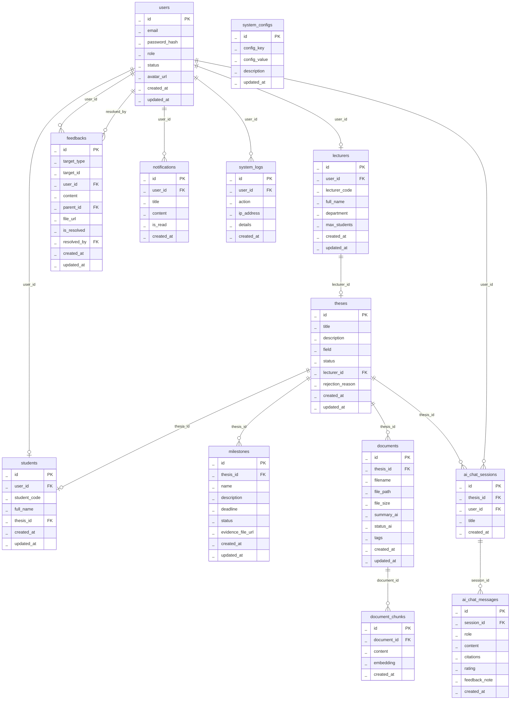

# 📊 THIẾT KẾ CƠ SỞ DỮ LIỆU – HỆ THỐNG NOVATHESIS

Tài liệu này đặc tả chi tiết cơ sở dữ liệu quan hệ phục vụ cho hệ thống quản lý luận văn và đề tài nghiên cứu NovaThesis tích hợp AI hỗ trợ học thuật, đáp ứng toàn bộ các Use Case hệ thống (đã lược bỏ các chức năng hành chính ngoài phạm vi).

---

## I. SƠ ĐỒ THỰC THỂ MỐI QUAN HỆ (ERD - ENTITY RELATIONSHIP DIAGRAM)

---

## II. ĐẶC TẢ CHI TIẾT CÁC BẢNG DỮ LIỆU (DATABASE SCHEMA TABLES)

### 1. Bảng `users` (Tài khoản người dùng)

Lưu trữ thông tin xác thực và định danh chung cho tất cả các đối tượng tham gia hệ thống (Admin, Giảng viên, Sinh viên).

| Tên cột         | Kiểu dữ liệu | Ràng buộc                       | Ghi chú (Ý nghĩa)                                                 |
| --------------- | ------------ | ------------------------------- | ----------------------------------------------------------------- |
| `id`            | INT / UUID   | Primary Key, Auto-increment     | Khóa chính, định danh duy nhất của tài khoản.                     |
| `email`         | VARCHAR(255) | Unique, Not Null                | Địa chỉ email đăng nhập và nhận thông báo từ hệ thống.            |
| `password_hash` | VARCHAR(255) | Not Null                        | Mật khẩu tài khoản đã được băm bảo mật (bcrypt/argon2).           |
| `role`          | VARCHAR(50)  | Not Null                        | Vai trò của tài khoản (`ADMIN`, `LECTURER`, `STUDENT`).           |
| `status`        | VARCHAR(50)  | Not Null, Default: 'ACTIVE'     | Trạng thái hoạt động (`ACTIVE`: hoạt động, `SUSPENDED`: bị khóa). |
| `avatar_url`    | VARCHAR(255) | Nullable                        | Đường dẫn liên kết đến ảnh đại diện người dùng.                   |
| `created_at`    | TIMESTAMP    | Not Null, Default: Current Time | Thời điểm tài khoản được khởi tạo.                                |
| `updated_at`    | TIMESTAMP    | Not Null, Default: Current Time | Thời điểm thông tin tài khoản được cập nhật gần nhất.             |

---

### 2. Bảng `students` (Sinh viên)

Lưu trữ thông tin cá nhân cụ thể của sinh viên, liên kết 1-1 với tài khoản người dùng và liên kết nhóm nghiên cứu thông qua đề tài đang thực hiện.

| Tên cột        | Kiểu dữ liệu | Ràng buộc                                | Ghi chú (Ý nghĩa)                                                        |
| -------------- | ------------ | ---------------------------------------- | ------------------------------------------------------------------------ |
| `id`           | INT / UUID   | Primary Key, Auto-increment              | Khóa chính, định danh duy nhất của sinh viên.                            |
| `user_id`      | INT / UUID   | Foreign Key (users.id), Unique, Not Null | Khóa ngoại liên kết 1-1 sang tài khoản người dùng.                       |
| `student_code` | VARCHAR(50)  | Unique, Not Null                         | Mã số sinh viên (MSSV).                                                  |
| `full_name`    | VARCHAR(255) | Not Null                                 | Họ và tên đầy đủ của sinh viên.                                          |
| `thesis_id`    | INT / UUID   | Foreign Key (theses.id), Nullable        | Khóa ngoại liên kết đề tài nghiên cứu sinh viên đang tham gia thực hiện. |
| `created_at`   | TIMESTAMP    | Not Null, Default: Current Time          | Thời điểm tạo hồ sơ sinh viên.                                           |
| `updated_at`   | TIMESTAMP    | Not Null, Default: Current Time          | Thời điểm cập nhật hồ sơ gần nhất.                                       |

---

### 3. Bảng `lecturers` (Giảng viên)

Lưu trữ thông tin của giảng viên hướng dẫn khoa học, liên kết 1-1 với tài khoản người dùng.

| Tên cột         | Kiểu dữ liệu | Ràng buộc                                | Ghi chú (Ý nghĩa)                                             |
| --------------- | ------------ | ---------------------------------------- | ------------------------------------------------------------- |
| `id`            | INT / UUID   | Primary Key, Auto-increment              | Khóa chính, định danh duy nhất của giảng viên.                |
| `user_id`       | INT / UUID   | Foreign Key (users.id), Unique, Not Null | Khóa ngoại liên kết 1-1 sang tài khoản người dùng.            |
| `lecturer_code` | VARCHAR(50)  | Unique, Not Null                         | Mã số giảng viên (MSGV).                                      |
| `full_name`     | VARCHAR(255) | Not Null                                 | Họ và tên đầy đủ của giảng viên.                              |
| `department`    | VARCHAR(100) | Not Null                                 | Bộ môn hoặc khoa quản lý giảng viên.                          |
| `max_students`  | INT          | Not Null, Default: 5                     | Giới hạn số lượng sinh viên mà giảng viên hướng dẫn cùng lúc. |
| `created_at`    | TIMESTAMP    | Not Null, Default: Current Time          | Thời điểm tạo hồ sơ giảng viên.                               |
| `updated_at`    | TIMESTAMP    | Not Null, Default: Current Time          | Thời điểm cập nhật hồ sơ gần nhất.                            |

---

### 4. Bảng `theses` (Đề tài nghiên cứu / Luận văn)

Lưu trữ thông tin đề tài nghiên cứu hoặc luận văn khoa học đang được triển khai trên hệ thống.

| Tên cột            | Kiểu dữ liệu | Ràng buộc                            | Ghi chú (Ý nghĩa)                                                                                                                 |
| ------------------ | ------------ | ------------------------------------ | --------------------------------------------------------------------------------------------------------------------------------- |
| `id`               | INT / UUID   | Primary Key, Auto-increment          | Khóa chính, định danh duy nhất của đề tài.                                                                                        |
| `title`            | VARCHAR(255) | Not Null                             | Tên tiêu đề đề tài nghiên cứu học thuật hoặc luận văn.                                                                            |
| `description`      | TEXT         | Nullable                             | Mô tả chi tiết mục tiêu, nội dung và đề cương nghiên cứu.                                                                         |
| `field`            | VARCHAR(100) | Not Null                             | Lĩnh vực chuyên môn của đề tài nghiên cứu.                                                                                        |
| `status`           | VARCHAR(50)  | Not Null, Default: 'DRAFT'           | Trạng thái đề tài (`DRAFT`: Nháp, `PENDING`: Chờ duyệt, `ONGOING`: Đang thực hiện, `COMPLETED`: Hoàn thành, `REJECTED`: Từ chối). |
| `lecturer_id`      | INT / UUID   | Foreign Key (lecturers.id), Nullable | Khóa ngoại liên kết giảng viên trực tiếp hướng dẫn đề tài.                                                                        |
| `rejection_reason` | TEXT         | Nullable                             | Ghi nhận lý do giảng viên từ chối phê duyệt đề tài.                                                                               |
| `created_at`       | TIMESTAMP    | Not Null, Default: Current Time      | Thời điểm đề tài được đề xuất/khởi tạo.                                                                                           |
| `updated_at`       | TIMESTAMP    | Not Null, Default: Current Time      | Thời điểm cập nhật thông tin đề tài gần nhất.                                                                                     |

---

### 5. Bảng `milestones` (Mốc tiến độ đề tài)

Lưu trữ các mốc tiến độ theo thời gian của từng đề tài nghiên cứu.

| Tên cột             | Kiểu dữ liệu | Ràng buộc                         | Ghi chú (Ý nghĩa)                                                                                                                             |
| ------------------- | ------------ | --------------------------------- | --------------------------------------------------------------------------------------------------------------------------------------------- |
| `id`                | INT / UUID   | Primary Key, Auto-increment       | Khóa chính, định danh duy nhất của mốc tiến độ.                                                                                               |
| `thesis_id`         | INT / UUID   | Foreign Key (theses.id), Not Null | Khóa ngoại liên kết đề tài nghiên cứu sở hữu mốc này.                                                                                         |
| `name`              | VARCHAR(255) | Not Null                          | Tên mốc tiến độ (Ví dụ: Báo cáo đề cương, Nộp bản nháp).                                                                                      |
| `description`       | TEXT         | Nullable                          | Mô tả chi tiết yêu cầu sinh viên cần nộp cho mốc này.                                                                                         |
| `deadline`          | TIMESTAMP    | Not Null                          | Hạn chót nộp báo cáo / bằng chứng tiến độ.                                                                                                    |
| `status`            | VARCHAR(50)  | Not Null, Default: 'NOT_STARTED'  | Trạng thái mốc (`NOT_STARTED`: Chưa làm, `ONGOING`: Đang làm, `PENDING_APPROVAL`: Chờ duyệt, `COMPLETED`: Đạt, `REVISION_REQUIRED`: Cần sửa). |
| `evidence_file_url` | VARCHAR(255) | Nullable                          | Đường dẫn file báo cáo hoặc bằng chứng tiến độ do sinh viên nộp.                                                                              |
| `created_at`        | TIMESTAMP    | Not Null, Default: Current Time   | Thời điểm khởi tạo mốc tiến độ.                                                                                                               |
| `updated_at`        | TIMESTAMP    | Not Null, Default: Current Time   | Thời điểm cập nhật mốc gần nhất.                                                                                                              |

---

### 6. Bảng `documents` (Tài liệu nghiên cứu)

Lưu trữ thông tin metadata và nội dung tóm tắt của tài liệu tham khảo tải lên cho từng đề tài.

| Tên cột      | Kiểu dữ liệu | Ràng buộc                         | Ghi chú (Ý nghĩa)                                                                                |
| ------------ | ------------ | --------------------------------- | ------------------------------------------------------------------------------------------------ |
| `id`         | INT / UUID   | Primary Key, Auto-increment       | Khóa chính, định danh tài liệu.                                                                  |
| `thesis_id`  | INT / UUID   | Foreign Key (theses.id), Not Null | Khóa ngoại liên kết đề tài sở hữu tài liệu này.                                                  |
| `filename`   | VARCHAR(255) | Not Null                          | Tên file gốc tải lên từ máy tính của người dùng.                                                 |
| `file_path`  | VARCHAR(255) | Not Null                          | Đường dẫn lưu trữ tệp tin vật lý trên hệ thống máy chủ.                                          |
| `file_size`  | INT          | Not Null                          | Dung lượng của tệp tin tính bằng đơn vị byte.                                                    |
| `summary_ai` | TEXT         | Nullable                          | Bản tóm tắt nội dung tài liệu tự động do hệ thống AI trích xuất.                                 |
| `status_ai`  | VARCHAR(50)  | Not Null, Default: 'PENDING'      | Trạng thái xử lý AI (`PENDING`: Chờ, `PROCESSING`: Đang chạy, `DONE`: Hoàn thành, `ERROR`: Lỗi). |
| `tags`       | VARCHAR(255) | Nullable                          | Các thẻ từ khóa tự định nghĩa phân cách bằng dấu phẩy để lọc tài liệu.                           |
| `created_at` | TIMESTAMP    | Not Null, Default: Current Time   | Thời điểm tải tài liệu lên.                                                                      |
| `updated_at` | TIMESTAMP    | Not Null, Default: Current Time   | Thời điểm cập nhật metadata tài liệu gần nhất.                                                   |

---

### 7. Bảng `document_chunks` (Đoạn trích tài liệu phục vụ Vector Search)

Lưu trữ các đoạn văn bản trích xuất nhỏ từ tài liệu kèm vector ngữ nghĩa tương ứng phục vụ tìm kiếm ngữ nghĩa và RAG.

| Tên cột       | Kiểu dữ liệu | Ràng buộc                            | Ghi chú (Ý nghĩa)                                                            |
| ------------- | ------------ | ------------------------------------ | ---------------------------------------------------------------------------- |
| `id`          | INT / UUID   | Primary Key, Auto-increment          | Khóa chính, định danh duy nhất của đoạn trích.                               |
| `document_id` | INT / UUID   | Foreign Key (documents.id), Not Null | Khóa ngoại liên kết đến tài liệu gốc chứa đoạn văn này.                      |
| `content`     | TEXT         | Not Null                             | Nội dung văn bản thô được trích xuất từ tài liệu.                            |
| `embedding`   | VECTOR(1536) | Not Null                             | Vector biểu diễn ngữ nghĩa (1536 chiều của OpenAI Embeddings hoặc tương tự). |
| `created_at`  | TIMESTAMP    | Not Null, Default: Current Time      | Thời điểm đoạn trích được xử lý và lưu trữ.                                  |

---

### 8. Bảng `ai_chat_sessions` (Phiên hội thoại AI)

Quản lý các phiên hội thoại riêng biệt giữa người dùng và AI trong phạm vi một đề tài cụ thể.

| Tên cột      | Kiểu dữ liệu | Ràng buộc                         | Ghi chú (Ý nghĩa)                                                                               |
| ------------ | ------------ | --------------------------------- | ----------------------------------------------------------------------------------------------- |
| `id`         | INT / UUID   | Primary Key, Auto-increment       | Khóa chính, định danh duy nhất của phiên hội thoại.                                             |
| `thesis_id`  | INT / UUID   | Foreign Key (theses.id), Not Null | Khóa ngoại liên kết đề tài nghiên cứu áp dụng (chỉ truy vấn RAG trong kho tài liệu đề tài này). |
| `user_id`    | INT / UUID   | Foreign Key (users.id), Not Null  | Khóa ngoại liên kết tài khoản người dùng thực hiện chat với AI.                                 |
| `title`      | VARCHAR(255) | Not Null                          | Tiêu đề tóm tắt ngắn gọn nội dung phiên chat.                                                   |
| `created_at` | TIMESTAMP    | Not Null, Default: Current Time   | Thời điểm phiên hội thoại được khởi tạo.                                                        |

---

### 9. Bảng `ai_chat_messages` (Tin nhắn hội thoại AI)

Lưu trữ chi tiết các tin nhắn trong mỗi phiên hội thoại học thuật, bao gồm nguồn trích dẫn và đánh giá chất lượng AI.

| Tên cột         | Kiểu dữ liệu | Ràng buộc                                   | Ghi chú (Ý nghĩa)                                                                |
| --------------- | ------------ | ------------------------------------------- | -------------------------------------------------------------------------------- |
| `id`            | INT / UUID   | Primary Key, Auto-increment                 | Khóa chính, định danh duy nhất của tin nhắn.                                     |
| `session_id`    | INT / UUID   | Foreign Key (ai_chat_sessions.id), Not Null | Khóa ngoại liên kết phiên hội thoại chứa tin nhắn này.                           |
| `role`          | VARCHAR(50)  | Not Null                                    | Vai trò gửi tin nhắn (`USER`: người dùng, `ASSISTANT`: hệ thống AI).             |
| `content`       | TEXT         | Not Null                                    | Nội dung tin nhắn dạng văn bản thô hoặc Markdown.                                |
| `citations`     | TEXT         | Nullable                                    | Chuỗi JSON mô tả nguồn tài liệu tham chiếu RAG (tên file, trang, độ tương đồng). |
| `rating`        | VARCHAR(10)  | Nullable                                    | Đánh giá chất lượng của người dùng cho câu trả lời AI (`LIKE` hoặc `DISLIKE`).   |
| `feedback_note` | TEXT         | Nullable                                    | Ý kiến phản hồi bằng chữ của người dùng khi đánh giá câu trả lời AI.             |
| `created_at`    | TIMESTAMP    | Not Null, Default: Current Time             | Thời điểm gửi tin nhắn.                                                          |

---

### 10. Bảng `feedbacks` (Bình luận & Phản hồi)

Quản lý luồng bình luận nhiều cấp (Thread) của giảng viên và sinh viên trên tài liệu hoặc mốc tiến độ.

| Tên cột       | Kiểu dữ liệu | Ràng buộc                        | Ghi chú (Ý nghĩa)                                                             |
| ------------- | ------------ | -------------------------------- | ----------------------------------------------------------------------------- |
| `id`          | INT / UUID   | Primary Key, Auto-increment      | Khóa chính, định danh phản hồi/nhận xét.                                      |
| `target_type` | VARCHAR(50)  | Not Null                         | Loại đối tượng được phản hồi (`MILESTONE` hoặc `DOCUMENT`).                   |
| `target_id`   | INT / UUID   | Not Null                         | Khóa ngoại động liên kết đến`milestone_id` hoặc `document_id`.                |
| `user_id`     | INT / UUID   | Foreign Key (users.id), Not Null | Khóa ngoại liên kết tài khoản của người viết bình luận.                       |
| `content`     | TEXT         | Not Null                         | Nội dung văn bản của bình luận.                                               |
| `parent_id`   | INT / UUID   | Nullable                         | Liên kết đệ quy sang chính bảng này để tạo bình luận phân cấp (tối đa 3 cấp). |
| `file_url`    | VARCHAR(255) | Nullable                         | Đường dẫn tệp đính kèm đi kèm bình luận (nếu có).                             |
| `is_resolved` | BOOLEAN      | Not Null, Default: False         | Trạng thái bình luận đã được giải quyết xong hay chưa (dành cho giảng viên).  |
| `resolved_by` | INT / UUID   | Foreign Key (users.id), Nullable | Khóa ngoại liên kết giảng viên thực hiện đánh dấu hoàn thành bình luận.       |
| `created_at`  | TIMESTAMP    | Not Null, Default: Current Time  | Thời điểm viết bình luận.                                                     |
| `updated_at`  | TIMESTAMP    | Not Null, Default: Current Time  | Thời điểm chỉnh sửa bình luận gần nhất.                                       |

---

### 11. Bảng `notifications` (Thông báo)

Lưu thông tin thông báo thời gian thực hoặc thông báo email để đẩy về cho người dùng.

| Tên cột      | Kiểu dữ liệu | Ràng buộc                        | Ghi chú (Ý nghĩa)                                             |
| ------------ | ------------ | -------------------------------- | ------------------------------------------------------------- |
| `id`         | INT / UUID   | Primary Key, Auto-increment      | Khóa chính, định danh thông báo.                              |
| `user_id`    | INT / UUID   | Foreign Key (users.id), Not Null | Khóa ngoại liên kết người dùng nhận thông báo.                |
| `title`      | VARCHAR(255) | Not Null                         | Tiêu đề ngắn gọn của thông báo.                               |
| `content`    | TEXT         | Not Null                         | Chi tiết nội dung của thông báo gửi đến người dùng.           |
| `is_read`    | BOOLEAN      | Not Null, Default: False         | Trạng thái xem thông báo (`False`: chưa đọc, `True`: đã đọc). |
| `created_at` | TIMESTAMP    | Not Null, Default: Current Time  | Thời điểm thông báo được sinh ra.                             |

---

### 12. Bảng `system_logs` (Nhật ký hệ thống)

Lưu trữ nhật ký thao tác quan trọng để phục vụ kiểm toán và giám sát hệ thống của Admin.

| Tên cột      | Kiểu dữ liệu | Ràng buộc                        | Ghi chú (Ý nghĩa)                                                            |
| ------------ | ------------ | -------------------------------- | ---------------------------------------------------------------------------- |
| `id`         | INT / UUID   | Primary Key, Auto-increment      | Khóa chính, định danh bản ghi log.                                           |
| `user_id`    | INT / UUID   | Foreign Key (users.id), Nullable | Khóa ngoại liên kết tài khoản thực hiện thao tác (null nếu là tác vụ nền).   |
| `action`     | VARCHAR(255) | Not Null                         | Hành động được thực hiện (Ví dụ: Đăng nhập thất bại, Cập nhật AI config...). |
| `ip_address` | VARCHAR(45)  | Nullable                         | Địa chỉ IP của thiết bị thực hiện thao tác.                                  |
| `details`    | TEXT         | Nullable                         | Mô tả chi tiết hoặc payload dữ liệu kèm theo hành động.                      |
| `created_at` | TIMESTAMP    | Not Null, Default: Current Time  | Thời điểm ghi nhận log.                                                      |

---

### 13. Bảng `system_configs` (Cấu hình hệ thống)

Lưu các thông số kỹ thuật cấu hình hệ thống phục vụ cho các tiến trình nền và AI.

| Tên cột        | Kiểu dữ liệu | Ràng buộc                       | Ghi chú (Ý nghĩa)                                              |
| -------------- | ------------ | ------------------------------- | -------------------------------------------------------------- |
| `id`           | INT / UUID   | Primary Key, Auto-increment     | Khóa chính, định danh dòng cấu hình.                           |
| `config_key`   | VARCHAR(100) | Unique, Not Null                | Khóa cấu hình hệ thống (Ví dụ:`AI_MODEL`, `MAX_FILE_SIZE_MB`). |
| `config_value` | VARCHAR(255) | Not Null                        | Giá trị chuỗi tương ứng của cấu hình.                          |
| `description`  | TEXT         | Nullable                        | Mô tả công dụng và ý nghĩa của khóa cấu hình này.              |
| `updated_at`   | TIMESTAMP    | Not Null, Default: Current Time | Thời điểm cấu hình được Admin chỉnh sửa gần nhất.              |
