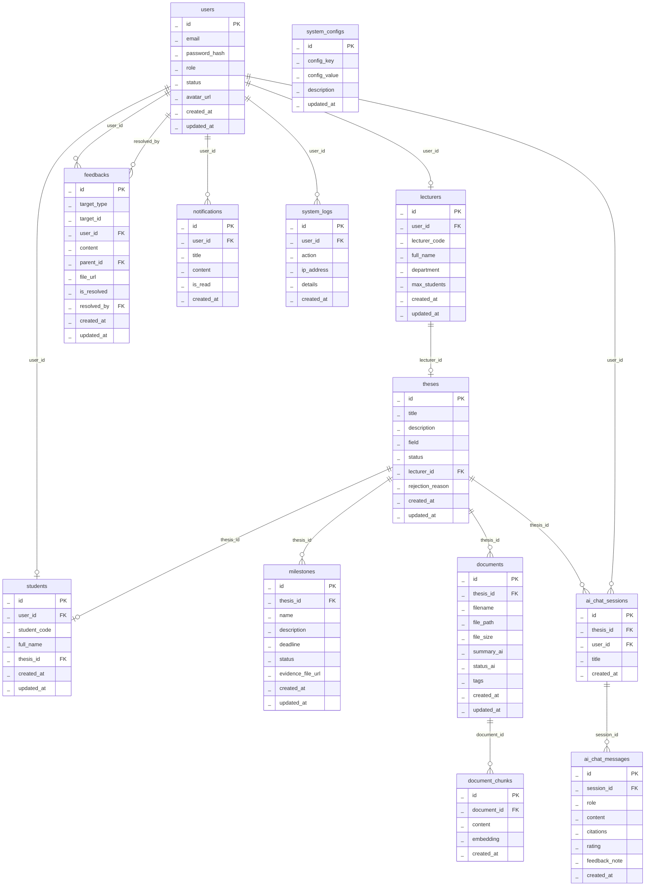

# 📊 THIẾT KẾ CƠ SỞ DỮ LIỆU – HỆ THỐNG NOVATHESIS

Tài liệu này đặc tả chi tiết cơ sở dữ liệu quan hệ phục vụ cho hệ thống quản lý luận văn và đề tài nghiên cứu NovaThesis tích hợp AI hỗ trợ học thuật, đáp ứng toàn bộ các Use Case hệ thống (đã lược bỏ các chức năng hành chính ngoài phạm vi).

---

> # 🔴 GHI CHÚ RÀ SOÁT (đối chiếu với source code `frontend/src`)
>
> Toàn bộ ghi chú bắt đầu bằng **`CẦN SỬA`** — tìm nhanh bằng `grep "CẦN SỬA"`.
> Xoá các block này sau khi đã cập nhật xong tài liệu.
>
> **Tổng hợp: 7 bảng còn thiếu + 21 cột còn thiếu + 2 lỗi quan hệ.**
>
> | # | Vấn đề | Mức độ | Bằng chứng trong source |
> |---|--------|--------|--------------------------|
> | 1 | `users` **không có `full_name`** → tài khoản ADMIN không có tên để hiển thị | 🔴 Nghiêm trọng | `lib/auth.ts` → `User.full_name`; `admin/users/page.tsx` hiển thị `full_name` cho cả 3 vai trò |
> | 2 | `users` thiếu trường xác minh email / reset mật khẩu / khoá tạm thời | 🔴 Nghiêm trọng | UC 1.1 BR "khoá 15 phút sau 5 lần sai", UC 1.4/1.5/1.6; `auth-sheet.tsx` `MAX_ATTEMPTS = 5` |
> | 3 | `milestones` thiếu 5 cột đã dùng trong code | 🔴 Nghiêm trọng | `milestones/page.tsx` → `Milestone` interface |
> | 4 | **Thiếu Document Versioning** dù là yêu cầu bắt buộc | 🔴 Nghiêm trọng | `Yêu cầu dự án.md` §3.1 |
> | 5 | Quan hệ `theses ||--o| students` sai chiều (1 đề tài chỉ 1 SV) | 🔴 Nghiêm trọng | `theses/page.tsx` → `student_names?: string[]` (mảng) |
> | 6 | Thiếu 7 bảng cho các UC đã đặc tả | 🟠 Cao | UC 2.7, 4.12, 5.10, 6.3, 6.10–6.13, 8.7 |
> | 7 | Thiếu cột phân loại: `notifications.type`, `system_logs.level`, `system_configs.category` | 🟠 Cao | 3 file page tương ứng đều có |
> | 8 | Thiếu hoàn toàn phần đặc tả **Index** (đặc biệt HNSW cho pgvector) | 🟠 Cao | `Yêu cầu dự án.md` §2.3 |
> | 9 | `theses.status` thiếu trạng thái cho UC 3.10 (Yêu cầu chỉnh sửa) | 🟡 Trung bình | UC 3.10 vs `ThesisStatus` |
> | 10 | `feedbacks.target_id` là khoá ngoại đa hình → không ràng buộc được toàn vẹn | 🟡 Trung bình | Thiết kế |

---

## I. SƠ ĐỒ THỰC THỂ MỐI QUAN HỆ (ERD - ENTITY RELATIONSHIP DIAGRAM)



---

## II. ĐẶC TẢ CHI TIẾT CÁC BẢNG DỮ LIỆU (DATABASE SCHEMA TABLES)

### 1. Bảng `users` (Tài khoản người dùng)

Lưu trữ thông tin xác thực và định danh chung cho tất cả các đối tượng tham gia hệ thống (Admin, Giảng viên, Sinh viên).

| Tên cột         | Kiểu dữ liệu | Ràng buộc                       | Ghi chú (Ý nghĩa)                                                 |
| --------------- | ------------ | ------------------------------- | ----------------------------------------------------------------- |
| `id`            | INT / UUID   | Primary Key, Auto-increment     | Khóa chính, định danh duy nhất của tài khoản.                     |
| `email`         | VARCHAR(255) | Unique, Not Null                | Địa chỉ email đăng nhập và nhận thông báo từ hệ thống.            |
| `password_hash` | VARCHAR(255) | Not Null                        | Mật khẩu tài khoản đã được băm bảo mật (bcrypt/argon2).           |
| `role`          | VARCHAR(50)  | Not Null                        | Vai trò của tài khoản (`ADMIN`, `LECTURER`, `STUDENT`).           |
| `status`        | VARCHAR(50)  | Not Null, Default: 'ACTIVE'     | Trạng thái hoạt động (`ACTIVE`: hoạt động, `SUSPENDED`: bị khóa). |
| `avatar_url`    | VARCHAR(255) | Nullable                        | Đường dẫn liên kết đến ảnh đại diện người dùng.                   |
| `created_at`    | TIMESTAMP    | Not Null, Default: Current Time | Thời điểm tài khoản được khởi tạo.                                |
| `updated_at`    | TIMESTAMP    | Not Null, Default: Current Time | Thời điểm thông tin tài khoản được cập nhật gần nhất.             |

> 🔴 **CẦN SỬA – bảng `users` (nghiêm trọng nhất trong ERD)**
>
> **a) Thiếu cột `full_name`.** Hiện `full_name` chỉ nằm ở `students` và `lecturers`.
> Hệ quả: **tài khoản ADMIN không có chỗ nào lưu họ tên.** Nhưng trong code:
> - `lib/auth.ts` khai báo `User.full_name: string` (bắt buộc, cho mọi vai trò)
> - `admin/users/page.tsx` hiển thị cột "Người dùng" = `full_name` cho cả ADMIN
> - Sidebar/Topbar dùng `user.full_name` để sinh chữ cái viết tắt avatar
>
> → **Sửa:** thêm `full_name VARCHAR(255) NOT NULL` vào `users`, và **xoá** `full_name`
> khỏi `students`/`lecturers` (tránh trùng lặp, tránh lệch dữ liệu).
>
> **b) Thiếu toàn bộ trường phục vụ UC 1.1 / 1.4 / 1.5 / 1.6.** Cần bổ sung:
>
> | Cột đề xuất | Kiểu | Phục vụ UC |
> |---|---|---|
> | `email_verified_at` | TIMESTAMP, Nullable | UC 1.2, 1.4 – chặn đăng nhập khi chưa xác minh |
> | `verification_token` | VARCHAR(255), Nullable | UC 1.4 |
> | `verification_expires_at` | TIMESTAMP, Nullable | UC 1.4 – token hết hạn |
> | `reset_token` | VARCHAR(255), Nullable | UC 1.5, 1.6 |
> | `reset_token_expires_at` | TIMESTAMP, Nullable | UC 1.6 |
> | `failed_login_attempts` | INT, Default 0 | UC 1.1 BR-1 |
> | `locked_until` | TIMESTAMP, Nullable | UC 1.1 BR-1 – khoá 15 phút |
> | `last_login_at` | TIMESTAMP, Nullable | UC 2.1 – admin xem hoạt động |
>
> Không có các cột này thì **Business rule "khoá tài khoản 15 phút sau 5 lần sai"
> của UC 1.1 không thể cài đặt được ở backend** (frontend `auth-sheet.tsx` chỉ đếm
> tạm trong RAM, mất khi F5 → không phải cơ chế bảo mật).
>
> **c) `status` nên có thêm `PENDING_VERIFICATION`** để phân biệt với `SUSPENDED`
> (UC 1.2 post-condition ghi rõ tài khoản tạo ra ở trạng thái "Chờ xác minh",
> nhưng enum hiện chỉ có `ACTIVE` / `SUSPENDED`).

---

### 2. Bảng `students` (Sinh viên)

Lưu trữ thông tin cá nhân cụ thể của sinh viên, liên kết 1-1 với tài khoản người dùng và liên kết nhóm nghiên cứu thông qua đề tài đang thực hiện.

| Tên cột        | Kiểu dữ liệu | Ràng buộc                                | Ghi chú (Ý nghĩa)                                                        |
| -------------- | ------------ | ---------------------------------------- | ------------------------------------------------------------------------ |
| `id`           | INT / UUID   | Primary Key, Auto-increment              | Khóa chính, định danh duy nhất của sinh viên.                            |
| `user_id`      | INT / UUID   | Foreign Key (users.id), Unique, Not Null | Khóa ngoại liên kết 1-1 sang tài khoản người dùng.                       |
| `student_code` | VARCHAR(50)  | Unique, Not Null                         | Mã số sinh viên (MSSV).                                                  |
| `full_name`    | VARCHAR(255) | Not Null                                 | Họ và tên đầy đủ của sinh viên.                                          |
| `thesis_id`    | INT / UUID   | Foreign Key (theses.id), Nullable        | Khóa ngoại liên kết đề tài nghiên cứu sinh viên đang tham gia thực hiện. |
| `created_at`   | TIMESTAMP    | Not Null, Default: Current Time          | Thời điểm tạo hồ sơ sinh viên.                                           |
| `updated_at`   | TIMESTAMP    | Not Null, Default: Current Time          | Thời điểm cập nhật hồ sơ gần nhất.                                       |

> 🟠 **CẦN SỬA – bảng `students`**
>
> **a) Mâu thuẫn `student_code` NOT NULL.** ERD bắt buộc phải có MSSV, UC 1.2 cũng
> ghi form đăng ký gồm "Họ tên, **Mã SV**, Email, Mật khẩu". Nhưng form thực tế
> (`components/auth-sheet.tsx`) **chỉ có 4 trường: Họ và tên, Email, Mật khẩu,
> Xác nhận mật khẩu — không có ô nhập Mã SV.**
> → Chọn 1 trong 2: (i) thêm ô Mã SV vào form, hoặc (ii) đổi `student_code` thành
> `Nullable` và cho Admin/SV bổ sung sau ở trang Hồ sơ. **Phải sửa cả UC 1.2.**
>
> **b) Xoá `full_name`** – chuyển lên `users` (xem ghi chú bảng `users` mục a).
>
> **c) `thesis_id` chỉ cho phép 1 đề tài/1 sinh viên trong suốt vòng đời.**
> Không lưu được lịch sử khi sinh viên đổi đề tài hoặc học lại năm sau.
> → Cân nhắc tách bảng `thesis_members (thesis_id, student_id, joined_at, role)`,
> vừa giải quyết luôn lỗi quan hệ 1-N ở sơ đồ Mermaid.

---

### 3. Bảng `lecturers` (Giảng viên)

Lưu trữ thông tin của giảng viên hướng dẫn khoa học, liên kết 1-1 với tài khoản người dùng.

| Tên cột         | Kiểu dữ liệu | Ràng buộc                                | Ghi chú (Ý nghĩa)                                             |
| --------------- | ------------ | ---------------------------------------- | ------------------------------------------------------------- |
| `id`            | INT / UUID   | Primary Key, Auto-increment              | Khóa chính, định danh duy nhất của giảng viên.                |
| `user_id`       | INT / UUID   | Foreign Key (users.id), Unique, Not Null | Khóa ngoại liên kết 1-1 sang tài khoản người dùng.            |
| `lecturer_code` | VARCHAR(50)  | Unique, Not Null                         | Mã số giảng viên (MSGV).                                      |
| `full_name`     | VARCHAR(255) | Not Null                                 | Họ và tên đầy đủ của giảng viên.                              |
| `department`    | VARCHAR(100) | Not Null                                 | Bộ môn hoặc khoa quản lý giảng viên.                          |
| `max_students`  | INT          | Not Null, Default: 5                     | Giới hạn số lượng sinh viên mà giảng viên hướng dẫn cùng lúc. |
| `created_at`    | TIMESTAMP    | Not Null, Default: Current Time          | Thời điểm tạo hồ sơ giảng viên.                               |
| `updated_at`    | TIMESTAMP    | Not Null, Default: Current Time          | Thời điểm cập nhật hồ sơ gần nhất.                            |

---

### 4. Bảng `theses` (Đề tài nghiên cứu / Luận văn)

Lưu trữ thông tin đề tài nghiên cứu hoặc luận văn khoa học đang được triển khai trên hệ thống.

| Tên cột            | Kiểu dữ liệu | Ràng buộc                            | Ghi chú (Ý nghĩa)                                                                                                                 |
| ------------------ | ------------ | ------------------------------------ | --------------------------------------------------------------------------------------------------------------------------------- |
| `id`               | INT / UUID   | Primary Key, Auto-increment          | Khóa chính, định danh duy nhất của đề tài.                                                                                        |
| `title`            | VARCHAR(255) | Not Null                             | Tên tiêu đề đề tài nghiên cứu học thuật hoặc luận văn.                                                                            |
| `description`      | TEXT         | Nullable                             | Mô tả chi tiết mục tiêu, nội dung và đề cương nghiên cứu.                                                                         |
| `field`            | VARCHAR(100) | Not Null                             | Lĩnh vực chuyên môn của đề tài nghiên cứu.                                                                                        |
| `status`           | VARCHAR(50)  | Not Null, Default: 'DRAFT'           | Trạng thái đề tài (`DRAFT`: Nháp, `PENDING`: Chờ duyệt, `ONGOING`: Đang thực hiện, `COMPLETED`: Hoàn thành, `REJECTED`: Từ chối). |
| `lecturer_id`      | INT / UUID   | Foreign Key (lecturers.id), Nullable | Khóa ngoại liên kết giảng viên trực tiếp hướng dẫn đề tài.                                                                        |
| `rejection_reason` | TEXT         | Nullable                             | Ghi nhận lý do giảng viên từ chối phê duyệt đề tài.                                                                               |
| `created_at`       | TIMESTAMP    | Not Null, Default: Current Time      | Thời điểm đề tài được đề xuất/khởi tạo.                                                                                           |
| `updated_at`       | TIMESTAMP    | Not Null, Default: Current Time      | Thời điểm cập nhật thông tin đề tài gần nhất.                                                                                     |

> 🟡 **CẦN SỬA – bảng `theses`**
>
> **a) `status` thiếu trạng thái cho UC 3.10 "Yêu cầu chỉnh sửa đề tài".**
> Enum hiện có: `DRAFT`, `PENDING`, `ONGOING`, `COMPLETED`, `REJECTED` (khớp
> `ThesisStatus` trong `theses/page.tsx`). Không có trạng thái nào ứng với việc
> giảng viên trả đề tài về cho sinh viên sửa.
> → Thêm `REVISION_REQUIRED`, và bổ sung cột `revision_note TEXT NULL` (hiện chỉ
> có `rejection_reason` dùng cho UC 3.11 – từ chối hẳn, khác nghĩa).
>
> **b) Thiếu `academic_year_id`** – UC 2.7 (Quản lý năm học) trong `00_UC_Overview.md`
> không có bảng nào chống lưng. Xem mục III cuối tài liệu.
>
> **c) Thiếu `completed_at`** – UC 3.13 "Đánh dấu đề tài hoàn thành" và UC 9.2
> (xuất danh sách theo trạng thái) cần biết thời điểm hoàn thành, không thể suy ra
> từ `updated_at`.
>
> **d) Ghi chú thiết kế:** yêu cầu dự án (`Yêu cầu dự án.md` §2.4) mô tả FSM là
> `Draft → Pending Review → Defending → Approved → Published`. Enum trong tài liệu
> và trong code lại là `DRAFT → PENDING → ONGOING → COMPLETED`. **Hai nơi mô tả hai
> máy trạng thái khác nhau** → cần thống nhất một bản duy nhất rồi sửa cả 3 chỗ
> (yêu cầu, ERD, code).

---

### 5. Bảng `milestones` (Mốc tiến độ đề tài)

Lưu trữ các mốc tiến độ theo thời gian của từng đề tài nghiên cứu.

| Tên cột             | Kiểu dữ liệu | Ràng buộc                         | Ghi chú (Ý nghĩa)                                                                                                                             |
| ------------------- | ------------ | --------------------------------- | --------------------------------------------------------------------------------------------------------------------------------------------- |
| `id`                | INT / UUID   | Primary Key, Auto-increment       | Khóa chính, định danh duy nhất của mốc tiến độ.                                                                                               |
| `thesis_id`         | INT / UUID   | Foreign Key (theses.id), Not Null | Khóa ngoại liên kết đề tài nghiên cứu sở hữu mốc này.                                                                                         |
| `name`              | VARCHAR(255) | Not Null                          | Tên mốc tiến độ (Ví dụ: Báo cáo đề cương, Nộp bản nháp).                                                                                      |
| `description`       | TEXT         | Nullable                          | Mô tả chi tiết yêu cầu sinh viên cần nộp cho mốc này.                                                                                         |
| `deadline`          | TIMESTAMP    | Not Null                          | Hạn chót nộp báo cáo / bằng chứng tiến độ.                                                                                                    |
| `status`            | VARCHAR(50)  | Not Null, Default: 'NOT_STARTED'  | Trạng thái mốc (`NOT_STARTED`: Chưa làm, `ONGOING`: Đang làm, `PENDING_APPROVAL`: Chờ duyệt, `COMPLETED`: Đạt, `REVISION_REQUIRED`: Cần sửa). |
| `evidence_file_url` | VARCHAR(255) | Nullable                          | Đường dẫn file báo cáo hoặc bằng chứng tiến độ do sinh viên nộp.                                                                              |
| `created_at`        | TIMESTAMP    | Not Null, Default: Current Time   | Thời điểm khởi tạo mốc tiến độ.                                                                                                               |
| `updated_at`        | TIMESTAMP    | Not Null, Default: Current Time   | Thời điểm cập nhật mốc gần nhất.                                                                                                              |

> 🔴 **CẦN SỬA – bảng `milestones` (thiếu 5 cột đang được code sử dụng)**
>
> `milestones/page.tsx` khai báo interface `Milestone` với các trường sau mà ERD
> **hoàn toàn không có**:
>
> | Cột thiếu | Kiểu đề xuất | Dùng ở đâu | UC liên quan |
> |---|---|---|---|
> | `description_revision` | TEXT, Nullable | Nội dung GV yêu cầu SV sửa | **UC 4.11** |
> | `evidence_filename` | VARCHAR(255), Nullable | Tên file gốc hiển thị trên thẻ Kanban | UC 4.9 |
> | `extension_requested` | BOOLEAN, Default False | Cờ "đang xin gia hạn" | **UC 4.7** |
> | `extension_reason` | TEXT, Nullable | Lý do xin gia hạn | **UC 4.7** |
> | `extension_new_deadline` | TIMESTAMP, Nullable | Hạn mới sinh viên đề nghị | **UC 4.7** |
>
> Thiếu 3 cột `extension_*` thì **UC 4.7 (Gia hạn deadline) không có nơi lưu dữ liệu** —
> giao diện đã hiện chip "Xin gia hạn → 2026-08-20" nhưng backend không lưu được.
>
> **Bổ sung thêm (chưa có ở cả code lẫn ERD nhưng UC yêu cầu):**
> - `extension_status` (`PENDING`/`APPROVED`/`REJECTED`) – UC 4.7 cần GV duyệt, hiện
>   chỉ có cờ boolean nên không biết GV đã trả lời chưa.
> - `order_index INT` – Kanban và Gantt (UC 9.4) cần thứ tự mốc ổn định; hiện sắp
>   theo `deadline` nên hai mốc cùng hạn sẽ nhảy vị trí ngẫu nhiên.
> - `approved_by` FK → `users.id`, `approved_at` TIMESTAMP – UC 4.10 cần biết **ai**
>   đã duyệt mốc, phục vụ kiểm toán.
>
> **Ràng buộc trạng thái (quan trọng):** `status` hiện chỉ là VARCHAR tự do. Code đã
> cài **máy trạng thái FSM** tại `lib/milestone-fsm.ts` với bảng chuyển tiếp hợp lệ
> (VD: `ONGOING → PENDING_APPROVAL` bắt buộc phải có minh chứng; chỉ LECTURER/ADMIN
> mới được chuyển sang `COMPLETED`). Tài liệu ERD **cần đặc tả lại bảng chuyển tiếp
> này** và backend phải kiểm tra lại (client chỉ chặn nhầm lẫn, không phải hàng rào
> bảo mật). Xem thêm ghi chú tại **UC 4.8** trong `ALL_UC_Consolidated.md`.

---

### 6. Bảng `documents` (Tài liệu nghiên cứu)

Lưu trữ thông tin metadata và nội dung tóm tắt của tài liệu tham khảo tải lên cho từng đề tài.

| Tên cột      | Kiểu dữ liệu | Ràng buộc                         | Ghi chú (Ý nghĩa)                                                                                |
| ------------ | ------------ | --------------------------------- | ------------------------------------------------------------------------------------------------ |
| `id`         | INT / UUID   | Primary Key, Auto-increment       | Khóa chính, định danh tài liệu.                                                                  |
| `thesis_id`  | INT / UUID   | Foreign Key (theses.id), Not Null | Khóa ngoại liên kết đề tài sở hữu tài liệu này.                                                  |
| `filename`   | VARCHAR(255) | Not Null                          | Tên file gốc tải lên từ máy tính của người dùng.                                                 |
| `file_path`  | VARCHAR(255) | Not Null                          | Đường dẫn lưu trữ tệp tin vật lý trên hệ thống máy chủ.                                          |
| `file_size`  | INT          | Not Null                          | Dung lượng của tệp tin tính bằng đơn vị byte.                                                    |
| `summary_ai` | TEXT         | Nullable                          | Bản tóm tắt nội dung tài liệu tự động do hệ thống AI trích xuất.                                 |
| `status_ai`  | VARCHAR(50)  | Not Null, Default: 'PENDING'      | Trạng thái xử lý AI (`PENDING`: Chờ, `PROCESSING`: Đang chạy, `DONE`: Hoàn thành, `ERROR`: Lỗi). |
| `tags`       | VARCHAR(255) | Nullable                          | Các thẻ từ khóa tự định nghĩa phân cách bằng dấu phẩy để lọc tài liệu.                           |
| `created_at` | TIMESTAMP    | Not Null, Default: Current Time   | Thời điểm tải tài liệu lên.                                                                      |
| `updated_at` | TIMESTAMP    | Not Null, Default: Current Time   | Thời điểm cập nhật metadata tài liệu gần nhất.                                                   |

> 🔴 **CẦN SỬA – bảng `documents`**
>
> **a) THIẾU DOCUMENT VERSIONING – đây là yêu cầu bắt buộc của dự án.**
> `Yêu cầu dự án.md` §3.1 ghi rõ:
> > *"Luận văn thường trải qua nhiều lần sửa đổi (Draft v1, Draft v2, Final).
> > Cần thiết kế DB để lưu trữ nhiều phiên bản của cùng một đề tài **thay vì ghi đè
> > file cũ**."*
>
> Thiết kế hiện tại **ghi đè**: 1 dòng `documents` = 1 file duy nhất, không có
> `version`, không có bảng lịch sử. → Bắt buộc bổ sung bảng `document_versions`
> (xem mục III).
>
> **b) Thiếu `uploaded_by`** FK → `users.id`. Một đề tài có nhiều sinh viên (xem lỗi
> quan hệ ở sơ đồ), không biết ai đã tải tệp nào. UC 5.5 (xoá tài liệu) cũng cần
> để phân quyền "chỉ người tải lên hoặc GVHD mới được xoá".
>
> **c) `tags` lưu chuỗi phân cách bằng dấu phẩy** – không đánh index được, không
> đảm bảo toàn vẹn, lọc phải dùng `LIKE '%...%'` (chậm, dễ khớp nhầm "AI" trong
> "MAINTAIN"). Code `documents/page.tsx` đang tự `split(",")` ở client.
> → Nên dùng `TEXT[]` của PostgreSQL + index GIN, hoặc tách bảng `tags` + `document_tags`.
>
> **d) Thiếu `summary_note`** – UC 6.3 "Chỉnh sửa / Ghi chú vào tóm tắt AI" cho phép
> người dùng ghi chú thêm vào bản tóm tắt, nhưng chỉ có `summary_ai` (do AI sinh).
> Ghi đè vào đó sẽ mất bản gốc của AI.
>
> **e) Thiếu `page_count`** – giao diện trích dẫn hiển thị "tr. 12/…", và UC 6.6 cần
> đối chiếu số trang.
>
> **f) UC 5.10 "Chia sẻ tài liệu với đề tài khác" không khả thi với thiết kế này.**
> `thesis_id` là FK đơn trị → 1 tài liệu chỉ thuộc đúng 1 đề tài. Cần bảng
> `document_shares` (xem mục III).

---

### 7. Bảng `document_chunks` (Đoạn trích tài liệu phục vụ Vector Search)

Lưu trữ các đoạn văn bản trích xuất nhỏ từ tài liệu kèm vector ngữ nghĩa tương ứng phục vụ tìm kiếm ngữ nghĩa và RAG.

| Tên cột       | Kiểu dữ liệu | Ràng buộc                            | Ghi chú (Ý nghĩa)                                                            |
| ------------- | ------------ | ------------------------------------ | ---------------------------------------------------------------------------- |
| `id`          | INT / UUID   | Primary Key, Auto-increment          | Khóa chính, định danh duy nhất của đoạn trích.                               |
| `document_id` | INT / UUID   | Foreign Key (documents.id), Not Null | Khóa ngoại liên kết đến tài liệu gốc chứa đoạn văn này.                      |
| `content`     | TEXT         | Not Null                             | Nội dung văn bản thô được trích xuất từ tài liệu.                            |
| `embedding`   | VECTOR(1536) | Not Null                             | Vector biểu diễn ngữ nghĩa (1536 chiều của OpenAI Embeddings hoặc tương tự). |
| `created_at`  | TIMESTAMP    | Not Null, Default: Current Time      | Thời điểm đoạn trích được xử lý và lưu trữ.                                  |

> 🟠 **CẦN SỬA – bảng `document_chunks`**
>
> **a) Thiếu `page_number`.** Giao diện trích dẫn RAG (`ai-chat/page.tsx` →
> `Citation.page`) hiển thị **"tr. 12"** cho từng nguồn, và UC 6.6 yêu cầu chỉ rõ
> trang. Không có cột này thì không thể dẫn nguồn tới trang.
> → Thêm `page_number INT NULL`.
>
> **b) Thiếu `chunk_index INT`** – thứ tự đoạn trong tài liệu, cần để ghép lại ngữ
> cảnh liền mạch khi đưa vào prompt RAG.
>
> **c) Thiếu `token_count INT`** – để kiểm soát ngân sách context khi build prompt
> (liên quan §2.4 "Resource Constrained Thinking" trong yêu cầu dự án).
>
> **d) Thiếu đặc tả INDEX cho pgvector – đây là điểm cốt lõi của đề tài.**
> Cột `embedding VECTOR(1536)` mà không có index thì mọi truy vấn tương đồng sẽ
> quét tuần tự toàn bảng (O(N)), trái ngược hoàn toàn với mục tiêu "< 50ms cho
> 100.000 trang" nêu trong tài liệu. Cần bổ sung mục Index:
>
> ```sql
> CREATE INDEX idx_chunks_embedding ON document_chunks
>   USING hnsw (embedding vector_cosine_ops) WITH (m = 16, ef_construction = 64);
> CREATE INDEX idx_chunks_document ON document_chunks (document_id);
> ```
>
> **e) Cảnh báo bảo mật (Tenant Isolation).** `Yêu cầu dự án.md` §2.1 yêu cầu:
> *"khi similarity search, scope tìm kiếm phải giới hạn trong những tài liệu mà
> user đó có quyền truy cập"*. Bảng này **không có cột nào để lọc quyền** — phải
> JOIN qua `documents → theses` ở mọi truy vấn. Cần ghi rõ ràng buộc này trong tài
> liệu, nếu không lập trình viên rất dễ viết `ORDER BY embedding <=> $1 LIMIT 5`
> trên toàn bảng và **làm rò rỉ nội dung luận văn của sinh viên khác**.

---

### 8. Bảng `ai_chat_sessions` (Phiên hội thoại AI)

Quản lý các phiên hội thoại riêng biệt giữa người dùng và AI trong phạm vi một đề tài cụ thể.

| Tên cột      | Kiểu dữ liệu | Ràng buộc                         | Ghi chú (Ý nghĩa)                                                                               |
| ------------ | ------------ | --------------------------------- | ----------------------------------------------------------------------------------------------- |
| `id`         | INT / UUID   | Primary Key, Auto-increment       | Khóa chính, định danh duy nhất của phiên hội thoại.                                             |
| `thesis_id`  | INT / UUID   | Foreign Key (theses.id), Not Null | Khóa ngoại liên kết đề tài nghiên cứu áp dụng (chỉ truy vấn RAG trong kho tài liệu đề tài này). |
| `user_id`    | INT / UUID   | Foreign Key (users.id), Not Null  | Khóa ngoại liên kết tài khoản người dùng thực hiện chat với AI.                                 |
| `title`      | VARCHAR(255) | Not Null                          | Tiêu đề tóm tắt ngắn gọn nội dung phiên chat.                                                   |
| `created_at` | TIMESTAMP    | Not Null, Default: Current Time   | Thời điểm phiên hội thoại được khởi tạo.                                                        |

> 🟡 **CẦN SỬA – bảng `ai_chat_sessions`**
>
> - **Thiếu `updated_at`.** Danh sách phiên chat (`ai-chat/page.tsx`) sắp xếp theo
>   độ mới và hiển thị "Hôm nay / Hôm qua / 3 ngày trước". Dùng `created_at` sẽ đẩy
>   phiên vừa nhắn xuống dưới cùng nếu nó được tạo từ lâu.
> - **`thesis_id` NOT NULL là quá chặt.** Sinh viên chưa được duyệt đề tài vẫn có
>   thể hỏi trợ lý AI (giao diện không chặn). → đổi thành `Nullable`, và ghi rõ:
>   khi NULL thì phạm vi RAG rỗng, AI chỉ trả lời kiến thức chung.
> - **Thiếu `deleted_at`** – UC 6.8 "Xoá lịch sử hội thoại". Xoá cứng sẽ mất dữ liệu
>   phục vụ UC 9.3 (thống kê hoạt động AI). Nên xoá mềm.
> - `title` NOT NULL nhưng phiên mới tạo chưa có nội dung để đặt tên (code dùng tạm
>   "Hội thoại mới"). → ghi rõ giá trị mặc định, hoặc cho Nullable.

---

### 9. Bảng `ai_chat_messages` (Tin nhắn hội thoại AI)

Lưu trữ chi tiết các tin nhắn trong mỗi phiên hội thoại học thuật, bao gồm nguồn trích dẫn và đánh giá chất lượng AI.

| Tên cột         | Kiểu dữ liệu | Ràng buộc                                   | Ghi chú (Ý nghĩa)                                                                |
| --------------- | ------------ | ------------------------------------------- | -------------------------------------------------------------------------------- |
| `id`            | INT / UUID   | Primary Key, Auto-increment                 | Khóa chính, định danh duy nhất của tin nhắn.                                     |
| `session_id`    | INT / UUID   | Foreign Key (ai_chat_sessions.id), Not Null | Khóa ngoại liên kết phiên hội thoại chứa tin nhắn này.                           |
| `role`          | VARCHAR(50)  | Not Null                                    | Vai trò gửi tin nhắn (`USER`: người dùng, `ASSISTANT`: hệ thống AI).             |
| `content`       | TEXT         | Not Null                                    | Nội dung tin nhắn dạng văn bản thô hoặc Markdown.                                |
| `citations`     | TEXT         | Nullable                                    | Chuỗi JSON mô tả nguồn tài liệu tham chiếu RAG (tên file, trang, độ tương đồng). |
| `rating`        | VARCHAR(10)  | Nullable                                    | Đánh giá chất lượng của người dùng cho câu trả lời AI (`LIKE` hoặc `DISLIKE`).   |
| `feedback_note` | TEXT         | Nullable                                    | Ý kiến phản hồi bằng chữ của người dùng khi đánh giá câu trả lời AI.             |
| `created_at`    | TIMESTAMP    | Not Null, Default: Current Time             | Thời điểm gửi tin nhắn.                                                          |

> 🟠 **CẦN SỬA – bảng `ai_chat_messages`**
>
> **a) `citations` nên là `JSONB`, không phải `TEXT`.** Kiểu TEXT không truy vấn/
> đánh index được, và UC 9.3 (thống kê AI) cần đếm tài liệu nào được trích dẫn
> nhiều nhất.
>
> **b) Mô tả cấu trúc `citations` chưa khớp code.** Tài liệu ghi *"(tên file, trang,
> độ tương đồng)"* — thiếu **`snippet`**. Cấu trúc thực tế trong `ai-chat/page.tsx`:
>
> ```ts
> interface Citation {
>   doc_title: string;   // tên tài liệu
>   page?: number;       // số trang
>   score: number;       // độ tương đồng cosine 0–1
>   snippet?: string;    // ĐOẠN TRÍCH NGUYÊN VĂN — tài liệu chưa mô tả
> }
> ```
> Giao diện cho phép bấm mở từng nguồn để xem `snippet` nguyên văn đối chiếu.
>
> **c) Nên lưu `chunk_id` thay vì chỉ lưu tên file.** Hiện `citations` chỉ chứa
> chuỗi `doc_title` → không truy ngược được về `document_chunks`, và nếu tài liệu bị
> đổi tên (UC 5.6) thì trích dẫn cũ trở nên sai. → thêm mảng `chunk_ids INT[]` hoặc
> bảng nối `message_citations (message_id, chunk_id, score)`.
>
> **d) Thiếu `model_name` và `tokens_used`** – UC 9.3 yêu cầu thống kê hoạt động AI;
> `system_configs.AI_MODEL_NAME` có thể đổi theo thời gian nên phải ghi lại model đã
> dùng cho từng câu trả lời.
>
> **e) Thiếu `is_streaming` / `finished_at`** – giao diện có trả lời dạng streaming
> và nút "Dừng trả lời"; câu trả lời bị dừng giữa chừng cần được đánh dấu là chưa
> hoàn chỉnh.

---

### 10. Bảng `feedbacks` (Bình luận & Phản hồi)

Quản lý luồng bình luận nhiều cấp (Thread) của giảng viên và sinh viên trên tài liệu hoặc mốc tiến độ.

| Tên cột       | Kiểu dữ liệu | Ràng buộc                        | Ghi chú (Ý nghĩa)                                                             |
| ------------- | ------------ | -------------------------------- | ----------------------------------------------------------------------------- |
| `id`          | INT / UUID   | Primary Key, Auto-increment      | Khóa chính, định danh phản hồi/nhận xét.                                      |
| `target_type` | VARCHAR(50)  | Not Null                         | Loại đối tượng được phản hồi (`MILESTONE` hoặc `DOCUMENT`).                   |
| `target_id`   | INT / UUID   | Not Null                         | Khóa ngoại động liên kết đến`milestone_id` hoặc `document_id`.                |
| `user_id`     | INT / UUID   | Foreign Key (users.id), Not Null | Khóa ngoại liên kết tài khoản của người viết bình luận.                       |
| `content`     | TEXT         | Not Null                         | Nội dung văn bản của bình luận.                                               |
| `parent_id`   | INT / UUID   | Nullable                         | Liên kết đệ quy sang chính bảng này để tạo bình luận phân cấp (tối đa 3 cấp). |
| `file_url`    | VARCHAR(255) | Nullable                         | Đường dẫn tệp đính kèm đi kèm bình luận (nếu có).                             |
| `is_resolved` | BOOLEAN      | Not Null, Default: False         | Trạng thái bình luận đã được giải quyết xong hay chưa (dành cho giảng viên).  |
| `resolved_by` | INT / UUID   | Foreign Key (users.id), Nullable | Khóa ngoại liên kết giảng viên thực hiện đánh dấu hoàn thành bình luận.       |
| `created_at`  | TIMESTAMP    | Not Null, Default: Current Time  | Thời điểm viết bình luận.                                                     |
| `updated_at`  | TIMESTAMP    | Not Null, Default: Current Time  | Thời điểm chỉnh sửa bình luận gần nhất.                                       |

> 🟡 **CẦN SỬA – bảng `feedbacks`**
>
> - **Thiếu `file_name`.** Code (`feedbacks/page.tsx`) có **cả hai** `file_url` và
>   `file_name` — cần tên gốc để hiển thị, không thể suy từ đường dẫn đã băm.
> - **`parent_id` chưa khai báo là Foreign Key.** Cột ghi "Nullable" nhưng không nói
>   FK trỏ về `feedbacks.id`. → ghi rõ `Foreign Key (feedbacks.id), Nullable`.
> - **Ràng buộc "tối đa 3 cấp" không thể cưỡng chế bằng schema.** Cần thêm cột
>   `depth INT NOT NULL DEFAULT 0` và CHECK `depth <= 2`, nếu không lập trình viên
>   phải tự đếm đệ quy mỗi lần chèn.
> - **Thiếu `deleted_at`** – UC 7.5 (Xoá phản hồi). Xoá cứng bình luận cha sẽ làm
>   mồ côi toàn bộ nhánh trả lời.
> - **Thiếu `resolved_at`** – có `resolved_by` nhưng không có thời điểm (UC 7.6).
> - ⚠️ **`target_id` là khoá ngoại đa hình (polymorphic).** Không thể đặt ràng buộc
>   FK ở tầng CSDL → nguy cơ dữ liệu mồ côi khi xoá milestone/document. Tài liệu cần
>   **nêu rõ rủi ro này** và chọn hướng xử lý: (i) chấp nhận + dọn bằng job nền, hoặc
>   (ii) tách thành 2 cột `milestone_id` / `document_id` nullable kèm CHECK đúng 1
>   cột khác NULL (khuyến nghị — giữ được toàn vẹn tham chiếu).
> - **Thiếu ràng buộc 15 phút.** UC 7.4 cho sửa bình luận trong 15 phút đầu
>   (code: `now - created_timestamp < 15*60*1000`). Backend phải kiểm tra lại bằng
>   `created_at`; cần ghi vào Business rule của bảng.

---

### 11. Bảng `notifications` (Thông báo)

Lưu thông tin thông báo thời gian thực hoặc thông báo email để đẩy về cho người dùng.

| Tên cột      | Kiểu dữ liệu | Ràng buộc                        | Ghi chú (Ý nghĩa)                                             |
| ------------ | ------------ | -------------------------------- | ------------------------------------------------------------- |
| `id`         | INT / UUID   | Primary Key, Auto-increment      | Khóa chính, định danh thông báo.                              |
| `user_id`    | INT / UUID   | Foreign Key (users.id), Not Null | Khóa ngoại liên kết người dùng nhận thông báo.                |
| `title`      | VARCHAR(255) | Not Null                         | Tiêu đề ngắn gọn của thông báo.                               |
| `content`    | TEXT         | Not Null                         | Chi tiết nội dung của thông báo gửi đến người dùng.           |
| `is_read`    | BOOLEAN      | Not Null, Default: False         | Trạng thái xem thông báo (`False`: chưa đọc, `True`: đã đọc). |
| `created_at` | TIMESTAMP    | Not Null, Default: Current Time  | Thời điểm thông báo được sinh ra.                             |

> 🟠 **CẦN SỬA – bảng `notifications`**
>
> **a) Thiếu cột `type`.** `notifications/page.tsx` khai báo:
> ```ts
> type: "MILESTONE" | "THESIS" | "FEEDBACK" | "SYSTEM"
> ```
> Giao diện dùng nó để lọc theo tab và chọn biểu tượng/màu. Không có cột này thì
> **UC 8.3 (lọc danh sách thông báo) và UC 8.7 (chọn loại thông báo muốn nhận)
> không cài đặt được.**
> → Thêm `type VARCHAR(50) NOT NULL`.
>
> **b) Thiếu `link` / `target_type` + `target_id`.** Bấm vào thông báo phải nhảy tới
> đúng mốc tiến độ hoặc tài liệu liên quan (UC 8.1). Hiện chỉ có `title` + `content`
> dạng văn bản thuần → không điều hướng được.
>
> **c) Thiếu `read_at`** – có `is_read` nhưng không biết đọc lúc nào.
>
> **d) Thiếu bảng cấu hình nhận thông báo cho UC 8.7** (bật/tắt email theo từng loại).
> Xem `notification_preferences` ở mục III.

---

### 12. Bảng `system_logs` (Nhật ký hệ thống)

Lưu trữ nhật ký thao tác quan trọng để phục vụ kiểm toán và giám sát hệ thống của Admin.

| Tên cột      | Kiểu dữ liệu | Ràng buộc                        | Ghi chú (Ý nghĩa)                                                            |
| ------------ | ------------ | -------------------------------- | ---------------------------------------------------------------------------- |
| `id`         | INT / UUID   | Primary Key, Auto-increment      | Khóa chính, định danh bản ghi log.                                           |
| `user_id`    | INT / UUID   | Foreign Key (users.id), Nullable | Khóa ngoại liên kết tài khoản thực hiện thao tác (null nếu là tác vụ nền).   |
| `action`     | VARCHAR(255) | Not Null                         | Hành động được thực hiện (Ví dụ: Đăng nhập thất bại, Cập nhật AI config...). |
| `ip_address` | VARCHAR(45)  | Nullable                         | Địa chỉ IP của thiết bị thực hiện thao tác.                                  |
| `details`    | TEXT         | Nullable                         | Mô tả chi tiết hoặc payload dữ liệu kèm theo hành động.                      |
| `created_at` | TIMESTAMP    | Not Null, Default: Current Time  | Thời điểm ghi nhận log.                                                      |

> 🟠 **CẦN SỬA – bảng `system_logs`**
>
> - **Thiếu cột `level`.** `admin/logs/page.tsx` khai báo
>   `level: "INFO" | "WARN" | "ERROR"` và tô màu / lọc theo mức độ.
>   → Thêm `level VARCHAR(20) NOT NULL DEFAULT 'INFO'`.
> - **`details` nên là `JSONB`** thay vì TEXT — dữ liệu thực tế đang là JSON
>   (`'{"browser": "Chrome", "os": "Windows 11"}'`), để TEXT thì không truy vấn được.
> - **Thiếu `user_agent`** – kiểm toán đăng nhập cần biết trình duyệt/thiết bị
>   (dữ liệu mẫu đang nhét tạm vào `details`).
> - **Thiếu chính sách lưu trữ (retention).** Bảng log tăng vô hạn. Cần ghi rõ thời
>   gian giữ log và cơ chế xoá/phân vùng theo tháng.

---

### 13. Bảng `system_configs` (Cấu hình hệ thống)

Lưu các thông số kỹ thuật cấu hình hệ thống phục vụ cho các tiến trình nền và AI.

| Tên cột        | Kiểu dữ liệu | Ràng buộc                       | Ghi chú (Ý nghĩa)                                              |
| -------------- | ------------ | ------------------------------- | -------------------------------------------------------------- |
| `id`           | INT / UUID   | Primary Key, Auto-increment     | Khóa chính, định danh dòng cấu hình.                           |
| `config_key`   | VARCHAR(100) | Unique, Not Null                | Khóa cấu hình hệ thống (Ví dụ:`AI_MODEL`, `MAX_FILE_SIZE_MB`). |
| `config_value` | VARCHAR(255) | Not Null                        | Giá trị chuỗi tương ứng của cấu hình.                          |
| `description`  | TEXT         | Nullable                        | Mô tả công dụng và ý nghĩa của khóa cấu hình này.              |
| `updated_at`   | TIMESTAMP    | Not Null, Default: Current Time | Thời điểm cấu hình được Admin chỉnh sửa gần nhất.              |

> 🟠 **CẦN SỬA – bảng `system_configs`**
>
> - **Thiếu cột `category`.** `admin/settings/page.tsx` khai báo
>   `category: "AI" | "STORAGE" | "SECURITY" | "GENERAL"` và nhóm form theo đó.
>   → Thêm `category VARCHAR(50) NOT NULL`.
> - **Thiếu `value_type`** (`STRING`/`INT`/`BOOLEAN`/`JSON`) và `is_secret`.
>   ⚠️ Quan trọng: `Yêu cầu dự án.md` §2.1 yêu cầu **không hardcode API key**, nhưng
>   bảng này lưu `config_value` dạng văn bản thuần → nếu Admin nhập API key của
>   OpenAI vào đây thì key nằm trần trong CSDL và hiện lên màn hình Cấu hình.
>   Cần ghi rõ: **khoá bí mật đọc từ biến môi trường / Secret Manager, tuyệt đối
>   không lưu ở bảng này**; cột `is_secret` dùng để che giá trị trên giao diện.
> - **Thiếu `updated_by`** FK → `users.id` – UC 2.8 sửa cấu hình cần kiểm toán ai sửa.

---

# 🔴 III. CẦN SỬA – CÁC BẢNG CÒN THIẾU

> Mỗi bảng dưới đây tương ứng với Use Case **đã được đặc tả** hoặc yêu cầu **đã được
> nêu trong `Yêu cầu dự án.md`**, nhưng hiện **không có nơi nào để lưu dữ liệu**.
> Thiếu chúng thì các UC tương ứng không thể cài đặt.

### 1. `document_versions` — 🔴 Bắt buộc

`Yêu cầu dự án.md` §3.1 nêu đích danh Document Versioning là hạng mục nghiệp vụ bắt
buộc. Thiết kế hiện tại ghi đè file cũ.

| Cột | Kiểu | Ghi chú |
|---|---|---|
| `id` | INT/UUID PK | |
| `document_id` | FK → documents.id, Not Null | Tài liệu gốc |
| `version_number` | INT, Not Null | v1, v2, Final… |
| `file_path` | VARCHAR(255), Not Null | Mỗi phiên bản một tệp riêng |
| `file_size` | INT, Not Null | |
| `uploaded_by` | FK → users.id, Not Null | |
| `change_note` | TEXT, Nullable | Sinh viên ghi "sửa theo góp ý chương 2" |
| `is_current` | BOOLEAN, Default False | Phiên bản đang hiệu lực |
| `created_at` | TIMESTAMP | |

Ràng buộc: `UNIQUE (document_id, version_number)`; mỗi `document_id` chỉ có đúng 1
dòng `is_current = true`.

### 2. `academic_years` — 🟠 UC 2.7

`00_UC_Overview.md` liệt kê **UC 2.7 "Quản lý năm học"** nhưng (a) không có bảng nào,
(b) UC này cũng **bị thiếu luôn trong `ALL_UC_Consolidated.md`** (xem ghi chú trong
file đó).

| Cột | Kiểu | Ghi chú |
|---|---|---|
| `id` | INT PK | |
| `name` | VARCHAR(50), Unique | "2025–2026" |
| `start_date` / `end_date` | DATE | |
| `is_active` | BOOLEAN | Chỉ 1 năm học đang mở |

→ Thêm `theses.academic_year_id` FK. Không có nó thì UC 9.2 (xuất danh sách đề tài)
và UC 2.6 (thống kê) không lọc được theo khoá.

### 3. `document_shares` — 🟠 UC 5.10

UC 5.10 "Chia sẻ tài liệu với đề tài khác" không thực hiện được vì
`documents.thesis_id` là FK đơn trị.

| Cột | Kiểu | Ghi chú |
|---|---|---|
| `document_id` | FK → documents.id | |
| `thesis_id` | FK → theses.id | Đề tài được chia sẻ tới |
| `shared_by` | FK → users.id | |
| `permission` | VARCHAR(20) | `READ` (giao diện ghi rõ: chỉ đọc, không sửa/xoá) |
| `created_at` | TIMESTAMP | |

⚠️ Ảnh hưởng bảo mật: khi mở rộng phạm vi RAG, truy vấn `document_chunks` phải xét
**cả** `documents.thesis_id` **và** bảng này — nếu quên sẽ vi phạm Tenant Isolation.

### 4. `milestone_history` — 🟠 UC 4.12

UC 4.12 "Xem lịch sử thay đổi milestone" hiện không có nguồn dữ liệu.

| Cột | Kiểu | Ghi chú |
|---|---|---|
| `milestone_id` | FK → milestones.id | |
| `changed_by` | FK → users.id | |
| `field_name` | VARCHAR(50) | `status`, `deadline`… |
| `old_value` / `new_value` | TEXT | |
| `created_at` | TIMESTAMP | |

Kết hợp với FSM ở `lib/milestone-fsm.ts`: mỗi lần chuyển trạng thái hợp lệ ghi 1 dòng.

### 5. `notification_preferences` — 🟠 UC 8.7

UC 8.7 "Cài đặt loại thông báo muốn nhận" — giao diện đã có modal cài đặt nhưng
không có bảng lưu.

| Cột | Kiểu | Ghi chú |
|---|---|---|
| `user_id` | FK → users.id | |
| `type` | VARCHAR(50) | Khớp `notifications.type` |
| `in_app` / `email` | BOOLEAN | Bật/tắt từng kênh |

Khoá chính tổ hợp `(user_id, type)`.

### 6. `ai_suggestions` — 🟡 UC 6.10 → 6.13

Bốn UC (đề xuất lộ trình, chấp nhận, từ chối/sửa, tái tạo gợi ý) đều thao tác trên
"gợi ý AI" nhưng không có bảng nào lưu gợi ý đó.

| Cột | Kiểu | Ghi chú |
|---|---|---|
| `thesis_id` | FK → theses.id | |
| `payload` | JSONB | Danh sách mốc do AI đề xuất |
| `status` | VARCHAR(20) | `PENDING` / `ACCEPTED` / `REJECTED` |
| `created_at` | TIMESTAMP | |

### 7. `plagiarism_checks` — 🟡 Chức năng đã có giao diện nhưng KHÔNG có UC

Tab **"Kiểm tra trùng lặp"** đã được cài đặt trong `ai-chat/page.tsx` (nhập đoạn văn
→ trả về tỷ lệ % và danh sách nguồn trùng khớp), nhưng **không có UC nào mô tả** và
không có bảng lưu kết quả.
→ Cần bổ sung **UC 6.15** vào Module 6 *hoặc* gỡ chức năng khỏi giao diện.

| Cột | Kiểu | Ghi chú |
|---|---|---|
| `thesis_id` | FK → theses.id | |
| `input_text` | TEXT | Đoạn văn được kiểm tra |
| `similarity` | NUMERIC(5,2) | Tỷ lệ % |
| `matches` | JSONB | `[{source, percent}]` |
| `checked_by` | FK → users.id | |
| `created_at` | TIMESTAMP | |

---

# 🔴 IV. CẦN SỬA – THIẾU HOÀN TOÀN PHẦN ĐẶC TẢ INDEX

Tài liệu chưa có mục nào về Index. Với một đề tài lấy pgvector làm trọng tâm, đây là
thiếu sót lớn — và §3.3 của `Yêu cầu dự án.md` cũng yêu cầu tránh N+1 và tối ưu truy vấn.

```sql
-- Vector search (cốt lõi của đề tài)
CREATE INDEX idx_chunks_embedding ON document_chunks
  USING hnsw (embedding vector_cosine_ops) WITH (m = 16, ef_construction = 64);

-- Khoá ngoại truy vấn nhiều (tránh full scan khi JOIN)
CREATE INDEX idx_chunks_document    ON document_chunks (document_id);
CREATE INDEX idx_documents_thesis   ON documents (thesis_id);
CREATE INDEX idx_milestones_thesis  ON milestones (thesis_id);
CREATE INDEX idx_milestones_deadline ON milestones (deadline) WHERE status <> 'COMPLETED';
CREATE INDEX idx_feedbacks_target   ON feedbacks (target_type, target_id);
CREATE INDEX idx_messages_session   ON ai_chat_messages (session_id, created_at);

-- Hộp thư thông báo: chỉ quan tâm dòng chưa đọc
CREATE INDEX idx_notif_unread ON notifications (user_id, created_at DESC)
  WHERE is_read = false;

-- Tìm kiếm từ khoá (UC 5.8) — hiện chưa đặc tả, sẽ phải LIKE '%...%' (chậm)
CREATE INDEX idx_documents_fts ON documents
  USING gin (to_tsvector('simple', filename || ' ' || coalesce(summary_ai, '')));
```

> **Lưu ý về UC 5.8 (Tìm kiếm từ khoá):** hiện giao diện lọc phía client trên mảng đã
> tải sẵn. Khi có dữ liệu thật phải chuyển sang tìm kiếm phía server; nếu không có
> index Full-Text ở trên thì mỗi lần gõ phím là một lần quét toàn bảng.
