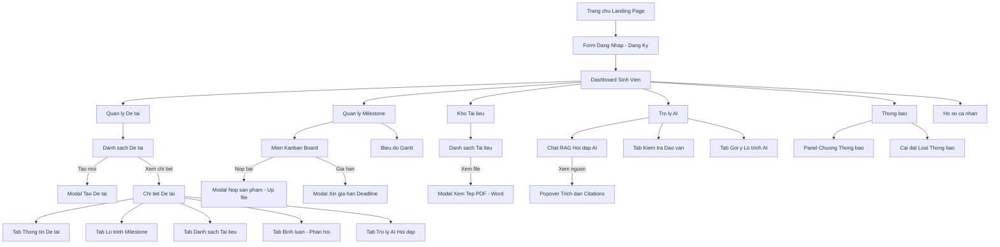
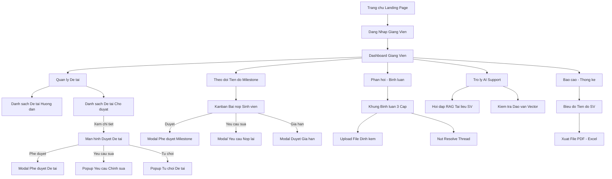
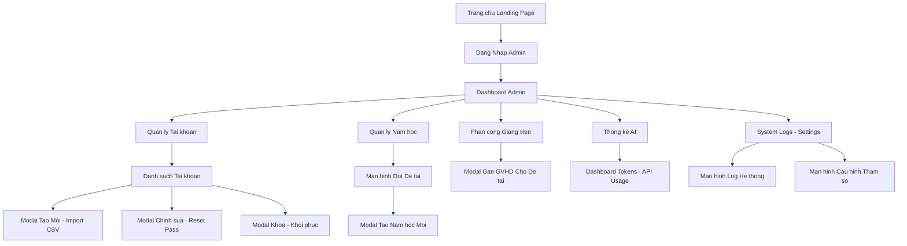

# 🖥️ NOVATHESIS – SƠ ĐỒ LUỒNG MÀN HÌNH THEO ACTOR (SCREEN TREE FLOW)

> **Dự án**: NovaThesis – Hệ thống Quản lý Luận văn & Đề tài Tích hợp AI
> **Tài liệu**: Sơ đồ Phân cấp Luồng Màn hình (Screen Tree Flow Diagram)
> **Định dạng**: Chuẩn hóa 100% Mermaid syntax tương thích hoàn toàn với **Draw.io (diagrams.net)** và **GitHub Markdown**

---

## 📌 HƯỚNG DẪN COPY VÀO DRAW.IO KHÔNG BỊ LỖI

1. Truy cập [draw.io](https://app.diagrams.net/)
2. Vào menu **Arrange** -> **Insert** -> **Advanced** -> **Mermaid** (hoặc bấm phím **Ctrl + Shift + M**)
3. Copy đoạn mã Mermaid bên dưới và dán vào ô nhập liệu
4. Bấm nút **Insert**

---

## 1. 👨‍🎓 LUỒNG MÀN HÌNH SINH VIÊN (STUDENT SCREEN FLOW)

### 🌳 1.1 Sơ đồ Cây Phân cấp Màn hình (ASCII Tree)

```text
└── 🏠 [S0. Trang công khai / Landing Page (`/`)]
    └── 🔐 [S0.1 Sheet Đăng nhập / Đăng ký (`AuthSheet`)]
        └── 📊 [S1. Dashboard Sinh viên (`/dashboard`)]
            ├── 📁 [S2. Quản lý Đề tài (`/theses`)]
            │   ├── 📄 [S2.1 Màn hình Danh sách đề tài]
            │   ├── 🔲 [S2.2 Modal Tạo đề tài mới]
            │   └── 🖥️ [S2.3 Màn hình Chi tiết đề tài (`/theses/[id]`)]
            │       ├── 📌 [Tab S2.3.1: Thông tin đề tài & SV/GVHD]
            │       ├── 📌 [Tab S2.3.2: Lộ trình & Milestone]
            │       ├── 📌 [Tab S2.3.3: Danh sách Tài liệu]
            │       ├── 📌 [Tab S2.3.4: Bình luận & Phản hồi]
            │       └── 📌 [Tab S2.3.5: Trợ lý AI Hỏi đáp]
            ├── 📅 [S3. Quản lý Milestone (`/milestones`)]
            │   ├── 📊 [S3.1 Màn hình Kanban Board]
            │   ├── 📈 [S3.2 Màn hình Biểu đồ Gantt]
            │   ├── 🔲 [S3.3 Modal Nộp sản phẩm & Đính kèm file]
            │   └── 🔲 [S3.4 Modal Xin gia hạn deadline]
            ├── 📄 [S4. Kho Tài liệu (`/documents`)]
            │   ├── 📥 [S4.1 Màn hình Tải lên & Quản lý file]
            │   └── 🔍 [S4.2 Modal Preview PDF/Word & Status AI]
            ├── 🤖 [S5. Trợ lý AI Assistant (`/ai-chat`)]
            │   ├── 💬 [S5.1 Màn hình Chat RAG (Streaming SSE)]
            │   ├── 📌 [S5.2 Popover Trích dẫn Nguồn (Citations)]
            │   ├── 🔍 [S5.3 Tab Kiểm tra Đạo văn / Trùng lặp]
            │   └── 💡 [S5.4 Tab Nhận Gợi ý Lộ trình Nhiệm vụ]
            ├── 🔔 [S6. Thông báo (`/notifications`)]
            │   ├── 🛎️ [S6.1 Dropdown Panel Chuông thông báo]
            │   └── ⚙️ [S6.2 Màn hình Cài đặt Loại thông báo]
            └── 👤 [S7. Hồ sơ cá nhân (`/profile`)]
                └── 🔑 [S7.1 Màn hình Đổi mật khẩu & Cập nhật thông tin]
```

### 🎨 1.2 Sơ đồ Mermaid Draw.io (Sinh viên)



---

## 2. 👨‍🏫 LUỒNG MÀN HÌNH GIẢNG VIÊN HƯỚNG DẪN (LECTURER SCREEN FLOW)

### 🌳 2.1 Sơ đồ Cây Phân cấp Màn hình (ASCII Tree)

```text
└── 🏠 [L0. Trang công khai / Landing Page (`/`)]
    └── 🔐 [L0.1 Sheet Đăng nhập Giảng viên (`AuthSheet`)]
        └── 📊 [L1. Dashboard Giảng viên (`/dashboard`)]
            ├── 📋 [L2. Quản lý Duyệt Đề tài (`/theses`)]
            │   ├── 📄 [L2.1 Màn hình Danh sách đề tài hướng dẫn]
            │   ├── ⏳ [L2.2 Màn hình Danh sách đề tài chờ duyệt]
            │   └── 🖥️ [L2.3 Màn hình Duyệt đề tài chi tiết]
            │       ├── 🔲 [Modal L2.3.1: Nút Phê duyệt đề tài]
            │       ├── 🔲 [Modal L2.3.2: Popup Yêu cầu sửa đổi]
            │       └── 🔲 [Modal L2.3.3: Popup Từ chối đề tài]
            ├── 📅 [L3. Theo dõi Tiến độ Milestone (`/milestones`)]
            │   ├── 📊 [L3.1 Màn hình Kanban xem bài nộp SV]
            │   ├── 🔲 [L3.2 Modal Phê duyệt đạt Milestone]
            │   ├── 🔲 [L3.3 Modal Yêu cầu nộp lại Milestone]
            │   └── 🔲 [L3.4 Modal Duyệt gia hạn deadline]
            ├── 💬 [L4. Phản hồi & Đánh giá (`/feedbacks`)]
            │   ├── ✍️ [L4.1 Khung bình luận trực tiếp trên Milestone/Tài liệu]
            │   ├── 📎 [L4.2 Modal Đính kèm file phản hồi]
            │   └── ✅ [L4.3 Nút Đánh dấu Đã giải quyết (Resolve)]
            ├── 🤖 [L5. Trợ lý AI Hỗ trợ Giảng viên (`/ai-chat`)]
            │   ├── 💬 [L5.1 Màn hình Hỏi đáp RAG tài liệu sinh viên]
            │   └── 🔍 [L5.2 Màn hình Đối soát & Kiểm tra đạo văn]
            ├── 📊 [L6. Báo cáo & Thống kê Tiến độ (`/reports`)]
            │   ├── 📉 [L6.1 Màn hình Biểu đồ Tiến độ tổng thể SV]
            │   └── 📥 [L6.2 Nút Xuất file Báo cáo PDF / Excel]
            └── 🔔 [L7. Panel Thông báo & Cài đặt (`/notifications`)]
```

### 🎨 2.2 Sơ đồ Mermaid Draw.io (Giảng viên)



---

## 3. 👨‍💼 LUỒNG MÀN HÌNH QUẢN TRỊ VIÊN (ADMIN SCREEN FLOW)

### 🌳 3.1 Sơ đồ Cây Phân cấp Màn hình (ASCII Tree)

```text
└── 🏠 [A0. Trang công khai / Landing Page (`/`)]
    └── 🔐 [A0.1 Sheet Đăng nhập Quản trị viên (`AuthSheet`)]
        └── 🖥️ [A1. Dashboard Quản trị Hệ thống (`/admin`)]
            ├── 👥 [A2. Quản lý Tài khoản (`/admin/users`)]
            │   ├── 📄 [A2.1 Màn hình Danh sách Người dùng (SV, GV, Admin)]
            │   ├── 🔲 [A2.2 Modal Tạo Tài khoản / Import Excel]
            │   ├── 🔲 [A2.3 Modal Chỉnh sửa & Reset mật khẩu]
            │   └── 🔲 [A2.4 Modal Vô hiệu hóa / Khôi phục tài khoản]
            ├── 📅 [A3. Quản lý Năm học & Đợt Đề tài (`/admin/academic-years`)]
            │   ├── 📝 [A3.1 Màn hình Danh sách Năm học & Đợt đợt làm luận văn]
            │   └── 🔲 [A3.2 Modal Cấu hình Thời gian đăng ký đề tài]
            ├── 🔗 [A4. Phân công & Gán Giảng viên (`/admin/theses/assign`)]
            │   └── 🔲 [A4.1 Modal Gán GVHD cho Đề tài chưa có người hướng dẫn]
            ├── 🤖 [A5. Thống kê Hoạt động AI (`/admin/ai-stats`)]
            │   └── 📊 [A5.1 Dashboard Token, lượt gọi API, Rating tốt/xấu]
            └── 📜 [A6. Nhật ký Hệ thống & Settings (`/admin/logs`)]
                ├── 📋 [A6.1 Màn hình Xem System Logs]
                └── ⚙️ [A6.2 Màn hình Cấu hình tham số Hệ thống]
```

### 🎨 3.2 Sơ đồ Mermaid Draw.io (Admin)


